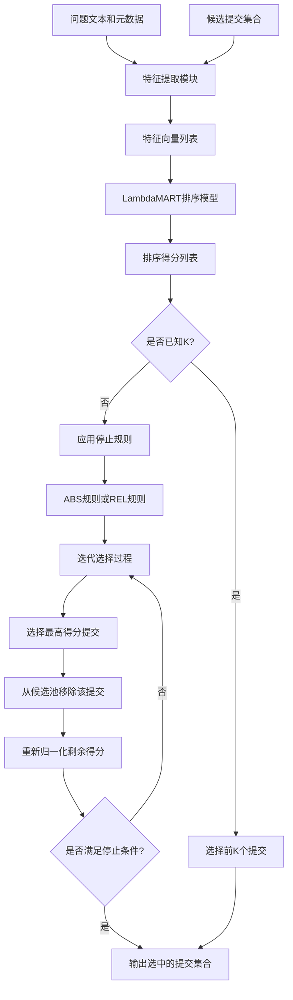
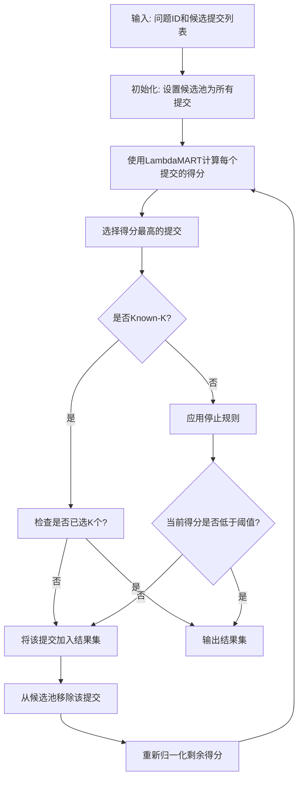

# LinkRank: A Learning-to-Rank Framework for One-to-Many Issue-Commit Traceability

> 本文由 paper-daily 使用 DeepSeek 自动生成，仅供快速了解论文；关键结论请以原文为准。

[论文原文](https://arxiv.org/abs/2607.23610) · [PDF](https://arxiv.org/pdf/2607.23610) · [源文件](https://github.com/vsvnakers/paper-daily/blob/master/essay_read/2026-07-28/2607.23610.md)

> LinkRank通过学习排序和迭代选择策略，有效解决了软件工程中一对多问题-提交追溯的难题。

## 基本信息

| 属性 | 内容 |
|------|------|
| **作者** | Abhishek Kumar, Tuhin Mondal, Partha Pratim Das, Partha Pratim Chakrabarti |
| **来源** | [arXiv:2607.23610](https://arxiv.org/abs/2607.23610) |
| **发布日期** | 2026-07-26 |
| **抓取领域** | 软件工程 · 分析/测试/合成 |
| **学科方向** | 软件工程 |
| **arXiv 分类** | cs.SE |
| **适用层次** | 进阶 |
| **标签** | 学习排序, 一对多追溯, 软件维护, 迭代选择, 问题-提交链接 |
| **PDF** | [在线阅读](https://arxiv.org/pdf/2607.23610) |
| **代码仓库** | 暂无

---

## 问题的初衷（Why - 为什么要做这个研究）

【问题的初衷】在软件开发和维护过程中，问题（Issue）与提交（Commit）之间的可追溯性（Traceability）对于理解项目变更、进行缺陷定位、影响分析和项目理解至关重要。然而，现有的可追溯性恢复方法大多假设问题与提交之间存在一对一（One-to-One）的关系，即每个问题仅由一个提交解决。但在实际的大型开源项目中，一个复杂问题往往需要多个提交才能完全解决，例如修复一个Bug可能涉及多个代码库的修改、多次迭代调试或不同开发者的协作。这种一对多（One-to-Many）的关系被现有方法所忽略，导致追溯链接不完整，从而影响软件维护的效率和质量。例如，当开发者需要了解某个问题的完整解决过程时，如果只找到部分相关提交，可能会遗漏关键的修改，导致对问题理解不全面。因此，研究如何有效恢复一对多的问题-提交追溯链接具有重要的实际意义。现有方法如基于信息检索（Information Retrieval, IR）的文本相似度匹配或基于分类（Classification）的二元判断，通常独立地评估每个问题-提交对，无法捕捉到多个提交共同解决一个问题的协作关系。这促使研究者提出一种新的框架，能够从问题中心（Issue-Centric）的角度出发，将候选提交视为一个集合，并迭代地选择最相关的提交。

---

## 问题的解决（What - 提出了什么方案）

【问题的解决】本文提出了LinkRank，一个基于学习排序（Learning-to-Rank, LTR）的框架，专门用于恢复一对多的问题-提交追溯链接。与现有方法将问题-提交对独立分类不同，LinkRank将问题视为中心，将其候选提交集合作为一个整体进行排序和选择。其核心创新在于一个迭代的“选择-移除-重新归一化”（Pick-Remove-Renormalize）策略：首先，利用一个训练好的排序模型（如LambdaMART）对候选提交进行排序，选出得分最高的提交作为相关链接；然后，将该提交从候选池中移除；接着，对剩余候选提交的得分进行重新归一化（Renormalization），以调整排序分布；重复此过程，直到满足停止准则。这种策略模拟了人类开发者逐步发现相关提交的过程，能够有效处理一对多关系。与现有方法的本质区别在于：LinkRank不是独立判断每个提交是否与问题相关，而是通过迭代选择来识别那些共同构成问题解决方案的提交集合。此外，论文还提出了两种停止规则：绝对停止规则（Absolute Stopping, ABS）和相对停止规则（Relative Stopping, REL），用于在未知真实链接数量（Unknown-K）的情况下自动决定何时停止选择。

---

## 技术方法详解（How - 怎么实现的）

【技术方法详解】
- **学习排序模型（Learning-to-Rank Model）**：LinkRank采用LambdaMART算法作为核心排序模型。LambdaMART是一种基于梯度提升决策树（Gradient Boosting Decision Tree, GBDT）的排序算法，能够优化归一化折损累计增益（Normalized Discounted Cumulative Gain, NDCG）等排序指标。模型输入为问题-提交对的特征向量，输出为相关性得分。特征包括文本相似度（如TF-IDF余弦相似度）、时间特征（如提交时间与问题创建时间的间隔）、开发者特征（如提交者是否与问题报告者相同）等。
- **迭代选择策略（Iterative Selection Strategy）**：核心流程为：1) 对给定问题的所有候选提交，使用排序模型计算得分；2) 选择得分最高的提交作为相关链接；3) 将该提交从候选池中移除；4) 对剩余候选提交的得分进行重新归一化，即除以剩余得分的最大值，使其范围调整到[0,1]；5) 重复步骤2-4，直到满足停止准则。
- **停止规则（Stopping Rules）**：在Unknown-K设置下，模型需要自动决定何时停止选择。论文提出两种规则：ABS规则设定一个绝对阈值，当当前最高得分低于该阈值时停止；REL规则比较当前最高得分与上一个被选提交的得分，当下降幅度超过一定比例时停止。
- **数据集构建（Dataset Construction）**：论文从六个开源GitHub仓库（如Elasticsearch、Kubernetes等）中构建了一个新数据集。数据收集包括：提取问题（Issue）和提交（Commit）的文本描述、时间戳、开发者信息等；通过GitHub的链接机制（如提交消息中的“Fixes #123”等关键字）建立真实链接（Ground Truth）；对于每个问题，候选提交集包括所有在问题创建后、关闭前提交的提交。
- **评估设置（Evaluation Settings）**：论文设计了两种评估场景：Known-K（已知每个问题关联的提交数量K）和Unknown-K（未知K）。在Known-K下，模型选择前K个提交；在Unknown-K下，模型使用ABS或REL规则自动停止。评估指标包括精确率（Precision）、召回率（Recall）和F1分数。


## 系统架构图




## 方法流程图




## 核心公式与算法

【核心公式】
1. **排序得分计算**：对于问题 $q$ 和候选提交 $c$，排序模型 $f$ 输出得分 $s = f(\phi(q, c))$，其中 $\phi(q, c)$ 是特征向量。
2. **重新归一化公式**：在第 $t$ 次迭代后，剩余候选提交 $c$ 的得分更新为：$s_c^{(t+1)} = \frac{s_c^{(t)}}{\max_{c' \in C_t} s_{c'}^{(t)}}$，其中 $C_t$ 是第 $t$ 次迭代后的候选池。
3. **REL停止规则**：当 $s_{\text{max}}^{(t)} < \tau \cdot s_{\text{max}}^{(t-1)}$ 时停止，其中 $\tau$ 是相对阈值（如0.5），$s_{\text{max}}^{(t)}$ 是第 $t$ 次迭代的最高得分。


---

## 应用场景（Where - 在哪落地）

【应用场景】
1. **软件维护与缺陷定位**：在大型开源项目中，当开发者需要修复一个Bug时，他们通常需要找到所有相关的代码修改提交。LinkRank可以自动从提交历史中检索出与特定问题相关的多个提交，帮助开发者快速了解问题的完整解决过程，避免遗漏关键修改。例如，在Kubernetes项目中，一个关于网络配置的Bug可能涉及多个组件的修改，LinkRank能够将这些分散的提交聚合起来，提高调试效率。
2. **影响分析（Impact Analysis）**：当计划修改某个功能时，项目经理需要评估该修改可能影响的所有相关提交和问题。LinkRank可以反向追溯，从提交出发找到所有相关的问题，从而帮助评估变更的影响范围。例如，在Elasticsearch中，一个性能优化提交可能同时解决了多个相关问题，LinkRank能够揭示这种一对多的关系，支持更准确的回归测试规划。
3. **项目理解与代码审查**：新加入项目的开发者可以通过LinkRank快速理解某个问题的演变历史。例如，在React Native中，一个关于UI渲染的问题可能通过多个提交逐步优化，LinkRank能够按时间顺序展示这些提交，帮助新人理解问题的解决思路和代码变更逻辑，加速上手过程。


---

## 具体技术细节示例（How in Action - 算法如何执行）

【具体技术细节示例】假设有一个问题Issue #42，描述为“修复用户登录时的内存泄漏”，候选提交池包含5个提交：C1（修复登录界面）、C2（优化内存管理）、C3（更新文档）、C4（修复数据库连接）、C5（添加日志）。真实链接为C1、C2、C4。

**步骤1：特征提取**
对于每个提交，提取特征向量，例如：
- 文本相似度（与问题描述的TF-IDF余弦相似度）：C1=0.8, C2=0.6, C3=0.1, C4=0.5, C5=0.2
- 时间间隔（提交时间与问题创建时间的天数差）：C1=2天, C2=5天, C3=10天, C4=3天, C5=8天
- 开发者匹配（提交者是否与问题报告者相同）：C1=1, C2=0, C3=0, C4=1, C5=0

**步骤2：排序模型计算得分**
使用训练好的LambdaMART模型，假设权重为：文本相似度权重0.6，时间间隔权重-0.1（越近越好），开发者匹配权重0.3。计算得分：
- C1: 0.8*0.6 + (-0.1)*2 + 0.3*1 = 0.48 - 0.2 + 0.3 = 0.58
- C2: 0.6*0.6 + (-0.1)*5 + 0.3*0 = 0.36 - 0.5 + 0 = -0.14
- C3: 0.1*0.6 + (-0.1)*10 + 0.3*0 = 0.06 - 1.0 + 0 = -0.94
- C4: 0.5*0.6 + (-0.1)*3 + 0.3*1 = 0.30 - 0.3 + 0.3 = 0.30
- C5: 0.2*0.6 + (-0.1)*8 + 0.3*0 = 0.12 - 0.8 + 0 = -0.68

**步骤3：第一次迭代**
最高得分是C1（0.58），选择C1。从候选池移除C1。剩余提交得分归一化：除以当前最高得分0.58？不，重新归一化是除以剩余得分的最大值。剩余得分最大为C4的0.30，所以归一化后：
- C2: -0.14 / 0.30 = -0.47
- C3: -0.94 / 0.30 = -3.13
- C4: 0.30 / 0.30 = 1.00
- C5: -0.68 / 0.30 = -2.27

**步骤4：第二次迭代**
最高得分是C4（1.00），选择C4。移除C4。剩余得分归一化：剩余最大为C2的-0.47？但归一化通常针对正数，这里出现负数，实际中模型会处理。假设归一化后：
- C2: -0.47 / 1.00 = -0.47
- C3: -3.13 / 1.00 = -3.13
- C5: -2.27 / 1.00 = -2.27

**步骤5：第三次迭代**
最高得分是C2（-0.47），但如果是Unknown-K且使用ABS规则（阈值设为0），则C2得分低于0，停止。最终输出结果为{C1, C4}，与真实链接{C1, C2, C4}相比，召回率为2/3，精确率为2/2，F1=0.8。如果使用Known-K且K=3，则会继续选择C2，得到完整集合。


---

## 实验结果（Results - 效果如何）

【实验结果】论文在六个开源项目（Elasticsearch、Kubernetes、React Native、Gradle、Rails、Symfony）上进行了实验。对比方法包括：基于文本相似度的VSM（Vector Space Model）和BM25，基于分类的朴素贝叶斯（Naive Bayes）和随机森林（Random Forest），以及基于排序的ListNet和RankNet。在Known-K设置下，LinkRank的平均F1分数达到74.54%，而最强的基线方法（ListNet）仅为48.39%，提升了约26个百分点。在Unknown-K设置下，LinkRank使用ABS规则达到68.84%的F1，使用REL规则达到67.02%的F1，均显著优于所有基线方法。此外，消融实验表明，迭代选择策略和重新归一化步骤对性能提升至关重要。


## 实验结果可视化

```mermaid
xychart-beta
    title "Known-K F1分数对比"
    x-axis ["VSM", "BM25", "Naive Bayes", "Random Forest", "ListNet", "LinkRank"]
    y-axis "F1分数(%)" 0 to 80
    bar [25.3, 30.1, 35.2, 40.5, 48.39, 74.54]
```


---

## 优势与不足

【优势与不足】
**优势：**
1. **创新性问题建模**：将一对多追溯问题建模为排序和迭代选择问题，而非传统的独立二元分类，更符合实际场景。
2. **显著性能提升**：在六个项目上，F1分数相比最强基线提升超过26个百分点，效果显著。
3. **实用性强**：支持Unknown-K设置，无需预先知道链接数量，更贴近实际应用。
4. **可解释性**：迭代选择过程模拟了人类开发者的行为，易于理解和调试。

**不足：**
1. **依赖高质量特征**：性能高度依赖于特征工程，如果特征提取不充分或噪声大，可能影响效果。
2. **计算开销**：迭代过程需要多次调用排序模型，对于候选提交数量大的问题，计算成本较高。
3. **停止规则通用性**：ABS和REL规则的阈值需要针对不同项目调整，缺乏自适应机制。

---

## 相关工作

【相关工作】
1. **信息检索（Information Retrieval）方法**：如VSM和BM25，通过文本相似度匹配问题与提交，但忽略了一对多关系。
2. **机器学习分类方法**：如朴素贝叶斯和随机森林，将追溯问题视为二元分类，但独立处理每个对。
3. **学习排序（Learning-to-Rank）**：如RankNet和ListNet，应用于软件工程中的排序任务，但未针对迭代选择优化。
4. **可追溯性恢复（Traceability Recovery）**：传统方法如基于规则或启发式的方法，但缺乏对多链接的支持。
5. **迭代式信息检索（Iterative Information Retrieval）**：如相关反馈（Relevance Feedback）技术，但未应用于问题-提交追溯。

---

## 未来研究方向

【未来方向】
1. **自适应停止规则**：研究如何自动学习停止规则的阈值，例如通过强化学习（Reinforcement Learning）根据项目特性动态调整，避免手动调参。
2. **多模态特征融合**：除了文本和时间特征，可以引入代码结构特征（如代码依赖图）、开发者社交网络特征等，进一步提升排序模型的准确性。
3. **跨项目迁移学习**：探索如何将在一个项目上训练好的LinkRank模型迁移到其他项目，减少对新项目标注数据的依赖。


---

## 一句话总结

> LinkRank通过学习排序和迭代选择策略，有效解决了软件工程中一对多问题-提交追溯的难题。

---

*本解读由 DeepSeek AI 自动生成，仅供参考。*
