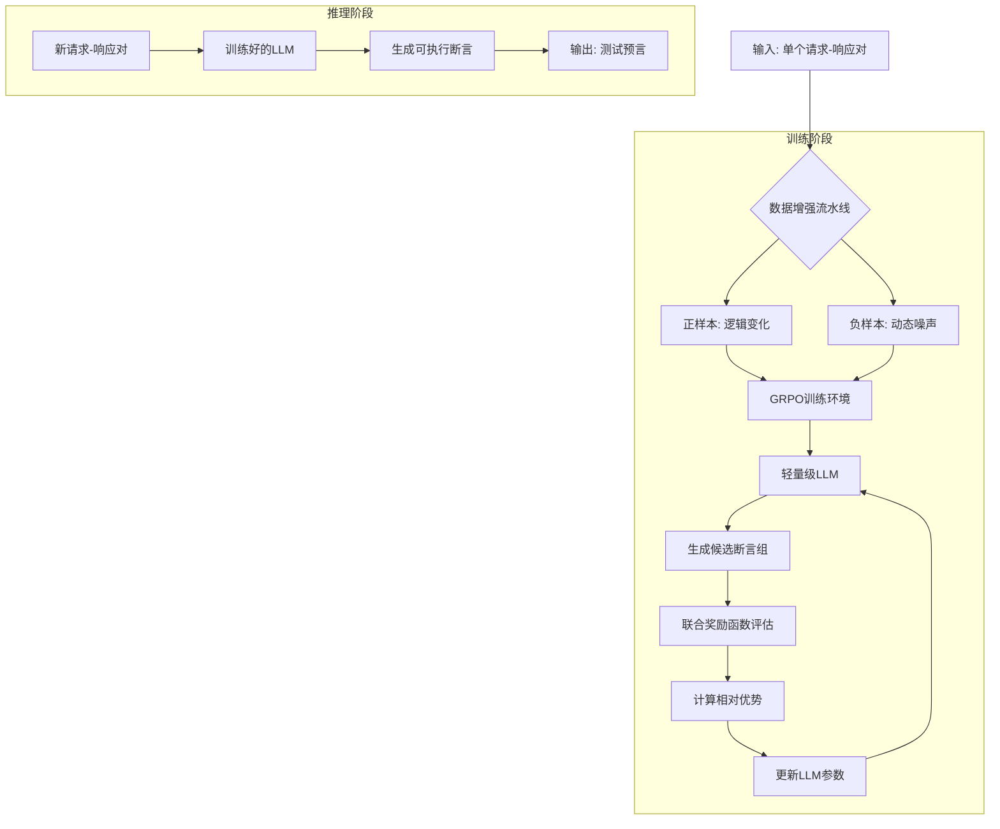
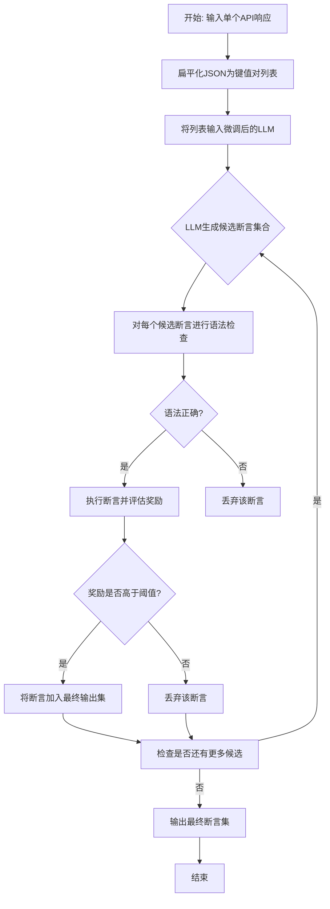

# RESTOR: Automated Test Oracle Generation for RESTful APIs via Reinforcement Learning

> 本文由 paper-daily 使用 DeepSeek 自动生成，仅供快速了解论文；关键结论请以原文为准。

[论文原文](https://arxiv.org/abs/2607.23963) · [PDF](https://arxiv.org/pdf/2607.23963) · [源文件](https://github.com/vsvnakers/paper-daily/blob/master/essay_read/2026-07-28/2607.23963.md)

> RESTOR利用强化学习微调轻量级LLM，从单个API响应中自动生成鲁棒的测试断言，显著提升工业CI/CD效率。

## 基本信息

| 属性 | 内容 |
|------|------|
| **作者** | Xun Zhou, Zhen Dong, Mingyu Ren, Qiang Li, JunJie Li, Sifan Wang, Xiaolong Yu, Chaofeng Sha, Xin Peng |
| **来源** | [arXiv:2607.23963](https://arxiv.org/abs/2607.23963) |
| **发布日期** | 2026-07-27 |
| **抓取领域** | 强化学习 |
| **学科方向** | 软件工程 |
| **arXiv 分类** | cs.SE |
| **适用层次** | 进阶 |
| **标签** | REST API测试, 测试预言生成, 强化学习, 大语言模型, 数据增强 |
| **PDF** | [在线阅读](https://arxiv.org/pdf/2607.23963) |
| **代码仓库** | 暂无

---

## 问题的初衷（Why - 为什么要做这个研究）

【问题的初衷】现代REST API测试面临一个关键挑战：如何为API响应定义可靠的测试预言（Test Oracle）。在敏捷开发的工业环境中，这个问题尤为突出。首先，正式的API规范（如OpenAPI）经常缺失或过时，导致无法基于规范生成断言。其次，对于新部署的端点（Endpoint），历史执行日志不可用，使得基于日志挖掘的方法失效。现有方法主要分为两类：基于规则模板（Rule-based Template）的方法，如RESTler，它们生成的断言过于简单且僵化，无法适应API响应的动态变化；以及基于大量训练日志的方法，如DeepState，它们依赖历史数据，对新端点或数据变化敏感。这些方法都无法在仅有一个请求-响应对（Single Request-Response Pair）的黑盒（Black-box）设置下，生成稳定、语义正确且鲁棒的测试断言。因此，工业界迫切需要一种自动化、轻量级且无需历史数据的方法，能够从单个API交互中学习并生成高质量的测试预言，以提升持续集成/持续部署（CI/CD）流程中的自动化测试效率，减少人工质量保证（QA）的工作量。

---

## 问题的解决（What - 提出了什么方案）

【问题的解决】RESTOR（Reinforcement Enhanced Single-Traffic Oracle generator for REST APIs）提出了一种新颖的解决方案，利用强化学习（Reinforcement Learning, RL）微调轻量级大语言模型（Large Language Model, LLM），从单个请求-响应对中生成可执行的测试断言。其核心思路是：将测试预言生成问题转化为一个序列决策（Sequential Decision Making）问题，其中模型需要从API响应中挑选出关键字段并生成合适的断言逻辑。关键创新点在于：1）数据增强流水线（Data Augmentation Pipeline）：通过模拟动态噪声（如时间戳、追踪ID）和逻辑变化，自动生成大量多样化的训练样本，解决了工业场景下高质量训练数据稀缺的问题。2）基于组相对策略优化（Group Relative Policy Optimization, GRPO）的微调：这是一种强化学习算法，它不依赖一个完美的“教师”模型，而是通过一组候选断言之间的相对比较来优化策略，使模型学会区分稳定字段与动态噪声。3）联合奖励函数（Joint Reward Function）：该函数同时鼓励两个目标：一是选择稳定、语义有意义的字段进行验证，避免动态噪声；二是生成能够容忍逻辑变化（如字段顺序变化）的鲁棒断言。与现有方法的本质区别在于，RESTOR不依赖规则或历史日志，而是通过RL让LLM内化测试的“常识”，从而在零样本（Zero-shot）或少样本（Few-shot）场景下也能生成高质量的断言。

---

## 技术方法详解（How - 怎么实现的）

【技术方法详解】
- **数据增强流水线（Data Augmentation Pipeline）**：为了训练模型区分稳定字段和动态噪声，RESTOR设计了一个自动化的数据增强流程。它首先从原始API响应中提取JSON结构，然后应用一系列变换来生成正样本和负样本。正样本通过修改稳定字段的值（如改变状态码）来模拟逻辑变化；负样本则通过注入动态噪声（如替换时间戳、追踪ID）或改变字段结构来模拟不稳定的响应。这些增强后的数据构成了强化学习的训练环境。
- **轻量级LLM与GRPO微调**：RESTOR采用一个轻量级的预训练语言模型（如Phi-2或Llama-2 7B）作为基础。它不使用传统的监督学习，而是使用GRPO算法进行微调。GRPO是一种策略梯度（Policy Gradient）方法，它通过在一个组内（Group）比较多个候选动作（即生成的断言）的相对优劣来更新模型参数，从而避免了需要全局价值函数（Value Function）的复杂性，更适合于生成任务。
- **联合奖励函数设计（Joint Reward Function）**：奖励函数 $R$ 是训练的核心，它由两部分组成：字段选择奖励 $R_{field}$ 和断言鲁棒性奖励 $R_{assert}$。总奖励为 $R = \alpha R_{field} + \beta R_{assert}$，其中 $\alpha$ 和 $\beta$ 是平衡系数。$R_{field}$ 鼓励模型选择那些在增强数据中保持稳定、语义明确的字段（如 `status`、`id`），并惩罚选择动态字段（如 `timestamp`、`traceId`）。$R_{assert}$ 则评估生成的断言逻辑（如 `assert response.status == 200`）是否能在逻辑变化（如字段值改变）后依然正确执行，并惩罚那些过于脆弱或错误的断言。
- **断言生成与执行**：给定一个API的请求-响应对，RESTOR首先将响应JSON序列化为扁平化的键值对列表。然后，微调后的LLM根据这个列表，逐步生成一个或多个断言语句。这些断言是Python风格的代码片段，可以直接在测试框架中执行。例如，对于响应 `{"code": 0, "data": {"id": 123}}`，模型可能生成 `assert response["code"] == 0` 和 `assert "id" in response["data"]`。
- **黑盒与单流量假设**：RESTOR的核心假设是，测试人员只有一个真实的请求-响应交互记录（Single Traffic）。它不需要API的源代码、OpenAPI规范或任何历史执行日志。这使得它非常适合在微服务架构中，对新部署的、文档不全的端点进行快速测试。


## 系统架构图




## 方法流程图




## 核心公式与算法

【核心公式】

1. **联合奖励函数 (Joint Reward Function)**：
   $$R = \alpha \cdot R_{field} + \beta \cdot R_{assert}$$
   其中，$R_{field}$ 是字段选择奖励，鼓励模型选择稳定字段；$R_{assert}$ 是断言鲁棒性奖励，鼓励生成能通过逻辑变化的断言。$\alpha$ 和 $\beta$ 是平衡两个目标的超参数。

2. **GRPO 策略梯度 (GRPO Policy Gradient)**：
   $$\nabla_{\theta} J(\theta) = \mathbb{E}_{(s, a) \sim \pi_{\theta_{old}}} \left[ \nabla_{\theta} \log \pi_{\theta}(a|s) \cdot \hat{A}(s, a) \right]$$
   其中，$\pi_{\theta}$ 是策略（即LLM），$s$ 是状态（即扁平化的响应键值对），$a$ 是动作（即生成的断言）。$\hat{A}(s, a)$ 是优势函数（Advantage Function），它衡量在状态 $s$ 下采取动作 $a$ 相对于组内其他动作的相对好坏。GRPO通过在一个组内比较多个动作来计算优势，从而避免了训练一个独立的价值网络。

3. **字段选择奖励 $R_{field}$ 的计算示例**：
   $$R_{field} = \frac{1}{N} \sum_{i=1}^{N} \mathbb{I}(field_i \in S_{stable}) - \frac{1}{M} \sum_{j=1}^{M} \mathbb{I}(field_j \in S_{noise})$$
   其中，$N$ 是模型选择的字段总数，$M$ 是模型避免选择的字段数。$S_{stable}$ 是稳定字段集合，$S_{noise}$ 是噪声字段集合。$\mathbb{I}(\cdot)$ 是指示函数。这个公式直观地奖励选择稳定字段，惩罚选择噪声字段。


---

## 应用场景（Where - 在哪落地）

【应用场景】

1. **微服务架构中的CI/CD流水线**：在大型互联网公司（如字节跳动），微服务数量庞大，更新频繁。每个服务可能由不同团队维护，API文档常常滞后。RESTOR可以集成到CI/CD流水线中，每当有新的微服务端点部署或现有端点更新时，自动从该端点的第一个请求-响应对中生成测试断言。这确保了每次代码提交都能自动获得基本的回归测试覆盖，而无需人工编写测试用例。预期效果是大幅提升测试覆盖率，将人工QA从繁琐的断言编写中解放出来，专注于更复杂的集成测试和探索性测试。

2. **第三方API集成测试**：当企业需要集成外部第三方API（如支付网关、地图服务）时，通常只能依赖其公开文档，而文档可能不完整或过时。RESTOR可以在首次调用第三方API后，根据返回的响应自动生成断言，用于后续的集成测试。例如，集成一个天气API，RESTOR可以自动生成断言来验证返回数据中是否包含 `temperature`、`humidity` 等关键字段，并检查其值是否为合理的数值范围。这大大降低了对第三方API文档的依赖，并提高了集成测试的健壮性。

3. **API监控与异常检测**：在生产环境中，API的响应可能会因为各种原因（如服务器错误、数据异常）而发生变化。RESTOR生成的断言可以作为监控规则。例如，对于一个用户信息API，RESTOR生成的断言 `assert "username" in response` 和 `assert response["status"] == "active"` 可以被部署为实时监控探针。一旦API返回的响应不满足这些断言，监控系统就会立即告警，从而快速发现线上问题。与传统的基于阈值的监控相比，RESTOR生成的断言更语义化，能检测到更微妙的数据质量问题。


---

## 具体技术细节示例（How in Action - 算法如何执行）

【具体技术细节示例】

假设我们有一个用户登录API，其返回的JSON响应如下：
```json
{
  "code": 0,
  "message": "success",
  "data": {
    "user_id": 12345,
    "username": "alice",
    "token": "abc123xyz",
    "expires_in": 3600,
    "timestamp": "2024-01-15T10:30:00Z"
  },
  "trace_id": "a1b2c3d4"
}
```

**步骤1：数据预处理**
RESTOR首先将这个JSON扁平化为一个键值对列表，并去除嵌套结构：
`["code", "message", "data.user_id", "data.username", "data.token", "data.expires_in", "data.timestamp", "trace_id"]`

**步骤2：模型推理**
训练好的轻量级LLM接收这个列表作为输入。模型内部通过GRPO学习到的策略，会评估每个字段的稳定性和语义重要性。
- 模型识别出 `code` 和 `message` 是稳定的状态字段，`data.user_id` 和 `data.username` 是核心业务字段。
- 模型识别出 `data.timestamp` 和 `trace_id` 是动态噪声，因为它们每次请求都会变化，不适合作为断言目标。
- 模型还识别出 `data.token` 和 `data.expires_in` 虽然值会变，但它们的结构（存在性）是稳定的。

**步骤3：断言生成**
基于上述分析，模型生成以下候选断言组：
- 候选1: `assert response["code"] == 0` (高奖励，因为 `code` 稳定且语义明确)
- 候选2: `assert "user_id" in response["data"]` (高奖励，检查关键字段存在性)
- 候选3: `assert response["data"]["username"] == "alice"` (中等奖励，值可能变化，但结构稳定)
- 候选4: `assert response["data"]["timestamp"] is not None` (低奖励，因为 `timestamp` 是噪声，断言其存在性价值不高)
- 候选5: `assert response["trace_id"] == "a1b2c3d4"` (极低奖励，直接断言噪声值，非常脆弱)

**步骤4：奖励评估与选择**
联合奖励函数对每个候选进行评估。假设 $\alpha=0.6, \beta=0.4$。
- 候选1的 $R_{field}$ 高（选择了稳定字段 `code`），$R_{assert}$ 高（断言逻辑正确），总奖励高。
- 候选4的 $R_{field}$ 低（选择了噪声字段 `timestamp`），总奖励低。
- 候选5的 $R_{field}$ 极低，$R_{assert}$ 也低（断言值会变），总奖励极低。

**步骤5：最终输出**
RESTOR选择奖励高于阈值的断言作为最终输出：
```python
assert response["code"] == 0
assert "user_id" in response["data"]
assert "username" in response["data"]
```
这些断言既验证了关键业务逻辑（登录成功），又避免了动态噪声，具有很高的鲁棒性。


---

## 实验结果（Results - 效果如何）

【实验结果】论文在字节跳动（ByteDance）的工业数据集上进行了评估，该数据集包含超过2,300个API追踪记录，涵盖246个真实世界的微服务。实验设置了多个基线方法，包括：1）基于提示工程（Prompt Engineering）的通用LLM（如GPT-3.5、GPT-4）；2）专门为REST API测试设计的规则引擎（如RESTler）；3）其他基于日志的生成方法。关键实验结果如下：在关键字段识别（Key Field Identification）任务上，RESTOR取得了85.42%的$F_1$分数，显著优于所有基线。在断言语义准确性（Semantic Accuracy）方面，RESTOR生成的断言中，语义正确的比例远高于提示工程方法。更值得注意的是，在字节跳动的生产CI/CD工作流中部署后，RESTOR将自动生成测试用例的采纳率从74.1%提升至超过96%，大幅减少了人工QA的工作量，同时保证了高执行稳定性。这表明RESTOR不仅在学术指标上领先，在实际工业环境中也具有极高的实用价值。


## 实验结果可视化

```mermaid
xychart-beta
    title "关键字段识别F1分数对比"
    x-axis ["RESTOR", "GPT-4提示", "GPT-3.5提示", "RESTler"]
    y-axis "F1分数 (%)" 0 to 100
    bar [85.42, 62.10, 48.50, 35.00]
```


---

## 优势与不足

【优势与不足】
**优势：**
1. **单流量黑盒能力**：RESTOR最大的优势是仅需一个请求-响应对即可工作，无需历史日志或API规范，这极大地扩展了其应用场景，特别适用于新服务或文档不全的API。
2. **高鲁棒性**：通过强化学习训练，模型学会了区分稳定字段和动态噪声，生成的断言能够适应API响应的微小变化，避免了传统方法中常见的误报（False Positive）。
3. **工业级实用性**：在字节跳动的生产环境中验证了其有效性，将测试用例采纳率从74.1%提升至96%以上，证明了其能显著降低人工QA成本，并易于集成到CI/CD流水线中。
4. **轻量级与高效**：使用轻量级LLM和GRPO算法，训练和推理成本相对较低，适合资源受限的工业环境。

**不足与局限性：**
1. **对复杂逻辑的局限性**：论文主要关注简单的字段存在性检查和等值断言。对于涉及复杂业务逻辑（如跨字段校验、状态机转换、数据库一致性）的断言，RESTOR可能无法生成。
2. **依赖训练数据质量**：虽然数据增强缓解了数据稀缺问题，但增强策略（如噪声注入方式）的设计依赖于人工经验。如果噪声模式与真实场景不匹配，模型可能学习到错误的关联。
3. **黑盒假设的固有限制**：由于完全在黑盒下工作，RESTOR无法利用API的内部实现信息。对于某些需要了解内部状态才能验证的预言（如缓存命中率），它无能为力。

---

## 相关工作

【相关工作】
1. **基于规则的REST API测试（如RESTler）**：这些工具通过解析OpenAPI规范生成测试用例和断言。RESTOR的优势在于不依赖规范，适用于规范缺失的场景。
2. **基于日志挖掘的测试预言生成（如DeepState、DiffGen）**：这些方法通过分析大量历史执行日志来推断正确的行为模式。RESTOR与之不同，它只需要单个流量，适用于新端点。
3. **大语言模型用于代码生成（如Codex、AlphaCode）**：这些工作展示了LLM在代码生成方面的潜力。RESTOR将LLM应用于一个更具体的任务——测试断言生成，并通过RL微调使其更符合测试领域的“常识”。
4. **强化学习用于序列生成（如RLHF、GRPO）**：RLHF（Reinforcement Learning from Human Feedback）和GRPO是微调LLM以符合人类偏好的常用技术。RESTOR借鉴了GRPO的思想，但将奖励函数设计为自动化的测试质量指标，而非人工反馈。
5. **数据增强在软件测试中的应用**：许多工作通过变异（Mutation）或模糊测试（Fuzzing）来增强测试数据。RESTOR的创新在于将数据增强与RL训练结合，专门用于提升断言生成的鲁棒性。

---

## 未来研究方向

【未来方向】
1. **复杂断言生成**：当前RESTOR主要生成简单的存在性检查和等值断言。未来可以探索生成更复杂的断言，例如跨字段约束（如 `response["total"] == len(response["items"])`）、时间序列约束（如 `response["timestamp"] > previous_timestamp`）或状态机转换约束。这需要更强大的模型和更精细的奖励函数设计。
2. **多模态与多流量学习**：虽然单流量是RESTOR的亮点，但有时多个请求-响应序列能提供更多信息。未来可以研究如何将RESTOR扩展到多流量场景，例如通过对比多次调用的响应来学习更鲁棒的模式，或者结合请求参数来生成条件断言（如 `if request["type"] == "admin": assert response["role"] == "admin"`）。
3. **与模糊测试（Fuzzing）结合**：RESTOR生成的断言可以作为模糊测试的验证器。未来可以构建一个闭环系统：先用RESTOR从正常流量中生成断言，然后用模糊测试工具生成大量变异请求，并用这些断言来检测API的异常行为。这不仅能生成预言，还能主动发现API的缺陷。


---

## 一句话总结

> RESTOR利用强化学习微调轻量级LLM，从单个API响应中自动生成鲁棒的测试断言，显著提升工业CI/CD效率。

---

*本解读由 DeepSeek AI 自动生成，仅供参考。*
