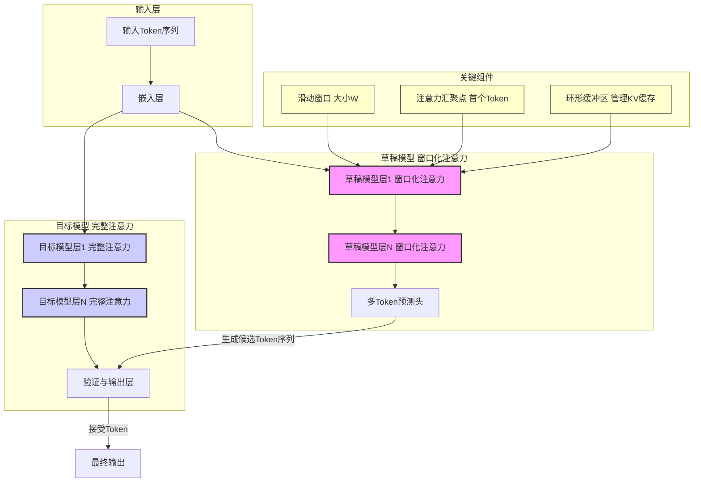
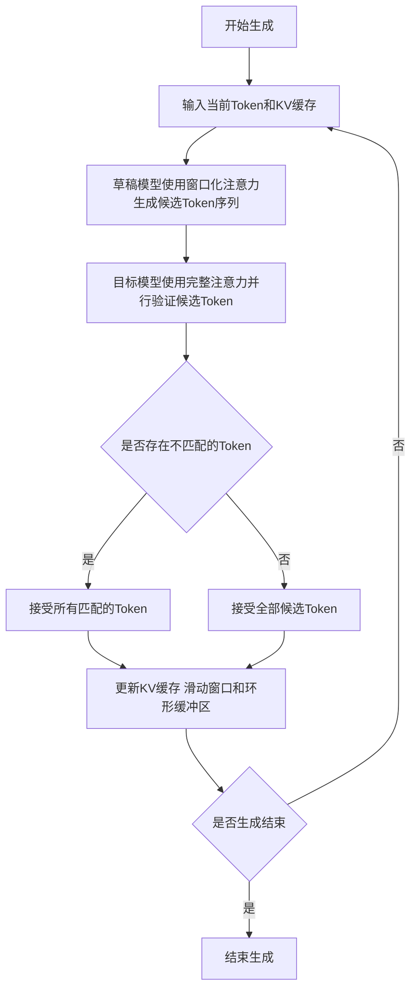
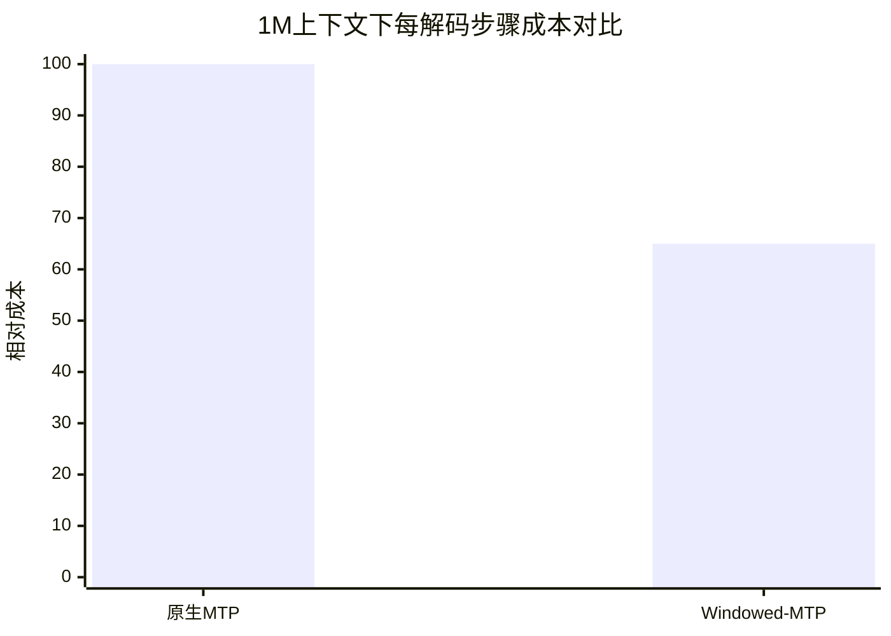

# Windowed-MTP: Removing the Full-Context Draft-KV Tax at Million-Token Context

> 本文由 paper-daily 使用 DeepSeek 自动生成，仅供快速了解论文；关键结论请以原文为准。

[论文原文](https://arxiv.org/abs/2607.21535) · [PDF](https://arxiv.org/pdf/2607.21535) · [源文件](https://github.com/vsvnakers/paper-daily/blob/master/essay_read/2026-07-29/2607.21535.md)

> 通过窗口化草稿模型注意力，消除长上下文投机解码中的高昂计算成本，实现无损加速。

## 基本信息

| 属性 | 内容 |
|------|------|
| **作者** | Alagappan Valliappan |
| **来源** | [arXiv:2607.21535](https://arxiv.org/abs/2607.21535) |
| **发布日期** | 2026-07-23 |
| **抓取领域** | LLM推理 · 内存与加速 |
| **学科方向** | 机器学习 · 自然语言处理 · 性能优化 |
| **arXiv 分类** | cs.LG, cs.CL, cs.PF |
| **适用层次** | 进阶 |
| **标签** | 投机解码, 多Token预测, 长上下文, 窗口化注意力, KV缓存优化 |
| **PDF** | [在线阅读](https://arxiv.org/pdf/2607.21535) |
| **代码仓库** | [windowed-mtp-b200](https://github.com/avalliappan-nvidia/windowed-mtp-b200) (已拉取) / [AI_Research_Collection](https://github.com/umerjavaidkh/AI_Research_Collection) (已拉取)

---

## 问题的初衷（Why - 为什么要做这个研究）

【问题的初衷】这篇论文旨在解决大语言模型（Large Language Model, LLM）在超长上下文（百万级Token）场景下，使用投机解码（Speculative Decoding）时遇到的一个关键性能瓶颈。投机解码通过一个廉价的小模型（草稿模型，Draft Model）快速生成多个候选Token，再由目标大模型（Target Model）并行验证，从而加速自回归生成。前沿模型（如Qwen、DeepSeek）通常内置一个多Token预测头（Multi-Token-Prediction, MTP），假设其计算成本可以忽略不计。然而，当上下文长度达到百万Token时，这个假设不再成立。MTP草稿头在每一步生成草稿时，都需要对整个键值缓存（Key-Value Cache, KV Cache）执行完整的注意力（Full Attention）计算。这意味着，草稿模型的计算成本会随着上下文长度线性增长，并最终主导整个解码过程的开销。这恰恰违背了投机解码的初衷——在长上下文场景下，投机解码本应带来最大的加速收益，但高昂的草稿成本反而可能导致性能下降，甚至比不使用投机解码更慢。这种问题在混合注意力（Hybrid Attention）或线性注意力（Linear Attention）的目标模型上尤为突出，因为这类模型的验证阶段本身更快，使得草稿阶段的完整注意力计算成本更加暴露。因此，论文的核心动机是消除长上下文场景下MTP草稿模型带来的高昂计算成本，即“全上下文草稿KV税”（Full-Context Draft-KV Tax）。

---

## 问题的解决（What - 提出了什么方案）

【问题的解决】论文提出了一种名为“窗口化多Token预测”（Windowed-MTP）的轻量级、无需训练、即插即用的方法，来消除长上下文下的草稿KV税。核心思路是：仅对草稿模型的注意力机制应用一个类似StreamingLLM的滑动窗口（Sliding Window）加上注意力汇聚点（Attention Sink），而目标模型的完整注意力验证过程保持不变。具体来说，Windowed-MTP将草稿模型的KV工作集（Working Set）限制在一个固定的窗口大小内，从而将草稿阶段的注意力计算复杂度从 $O(L)$（$L$ 为上下文长度）降低到 $O(W)$（$W$ 为窗口大小，远小于 $L$）。例如，在1M上下文下，该方法可以丢弃约99%的KV条目。关键创新点在于：1) 训练无关（Training-Free）：该方法直接应用于已训练好的模型，无需任何微调或重新训练。2) 即插即用（Drop-in）：可以无缝替换现有的MTP草稿头，无需修改模型的其他部分。3) 无损（Lossless）：由于最终决定每个接受Token的是执行完整注意力验证的目标模型，因此窗口化草稿模型只会改变哪些Token被提出，而不会改变哪些Token被最终接受。这意味着，模型的输出分布与原始模型完全一致，没有任何质量损失。与现有方法的本质区别在于，它没有尝试优化草稿模型本身（如训练一个更小的草稿模型），而是通过修改草稿模型的注意力机制，从根本上解决了其计算成本随上下文线性增长的问题。

---

## 技术方法详解（How - 怎么实现的）

【技术方法详解】
- **核心机制：窗口化注意力（Windowed Attention）**：Windowed-MTP的核心是对草稿模型的每一层注意力计算应用一个固定大小的滑动窗口。在生成第 $t$ 个Token的草稿时，草稿模型只关注最近的 $W$ 个Token（即位置 $t-W+1$ 到 $t$）的KV缓存，而不是整个序列。这大大减少了需要加载和计算的KV条目数量。
- **注意力汇聚点（Attention Sink）**：为了处理窗口之外的早期Token信息丢失问题，论文借鉴了StreamingLLM的思想，在窗口内保留一个特殊的“汇聚点”Token（通常是序列的第一个Token）。这个汇聚点Token的KV缓存始终保留在窗口中，用于吸收多余的注意力分数，防止模型因信息缺失而性能下降。
- **环形缓冲区（Ring Buffer）实现**：为了高效管理草稿模型的KV缓存，论文采用了一个紧凑的环形缓冲区（Ring Buffer）。当窗口滑动时，新的KV条目被写入缓冲区，而超出窗口范围的旧条目（除了汇聚点）则被覆盖。这种实现方式使得KV缓存的管理开销为 $O(1)$，并且可以回收未被读取的草稿KV缓存（在1M上下文下，可回收7.7-11%的总KV缓存），而不会影响接受率或生成质量。
- **与目标模型的解耦**：Windowed-MTP的关键设计在于，它只修改草稿模型的注意力机制，而目标模型的验证过程仍然使用完整的注意力机制。这意味着，目标模型在验证草稿时，依然可以访问整个上下文的KV缓存，从而保证了验证的准确性和最终输出的无损性。这种解耦设计是方法有效性的基石。
- **无需训练和微调**：由于窗口化注意力是一种确定性的计算模式，不涉及任何可学习参数，因此该方法可以直接应用于任何已训练好的、带有MTP头的模型，无需任何额外的训练或微调步骤。这极大地降低了部署成本。

## 系统架构图

## 方法流程图

## 核心公式与算法

【核心公式】
1. **草稿模型注意力计算复杂度**：
   原生MTP：$O(L \cdot d)$，其中 $L$ 是上下文长度，$d$ 是注意力头维度。
   Windowed-MTP：$O(W \cdot d)$，其中 $W$ 是滑动窗口大小，且 $W \ll L$。
   这个对比直接体现了Windowed-MTP在计算效率上的优势。

2. **每解码步骤成本（Per-Decode-Step Cost）**：
   $\text{Cost}_{\text{step}} = T_{\text{draft}} + T_{\text{verify}}$
   其中 $T_{\text{draft}}$ 是草稿模型生成候选Token的时间，$T_{\text{verify}}$ 是目标模型验证的时间。Windowed-MTP主要降低了 $T_{\text{draft}}$。

3. **端到端解码延迟（End-to-End Decode Latency）**：
   $\text{Latency} = \frac{N_{\text{total}}}{\alpha} \cdot \text{Cost}_{\text{step}}$
   其中 $N_{\text{total}}$ 是总Token数，$\alpha$ 是平均接受长度（Acceptance Length）。Windowed-MTP通过降低 $\text{Cost}_{\text{step}}$ 来降低延迟，并且可能通过提高 $\alpha$ 来进一步降低延迟。

---

## 应用场景（Where - 在哪落地）

【应用场景】
1. **长文档问答与摘要**：在需要对百万Token级别的书籍、代码库或法律文档进行问答或摘要生成时，Windowed-MTP可以显著加速推理过程。例如，一个法律AI助手需要分析整个案件卷宗（可能包含数十万Token）来回答用户问题。使用Windowed-MTP，草稿模型可以快速生成候选回答，而目标模型进行精确验证，从而在保证回答质量的同时，将响应时间从分钟级降低到秒级。

2. **实时对话与交互式应用**：在需要低延迟响应的对话系统中，如智能客服或虚拟助手，长上下文（如历史对话记录）是常见需求。Windowed-MTP可以确保即使在处理包含大量历史信息的对话时，模型也能快速生成回复，提升用户体验。例如，一个在线教育辅导机器人需要参考整个学期的课程讨论记录来回答学生问题，Windowed-MTP可以使其在几秒内给出有依据的回复，而不是让用户等待数十秒。

3. **代码生成与补全**：对于大型代码仓库的上下文感知代码生成，如GitHub Copilot等工具，需要处理整个项目文件。Windowed-MTP可以加速代码补全和生成过程，使开发者获得近乎实时的建议。例如，当开发者在编辑一个包含数万行代码的文件时，Windowed-MTP可以快速生成符合当前上下文和项目风格的下几行代码，而不会因为需要处理整个文件而引入明显延迟。

---

## 具体技术细节示例（How in Action - 算法如何执行）

【具体技术细节示例】
假设我们有一个目标模型和一个带有Windowed-MTP的草稿模型。当前上下文长度为 $L=10$，滑动窗口大小 $W=4$。当前需要生成下一个Token。

**输入：**
- 上下文Token序列：[A, B, C, D, E, F, G, H, I, J] (位置1到10)
- 当前Token：J（位置10）
- 目标模型的完整KV缓存：包含位置1到10的所有Key和Value。
- 草稿模型的环形缓冲区KV缓存：初始状态包含位置1到10的KV，但Windowed-MTP只使用最近的 $W=4$ 个Token（位置7,8,9,10）加上注意力汇聚点（位置1）的KV。

**算法执行步骤：**
1. **草稿生成阶段**：
   - 草稿模型接收当前Token J（位置10）作为输入。
   - 在每一层注意力计算中，草稿模型只查询其环形缓冲区中属于窗口的KV条目：位置1（汇聚点）、7、8、9、10。共5个KV条目，而不是10个。
   - 草稿模型的多Token预测头输出一个候选Token序列，例如 [K, L, M]（假设预测长度为3）。
   - 这个过程中，草稿模型的计算量从 $O(10)$ 降低到 $O(5)$。

2. **验证阶段**：
   - 目标模型接收当前Token J和候选序列 [K, L, M]。
   - 目标模型使用其完整的KV缓存（位置1到10）并行验证这三个候选Token。
   - 假设验证结果：Token K和L匹配，Token M不匹配。

3. **接受与更新阶段**：
   - 目标模型接受Token K和L，拒绝Token M。
   - 最终输出Token K和L。
   - 更新KV缓存：目标模型的KV缓存现在包含位置1到12（J, K, L）。
   - 更新草稿模型的环形缓冲区：窗口滑动到位置8,9,10,11,12（汇聚点1保留）。位置7的KV被覆盖，位置11和12的KV被写入。

**输出：**
- 生成的Token序列：[K, L]
- 更新后的草稿模型KV缓存：包含位置1（汇聚点）、8、9、10、11、12的KV条目。

这个示例清晰地展示了Windowed-MTP如何通过限制草稿模型的注意力范围来降低计算成本，同时通过目标模型的完整验证保证输出质量。

---

## 实验结果（Results - 效果如何）

【实验结果】论文在三种不同的架构家族上进行了实验：Qwen GDN-MoE 35B/122B 和一个 Mamba2-hybrid NoPE 120B 模型。所有实验均在单张GPU上使用SGLang推理框架进行，上下文长度达到1M Token。实验对比了使用原生MTP草稿头和使用Windowed-MTP草稿头的性能。关键结果显示：1) **解码成本降低**：在1M上下文下，Windowed-MTP将每个解码步骤的成本（per-decode-step cost）相比原生MTP草稿降低了28%到44%。这个性能提升与输入内容无关，并且随着上下文长度的增加而扩大。2) **端到端延迟改善**：由于每个Token的延迟等于解码成本除以接受长度（Acceptance Length），在匹配的接受率下，端到端解码延迟获得了相同比例的改善。在某些情况下，窗口化甚至提高了接受率，从而带来了更大的延迟改善。3) **KV缓存回收**：通过使用环形缓冲区，论文回收了未被读取的草稿KV缓存，在1M上下文下，这相当于总KV缓存的7.7-11%，且没有对接受率或生成质量造成任何影响。4) **无损验证**：论文通过实验验证了Windowed-MTP的输出分布与原始模型完全一致，证明了其无损特性。

## 实验结果可视化

---

## 优势与不足

【优势与不足】
**优势：**
1. **显著降低长上下文解码成本**：通过将草稿模型的注意力计算复杂度从 $O(L)$ 降低到 $O(W)$，在百万Token上下文下实现了28-44%的解码步骤成本降低，这是最直接和显著的优势。
2. **训练无关且即插即用**：无需任何训练或微调，可以直接应用于现有模型，部署成本极低，兼容性极强。
3. **无损保证**：由于目标模型的验证过程保持不变，最终输出分布与原始模型完全一致，没有任何质量损失，这在生产环境中至关重要。
4. **内存效率提升**：通过环形缓冲区回收未使用的草稿KV缓存，进一步提高了内存利用率。

**潜在不足：**
1. **窗口大小选择依赖经验**：滑动窗口的大小 $W$ 是一个超参数，其选择可能影响草稿模型的接受率。虽然论文表明在较宽范围内性能稳定，但在某些特定任务或数据分布下，可能需要针对性地调整窗口大小。
2. **对极长依赖任务的潜在影响**：虽然目标模型的完整注意力保证了最终输出的无损，但草稿模型由于信息受限（窗口化），其提出的候选Token质量可能在某些需要极长距离依赖的任务上下降，从而降低接受率，部分抵消加速效果。论文的实验可能未覆盖所有此类极端场景。

---

## 相关工作

【相关工作】
1. **投机解码（Speculative Decoding）**：本文的基础技术，通过草稿-验证机制加速自回归生成。本文的工作是对其草稿模型部分的优化。
2. **多Token预测（Multi-Token Prediction, MTP）**：一种训练草稿模型的方法，使其能一次性预测多个未来Token。本文针对的是MTP在长上下文下的效率问题。
3. **StreamingLLM**：提出使用滑动窗口和注意力汇聚点来让LLM处理无限长文本。本文的核心技术直接借鉴了StreamingLLM的思想，但将其应用范围限定在草稿模型上。
4. **高效注意力机制（Efficient Attention）**：如稀疏注意力（Sparse Attention）、线性注意力（Linear Attention）等。本文的工作属于此类，但专注于投机解码中草稿模型的特定场景。
5. **KV缓存管理（KV Cache Management）**：如缓存压缩、淘汰策略等。本文通过环形缓冲区回收草稿KV缓存，是一种轻量级的缓存管理技术。

---

## 未来研究方向

【未来方向】
1. **自适应窗口大小**：当前窗口大小 $W$ 是固定的。未来的研究可以探索如何根据任务复杂度、上下文内容或模型状态动态调整窗口大小，以在计算效率和草稿质量之间取得更好的平衡。例如，在需要长距离依赖的任务中自动增大窗口。
2. **与更高效的草稿模型结合**：Windowed-MTP可以与其他草稿模型优化技术结合，如训练一个更小的、专门用于窗口化注意力的草稿模型，或者使用知识蒸馏（Knowledge Distillation）来进一步提高草稿质量。
3. **扩展到其他投机解码变体**：本文的方法主要针对MTP草稿头。未来的工作可以探索将类似的窗口化思想应用于其他投机解码方法，如使用独立小模型的投机解码（Speculative Decoding with a Separate Draft Model），以解决类似的长上下文效率问题。

## 代码仓库

- [windowed-mtp-b200](https://github.com/avalliappan-nvidia/windowed-mtp-b200) (★ 4) — `已拉取到本地`
  Windowed-MTP B200 reproduction package (headline)
- [AI_Research_Collection](https://github.com/umerjavaidkh/AI_Research_Collection) (无 star 数据) — `已拉取到本地`
  A self-updating feed of the latest AI research papers from arXiv and Hugging Face, organized by topic.

---

## 一句话总结

> 通过窗口化草稿模型注意力，消除长上下文投机解码中的高昂计算成本，实现无损加速。

---

*本解读由 DeepSeek AI 自动生成，仅供参考。*
