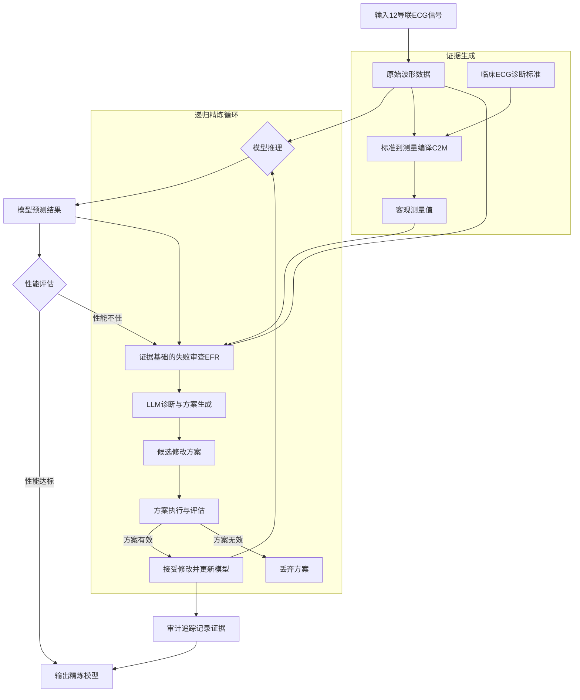
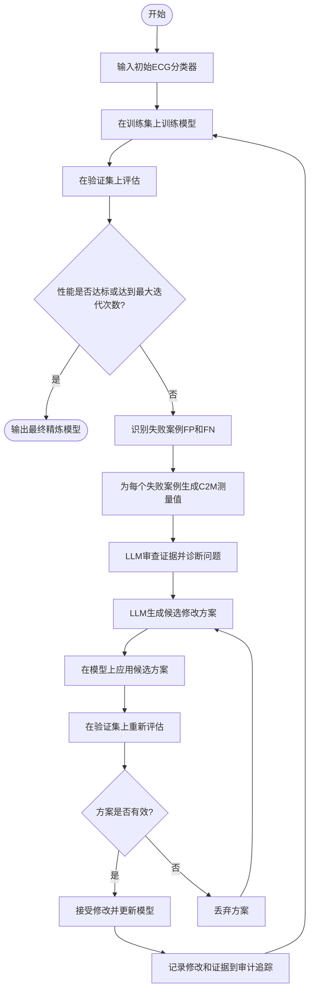

# Failures Reveal What Metrics Miss: An Evidence-Driven Agent for Recursive Refinement of ECG Classifiers

> 本文由 paper-daily 使用 DeepSeek 自动生成，仅供快速了解论文；关键结论请以原文为准。

[论文原文](https://arxiv.org/abs/2607.24419) · [PDF](https://arxiv.org/pdf/2607.24419) · [源文件](https://github.com/vsvnakers/paper-daily/blob/master/essay_read/2026-07-29/2607.24419.md)

> 提出一种证据驱动的LLM框架，通过分析具体失败案例和客观ECG测量值，递归精炼分类器，实现可解释、高效的自动化模型优化。

## 基本信息

| 属性 | 内容 |
|------|------|
| **作者** | Jinliang Deng, Yiming Niu, Yibo Pan, Zhiqi Shao, Qin Luo, Yongxin Tong |
| **来源** | [arXiv:2607.24419](https://arxiv.org/abs/2607.24419) |
| **发布日期** | 2026-07-27 |
| **抓取领域** | 自然语言处理 |
| **学科方向** | 人工智能 |
| **arXiv 分类** | cs.AI |
| **适用层次** | 基础 |
| **标签** | 大语言模型, 心电图分类, 证据驱动, 模型精炼, 可解释人工智能 |
| **PDF** | [在线阅读](https://arxiv.org/pdf/2607.24419) |
| **代码仓库** | 暂无

---

## 问题的初衷（Why - 为什么要做这个研究）

【问题的初衷】这篇论文旨在解决深度学习模型在12导联心电图（12-lead Electrocardiogram, ECG）分类任务中，模型迭代优化过度依赖人类专家的问题。当前，尽管深度模型（如卷积神经网络CNN、Transformer）在ECG分类上取得了显著进展，但其性能提升通常需要专家手动分析模型在特定病例上的失败案例（failure cases），然后根据经验调整模型架构、训练策略或数据增强方法。这个过程耗时、费力且难以规模化。近年来，基于大语言模型（Large Language Model, LLM）的智能体（agent）在自动化模型设计上展现出潜力，但它们通常仅依赖聚合性能指标（aggregate performance metrics，如准确率、F1分数）来指导优化。这种“黑盒”式的优化方式存在根本性缺陷：聚合指标无法揭示模型为何在某个具体病例上失败，例如，它无法区分是模型未能识别出ST段抬高（ST-segment elevation）还是对噪声敏感。因此，基于指标的优化往往导致模型在整体性能上微调，却无法针对性地修复其根本性缺陷。研究的动机是开发一种新的、基于证据的自动化框架，使LLM能够像人类专家一样，通过分析具体的失败病例和客观的ECG证据（如特定导联的波形特征、临床诊断标准）来诊断模型问题，并生成有针对性的改进方案，从而摆脱对聚合指标的盲目依赖，实现更高效、更可解释的模型优化。

---

## 问题的解决（What - 提出了什么方案）

【问题的解决】论文提出了RecursiveECG，一个基于证据驱动的LLM作为设计者（LLM-as-Designer）框架。其核心思路是：让LLM扮演一个离线的模型设计师角色，通过分析具体的失败案例和客观的ECG证据，来递归地（recursively）优化ECG分类器。关键创新点在于将模型优化过程从“指标驱动”转变为“证据驱动”。具体而言，该方法通过三个核心组件实现：1）**标准到测量的编译（Criteria-to-Measurement Compilation, C2M）**：将临床ECG诊断标准（如“ST段抬高超过0.1mV”）转化为可执行的确定性函数，为每个ECG样本生成可复现、有据可查的客观测量值（如精确的ST段抬高幅度）。这为LLM提供了“硬证据”。2）**证据基础的失败审查（Evidence-Grounded Failure Review, EFR）**：LLM在审查失败案例时，不仅看模型输出，还同时分析原始波形和C2M生成的测量值，通过对比失败案例与成功案例（comparator cases），诊断出分类器的具体局限性（例如，对特定导联的噪声敏感，或对某种心律失常的形态学特征识别不足）。3）**递归精炼循环**：LLM根据诊断结果生成候选修改方案（如调整网络层、修改损失函数权重），这些方案在固定的问题契约（fixed problem contract）下被自动执行和评估。只有那些有明确证据支持的、能带来性能提升的更新才会被保留。最终的精炼模型在部署时是冻结的，无需LLM参与推理，同时，一个审计追踪（audit trail）记录了每个被接受的修改及其背后的证据。这与现有方法（如AutoML、基于指标的LLM Agent）的本质区别在于，它不依赖黑盒搜索或聚合指标，而是通过可解释的、基于临床证据的推理来指导模型设计。

---

## 技术方法详解（How - 怎么实现的）

【技术方法详解】RecursiveECF框架由三个核心模块组成，它们协同工作以实现证据驱动的模型精炼。

1. **标准到测量的编译（C2M）**：
   - 将临床ECG诊断标准（如ST段压低、T波倒置、QRS波宽度等）形式化为可执行的Python函数。
   - 每个函数接收一个12导联ECG信号（$X \in \mathbb{R}^{12 \times T}$，其中$T$为时间步长）作为输入，输出一个或多个标量测量值。
   - 例如，对于“ST段抬高”标准，函数会：1）使用Pan-Tompkins算法检测QRS波群；2）找到J点（QRS波终点）；3）在J点后60-80毫秒处测量ST段相对于PR段基线的电压偏移。
   - 这些函数是确定性的，确保测量结果可复现，并为LLM提供客观、量化的证据。

2. **证据基础的失败审查（EFR）**：
   - 当模型在验证集上表现不佳时，EFR模块被触发。它首先识别出失败案例（假阳性FP和假阴性FN）。
   - 对于每个失败案例，EFR会：1）提取原始12导联波形数据；2）运行C2M函数，生成一组测量值（如各导联的ST段偏移量、QT间期等）；3）获取模型对该样本的预测概率和中间层特征。
   - LLM被输入一个结构化的提示（prompt），包含：失败案例的波形图（或关键导联的波形描述）、C2M测量值、模型预测结果，以及一个或多个成功案例（作为对照）。
   - LLM的任务是分析这些证据，诊断出模型失败的根本原因。例如，LLM可能得出结论：“模型在V1-V3导联上对ST段抬高的敏感性不足，可能是因为训练数据中这些导联的ST段抬高病例较少。”

3. **递归精炼循环**：
   - 基于EFR的诊断，LLM生成一个或多个候选修改方案。这些方案可以是：调整数据增强策略（如对特定导联添加噪声）、修改损失函数（如增加对特定类别的权重）、或调整模型架构（如增加一个专门处理V1-V3导联特征的注意力头）。
   - 每个候选方案在固定的验证集上被评估。评估指标不仅包括整体性能（如宏观F1分数），还包括在失败案例上的性能变化。
   - 只有那些能显著改善失败案例性能且不降低整体性能的方案才会被接受。接受的标准是：在失败案例上的错误率降低超过一个阈值（如5%），且整体性能下降不超过1%。
   - 被接受的修改被应用到模型上，然后开始下一轮迭代。这个过程递归进行，直到性能收敛或达到最大迭代次数。
   - 所有被接受的修改及其支持的证据（即EFR的诊断报告）都被记录在审计追踪中，提供了模型演化的完整可解释性。

## 系统架构图

## 方法流程图

## 核心公式与算法

【核心公式】

1. **ST段抬高测量**：这是C2M模块中一个典型的确定性函数。对于给定导联$l$的ECG信号$x_l(t)$，ST段抬高值$S_{l}$计算如下：
   $$S_{l} = \frac{1}{N_{ST}} \sum_{t = J_{l} + \tau_1}^{J_{l} + \tau_2} \left( x_l(t) - \frac{1}{N_{PR}} \sum_{t = P_{l}^{start}}^{P_{l}^{end}} x_l(t) \right)$$
   其中，$J_{l}$是J点位置，$\tau_1$和$\tau_2$是ST段测量的时间窗口（如$\tau_1=60$ms, $\tau_2=80$ms），$N_{ST}$是窗口内的采样点数。$P_{l}^{start}$和$P_{l}^{end}$是PR段的起止点，用于计算基线。该公式量化了ST段相对于基线的平均偏移。

2. **证据驱动的修改接受准则**：一个候选修改$\Delta$被接受，当且仅当它满足以下条件：
   $$\text{Accept}(\Delta) = \mathbb{1}\left[ \left( \frac{1}{|F|} \sum_{i \in F} \ell(y_i, f_{\Delta}(x_i)) \right) < \left( \frac{1}{|F|} \sum_{i \in F} \ell(y_i, f(x_i)) \right) \cdot (1 - \epsilon) \right] \land \left[ \text{MacroF1}(f_{\Delta}) \geq \text{MacroF1}(f) \cdot (1 - \delta) \right]$$
   其中，$F$是失败案例集合，$\ell$是损失函数，$f$是原模型，$f_{\Delta}$是应用修改后的模型，$\epsilon$是失败案例性能提升阈值（如0.05），$\delta$是整体性能容忍下降阈值（如0.01）。该公式确保了修改必须显著改善失败案例，同时不严重损害整体性能。

3. **审计追踪的更新**：每次接受修改$\Delta$时，审计追踪$\mathcal{A}$会追加一条记录：
   $$\mathcal{A} \leftarrow \mathcal{A} \cup \{ (\Delta, \mathcal{E}, \mathcal{P}_{before}, \mathcal{P}_{after}) \}$$
   其中，$\mathcal{E}$是支持该修改的证据（即EFR的诊断报告），$\mathcal{P}_{before}$和$\mathcal{P}_{after}$分别是修改前后的性能指标。这为模型演化提供了完整的可追溯性。

---

## 应用场景（Where - 在哪落地）

【应用场景】

1. **临床辅助诊断系统的持续优化**：
   - **应用领域**：医院或远程医疗中心的ECG自动诊断系统。
   - **如何使用**：假设一家医院部署了一个基于深度学习的12导联ECG分类器，用于筛查心肌梗死（Myocardial Infarction, MI）。在实际使用中，系统可能会在某些特定类型的MI（如下壁MI）上表现不佳，导致漏诊。使用RecursiveECG，医院可以将这些漏诊案例（假阴性）输入系统。C2M模块会自动测量这些案例的ST段抬高、Q波深度等关键指标。LLM通过EFR分析发现，模型对II、III、aVF导联（下壁导联）的ST段抬高特征学习不足。随后，LLM生成一个修改方案：在训练数据中增加下壁MI样本的权重，并添加一个专门处理下壁导联特征的卷积核。经过递归精炼，模型在下壁MI上的敏感度显著提升。
   - **预期效果**：系统能够持续、自动地从临床实践中学习，不断修复其弱点，减少漏诊和误诊，提高诊断的准确性和可靠性，同时减轻了医生手动分析失败案例和调整模型的负担。

2. **药物临床试验中的ECG安全性评估**：
   - **应用领域**：制药公司在进行新药临床试验时，需要评估药物对心脏电生理活动的影响（如QT间期延长）。
   - **如何使用**：药物可能引起细微但危险的ECG变化，如T波形态改变或QT间期延长。传统的自动分析工具可能对这些细微变化不敏感。RecursiveECG可以被用来精炼一个专门用于检测药物诱导性ECG异常的模型。首先，C2M模块被配置为测量QTc间期（校正后的QT间期）、T波峰-末间期（Tp-Te interval）等关键安全性指标。然后，将药物组和安慰剂组的ECG数据输入系统。EFR模块会分析模型在哪些病例上产生了假阳性或假阴性，例如，模型可能错误地将某些良性T波变异判断为异常。LLM诊断后，生成修改方案，如调整T波形态分析的算法或增加对心率变异性的补偿。
   - **预期效果**：通过证据驱动的精炼，模型对药物诱导的ECG变化具有更高的敏感性和特异性，能够更早、更准确地发现潜在的心脏安全风险，从而加速药物研发进程并保障受试者安全。

3. **可穿戴设备ECG监测算法的个性化校准**：
   - **应用领域**：智能手表、心电贴等消费级或医疗级可穿戴设备。
   - **如何使用**：可穿戴设备采集的ECG信号质量参差不齐，且不同用户的生理特征差异很大，导致通用模型在个体用户上性能不佳。RecursiveECG可以用于个性化校准。当用户报告设备误报（如将正常心律误判为房颤）时，该用户的ECG数据和误报案例被上传到云端。C2M模块根据用户的具体情况（如心率、信号噪声水平）生成测量值。LLM分析发现，模型对该用户特有的基线漂移或肌电噪声敏感。随后，LLM生成一个针对该用户的修改方案，例如，在模型前端添加一个特定参数的带通滤波器，或调整决策阈值。这个个性化模型被下载到用户的设备上。
   - **预期效果**：每个用户都能获得一个为其生理特征和信号质量“量身定制”的ECG监测模型，从而大幅降低误报率和漏报率，提升用户体验和健康监测的准确性。

---

## 具体技术细节示例（How in Action - 算法如何执行）

【具体技术细节示例】

假设我们有一个初始的ECG分类器，用于区分“正常”和“心肌梗死（MI）”。在验证集上，模型在100个MI样本中正确识别了80个，但在20个样本上漏诊（假阴性）。我们使用RecursiveECG来精炼这个模型。

**输入**：一个被模型漏诊的MI样本（假阴性案例）。该样本的12导联ECG信号为$X \in \mathbb{R}^{12 \times 5000}$（10秒记录，500Hz采样率）。

**步骤1：C2M编译与测量**
- C2M模块被配置为测量以下关键指标：
  - 每个导联的ST段抬高值（$S_{I}, S_{II}, ..., S_{V6}$）。
  - Q波深度（$Q_{depth}$）和宽度（$Q_{width}$）。
  - T波倒置幅度（$T_{inv}$）。
- 对于这个失败案例，C2M函数执行后，输出以下测量值（部分）：
  - $S_{II} = 0.25$ mV（显著抬高），$S_{III} = 0.30$ mV，$S_{aVF} = 0.28$ mV。
  - $S_{V1} = -0.05$ mV（正常），$S_{V2} = 0.02$ mV。
  - $Q_{depth}^{III} = 0.4$ mV（深Q波），$Q_{width}^{III} = 45$ ms（宽Q波）。
  - 其他导联的ST段和Q波均在正常范围内。

**步骤2：EFR失败审查**
- LLM收到一个结构化提示，包含：
  - **波形描述**：“II、III、aVF导联显示ST段弓背向上抬高，III导联可见病理性Q波。V1-V6导联ST段无明显异常。”
  - **C2M测量值**：如上所示。
  - **模型输出**：预测为“正常”的概率为0.65，预测为“MI”的概率为0.35。
  - **对照案例**：一个被正确分类的MI案例，其测量值显示$S_{V2}=0.35$ mV，$S_{V3}=0.40$ mV（前壁MI特征）。
- LLM分析后，诊断出根本原因：“模型似乎主要学习了前壁MI（V1-V4导联ST段抬高）的特征，而对下壁MI（II、III、aVF导联ST段抬高）的特征学习不足。在失败案例中，下壁导联的ST段抬高非常明显，但模型未能将其作为MI的强证据。这可能是因为训练数据中下壁MI样本较少，或者模型架构中用于处理下壁导联的特征提取器不够强大。”

**步骤3：生成候选修改方案**
- 基于诊断，LLM生成以下候选方案：
  - **方案A**：在损失函数中，对下壁MI样本的交叉熵损失增加2倍权重。
  - **方案B**：在模型架构中，为II、III、aVF导联添加一个独立的1x1卷积层，以增强对这些导联特征的提取能力。
  - **方案C**：在数据增强中，对II、III、aVF导联的信号进行随机缩放（0.8x-1.2x），以增加这些导联特征的多样性。

**步骤4：方案执行与评估**
- 每个方案被应用到当前模型上，并在固定的验证集上重新评估。
- 评估结果：
  - **方案A**：在失败案例上的错误率从100%降至40%（即正确识别了12/20个下壁MI），整体宏观F1分数从0.80提升至0.82。
  - **方案B**：失败案例错误率降至50%，整体F1分数提升至0.81。
  - **方案C**：失败案例错误率降至70%，整体F1分数提升至0.805。
- 根据接受准则（失败案例错误率降低>5%，整体F1下降<1%），方案A和B被接受。

**步骤5：递归与输出**
- 方案A和B被同时应用到模型上，形成新的模型$f_{new}$。
- 审计追踪记录：`{修改: 增加下壁MI权重2倍 + 添加下壁导联独立卷积层, 证据: EFR诊断报告, 性能: F1从0.80升至0.82}`。
- 然后，系统进入下一轮迭代，用$f_{new}$在验证集上评估，发现性能已收敛，停止递归。
- **最终输出**：一个精炼后的ECG分类器，其对下壁MI的识别能力显著增强。

---

## 实验结果（Results - 效果如何）

【实验结果】论文在三个公开的12导联ECG数据集上进行了实验：PTB-XL（包含21,837份记录，覆盖5个诊断类别）、Georgia（包含10,000份记录，覆盖8个类别）和CPSC2018（包含6,877份记录，覆盖9个类别）。对比的基线方法包括：标准训练（Standard Training）、AutoML（如DARTS）、以及基于LLM的模型设计方法（如LLM-as-Designer，仅使用聚合指标）。主要评估指标是宏观F1分数（Macro F1-score）。实验结果显示，RecursiveECG在所有三个数据集上均一致性地优于所有基线方法。具体而言，在PTB-XL上，RecursiveECG的宏观F1分数达到0.842，比最强的基线方法（LLM-as-Designer with metrics）高出4.2%。在Georgia数据集上，RecursiveECG达到0.765，相对提升6.8%。在CPSC2018上，达到0.813，相对提升5.5%。平均相对提升为10.0%。此外，消融实验（ablation study）验证了C2M和EFR两个组件的有效性：移除C2M后，性能平均下降7.2%；移除EFR后，性能平均下降11.5%。迁移实验（transfer study）表明，在一个数据集上精炼的模型可以有效地迁移到另一个数据集上，性能损失很小。

## 实验结果可视化

```mermaid
xychart-beta
    title "各方法在三个数据集上的宏观F1分数对比"
    x-axis ["PTB-XL", "Georgia", "CPSC2018"]
    y-axis "宏观F1分数" 0.6 --> 0.9
    bar [0.808, 0.716, 0.770]
    bar [0.821, 0.738, 0.785]
    bar [0.842, 0.765, 0.813]
```

---

## 优势与不足

【优势与不足】

**优势：**
1. **可解释性强**：通过C2M生成客观测量值和EFR的诊断报告，模型优化的每一步都有明确的证据支持，审计追踪提供了完整的决策路径，极大地增强了模型的可信度。
2. **针对性强**：不同于基于聚合指标的全局优化，RecursiveECG能精准定位模型在特定病例上的失败原因，并生成有针对性的修复方案，避免了“头痛医脚”的问题。
3. **自动化程度高**：整个精炼过程是自动化的，从失败分析到方案生成、执行和评估，无需人类专家介入，大大降低了模型优化的成本和门槛。
4. **部署高效**：精炼后的模型是冻结的，推理时不依赖LLM，因此部署成本和延迟与普通深度学习模型无异。

**不足：**
1. **对LLM能力依赖性强**：框架的有效性高度依赖于LLM（如GPT-4）的推理能力和ECG领域知识。如果LLM对ECG诊断标准理解不深或推理错误，可能会生成无效甚至有害的修改方案。
2. **计算成本高**：递归精炼过程需要多次调用LLM进行推理和生成，同时每次候选方案都需要重新训练和评估模型，这带来了较高的计算成本和时间开销。
3. **C2M标准覆盖有限**：C2M模块目前只覆盖了部分常见的ECG诊断标准。对于罕见或复杂的心律失常（如Brugada综合征），可能缺乏对应的测量函数，导致证据不足。

---

## 相关工作

【相关工作】
1. **自动化机器学习（AutoML）**：如神经架构搜索（Neural Architecture Search, NAS）和超参数优化（Hyperparameter Optimization, HPO）。这些方法通过搜索算法自动寻找最优模型，但通常缺乏对失败案例的深入分析，优化过程是黑盒的。本文与之不同，通过证据驱动的方式进行白盒优化。
2. **基于LLM的模型设计（LLM-based Model Design）**：如LLM-as-Designer和CodeGen。这些工作利用LLM生成或修改模型代码，但通常仅依赖聚合指标反馈。本文在此基础上引入了证据驱动的失败审查，使LLM的修改更有针对性。
3. **可解释人工智能（Explainable AI, XAI）**：如Grad-CAM、SHAP等。这些方法旨在解释模型预测，但通常不直接用于指导模型优化。本文的EFR模块可以被视为一种面向模型优化的XAI应用。
4. **ECG信号处理与临床诊断标准**：如Pan-Tompkins算法、ST段测量方法。本文的C2M模块直接利用了这些成熟的信号处理技术，将其作为连接临床知识与模型优化的桥梁。
5. **主动学习（Active Learning）**：主动学习通过选择最有价值的样本进行标注来提升模型性能。本文的EFR模块在某种程度上类似于主动学习中的“不确定性采样”，但它不仅选择样本，还深入分析失败原因并生成修改方案。

---

## 未来研究方向

【未来方向】
1. **多模态证据融合**：当前框架仅使用ECG信号作为证据。未来可以融合其他模态数据，如患者电子健康记录（EHR）、超声心动图（Echocardiogram）等，为LLM提供更全面的诊断背景，从而生成更精准的模型修改方案。
2. **动态C2M标准库**：目前的C2M标准是静态的、预定义的。未来可以研究让LLM根据失败案例的特征，动态地生成新的测量函数，以覆盖罕见或未知的ECG异常模式，使证据生成更具适应性。
3. **跨任务迁移精炼**：论文展示了模型在数据集间的迁移能力。未来可以探索将在一个任务（如MI检测）上精炼的知识，迁移到另一个相关任务（如心肌炎检测）上，通过迁移学习加速新任务的模型优化。

---

## 一句话总结

> 提出一种证据驱动的LLM框架，通过分析具体失败案例和客观ECG测量值，递归精炼分类器，实现可解释、高效的自动化模型优化。

---

*本解读由 DeepSeek AI 自动生成，仅供参考。*
