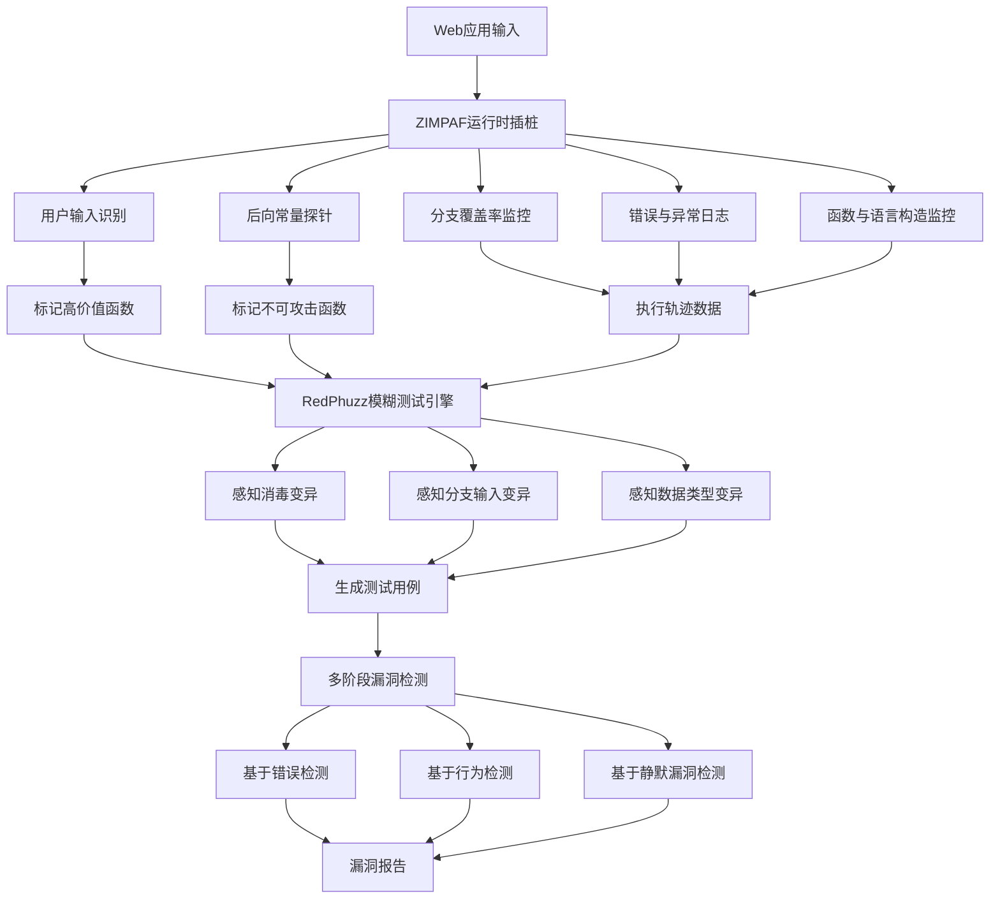
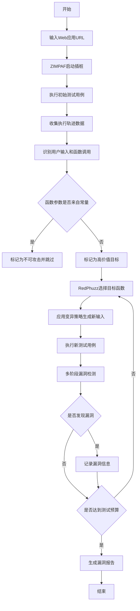

# ZIMPAF & RedPhuzz: High-fidelity Web Application Fuzzing via Branch, Language Construct, and Function Call Monitoring

> 本文由 paper-daily 使用 DeepSeek 自动生成，仅供快速了解论文；关键结论请以原文为准。

[论文原文](https://arxiv.org/abs/2607.25012) · [PDF](https://arxiv.org/pdf/2607.25012) · [源文件](https://github.com/vsvnakers/paper-daily/blob/master/essay_read/2026-07-29/2607.25012.md)

> 通过高效多粒度插桩和精准变异策略，实现高保真Web应用模糊测试，显著提升漏洞检测率和性能。

## 基本信息

| 属性 | 内容 |
|------|------|
| **作者** | Tennov Simanjuntak, Christoph Csallner |
| **来源** | [arXiv:2607.25012](https://arxiv.org/abs/2607.25012) |
| **发布日期** | 2026-07-27 |
| **抓取领域** | 软件工程 · 分析/测试/合成 |
| **学科方向** | 安全加密 |
| **arXiv 分类** | cs.CR |
| **适用层次** | 进阶 |
| **标签** | 模糊测试, 插桩, Web安全, 漏洞检测, PHP |
| **PDF** | [在线阅读](https://arxiv.org/pdf/2607.25012) |
| **代码仓库** | 暂无

---

## 问题的初衷（Why - 为什么要做这个研究）

【问题的初衷】Web应用模糊测试（Fuzzing）是发现Web应用漏洞的关键技术。然而，现有最先进的模糊测试工具（如Phuzz）存在三大核心局限性：第一，插桩（Instrumentation）效率低下，导致运行时开销巨大，影响测试吞吐量；第二，缺乏对执行环境（如解释器内部机制）的深入理解，无法有效监控函数调用、语言构造（Language Construct）等关键信息；第三，Web领域知识有限，无法区分用户可控输入与常量，导致大量无效测试。例如，Phuzz的插桩工具PCOV和UOPZ在记录分支覆盖率时，会引入显著的性能开销，且无法识别哪些分支指令使用了用户输入（Tainted Input）。此外，现有方法主要依赖错误日志（Error-based Fuzzing）来发现漏洞，但许多安全漏洞（如逻辑漏洞、静默漏洞）并不会触发显式错误，导致漏报。因此，亟需一种高保真（High-fidelity）的模糊测试方法，能够高效插桩、深入理解执行环境，并实现精准的漏洞检测。

---

## 问题的解决（What - 提出了什么方案）

【问题的解决】论文提出了ZIMPAF和RedPhuzz两个核心组件，协同解决上述问题。ZIMPAF是一种运行时解释器插桩（Runtime Interpreter Instrumentation）工具，它实现了多粒度（Multi-granular）插桩，能够同时监控分支覆盖率、错误与异常日志、函数调用、语言构造，并识别用户输入在分支指令中的使用情况。其关键创新在于：无需进行完整的污点分析（Taint Analysis），即可通过监控函数参数是否被用户输入污染（Tainted）来标记高价值模糊测试目标；同时，提出了一种新颖的后向常量探针（Backward Constant Probe），通过反向追踪函数参数是否源自常量，推断其不可攻击性（Invulnerability），从而跳过这些函数，减少无效测试。RedPhuzz则利用ZIMPAF提供的丰富信息，执行高度目标化的函数级和输入级模糊测试。它超越了简单的基于错误的模糊测试，通过多阶段漏洞检测（Multi-stage Vulnerability Detection）发现静默漏洞（Silent Vulnerabilities）。此外，RedPhuzz引入了三种新颖的变异策略：感知消毒（Sanitization-aware）、感知分支输入（Input-in-branch-aware）和感知数据类型（Data type-aware）变异，实现了高度精准和高效的模糊测试。与Phuzz相比，RedPhuzz在86个测试用例中检测到所有漏洞，而Phuzz漏检16个，且速度提升了73%。

---

## 技术方法详解（How - 怎么实现的）

【技术方法详解】
- **ZIMPAF多粒度插桩**：ZIMPAF在PHP解释器（如PHP 7.0）的运行时进行插桩，通过修改解释器内部函数（如`zend_execute_ex`）来捕获关键事件。它实现了四种粒度的监控：1) 分支覆盖率（Branch Coverage）：记录每个条件分支的执行情况；2) 错误与异常日志（Error & Exception Logging）：捕获所有运行时错误和异常；3) 函数与语言构造监控（Function & Language Construct Monitoring）：记录每个函数调用和语言构造（如`echo`、`include`）的执行；4) 用户输入识别（User Input Identification）：通过监控`$_GET`、`$_POST`等超全局变量的使用，标记哪些分支指令使用了用户输入。
- **后向常量探针（Backward Constant Probe）**：当ZIMPAF检测到函数调用时，它会反向追踪函数参数的值来源。如果参数值直接来自常量（如字符串字面量`"admin"`），则标记该函数为不可攻击（Invulnerable），并在后续模糊测试中跳过。这避免了在不可能被利用的函数上浪费计算资源。
- **RedPhuzz目标化模糊测试**：RedPhuzz接收ZIMPAF提供的函数调用图（Call Graph）和用户输入标记信息。它优先对标记为高价值（High-valued）的函数进行模糊测试，即那些参数被用户输入污染的函数。对于每个目标函数，RedPhuzz会生成特定的输入，尝试触发该函数的所有可能执行路径。
- **多阶段漏洞检测（Multi-stage Vulnerability Detection）**：RedPhuzz不仅依赖错误日志，还通过三个阶段检测漏洞：1) 第一阶段：基于错误的检测（Error-based），捕获崩溃和异常；2) 第二阶段：基于行为的检测（Behavior-based），监控函数返回值、执行路径变化等异常行为；3) 第三阶段：基于静默漏洞的检测（Silent Vulnerability Detection），通过比较不同输入下的执行轨迹，发现那些不触发错误但导致安全问题的漏洞（如SQL注入、命令注入）。
- **三种新型变异策略**：1) 感知消毒变异（Sanitization-aware Mutation）：识别并绕过常见的输入消毒函数（如`htmlspecialchars`、`mysql_real_escape_string`），生成能突破消毒的输入；2) 感知分支输入变异（Input-in-branch-aware Mutation）：针对那些在分支指令中使用的用户输入，生成能覆盖不同分支的输入；3) 感知数据类型变异（Data type-aware Mutation）：根据目标函数期望的数据类型（如整数、字符串、数组），生成符合类型约束的输入，避免因类型错误导致的无效测试。

## 系统架构图

## 方法流程图

## 核心公式与算法

【核心公式】
1. **吞吐量（Throughput）计算公式**：
   $$\text{Throughput} = \frac{N_{exec}}{T_{total}}$$
   其中，$N_{exec}$ 是执行的测试用例数量，$T_{total}$ 是总执行时间。ZIMPAF通过减少插桩开销，提高了吞吐量。

2. **高价值函数标记条件**：
   $$\text{HighValue}(f) = \begin{cases} \text{True} & \text{if } \exists p \in \text{params}(f) \text{ such that } p \text{ is tainted by user input} \\ \text{False} & \text{otherwise} \end{cases}$$
   该公式表示，如果函数 $f$ 的任何一个参数 $p$ 被用户输入污染，则 $f$ 被标记为高价值目标。

3. **不可攻击函数标记条件（后向常量探针）**：
   $$\text{Invulnerable}(f) = \begin{cases} \text{True} & \text{if } \forall p \in \text{params}(f), \text{ the value of } p \text{ originates from a constant} \\ \text{False} & \text{otherwise} \end{cases}$$
   该公式表示，如果函数 $f$ 的所有参数都源自常量，则 $f$ 被标记为不可攻击，并在模糊测试中跳过。

---

## 应用场景（Where - 在哪落地）

【应用场景】
1. **Web应用安全测试**：在开发阶段或上线前，使用RedPhuzz对Web应用进行自动化安全测试。例如，对一个基于PHP的电子商务网站进行模糊测试，ZIMPAF插桩后，RedPhuzz会优先测试那些处理用户输入的函数（如`add_to_cart`、`checkout`），并生成能绕过消毒的SQL注入或XSS payload。通过多阶段检测，不仅能发现导致500错误的漏洞，还能发现那些不报错但导致数据泄露的逻辑漏洞。预期效果是显著减少人工审计的工作量，提高漏洞发现率。
2. **CMS（内容管理系统）安全审计**：针对WordPress、Drupal等流行CMS，使用RedPhuzz进行深度安全审计。这些CMS拥有大量插件和主题，可能存在未知漏洞。ZIMPAF可以监控插件中的函数调用，识别哪些函数使用了用户输入（如`$_GET['page']`），并标记为高价值目标。RedPhuzz的感知数据类型变异可以生成符合插件期望的输入（如整数ID、字符串slug），从而触发深层代码路径。预期效果是发现零日漏洞（Zero-day Vulnerability），提升CMS生态系统的安全性。
3. **API安全测试**：对RESTful API或GraphQL API进行模糊测试。虽然ZIMPAF主要针对PHP，但其思想可以扩展到其他语言。例如，对Node.js编写的API，可以类似地插桩JavaScript解释器，监控函数调用和用户输入。RedPhuzz的感知分支输入变异可以针对API中的条件分支（如`if (req.query.role === 'admin')`）生成不同输入，测试权限绕过漏洞。多阶段检测可以监控API的响应状态码、响应体内容等，发现静默漏洞。预期效果是提高API的健壮性，防止未授权访问和数据泄露。

---

## 具体技术细节示例（How in Action - 算法如何执行）

【具体技术细节示例】
假设我们有一个简单的PHP函数`get_user_by_id($id)`，它从数据库查询用户信息。ZIMPAF插桩后，会监控到该函数被调用，并检查参数`$id`的来源。

**输入**：用户通过URL参数`?id=1`访问页面。

**执行步骤**：
1. **ZIMPAF监控**：ZIMPAF检测到`$_GET['id']`被使用，并标记其值为`1`。当`get_user_by_id($id)`被调用时，ZIMPAF记录函数调用，并反向追踪`$id`的值来源。由于`$id`直接来自`$_GET['id']`（用户输入），ZIMPAF标记`get_user_by_id`为高价值函数。
2. **后向常量探针**：ZIMPAF检查`$id`是否来自常量。这里`$id`来自用户输入，不是常量，因此不标记为不可攻击。
3. **RedPhuzz目标选择**：RedPhuzz从ZIMPAF获取信息，将`get_user_by_id`作为高价值目标。它首先生成一个初始测试用例`?id=1`，执行后收集执行轨迹。
4. **变异策略应用**：RedPhuzz应用感知数据类型变异，知道`$id`应该是整数。它生成变异输入`?id=2`、`?id=100`等。同时，应用感知分支输入变异，假设函数内部有分支`if ($id > 10)`，则生成`?id=11`以覆盖该分支。
5. **多阶段漏洞检测**：
   - **第一阶段**：执行`?id=abc`（非整数），PHP可能抛出类型错误，RedPhuzz捕获该错误。
   - **第二阶段**：执行`?id=1 OR 1=1`（SQL注入尝试），如果函数未消毒，数据库可能返回所有用户，RedPhuzz监控到返回数据量异常（行为变化），标记为潜在漏洞。
   - **第三阶段**：执行`?id=1`和`?id=2`，比较执行轨迹。如果轨迹差异仅在于查询结果，但无错误，RedPhuzz可能忽略；但如果轨迹显示`?id=1`导致管理员权限，而`?id=2`导致普通用户权限，RedPhuzz会检测到权限提升漏洞。

**输出**：RedPhuzz最终报告发现一个SQL注入漏洞（通过第二阶段检测）和一个权限提升漏洞（通过第三阶段检测）。

---

## 实验结果（Results - 效果如何）

【实验结果】论文在六个基准Web应用（包括WordPress、Drupal、Joomla等）上进行了评估，共使用86个测试用例。对比方法为Phuzz（RedPhuzz的前身）及其插桩工具PCOV和UOPZ。实验结果显示：RedPhuzz检测到了所有86个漏洞，而Phuzz漏检了16个（漏检率约18.6%）。在性能方面，RedPhuzz比Phuzz快73%，尽管它执行了更多的任务（如多阶段检测和变异策略）。ZIMPAF的插桩性能显著优于PCOV和UOPZ：在五个基准测试中，ZIMPAF的吞吐量（Throughput）是PCOV和UOPZ的2.1倍到41.22倍；在另一个基准测试中，ZIMPAF的吞吐量是PCOV和UOPZ的0.87倍（略低）。此外，ZIMPAF在插桩过程中写入的数据量显著多于PCOV和UOPZ，表明其监控粒度更细。

## 实验结果可视化

```mermaid
xychart-beta
    title "RedPhuzz与Phuzz漏洞检测对比"
    x-axis ["总漏洞数", "检测到漏洞数", "漏检漏洞数"]
    y-axis "漏洞数量" 0 --> 100
    bar [86, 86, 0]
    bar [86, 70, 16]
```

---

## 优势与不足

【优势与不足】
**优势：**
1. **高检测率**：RedPhuzz检测到了所有测试用例中的漏洞，而Phuzz漏检了16个，证明了其多阶段检测和精准变异策略的有效性。
2. **高性能**：尽管功能更复杂，RedPhuzz比Phuzz快73%，这得益于ZIMPAF的高效插桩和跳过不可攻击函数的优化。
3. **创新性插桩**：ZIMPAF的后向常量探针和无需污点分析的用户输入识别方法，显著降低了插桩开销，同时提供了更丰富的执行信息。
4. **静默漏洞检测**：通过多阶段检测，特别是第三阶段的静默漏洞检测，能够发现传统基于错误的方法无法发现的漏洞。

**不足：**
1. **语言依赖性**：ZIMPAF是针对PHP解释器实现的，其插桩方法依赖于PHP的运行时结构。迁移到其他语言（如Python、JavaScript）需要大量修改。
2. **常量探针的局限性**：后向常量探针假设常量参数一定不可攻击，但某些情况下常量参数也可能被利用（例如，常量字符串拼接用户输入后形成漏洞）。这可能导致漏报。
3. **基准测试规模有限**：实验仅在六个Web应用上进行，且测试用例数量为86个，规模相对较小。在更大规模、更多样化的应用上，性能可能有所变化。

---

## 相关工作

【相关工作】
1. **Phuzz**：RedPhuzz的前身，基于轨迹的Web应用模糊测试工具。RedPhuzz在其基础上引入了更高效的插桩和更精准的变异策略。
2. **AFL (American Fuzzy Lop)**：一种广泛使用的通用模糊测试工具，通过分支覆盖率引导变异。RedPhuzz借鉴了覆盖率引导的思想，但针对Web应用进行了定制。
3. **Taint-based Fuzzing**：基于污点分析的模糊测试方法，如TaintScope。ZIMPAF通过监控用户输入在分支中的使用，实现了类似污点分析的效果，但无需完整污点传播。
4. **Sanitizer-aware Fuzzing**：感知消毒函数的模糊测试方法，如SanitizerFuzz。RedPhuzz的感知消毒变异策略与此相关，但更侧重于Web应用的输入消毒。
5. **Multi-stage Vulnerability Detection**：多阶段漏洞检测方法，如VDiscover。RedPhuzz将其应用于Web应用模糊测试，结合错误、行为和静默漏洞检测。

---

## 未来研究方向

【未来方向】
1. **跨语言支持**：将ZIMPAF的插桩思想扩展到其他解释型语言（如Python、Ruby、Node.js），实现通用的Web应用模糊测试框架。这需要针对不同语言的运行时结构设计相应的插桩点。
2. **机器学习增强的变异策略**：利用机器学习模型（如生成对抗网络GAN）自动学习Web应用的输入模式，生成更逼真、更有效的测试用例，减少人工设计变异策略的工作量。
3. **与静态分析结合**：将ZIMPAF的动态插桩信息与静态分析（如代码审计工具）结合，实现更全面的漏洞检测。例如，静态分析可以识别潜在的漏洞模式，动态模糊测试则验证这些模式是否可被利用。

---

## 一句话总结

> 通过高效多粒度插桩和精准变异策略，实现高保真Web应用模糊测试，显著提升漏洞检测率和性能。

---

*本解读由 DeepSeek AI 自动生成，仅供参考。*
