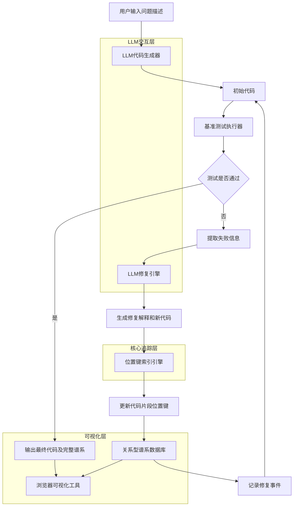
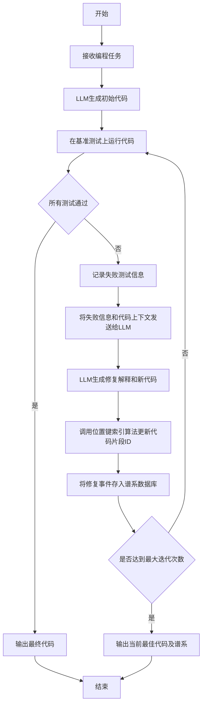
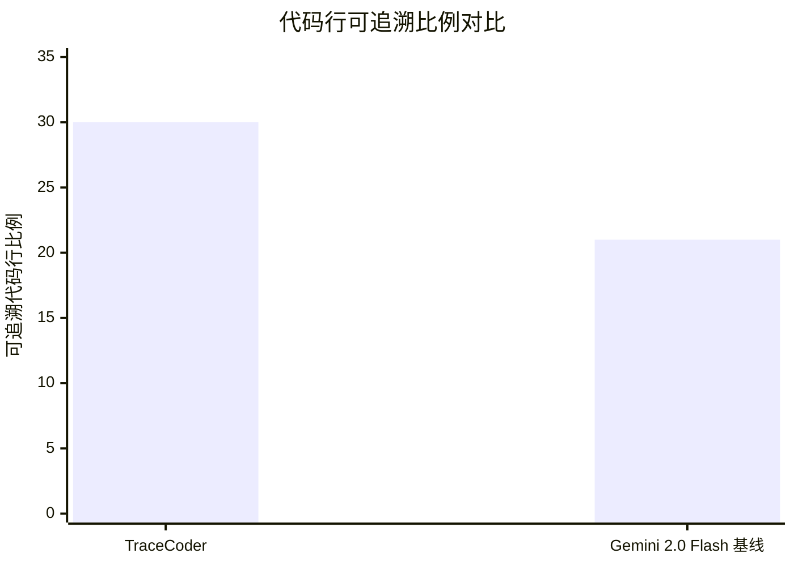

# TraceCoder: Explainable and Auditable Code Generation with Position-Key Snippet Versioning

> 本文由 paper-daily 使用 DeepSeek 自动生成，仅供快速了解论文；关键结论请以原文为准。

[论文原文](https://arxiv.org/abs/2607.26307) · [PDF](https://arxiv.org/pdf/2607.26307) · [源文件](https://github.com/vsvnakers/paper-daily/blob/master/essay_read/2026-07-30/2607.26307.md)

> TraceCoder通过记录、索引和可视化代码修复历史，将LLM代码生成从黑盒转变为可解释、可审计的透明过程。

## 基本信息

| 属性 | 内容 |
|------|------|
| **作者** | Rwaida Alssadi, Muntaser Syed, Balaji Kasula, Lamine Deen, Majed Alotaibi, Mohammed Alghamdi, Tyler Ton, Ali Alqarni, Marius Silaghi |
| **来源** | [arXiv:2607.26307](https://arxiv.org/abs/2607.26307) |
| **发布日期** | 2026-07-28 |
| **抓取领域** | 深度学习编译器/IR |
| **学科方向** | 人工智能 · 软件工程 |
| **arXiv 分类** | cs.AI, cs.SE |
| **适用层次** | 进阶 |
| **标签** | 可解释代码生成, 代码谱系, LLM审计, 位置键索引, 可视化调试 |
| **PDF** | [在线阅读](https://arxiv.org/pdf/2607.26307) |
| **代码仓库** | 暂无

---

## 问题的初衷（Why - 为什么要做这个研究）

【问题的初衷】当前基于大型语言模型（Large Language Model, LLM）的代码生成智能体（Coding Agent）在生成代码时，其内部推理过程完全是一个“黑盒”（Black-box）。用户只能看到最终的代码输出，而无法理解每一行代码背后的生成逻辑、决策依据以及代码是如何通过基准测试（Benchmark）驱动的修复过程逐步演化的。这种不透明性带来了几个严重问题：首先，当生成的代码存在缺陷或安全漏洞时，开发者无法追溯其根源，难以进行有效的调试和修复；其次，在需要问责（Accountability）的生产环境中，无法对代码生成过程进行事后审计（Post-hoc Auditing），这阻碍了LLM在关键任务（如金融、医疗、自动驾驶）中的应用；最后，代码的演化过程是短暂的（Ephemeral），一旦修复完成，之前的失败尝试和修复原因就丢失了，无法用于后续的模型改进或知识复用。因此，论文旨在解决LLM代码生成过程中的“可解释性”（Explainability）和“可审计性”（Auditability）缺失问题，提出一种能够记录、可视化和追溯代码生成全生命周期的系统。

---

## 问题的解决（What - 提出了什么方案）

【问题的解决】论文提出了一个名为TraceCoder的概念验证系统，通过三个互补的机制来解决上述问题。核心思路是：将代码生成过程从一个无状态的黑盒调用，转变为一个有状态、可追溯的“叙事”（Narrative）过程。首先，它设计了一个关系型代码片段历史模式（Relational Snippet-History Schema），将每一次修复事件（Repair Event）的详细信息（如基准测试引用、修复轮次、失败文本、LLM解释）作为元数据记录下来，从而建立完整的代码谱系（Provenance）。其次，开发了一个基于浏览器的可视化工具，通过热力图（Heatmap）和悬停注释（Hover-annotated）的方式，将代码的演化历史直观地渲染在源代码上，让开发者可以交互式地探索每一行代码的“前世今生”。最后，为了在不破坏周围代码结构的前提下，实现对代码片段（Snippet）的细粒度、稳定追踪，论文提出了一种竞争性分数位置键索引方案（Competitive Fractional Position-Key Indexing Scheme），该方案结合树节点分隔符（Tree-Node Delimiters），为每个代码片段分配稳定且按字典序排列的标识符。这三个机制共同作用，使得代码生成的内部“叙事”变得可审计、可回放，从而增强了信任度和可靠性。

---

## 技术方法详解（How - 怎么实现的）

【技术方法详解】
- **关系型代码谱系模式（Relational Provenance Schema）**：系统设计了一个数据库模式来记录代码生成的完整历史。该模式以“修复事件”（Repair Event）为核心实体，每个事件包含：基准测试引用（Benchmark Reference）、修复轮次（Round Number）、失败文本（Failure Text，如测试用例的预期输出与实际输出）、LLM生成的解释（LLM Explanation，即模型解释为何修改代码）。这些事件通过外键与具体的代码片段（Snippet）关联，形成一个有向无环图（DAG），支持复杂的谱系查询（Provenance Query），例如“找出导致第X行代码被修改的所有失败测试”。
- **竞争性分数位置键索引（Competitive Fractional Position-Key Indexing）**：这是实现细粒度代码追踪的核心算法。传统行号（Line Number）在代码插入或删除后不稳定。该方案为每个代码片段分配一个分数键（Fractional Key），例如在行10和行11之间插入新行时，其键值可以设为10.5。为了在多次插入后避免键值精度溢出，算法采用“竞争”策略：当两个相邻片段的键值差过小时，触发一次全局或局部的键值重分配（Rebalancing），类似于B树的节点分裂。同时，使用树节点分隔符（如XML标签或特殊注释）来标记代码块（如函数、循环）的边界，使得键值分配具有层次结构，便于追踪代码块的移动和重构。
- **基于浏览器的可视化工具（Browser-based Visualization Tool）**：该工具将数据库中的谱系信息渲染到源代码上。核心功能包括：1) 热力图（Heatmap）：根据代码行被修改的频率或修复事件的严重性，为代码行着色，直观展示“热点”区域；2) 悬停注释（Hover-annotation）：当鼠标悬停在某行代码上时，弹出一个信息框，显示该行代码的所有历史修复事件，包括时间、原因、LLM的解释等；3) 时间轴滑块（Timeline Slider）：允许用户拖动滑块，查看代码在不同修复轮次（Round）的演化状态。
- **LLM驱动的修复循环（LLM-driven Repair Loop）**：系统的工作流程是迭代的。首先，LLM根据问题描述生成初始代码。然后，代码在基准测试上运行。如果测试失败，失败信息（Failure Text）和代码上下文被反馈给LLM，LLM生成解释并尝试修复代码。这个“生成-测试-反馈-修复”的循环持续进行，直到所有测试通过或达到最大迭代次数。TraceCoder在此过程中，记录下每一次交互的详细信息。
- **稳定标识符的维护（Stable Identifier Maintenance）**：在每次修复后，系统需要更新代码片段的位置键。如果LLM插入或删除了代码行，系统会调用位置键索引算法，为新增的代码行分配新的分数键，并更新受影响行的键值（如果需要重分配）。这个过程确保了即使代码结构发生剧烈变化，每个代码片段的历史记录仍然可以通过其初始的键值或后续的键值映射进行追踪。


## 系统架构图




## 方法流程图




## 核心公式与算法

【核心公式】
论文的核心在于算法而非数学公式。其关键思想可以用以下逻辑描述：

1. **位置键分配规则**：对于一个代码片段 $s_i$，其位置键 $k_i$ 是一个分数。当在片段 $s_a$ 和 $s_b$ 之间插入新片段 $s_{new}$ 时，其键值 $k_{new}$ 计算为：
   $$k_{new} = \frac{k_a + k_b}{2}$$
   其中 $k_a$ 和 $k_b$ 是相邻片段的键值。

2. **重分配触发条件**：当两个相邻片段的键值差小于一个预设的阈值 $\tau$ 时，触发全局或局部重分配。例如，如果 $|k_b - k_a| < \tau$，则对从 $s_a$ 到 $s_b$ 范围内的所有片段，重新分配等间隔的整数键值。
   $$\text{IF } |k_b - k_a| < \tau \text{ THEN Rebalance}(s_a, s_b)$$

3. **谱系查询**：给定一个代码片段 $s_i$，其完整谱系可以通过查询关系数据库获得：
   $$\text{Provenance}(s_i) = \{ \text{RepairEvent} \mid \text{RepairEvent.snippet_id} = s_i.id \}$$
   这个查询返回所有与 $s_i$ 相关的修复事件，包括基准测试引用、失败文本和LLM解释。


---

## 应用场景（Where - 在哪落地）

【应用场景】
- **场景一：金融领域的合规代码审计**：在金融行业，任何用于交易、风控或报表的代码都必须经过严格的合规审计。使用TraceCoder，审计员可以打开一个由LLM生成的交易算法，通过可视化工具查看每一行代码的生成历史。例如，审计员可以悬停在一行负责计算风险敞口的代码上，看到它是在第3轮修复中，因为一个特定的市场波动测试用例失败而由LLM添加的，并且LLM的解释是“为了处理极端市场条件下的杠杆率限制”。这使得审计过程从检查最终代码的“静态快照”转变为审查代码生成的“动态叙事”，大大提高了审计的深度和可信度。
- **场景二：自动驾驶系统的安全关键代码开发**：自动驾驶系统中的感知、规划和控制代码对安全性和可靠性要求极高。当LLM被用来辅助生成或修复这部分代码时，TraceCoder可以记录下每一次修改的原因。例如，一个用于处理十字路口场景的规划代码，其某一行关于“让行规则”的逻辑，可能是在第5轮修复中，因为一个模拟测试中车辆未能识别行人而修改的。开发者可以回放整个修复过程，理解LLM的决策逻辑，并判断其是否引入了新的安全隐患。这种可追溯性对于通过ISO 26262等功能安全标准认证至关重要。
- **场景三：教育领域的编程作业辅助与评估**：在编程教学中，学生可以使用LLM辅助完成作业。TraceCoder可以记录下学生与LLM的交互过程，包括学生提出的问题、LLM生成的代码、以及后续的修复历史。教师可以查看每个学生的代码演化过程，了解其遇到的困难、LLM提供的帮助以及学生最终的理解程度。这比只看最终提交的代码能提供更丰富的教学评估信息。例如，教师可以发现某个学生反复在边界条件处理上出错，从而进行针对性的辅导。同时，学生自己也可以通过回放代码生成过程，加深对问题解决思路的理解。


---

## 具体技术细节示例（How in Action - 算法如何执行）

【具体技术细节示例】
假设我们有一个简单的编程任务：“编写一个函数 `is_even(n)`，判断整数 `n` 是否为偶数。”

**初始状态**：LLM生成初始代码。
```python
1: def is_even(n):
2:     if n % 2 == 0:
3:         return True
4:     else:
5:         return False
```
此时，位置键索引为：行1键=1.0，行2键=2.0，行3键=3.0，行4键=4.0，行5键=5.0。

**第一轮修复**：基准测试包含一个测试用例 `assert is_even(0.5) == False`（输入是浮点数）。代码运行失败，因为 `0.5 % 2` 在Python中返回 `0.5`，不等于0，但 `if 0.5:` 为真，所以函数错误地返回了 `True`。失败信息是“输入0.5，期望False，得到True”。LLM收到反馈后，决定在函数开头添加类型检查。

**执行过程**：
1. LLM生成新代码：在行1和行2之间插入一行 `if not isinstance(n, int): return False`。
2. 位置键索引引擎工作：需要在键1.0和2.0之间插入新行。计算新键值：$k_{new} = (1.0 + 2.0) / 2 = 1.5$。假设阈值 $\tau = 0.1$，当前差值 $|2.0 - 1.5| = 0.5 > 0.1$，无需重分配。
3. 更新后的代码和键值：
   - 行1: `def is_even(n):` (键=1.0)
   - 行2: `if not isinstance(n, int): return False` (键=1.5)  **新增**
   - 行3: `if n % 2 == 0:` (键=2.0)
   - 行4: `return True` (键=3.0)
   - 行5: `else:` (键=4.0)
   - 行6: `return False` (键=5.0)
4. 谱系数据库记录：为键=1.5的代码片段创建一条修复事件记录，包含：基准测试引用 `test_is_even_float`，轮次=1，失败文本=`输入0.5，期望False，得到True`，LLM解释=`添加类型检查以防止非整数输入`。

**第二轮修复**：基准测试包含 `assert is_even(0) == True`。代码运行正确。所有测试通过。

**最终输出**：用户可以看到最终代码。当鼠标悬停在第二行代码上时，可视化工具会显示一个热力图标记（因为该行被修改过），并弹出一个信息框，显示上述修复事件。用户从而可以理解：这行代码是为了处理浮点数输入的边界情况而添加的。


---

## 实验结果（Results - 效果如何）

【实验结果】论文在30个算法编程任务上评估了TraceCoder，这些任务涵盖字符串处理、数学计算和数据结构操作。实验使用了两种提供商配置（可能是不同的LLM或API）。结果显示，有10个任务在6次迭代预算内耗尽，这些任务通常涉及微妙的边界情况。平均代码变更百分比（Mean Chg%）达到了30%，这意味着平均有30%的代码行在修复过程中被修改。更重要的是，平均每十行代码中有三行（30%）携带可追溯的修复事件记录，这证明了系统追踪能力的有效性。作为对比，当仅使用Gemini 2.0 Flash作为单一提供商在20个任务的子集上运行时，这个比例仅为21%。论文还通过三个详细的案例研究，展示了系统如何解释特定的基准测试失败如何塑造了最终程序的每一行代码。这些结果表明，TraceCoder能够有效地记录和呈现代码生成的演化过程，其追踪覆盖率显著高于基线方法。


## 实验结果可视化




---

## 优势与不足

【优势与不足】
- **优势**：
    1. **开创性的可解释性**：首次系统性地解决了LLM代码生成的黑盒问题，通过谱系记录和可视化，使得代码生成过程变得透明和可理解。
    2. **细粒度的追踪能力**：提出的竞争性分数位置键索引方案，能够在不破坏代码结构的前提下，稳定地追踪单个代码片段的演化，这是一个技术亮点。
    3. **完整的审计支持**：关系型谱系模式为事后审计和故障根因分析提供了坚实的数据基础，这对于高风险应用场景至关重要。
- **潜在不足**：
    1. **性能开销**：记录每一次修复事件、维护位置键索引以及可视化渲染都会引入额外的计算和存储开销。在需要大量迭代或处理超大规模代码库时，性能可能成为瓶颈。
    2. **对LLM解释质量的依赖**：系统的可解释性高度依赖于LLM生成的解释（LLM Explanation）的质量。如果LLM的解释不准确、不完整或具有误导性，那么整个谱系记录的价值将大打折扣。论文未深入探讨如何验证或提升LLM解释的可靠性。

---

## 相关工作

【相关工作】
- **可解释人工智能（Explainable AI, XAI）**：本文属于XAI在代码生成领域的应用。与传统的特征重要性或注意力可视化不同，本文侧重于记录和展示决策过程的“历史轨迹”。
- **代码谱系与溯源（Code Provenance and Lineage）**：传统软件工程中，版本控制系统（如Git）记录了代码的变更历史。本文的工作是在LLM驱动的自动化代码生成场景下，对代码谱系进行更细粒度和语义丰富的记录。
- **基于LLM的代码修复（LLM-based Program Repair）**：这是TraceCoder的基础技术。本文在其之上增加了可解释性层，使得修复过程不再是黑盒。相关工作如Self-Refine、CodeBERT等。
- **交互式代码可视化（Interactive Code Visualization）**：如代码热力图、时间轴动画等。本文将这些技术应用于LLM代码生成过程，提供了一种新的交互式分析工具。
- **数据库中的位置键管理（Position Key Management in Databases）**：本文的竞争性分数位置键索引方案借鉴了数据库系统中用于维护有序列表的算法（如有序数组、B树、跳表），并将其创新性地应用于代码片段追踪。

---

## 未来研究方向

【未来方向】
- **自动化解释质量评估**：当前系统被动接受LLM的解释。未来可以研究如何自动评估LLM解释的准确性和完整性，例如通过对比解释与代码变更之间的因果一致性，或利用另一个LLM进行交叉验证。这可以过滤掉低质量或误导性的解释，提升谱系数据的可信度。
- **扩展到多文件项目和协作场景**：当前工作聚焦于单个代码文件。未来可以将谱系模式扩展到多文件项目，追踪跨文件的代码变更和依赖关系。同时，可以支持多个开发者或LLM智能体协作的场景，记录不同贡献者的决策历史。
- **主动式代码审计与修复建议**：基于积累的谱系数据，系统可以学习常见的失败模式和修复策略。未来可以开发一个“主动审计”模块，当检测到当前代码变更与历史中的某个失败模式相似时，自动向开发者发出警告，并建议经过验证的修复方案，从而将系统从被动的记录者转变为主动的辅助者。


---

## 一句话总结

> TraceCoder通过记录、索引和可视化代码修复历史，将LLM代码生成从黑盒转变为可解释、可审计的透明过程。

---

*本解读由 DeepSeek AI 自动生成，仅供参考。*
