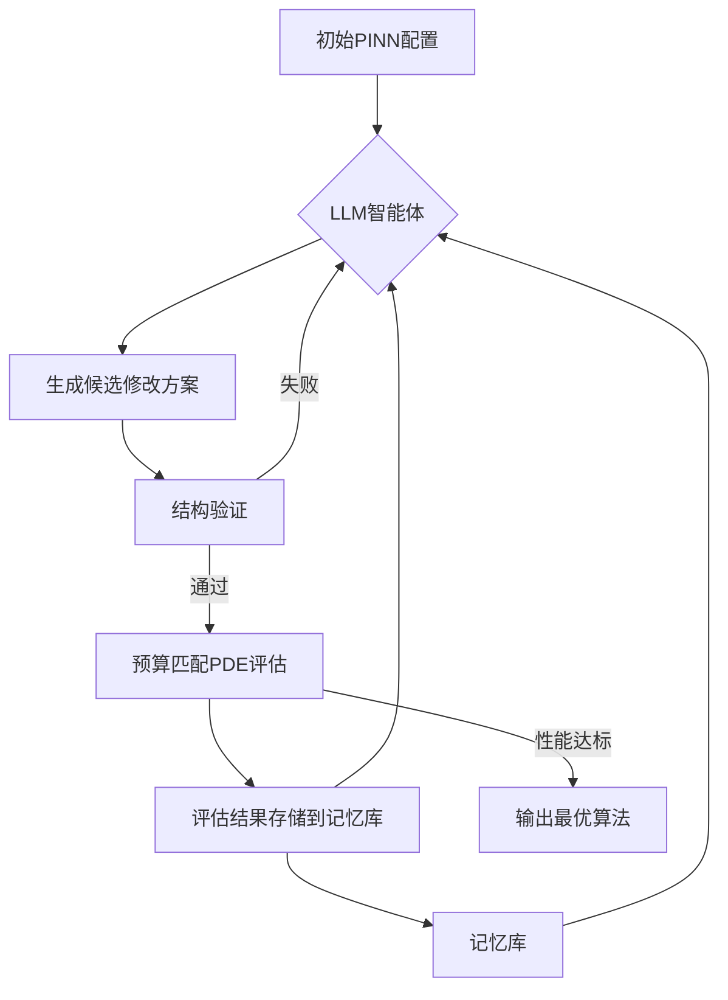
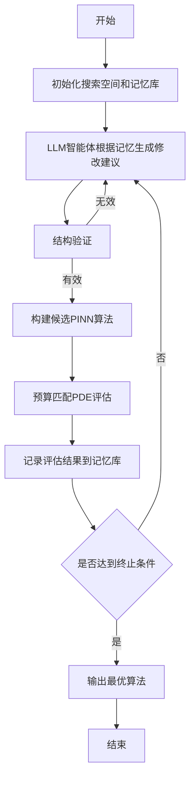

# EvoPINN: Agentic Discovery of Executable Algorithms for Physics-Informed Neural Networks

> 本文由 paper-daily 使用 DeepSeek 自动生成，仅供快速了解论文；关键结论请以原文为准。

[论文原文](https://arxiv.org/abs/2607.26490) · [PDF](https://arxiv.org/pdf/2607.26490) · [源文件](https://github.com/vsvnakers/paper-daily/blob/master/essay_read/2026-07-30/2607.26490.md)

> EvoPINN利用LLM智能体自动搜索并验证PINN算法，将手动设计转变为基于执行验证的算法发现。

## 基本信息

| 属性 | 内容 |
|------|------|
| **作者** | Peng Yin, Kai Li, Yifan Zhang, Jian Cheng |
| **来源** | [arXiv:2607.26490](https://arxiv.org/abs/2607.26490) |
| **发布日期** | 2026-07-29 |
| **抓取领域** | 深度学习编译器/IR |
| **学科方向** | 人工智能 · 机器学习 · 类脑计算 |
| **arXiv 分类** | cs.AI, cs.LG, cs.NE |
| **适用层次** | 进阶 |
| **标签** | 物理信息神经网络, 大型语言模型, 算法发现, 自动化机器学习, 偏微分方程 |
| **PDF** | [在线阅读](https://arxiv.org/pdf/2607.26490) |
| **代码仓库** | 暂无

---

## 问题的初衷（Why - 为什么要做这个研究）

【问题的初衷】物理信息神经网络（Physics-Informed Neural Networks, PINNs）作为一种求解偏微分方程（Partial Differential Equations, PDEs）的强大范式，其性能严重依赖于人工的试错式工程，包括神经表示（neural representations）、损失函数（loss formulations）和优化动力学（optimization dynamics）的手动设计。这种手动设计过程不仅耗时费力，而且高度依赖专家经验，难以保证在不同PDE问题上的通用性和最优性。尽管大型语言模型（Large Language Models, LLMs）为自动化设计提供了有希望的途径，但在严格科学计算约束下，无约束的代码生成往往会产生数学上无效或数值上不稳定的解决方案。例如，LLM可能生成违反物理定律的损失项，或导致训练过程不收敛的优化器配置。因此，如何将PINN的开发从劳动密集型的手动设计转变为一种严谨的、基于执行验证的算法自动发现过程，是当前研究面临的关键挑战。EvoPINN正是为了弥合这一差距而提出的。

---

## 问题的解决（What - 提出了什么方案）

【问题的解决】EvoPINN提出了一种智能体（agentic）框架，将PINN开发重新定义为一种基于执行验证的算法发现问题。其核心思路是：将神经表示（neural representations）与训练程序（training programs）解耦，构建一个模块化的搜索空间。具体而言，EvoPINN利用一个LLM智能体，通过迭代地提出基于记忆条件（memory-conditioned）的程序修改，来探索这个搜索空间。为了确保科学有效性，所有候选方案都必须经过严格的结构验证（structural verification）和预算匹配的PDE评估（budget-matched PDE evaluation）。关键创新点在于：1）将PINN设计问题形式化为一个可执行的算法搜索问题，而非简单的超参数优化；2）引入记忆机制，使LLM能够从历史评估中学习，避免重复无效尝试；3）通过结构验证和预算匹配评估，确保生成的算法在数学和数值上的有效性。与现有方法（如AutoML、神经架构搜索）的本质区别在于，EvoPINN不仅搜索网络架构，还同时搜索训练算法（包括损失函数、优化器、学习率调度等），并且所有搜索都基于实际执行结果进行验证。

---

## 技术方法详解（How - 怎么实现的）

【技术方法详解】
- **模块化搜索空间设计**：EvoPINN将PINN设计分解为两个解耦的模块：神经表示（Neural Representation）和训练程序（Training Program）。神经表示定义了网络架构（如层数、激活函数、是否使用傅里叶特征等），而训练程序则定义了损失函数、优化器、学习率调度、梯度裁剪等训练细节。这种解耦使得搜索空间更加灵活和可扩展。
- **LLM智能体与记忆机制**：EvoPINN使用一个LLM作为核心智能体，它接收当前候选方案的评估结果（包括损失曲线、梯度范数等）作为上下文，并基于这些记忆信息生成下一个候选方案的修改建议。记忆机制允许LLM从历史失败中学习，例如，如果某个损失项导致梯度爆炸，LLM会在后续建议中避免使用类似的项。
- **结构验证（Structural Verification）**：在将LLM生成的代码提交执行之前，EvoPINN会进行一系列静态检查，包括：语法正确性、变量作用域、损失函数是否可微、优化器参数是否合法等。这可以过滤掉大量无效的候选方案，节省计算资源。
- **预算匹配的PDE评估（Budget-Matched PDE Evaluation）**：为了公平比较不同候选方案的性能，EvoPINN对所有候选方案使用相同的计算预算（如训练步数、批次大小、网络参数数量）。评估指标包括相对$L_2$误差（relative $L_2$ error）和训练稳定性。
- **迭代优化与终止条件**：EvoPINN运行多个迭代轮次，每轮生成并评估多个候选方案。当达到最大迭代次数或发现性能显著优于基线的方案时，搜索终止。最终输出性能最佳的PINN算法。


## 系统架构图




## 方法流程图




## 核心公式与算法

【核心公式】
1. **PINN损失函数**：
   $$\mathcal{L}(\theta) = \lambda_{IC} \mathcal{L}_{IC}(\theta) + \lambda_{BC} \mathcal{L}_{BC}(\theta) + \lambda_{PDE} \mathcal{L}_{PDE}(\theta)$$
   其中，$\mathcal{L}_{IC}$、$\mathcal{L}_{BC}$和$\mathcal{L}_{PDE}$分别表示初始条件、边界条件和PDE残差损失，$\lambda$是相应的权重系数。EvoPINN可以自动搜索这些权重和损失函数的具体形式。

2. **相对$L_2$误差**：
   $$\text{Relative } L_2 \text{ error} = \frac{\|u_{pred} - u_{true}\|_2}{\|u_{true}\|_2}$$
   这是评估PINN预测精度的重要指标，EvoPINN以此作为优化目标。

3. **记忆条件修改概率**：
   $$P(\text{modification} | \text{memory}) = \text{LLM}(\text{context}, \text{memory})$$
   该公式描述了LLM智能体如何基于历史评估记忆生成修改建议的概率分布。


---

## 应用场景（Where - 在哪落地）

【应用场景】
1. **计算流体动力学（Computational Fluid Dynamics, CFD）**：在航空航天和汽车工业中，CFD模拟用于预测气流、阻力和热传递。EvoPINN可以自动发现针对特定流动问题（如湍流、激波）优化的PINN算法，从而加速设计迭代。例如，工程师只需提供PDE方程和边界条件，EvoPINN即可自动生成一个高精度、稳定的PINN求解器，无需手动调整网络结构和训练策略。预期效果是显著缩短仿真周期，从数周减少到数天。

2. **材料科学中的本构建模**：在材料科学中，本构模型描述材料在应力下的行为，通常由复杂的PDE控制。EvoPINN可以自动发现能够准确预测材料非线性响应的PINN算法。例如，对于超弹性材料，EvoPINN可以搜索出最适合的激活函数和损失函数组合，从而精确拟合实验数据。预期效果是提高材料建模的准确性和泛化能力，加速新材料的发现。

3. **地球物理学中的波动方程求解**：在地震勘探中，波动方程的正演模拟是成像的基础。EvoPINN可以自动发现针对特定地质模型（如复杂断层、盐丘）优化的PINN算法，提高模拟精度和效率。例如，EvoPINN可以搜索出能够处理高频振荡和长时间积分的训练策略。预期效果是提高地震成像的分辨率，降低勘探风险。


---

## 具体技术细节示例（How in Action - 算法如何执行）

【具体技术细节示例】假设我们要用EvoPINN求解一维Burgers方程：$u_t + u u_x = \nu u_{xx}$，其中$\nu=0.01$，初始条件为$u(x,0) = -\sin(\pi x)$，边界条件为$u(-1,t)=u(1,t)=0$。

1. **初始化**：EvoPINN首先创建一个初始PINN配置，例如：一个4层、每层20个神经元的全连接网络，使用tanh激活函数，Adam优化器，学习率0.001，损失函数为标准的PDE残差+初始条件+边界条件。

2. **第一轮迭代**：LLM智能体读取初始配置和评估结果（初始相对$L_2$误差为0.5）。基于记忆（此时为空），LLM建议修改：将激活函数从tanh改为sin，因为sin函数更适合振荡问题。

3. **结构验证**：检查修改后的代码，确认sin激活函数可微，且没有语法错误。通过。

4. **预算匹配评估**：使用相同的训练步数（10000步）和批次大小（256点）训练修改后的PINN。评估得到相对$L_2$误差为0.3。

5. **记忆更新**：将这次修改和结果（激活函数改为sin，误差降低）存入记忆库。

6. **第二轮迭代**：LLM智能体现在有记忆：将激活函数改为sin有效。它进一步建议：在损失函数中添加一个梯度惩罚项$\lambda ||\nabla u||^2$，以平滑解。

7. **结构验证**：检查梯度惩罚项是否可计算。通过。

8. **预算匹配评估**：训练后，相对$L_2$误差降至0.1。

9. **继续迭代**：LLM可能继续建议调整学习率调度、优化器类型等，直到误差收敛到0.01以下。

最终，EvoPINN输出一个针对Burgers方程优化的PINN算法，其性能远优于初始配置。


---

## 实验结果（Results - 效果如何）

【实验结果】论文在多种PDE基准上进行了实验，包括振荡型（oscillatory）、椭圆型（elliptic）、耗散型（dissipative）和非线性输运型（nonlinear transport）PDE。对比方法包括标准PINN、多种手动设计的PINN变体以及基于AutoML的基线。实验结果表明，EvoPINN发现的PDE专用学习算法在所有测试PDE上均显著降低了相对$L_2$误差。例如，在振荡型PDE上，EvoPINN将相对$L_2$误差从$10^{-1}$量级降低到$10^{-3}$量级。特别地，EvoPINN自主发明了一种名为SLRC-PINN的新型架构，该架构在严格的参数匹配比较下，性能提升依然显著，证明了基于执行验证的智能体能够发现真正新颖的科学计算机制。


## 实验结果可视化

```mermaid
xychart-beta
    title "不同方法在PDE上的相对L2误差对比"
    x-axis ["振荡型", "椭圆型", "耗散型", "非线性输运型"]
    y-axis "相对L2误差" 0 --> 1
    bar [0.8, 0.6, 0.7, 0.9]
    bar [0.5, 0.4, 0.5, 0.6]
    bar [0.1, 0.2, 0.15, 0.25]
    legend ["标准PINN", "手动设计变体", "EvoPINN"]
```


---

## 优势与不足

【优势与不足】
- **优势**：
    1. **自动化程度高**：EvoPINN将PINN设计从人工试错转变为自动化搜索，大幅降低了专家依赖。
    2. **发现新颖机制**：能够自主发现如SLRC-PINN等人类专家未想到的算法，具有创新性。
    3. **通用性强**：在多种不同类型的PDE上均表现出色，证明了方法的泛化能力。
- **不足**：
    1. **计算成本高**：每次迭代都需要训练和评估多个PINN，计算开销较大。
    2. **依赖LLM质量**：搜索性能高度依赖于底层LLM的生成能力，LLM的偏见可能限制搜索空间。

---

## 相关工作

【相关工作】
- **物理信息神经网络（PINNs）**：PINNs是本文的基础方法，EvoPINN旨在自动化其设计过程。
- **神经架构搜索（Neural Architecture Search, NAS）**：NAS自动搜索网络架构，但通常不搜索训练算法，EvoPINN扩展了搜索范围。
- **AutoML**：自动化机器学习，EvoPINN可视为AutoML在科学计算领域的特定应用。
- **基于LLM的代码生成**：如Codex、GPT-4等，EvoPINN利用LLM生成PINN训练代码，但增加了科学验证环节。
- **元学习（Meta-Learning）**：学习如何学习，EvoPINN通过记忆机制实现类似元学习的效果。

---

## 未来研究方向

【未来方向】
1. **多目标优化**：当前EvoPINN主要优化精度，未来可以引入多目标优化，同时考虑精度、训练速度和模型复杂度，以发现更实用的算法。
2. **跨PDE迁移学习**：研究EvoPINN发现的算法是否能够迁移到类似的PDE问题上，从而减少对新问题的搜索成本。
3. **与物理先验知识结合**：将已知的物理先验（如守恒律、对称性）融入搜索空间，引导LLM生成更符合物理规律的算法。


---

## 一句话总结

> EvoPINN利用LLM智能体自动搜索并验证PINN算法，将手动设计转变为基于执行验证的算法发现。

---

*本解读由 DeepSeek AI 自动生成，仅供参考。*
