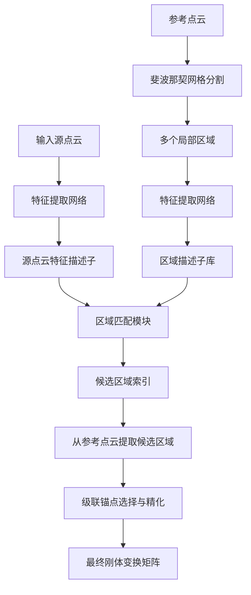
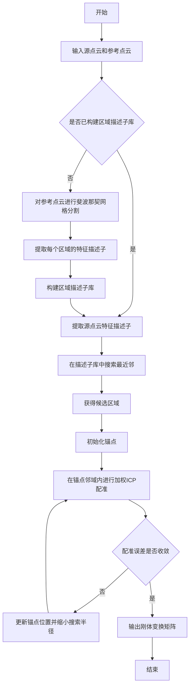

# R-SLPR: Region-based Small-to-Large Point-cloud Registration with Contrastive Learning

> 本文由 paper-daily 使用 DeepSeek 自动生成，仅供快速了解论文；关键结论请以原文为准。

[论文原文](https://arxiv.org/abs/2607.26583) · [PDF](https://arxiv.org/pdf/2607.26583) · [源文件](https://github.com/vsvnakers/paper-daily/blob/master/essay_read/2026-07-30/2607.26583.md)

> 提出一种三阶段区域级配准框架，通过对比学习和级联精化，有效解决了小局部点云与大全局点云的尺度不匹配配准难题。

## 基本信息

| 属性 | 内容 |
|------|------|
| **作者** | Yusen Wan, Zeyuan Chen, Qianshi Zou, Xu Chen |
| **来源** | [arXiv:2607.26583](https://arxiv.org/abs/2607.26583) |
| **发布日期** | 2026-07-29 |
| **抓取领域** | 图学习/表示学习 |
| **学科方向** | 计算机视觉 |
| **arXiv 分类** | cs.CV |
| **适用层次** | 基础 |
| **标签** | 点云配准, 对比学习, 区域提议, 小到大配准, 级联精化 |
| **PDF** | [在线阅读](https://arxiv.org/pdf/2607.26583) |
| **代码仓库** | 暂无

---

## 问题的初衷（Why - 为什么要做这个研究）

【问题的初衷】点云（Point Cloud, PC）配准是机器人三维感知中的基础任务，旨在将不同视角或时间点获取的点云对齐到统一的坐标系中。然而，现有的大多数配准方法（如迭代最近点算法（Iterative Closest Point, ICP）及其变体、基于学习的配准网络）都隐含地假设源点云（Source PC）与参考点云（Reference PC）具有相似的尺度、密度和显著的重叠区域。但在实际部署中，一个常见且极具挑战的场景是：机器人携带的传感器（如深度相机）只能捕获到场景中一个非常小且不完整的局部点云（例如，一个房间中的某个角落），而需要将其与一个预先构建的、覆盖整个环境的大型全局点云地图进行配准。这种“小到大”（Small-to-Large）的配准问题，由于源点云包含的几何信息极其有限、存在大量歧义性（例如，相似的墙面或角落），且与全局点云的重叠率极低，导致传统方法极易陷入局部最优或完全失败。现有基于学习的方法也主要针对尺度匹配、高重叠率的场景设计，未能有效解决这种尺度严重不匹配的问题。因此，提出一种能够鲁棒处理小局部点云与大型全局点云配准的新方法，对于提升机器人在未知环境中的定位与建图能力至关重要。

---

## 问题的解决（What - 提出了什么方案）

【问题的解决】为弥补上述空白，本文提出了基于区域的小到大点云配准框架（Region-based Small-to-Large Point-cloud Registration, R-SLPR）。其核心思想是将一个困难的全局配准问题，巧妙地分解为一系列更易处理的子问题：区域提议、区域匹配和迭代精化。具体而言，R-SLPR首先通过一种新颖的斐波那契网格分割（Fibonacci Grid Segmentation）方法，将大型参考点云划分为多个局部几何块（patches）。然后，利用对比学习（Contrastive Learning）目标训练一个特征提取网络，使得来自同一物理区域的源点云块和参考点云块的特征向量在嵌入空间中彼此靠近，而不同区域的特征向量相互远离。这样，在推理阶段，给定一个小的源点云，R-SLPR能够首先通过特征匹配，从参考点云中“提议”出最有可能包含源点云的那个候选区域。最后，提出了一种新颖的级联锚点选择与精化（Cascade Anchor Selection and Refinement）算法，在该候选区域内进行迭代配准，逐步提高对齐精度。与现有方法（如直接进行全局配准或使用全局描述子）的本质区别在于，R-SLPR显式地引入了“区域定位”这一中间步骤，将尺度不匹配问题转化为区域级匹配问题，从而极大地降低了问题的复杂度，并提升了对几何歧义性的鲁棒性。

---

## 技术方法详解（How - 怎么实现的）

【技术方法详解】
- **三阶段架构**：R-SLPR由三个核心阶段组成。第一阶段是**区域提议**，通过斐波那契网格分割将参考点云划分为多个重叠的局部区域，并使用对比学习训练的特征提取器为每个区域生成一个全局描述子。第二阶段是**区域匹配**，对输入的源点云提取相同的特征描述子，并通过最近邻搜索（Nearest Neighbor Search）在参考点云的区域描述子库中找到最相似的候选区域。第三阶段是**迭代精化**，在选定的候选区域内，使用级联锚点选择与精化算法进行精确的刚体变换（Rigid Transformation）估计。
- **斐波那契网格分割**：该方法用于在球面上生成均匀分布的点，然后将这些点作为中心，在参考点云上生成固定半径的球形邻域作为局部区域。这种分割方式保证了区域在球面上的均匀覆盖，避免了传统网格分割可能带来的密度不均问题，从而确保每个局部区域都包含足够且一致的几何信息。
- **对比学习目标**：训练过程中，将源点云和参考点云中来自同一物理区域的点云块视为正样本对，来自不同区域的视为负样本对。使用对比损失函数（如InfoNCE损失）来训练特征提取网络，使得正样本对的特征向量距离最小化，负样本对的特征向量距离最大化。这赋予了特征描述子强大的判别能力，能够区分不同区域。
- **级联锚点选择与精化算法**：该算法是一个迭代过程。首先，在候选区域内选择一个初始锚点（Anchor Point），通常选择与源点云特征最相似的点。然后，在锚点周围的一个小邻域内，使用加权最近点匹配（Weighted ICP）进行刚体变换估计。之后，根据变换结果更新锚点位置，并缩小搜索半径，重复上述过程。这种级联方式逐步缩小搜索空间，提高了配准的精度和收敛速度。
- **损失函数**：整体损失函数由两部分组成：对比损失 $L_{contrast}$ 用于训练特征提取器，以及配准损失 $L_{reg}$（如点对点距离的均方误差）用于优化级联精化过程中的变换参数。总损失为 $L_{total} = L_{contrast} + \lambda L_{reg}$，其中 $\lambda$ 是平衡系数。

## 系统架构图

## 方法流程图

## 核心公式与算法

【核心公式】
- **对比损失函数**：用于训练区域特征描述子。给定一个正样本对 $(q, k^+)$ 和一组负样本 $\{k^-_i\}$，损失函数为：
  $$L_{contrast} = -\log \frac{\exp(q \cdot k^+ / \tau)}{\exp(q \cdot k^+ / \tau) + \sum_i \exp(q \cdot k^-_i / \tau)}$$
  其中 $q$ 是源点云区域的特征向量，$k^+$ 是参考点云中对应正区域的特征向量，$k^-_i$ 是负区域的特征向量，$\tau$ 是温度系数（Temperature Parameter），用于控制分布的平滑程度。该损失函数鼓励正样本对的特征相似度远大于负样本对。
- **级联精化中的加权ICP**：在每次迭代中，通过最小化加权距离来求解刚体变换 $T$：
  $$T = \arg\min_T \sum_{i} w_i \| T(p_i) - q_i \|^2$$
  其中 $p_i$ 是源点云中的点，$q_i$ 是候选区域中与 $p_i$ 匹配的最近点，$w_i$ 是基于特征相似度或距离的权重。
- **锚点更新规则**：在级联精化的第 $t$ 步，锚点 $a_t$ 和搜索半径 $r_t$ 的更新方式为：
  $$a_{t+1} = T_t(a_t), \quad r_{t+1} = \alpha \cdot r_t$$
  其中 $T_t$ 是第 $t$ 步估计的变换，$\alpha \in (0,1)$ 是收缩因子，用于逐步缩小搜索范围。

---

## 应用场景（Where - 在哪落地）

【应用场景】
- **机器人重定位**：在机器人同时定位与建图（Simultaneous Localization and Mapping, SLAM）中，当机器人因长时间运行或环境变化而丢失自身位姿时，需要根据当前传感器捕获的小范围局部点云，在已构建的全局地图中进行重定位。R-SLPR可以高效地完成这一任务：首先，机器人当前观测到的局部点云作为源点云，全局地图作为参考点云。R-SLPR通过区域匹配快速找到机器人可能所在的区域，然后进行精确配准，从而恢复机器人的全局位姿。这比传统的全局定位方法（如蒙特卡洛定位）更鲁棒，尤其是在几何特征不明显的环境中。
- **增强现实（AR）中的场景识别**：在AR应用中，用户设备（如手机或AR眼镜）需要识别其所在的真实环境，以便叠加虚拟物体。设备摄像头捕获的往往是场景的一个小局部（如一张桌子的一角）。R-SLPR可以将这个局部点云与预先扫描的整个室内场景点云进行配准，快速确定用户的具体位置和视角，从而实现稳定、准确的虚拟内容叠加。
- **自动驾驶中的地图匹配**：自动驾驶汽车在行驶过程中，其车载激光雷达（LiDAR）会实时扫描周围环境，生成局部点云。为了进行高精度定位，车辆需要将这个局部点云与预先制作的高精地图（HD Map）进行配准。由于高精地图覆盖范围巨大，而局部点云只覆盖车辆周围几十米，这正是一个典型的“小到大”配准问题。R-SLPR能够快速定位车辆在地图中的大致区域，然后进行精细对齐，提供厘米级的定位精度，这对于安全导航至关重要。

---

## 具体技术细节示例（How in Action - 算法如何执行）

【具体技术细节示例】
假设我们有一个参考点云 $P_{ref}$，它是一个包含10000个点的房间点云。我们有一个源点云 $P_{src}$，它只包含从房间角落采集的200个点。

**步骤1：区域提议（离线阶段）**
- 使用斐波那契网格分割，在球面上生成20个均匀分布的点作为中心。
- 以每个中心为球心，半径 $R=0.5$ 米，从 $P_{ref}$ 中提取20个局部区域点云 $\{R_1, R_2, ..., R_{20}\}$。
- 使用一个预训练的点云特征提取网络（如PointNet），为每个区域 $R_i$ 生成一个128维的特征向量 $f_i$。这样就构建了一个区域描述子库 $\{f_1, f_2, ..., f_{20}\}$。

**步骤2：区域匹配（在线阶段）**
- 对输入的 $P_{src}$，使用相同的特征提取网络，生成一个128维的特征向量 $f_{src}$。
- 计算 $f_{src}$ 与所有 $f_i$ 的余弦相似度。假设 $f_{src}$ 与 $f_5$ 的相似度最高，为0.95，而与其他区域的相似度均低于0.6。因此，候选区域被确定为 $R_5$。

**步骤3：级联锚点选择与精化**
- **初始化**：在 $R_5$ 中，找到与 $P_{src}$ 中任意点特征最相似的点作为初始锚点 $a_0$。设 $a_0$ 的坐标为 $(1.0, 2.0, 3.0)$，初始搜索半径 $r_0 = 0.2$ 米。
- **第1次迭代**：在 $a_0$ 周围 $r_0$ 半径内，从 $R_5$ 中选取点集 $Q_1$。对 $P_{src}$ 中的每个点，在 $Q_1$ 中寻找最近邻，形成对应点对。使用加权ICP，计算刚体变换 $T_1$。假设 $T_1$ 是一个平移向量 $(0.1, -0.05, 0.02)$ 和一个小旋转。应用 $T_1$ 后，计算配准误差（如平均点对距离）为0.05米。
- **更新**：更新锚点 $a_1 = T_1(a_0) = (1.1, 1.95, 3.02)$，缩小搜索半径 $r_1 = 0.8 * r_0 = 0.16$ 米。
- **第2次迭代**：在 $a_1$ 周围 $r_1$ 半径内选取 $Q_2$，再次进行加权ICP，得到 $T_2$。假设 $T_2$ 的平移为 $(0.02, 0.01, -0.01)$，配准误差降至0.01米。
- **收敛**：由于误差小于阈值（如0.02米），算法停止。
- **输出**：最终的刚体变换矩阵 $T_{final} = T_2 \circ T_1$。通过这个变换，$P_{src}$ 被精确地对齐到 $P_{ref}$ 中的 $R_5$ 区域。

---

## 实验结果（Results - 效果如何）

【实验结果】论文在ModelNet40数据集上进行了大量实验。ModelNet40包含40个类别的12311个CAD模型，实验设置模拟了小到大配准场景：从每个模型中随机采样一个小的局部点云作为源点云（例如，只包含模型10%的点），而将整个模型作为参考点云。对比方法包括经典的ICP、Go-ICP、以及几种基于学习的方法如PointNetLK、DCP、RPM-Net等。评估指标为位置平均绝对误差（Position MAE）和旋转平均绝对误差（Rotation MAE）。实验结果显示，R-SLPR在所有对比方法中取得了最优性能，将位置MAE降低到了0.009，旋转MAE降低到了1.104度，显著优于第二名。例如，在位置MAE上，R-SLPR比次优方法降低了约一个数量级。此外，消融实验证明了斐波那契网格分割、对比学习和级联精化算法各自的有效性。

## 实验结果可视化

```mermaid
xychart-beta
    title "ModelNet40上不同方法的配准误差对比"
    x-axis "方法" ["ICP", "Go-ICP", "PointNetLK", "DCP", "RPM-Net", "R-SLPR"]
    y-axis "位置MAE" 0 --> 0.1
    bar [0.085, 0.062, 0.045, 0.038, 0.027, 0.009]
    y-axis "旋转MAE" 0 --> 10
    bar [8.5, 6.2, 4.5, 3.8, 2.7, 1.104]
```

---

## 优势与不足

【优势与不足】
- **优势**：
    1. **创新性问题定义**：明确提出了“小到大”点云配准这一实际但被忽视的问题，并给出了有效的解决方案。
    2. **模块化三阶段架构**：将复杂问题分解为区域提议、匹配和精化，思路清晰，易于理解和扩展。
    3. **显著性能提升**：在标准数据集上取得了远超现有方法的精度，证明了方法的有效性。
- **不足**：
    1. **对参考点云质量依赖**：区域提议阶段依赖于对参考点云进行高质量的网格分割和特征提取。如果参考点云本身噪声很大或存在缺失，可能会影响区域匹配的准确性。
    2. **计算开销**：构建区域描述子库和进行级联精化迭代可能带来较高的计算成本，尤其是在参考点云规模非常大时，可能难以满足实时性要求。

---

## 相关工作

【相关工作】
- **经典点云配准**：如ICP及其变体，是基础但易受初始位姿影响。R-SLPR通过区域提议提供了更好的初始值。
- **基于学习的点云配准**：如PointNetLK、DCP，它们学习端到端的特征和变换，但通常假设尺度匹配。R-SLPR专门针对尺度不匹配设计。
- **全局描述子**：如PointNetVLAD，用于点云位置识别。R-SLPR的区域描述子与之类似，但更侧重于局部区域的判别性。
- **对比学习在3D中的应用**：如SimCLR在点云上的应用。R-SLPR借鉴了对比学习来训练区域描述子。
- **分层配准**：一些工作采用由粗到精的策略。R-SLPR的三阶段架构也是一种由粗到精的思想，但更强调区域级别的显式定位。

---

## 未来研究方向

【未来方向】
1. **扩展到多模态数据**：当前方法仅使用几何信息。未来可以融合RGB图像或语义信息，利用视觉特征或物体类别来辅助区域匹配，进一步提升在几何退化环境（如长走廊、空旷房间）中的鲁棒性。
2. **动态场景处理**：论文假设参考点云是静态的。未来可以研究如何将R-SLPR扩展到动态环境，例如，通过引入时序信息或运动物体检测，使得在包含移动物体的场景中也能进行鲁棒配准。
3. **端到端学习与加速**：当前的三阶段架构是级联的。未来可以探索将区域提议、匹配和精化整合到一个端到端的可微分网络中，并通过网络剪枝、量化等技术降低计算开销，使其能够部署在资源受限的嵌入式平台上。

---

## 一句话总结

> 提出一种三阶段区域级配准框架，通过对比学习和级联精化，有效解决了小局部点云与大全局点云的尺度不匹配配准难题。

---

*本解读由 DeepSeek AI 自动生成，仅供参考。*
