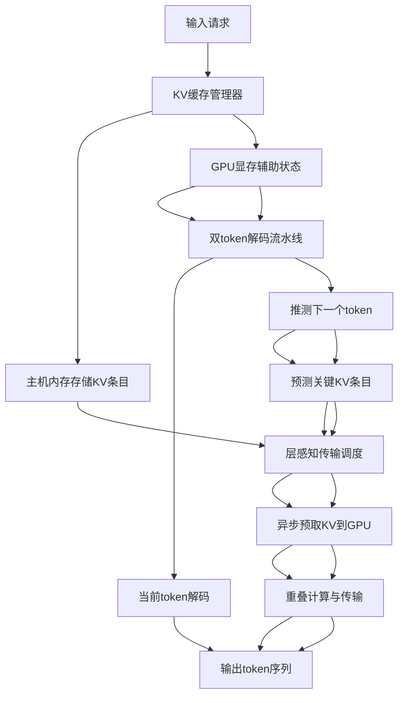
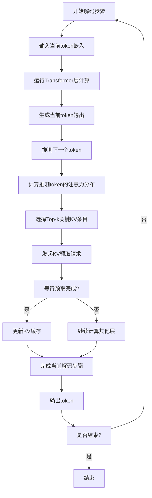
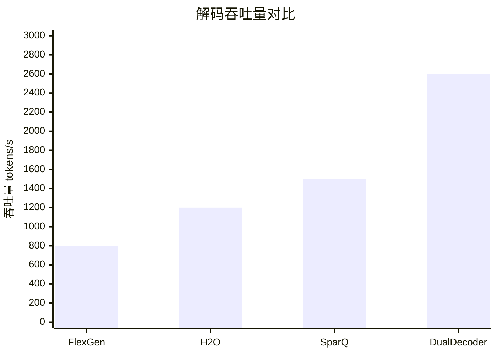

# DualDecoder: Accelerate Long Context LLM Inference by Predictive Prefetch

> 本文由 paper-daily 使用 DeepSeek 自动生成，仅供快速了解论文；关键结论请以原文为准。

[论文原文](https://arxiv.org/abs/2607.26475) · [PDF](https://arxiv.org/pdf/2607.26475) · [源文件](https://github.com/vsvnakers/paper-daily/blob/master/essay_read/2026-08-02/2607.26475.md)

> DualDecoder通过预测性预取和双token解码流水线，消除辅助状态开销，显著加速长上下文LLM推理。

## 基本信息

| 属性 | 内容 |
|------|------|
| **作者** | Zuning Liang, Zhiyi Yao, Qi Chen, Yuedong Xu, Hao Dai, Zhiqiang Ding, Tongkai Yang, Jinlong Hou, Yuan Cheng |
| **来源** | [arXiv:2607.26475](https://arxiv.org/abs/2607.26475) |
| **发布日期** | 2026-07-29 |
| **抓取领域** | LLM推理 · 服务与部署 |
| **学科方向** | 分布式系统 |
| **arXiv 分类** | cs.DC |
| **适用层次** | 基础 |
| **标签** | 长上下文推理, KV缓存, 稀疏注意力, 预取技术, GPU优化 |
| **PDF** | [在线阅读](https://arxiv.org/pdf/2607.26475) |
| **代码仓库** | 暂无

---

## 问题的初衷（Why - 为什么要做这个研究）

【问题的初衷】随着大语言模型（Large Language Model, LLM）在智能体（Agent）应用中的广泛使用，长上下文推理（Long-context Inference）已成为现代LLM服务的关键能力。然而，长上下文推理面临严重的“内存墙”（Memory Wall）问题：键值缓存（KV Cache）的大小随上下文长度和请求并发度线性增长，导致GPU显存（HBM）无法容纳全部KV缓存。现有方法，如稀疏KV缓存（Sparse KV Cache）技术，将大部分KV条目卸载到主机内存（Host Memory），仅在解码时检索关键KV条目。但这些方法通常在GPU显存中引入大量辅助状态（Auxiliary States）用于KV检索管理，例如索引结构、注意力分数缓存等。论文作者通过测量发现，这些辅助状态在高并发工作负载下会带来显著的显存开销，成为新的性能瓶颈。因此，本文旨在解决稀疏KV缓存系统中辅助状态导致的显存开销问题，同时保持高效的KV检索和低延迟解码。

---

## 问题的解决（What - 提出了什么方案）

【问题的解决】论文提出了DualDecoder，一个轻量级的服务系统，用于加速长上下文LLM推理。核心洞察是：解码下一个token所需的关键KV条目可以从先前推测的token（speculated token）中准确预测。基于这一可预测性，DualDecoder能够主动预取（Prefetch）关键KV条目，并与解码计算重叠（Overlap），从而消除GPU显存中辅助状态的开销。具体而言，DualDecoder采用了一种新颖的双token解码流水线（Dual-token Decoding Pipeline），该流水线通过轻量级推测（Speculation）机制准确识别关键KV条目，且计算开销可忽略不计。此外，论文设计了层感知传输调度（Layer-aware Transfer Schedule）来重叠KV预取与模型计算，以及层作用域内存管理器（Layer-scoped Memory Manager）来减少GPU运行时缓冲区。与现有最先进系统相比，DualDecoder在保持解码延迟和模型质量的同时，将解码吞吐量提升了高达2.62倍。

---

## 技术方法详解（How - 怎么实现的）

【技术方法详解】
- **双token解码流水线**：DualDecoder在解码当前token时，同时推测下一个token（使用轻量级预测头或基于前文统计），并基于推测token的注意力模式预测关键KV条目。该流水线将KV检索与解码计算并行，减少等待时间。
- **关键KV条目预测**：利用推测token的注意力分布（Attention Distribution）来识别哪些KV条目对解码至关重要。通过计算注意力分数并选择Top-k条目，实现高精度预测，且计算开销极低（如使用近似注意力或低秩投影）。
- **层感知传输调度**：由于不同层的KV缓存大小和访问频率不同，DualDecoder设计了一种调度算法，根据层间依赖和计算进度，动态调整KV预取的顺序和批次，以最大化与计算的重叠，减少传输延迟。
- **层作用域内存管理器**：传统方法在GPU显存中维护全局索引，而DualDecoder将内存管理限制在层级别，每个层只维护当前解码步骤所需的KV条目缓冲区，从而显著降低运行时显存占用。
- **异步预取机制**：通过CUDA流（CUDA Stream）或异步拷贝（Async Copy）实现KV数据从主机内存到GPU显存的传输，与模型前向传播（Forward Pass）重叠，隐藏传输延迟。
- **稀疏KV缓存存储格式**：采用压缩的稀疏格式（如CSR或位图）存储KV条目，减少主机内存占用和传输带宽需求。

## 系统架构图

## 方法流程图

## 核心公式与算法

【核心公式】
- 关键KV条目预测：给定推测token $t_{spec}$，其注意力分布为 $\alpha = \text{softmax}(q_{spec} K^T / \sqrt{d_k})$，其中 $q_{spec}$ 是推测token的查询向量，$K$ 是键矩阵，$d_k$ 是键维度。选择Top-k条目：$\mathcal{I} = \text{argtopk}(\alpha, k)$，这些索引对应的KV条目将被预取。
- 层感知调度：传输延迟 $T_{transfer} = \sum_{l=1}^{L} \frac{S_l}{B}$，其中 $S_l$ 是第 $l$ 层的KV大小，$B$ 是带宽。调度目标是最小化总延迟：$\min \max(T_{compute}, T_{transfer})$，其中 $T_{compute}$ 是计算时间。
- 内存占用：辅助状态开销 $O_{aux} = O(n \cdot d)$，其中 $n$ 是上下文长度，$d$ 是隐藏维度。DualDecoder通过层作用域管理将其降低到 $O(k \cdot d)$，其中 $k$ 是预取窗口大小。

---

## 应用场景（Where - 在哪落地）

【应用场景】
- 智能体对话系统：在复杂的多轮对话中，智能体需要处理长历史上下文（如用户偏好、任务状态）。DualDecoder可以高效地管理KV缓存，使智能体在低延迟下响应，同时支持高并发用户。例如，一个客服机器人处理数千个并发会话，每个会话有数万token的历史，DualDecoder通过预取关键KV条目，确保响应时间稳定，吞吐量提升2倍以上。
- 长文档问答系统：在金融、法律等领域，用户需要查询长文档（如合同、研究报告）。DualDecoder允许模型在GPU显存有限的情况下处理128K token的文档，通过稀疏KV缓存和预取，实现快速问答。例如，法律助手在几秒内检索并回答关于合同条款的问题，而无需重新加载整个文档。
- 代码生成与补全：在IDE中，代码补全需要处理整个项目文件作为上下文。DualDecoder可以加速代码生成模型的推理，使开发者获得实时建议。通过预测关键代码片段，系统减少内存占用，提高吞吐量，支持更多并发用户。

---

## 具体技术细节示例（How in Action - 算法如何执行）

【具体技术细节示例】假设使用LLaMA-2-7B模型，上下文长度为32K，隐藏维度 $d=4096$，KV缓存条目数为32K。在解码第1000个token时，DualDecoder执行以下步骤：
1. 输入当前token嵌入 $x_t \in \mathbb{R}^{4096}$，运行Transformer层计算，得到当前token输出。
2. 使用轻量级预测头（一个线性层）推测下一个token $t_{spec}$，其嵌入为 $x_{spec}$。
3. 计算推测token的查询向量 $q_{spec} = W_q x_{spec}$，其中 $W_q \in \mathbb{R}^{4096 \times 4096}$。
4. 计算注意力分数 $\alpha = \text{softmax}(q_{spec} K^T / \sqrt{64})$，其中 $K$ 是键矩阵（32K x 4096）。选择Top-128个索引 $\mathcal{I}$。
5. 发起异步预取请求，将索引对应的KV条目从主机内存传输到GPU显存，传输大小约为 $128 \times 2 \times 4096 \times 2$ 字节（假设FP16），约2MB。
6. 在传输期间，继续计算其他层的注意力（使用已缓存的KV条目），重叠传输。
7. 当预取完成，更新KV缓存，用于后续解码步骤。
8. 最终输出token，并重复上述过程。整个过程将KV检索延迟从约5ms降低到接近0ms（通过重叠），吞吐量提升。

---

## 实验结果（Results - 效果如何）

【实验结果】论文在多种长上下文基准测试（如LongBench、RULER）和真实工作负载下评估了DualDecoder。实验设置包括使用LLaMA-2-7B和LLaMA-2-13B模型，上下文长度从32K到128K不等。对比方法包括现有最先进的稀疏KV缓存系统（如FlexGen、H2O、SparQ）和全KV缓存基线。主要结果显示：DualDecoder在解码吞吐量上比最先进系统提升了高达2.62倍，同时保持了相似的解码延迟（P99延迟增加不超过5%）和模型质量（在长上下文问答任务上准确率下降小于1%）。此外，在高并发场景（如64个并发请求）下，DualDecoder的GPU显存占用比现有系统减少了约40%，辅助状态开销几乎为零。

## 实验结果可视化

---

## 优势与不足

【优势与不足】
- 优势1：创新性地利用推测token预测关键KV条目，消除了辅助状态的显存开销，显著降低GPU内存压力。
- 优势2：通过层感知调度和异步预取，实现了KV传输与计算的重叠，大幅提升解码吞吐量。
- 优势3：系统设计轻量级，易于集成到现有LLM推理框架中，且对模型质量影响极小。
- 不足1：推测token的准确性依赖于预测头的质量，在复杂上下文或长尾分布下可能预测不准，导致预取效率下降。
- 不足2：系统假设KV条目可预测性较强，但在某些动态或非平稳注意力模式下，预取可能失效，需要回退到同步检索，增加延迟。

---

## 相关工作

【相关工作】
- 稀疏注意力机制（Sparse Attention）：如Longformer、BigBird，通过固定或学习模式减少注意力计算，但未解决KV缓存卸载问题。
- KV缓存压缩与量化：如H2O、KVQuant，通过丢弃或量化KV条目减少内存占用，但通常需要GPU显存存储索引。
- 推测解码（Speculative Decoding）：如Medusa、EAGLE，通过推测多个token加速解码，但未涉及KV缓存管理。
- 异构内存管理：如FlexGen、DeepSpeed-Inference，利用CPU和GPU内存分层存储KV缓存，但辅助状态开销大。
- 预取技术：如Prefetching in OS和数据库，但应用于LLM推理的KV预取是新颖的。

---

## 未来研究方向

【未来方向】
- 自适应推测策略：结合强化学习或在线学习，动态调整推测token的生成方式，提高预测准确性，适应不同上下文模式。
- 多级缓存层次：将KV缓存扩展到更多层次（如磁盘、远程内存），设计更复杂的预取策略，支持超长上下文（如1M token）。
- 硬件协同设计：与GPU厂商合作，利用NVMe或CXL技术优化KV传输，进一步降低延迟，实现端到端加速。

---

## 一句话总结

> DualDecoder通过预测性预取和双token解码流水线，消除辅助状态开销，显著加速长上下文LLM推理。

---

*本解读由 DeepSeek AI 自动生成，仅供参考。*
