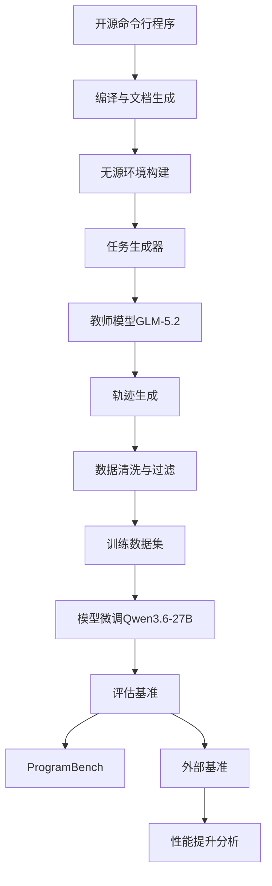
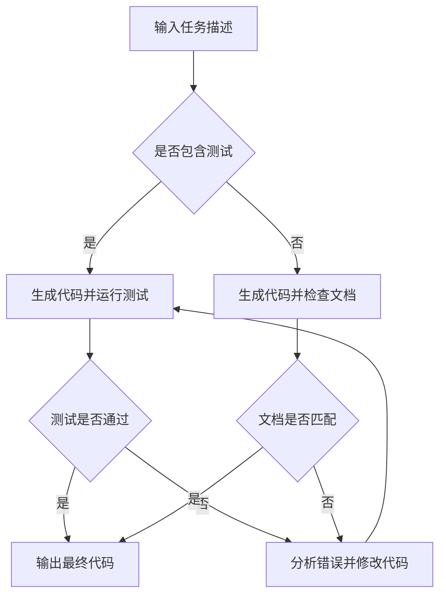

# MindForge: Teaching Small Language Models Whole-Life-Cycle Software Engineering via Source-Free Program Synthesis

> 本文由 paper-daily 使用 DeepSeek 自动生成，仅供快速了解论文；关键结论请以原文为准。

[论文原文](https://arxiv.org/abs/2607.27146) · [PDF](https://arxiv.org/pdf/2607.27146) · [源文件](https://github.com/vsvnakers/paper-daily/blob/master/essay_read/2026-08-02/2607.27146.md)

> MindForge通过无源环境生成全生命周期训练数据，显著提升小模型从零开始程序合成能力。

## 基本信息

| 属性 | 内容 |
|------|------|
| **作者** | Yihao Chen, Shi Chang, Khaled Chawa, Feng Lin, Boyuan Chen, Shaowei Wang, Ahmed E. Hassan |
| **来源** | [arXiv:2607.27146](https://arxiv.org/abs/2607.27146) |
| **发布日期** | 2026-07-29 |
| **抓取领域** | 软件工程 · 分析/测试/合成 |
| **学科方向** | 软件工程 · 自然语言处理 · 机器学习 |
| **arXiv 分类** | cs.SE, cs.CL, cs.LG |
| **适用层次** | 进阶 |
| **标签** | 程序合成, 无源环境, 全生命周期, 模型微调, 软件工程 |
| **PDF** | [在线阅读](https://arxiv.org/pdf/2607.27146) |
| **代码仓库** | [AI_Research_Collection](https://github.com/umerjavaidkh/AI_Research_Collection) (已拉取)

---

## 问题的初衷（Why - 为什么要做这个研究）

【问题的初衷】近年来，编码智能体（Coding Agents）在软件工程任务上取得了显著进展，尤其是在修改现有代码库的任务上，如缺陷修复（Bug Fixing）和功能实现（Feature Implementation）。然而，从零开始构建完整程序（From-Scratch Program Synthesis）仍然是一个巨大挑战，即使是最前沿的模型在ProgramBench基准上的完全解决率也不足1%。这一问题的根源在于缺乏可扩展的训练环境来覆盖软件工程的完整生命周期（Whole-Life-Cycle），因为现有的环境构建框架（如SWE-bench）仅关注软件开发中的单一阶段（如缺陷修复），无法为从零开始的程序合成提供足够的训练数据。此外，现有方法通常依赖源代码或复杂的测试框架，这限制了训练数据的规模和多样性。因此，本文旨在解决这一关键问题：如何构建一个自动化的、可扩展的、覆盖软件工程全生命周期的训练环境，以提升小语言模型（Small Language Models）在从零开始程序合成任务上的能力。

---

## 问题的解决（What - 提出了什么方案）

【问题的解决】本文提出了MindForge，一个自动化的流水线，用于将开源命令行程序转换为无源环境（Source-Free Environments），这些环境仅暴露编译后的参考可执行文件及其文档，从而避免了源代码泄露和测试框架的复杂性。通过MindForge，作者从与ProgramBench不重叠的代码仓库中构建了训练环境，并使用GLM-5.2作为教师智能体（Teacher Agent）生成了高质量的程序合成轨迹（Program Synthesis Trajectories）。这些轨迹用于微调Qwen3.6-27B模型，显著提升了其在ProgramBench上的平均测试通过率（从37.98%提升至49.51%），并使其在多个未见过的软件工程基准上均有一致性提升。核心创新在于：1）无源环境的构建，使得训练环境可扩展且不依赖源代码；2）全生命周期覆盖，从需求分析到测试生成；3）高质量数据配方，通过教师模型生成多样化的合成轨迹。

---

## 技术方法详解（How - 怎么实现的）

【技术方法详解】
- **无源环境构建**：MindForge从开源命令行程序（如Git、Grep等）出发，自动编译程序并生成文档，构建一个仅包含可执行文件和文档的环境。该环境通过命令行接口（CLI）与智能体交互，智能体需要根据文档和任务描述生成程序。
- **任务生成**：基于程序的功能描述，自动生成多样化的任务，包括程序合成、缺陷修复、功能扩展等，覆盖软件工程生命周期的多个阶段。
- **轨迹合成**：使用GLM-5.2作为教师模型，在无源环境中执行任务，记录智能体的思考过程、动作序列和最终结果，生成训练轨迹。轨迹包括自然语言推理、代码生成、测试执行等步骤。
- **模型微调**：使用生成的轨迹对Qwen3.6-27B进行监督微调（Supervised Fine-Tuning），优化模型的代码生成能力和决策能力。
- **评估协议**：在ProgramBench和七个外部基准上评估模型，包括RepoZero-C2Rust、DeepSWE、NL2Repo-Bench、SWE-bench Verified等，确保泛化性。
- **关键公式**：训练目标是最小化负对数似然损失，公式为 $L(\theta) = -\sum_{t=1}^{T} \log p_\theta(y_t | y_{<t}, x)$，其中 $x$ 是任务描述，$y_t$ 是生成的代码或动作。


## 系统架构图




## 方法流程图




## 核心公式与算法

【核心公式】
- 训练损失函数：$L(\theta) = -\sum_{t=1}^{T} \log p_\theta(y_t | y_{<t}, x)$，其中 $x$ 是任务描述，$y_t$ 是生成的代码或动作，$\theta$ 是模型参数。
- 测试通过率：$\text{PassRate} = \frac{1}{N} \sum_{i=1}^{N} \mathbb{I}[\text{test}_i \text{ passes}]$，其中 $N$ 是测试用例数量。


---

## 应用场景（Where - 在哪落地）

【应用场景】
- 场景1：自动化代码生成工具。在软件开发中，开发者可以使用基于MindForge微调的模型来生成新功能的初始代码，减少重复劳动。例如，在开发一个命令行工具时，模型可以根据功能描述生成完整的程序框架，开发者只需进行少量修改。
- 场景2：教育领域。MindForge可以用于编程教学，帮助学生理解从零开始构建程序的流程。通过无源环境，学生可以练习根据文档编写代码，而无需查看源代码。
- 场景3：跨语言迁移。模型在多个基准上的提升表明其可以用于跨语言代码生成，例如将Python程序转换为Rust，帮助团队迁移遗留系统。


---

## 具体技术细节示例（How in Action - 算法如何执行）

【具体技术细节示例】假设我们有一个任务：生成一个命令行程序，该程序读取一个整数列表并输出最大值。输入为任务描述文本，模型需要生成代码。
1. 模型接收任务描述，并生成初始代码：`def max_value(nums): return max(nums)`。
2. 环境执行代码，输入测试用例`[1, 5, 3]`，输出`5`，测试通过。
3. 模型进一步生成文档和测试代码，完成整个生命周期。
4. 最终输出完整的程序文件。这个过程展示了模型如何从任务描述到最终代码的完整流程。


---

## 实验结果（Results - 效果如何）

【实验结果】实验在ProgramBench基准上进行，该基准包含多个从零开始程序合成任务。作者使用GLM-5.2作为教师模型生成训练数据，并微调Qwen3.6-27B。结果显示，微调后的模型在ProgramBench上的平均测试通过率从37.98%提升至49.51%，提升了11.53个百分点。此外，在七个外部基准上，模型均有一致性提升，包括RepoZero-C2Rust（+31.00）、DeepSWE（+14.16）、NL2Repo-Bench（+10.70/4.56）、SWE-bench Verified（+5.04）、SWE-bench Pro（+5.93）、SWE-bench Multilingual（+5.22）和FeatBench（+4.94）。这些结果表明MindForge生成的训练数据具有很好的泛化性。


## 实验结果可视化

```mermaid
xychart-beta
    title "ProgramBench性能提升"
    x-axis [基础模型, 微调后]
    y-axis "测试通过率" 0 --> 60
    bar [37.98, 49.51]
```


---

## 优势与不足

【优势与不足】
- 优势1：无源环境设计避免了源代码依赖，使得训练环境可扩展且易于构建。
- 优势2：覆盖软件工程全生命周期，生成多样化的任务，提升模型的综合能力。
- 优势3：在多个基准上的一致性提升证明了方法的泛化性。
- 不足1：依赖教师模型GLM-5.2生成数据，可能引入教师模型的偏差。
- 不足2：无源环境可能无法完全模拟真实开发场景，如代码审查和协作。

---

## 相关工作

【相关工作】
- SWE-bench：专注于缺陷修复的基准，但仅覆盖单一阶段。
- RepoBench：用于仓库级代码生成，但依赖源代码。
- CodeT5和CodeGen：预训练代码模型，但未针对全生命周期优化。
- Self-Instruct：使用教师模型生成数据，但未应用于软件工程。
- GLM系列：作为教师模型，展示了强大的代码生成能力。

---

## 未来研究方向

【未来方向】
- 方向1：扩展无源环境到更多编程语言和框架，提高多样性。
- 方向2：引入强化学习（Reinforcement Learning）来优化模型在环境中的决策能力。
- 方向3：探索多智能体协作，模拟真实团队开发场景。


## 代码仓库

- [AI_Research_Collection](https://github.com/umerjavaidkh/AI_Research_Collection) (无 star 数据) — `已拉取到本地`
  A self-updating feed of the latest AI research papers from arXiv and Hugging Face, organized by topic.

---

## 一句话总结

> MindForge通过无源环境生成全生命周期训练数据，显著提升小模型从零开始程序合成能力。

---

*本解读由 DeepSeek AI 自动生成，仅供参考。*
