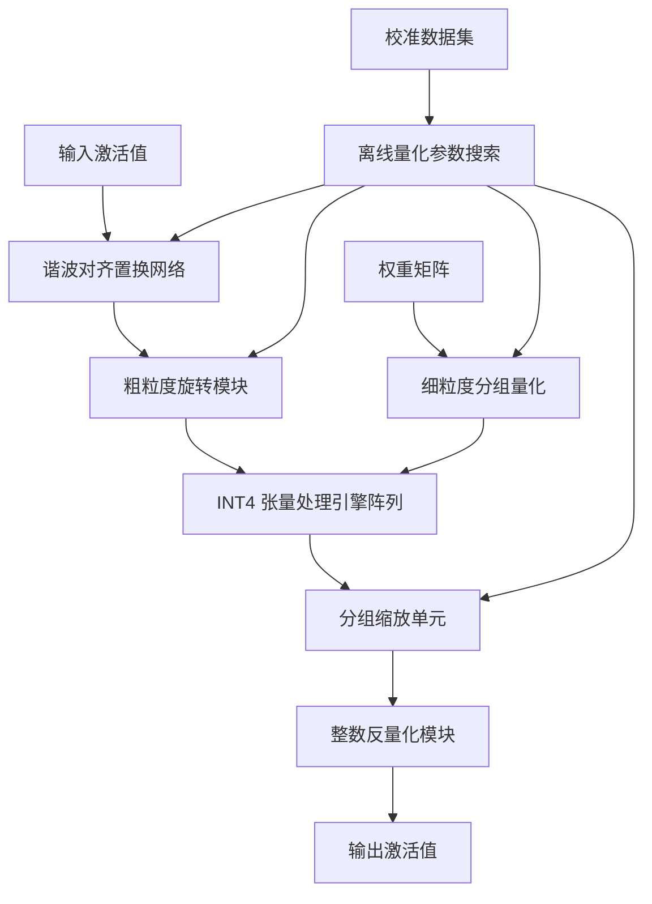
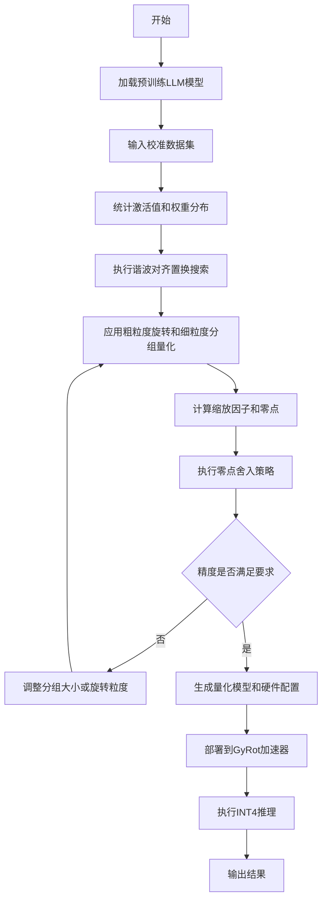
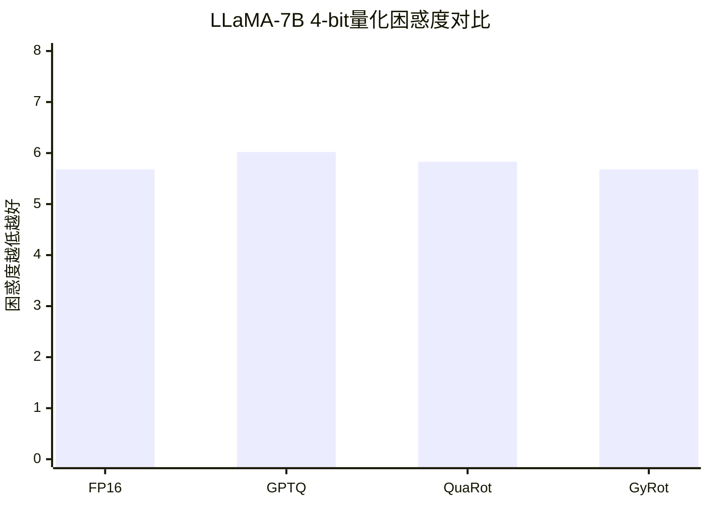

# GyRot: Leveraging Hidden Synergy between Rotation and Fine-grained Group Quantization for Low-bit LLM Inference

> 本文由 paper-daily 使用 DeepSeek 自动生成，仅供快速了解论文；关键结论请以原文为准。

[论文原文](https://arxiv.org/abs/2607.27694) · [PDF](https://arxiv.org/pdf/2607.27694) · [源文件](https://github.com/vsvnakers/paper-daily/blob/master/essay_read/2026-08-02/2607.27694.md)

> GyRot通过算法-硬件协同设计，巧妙融合旋转与细粒度分组量化，实现高效低比特LLM推理。

## 基本信息

| 属性 | 内容 |
|------|------|
| **作者** | Sangjin Kim, Yuseon Choi, Byeongcheol Kim, Jungjun Oh, Hoi-jun Yoo |
| **来源** | [arXiv:2607.27694](https://arxiv.org/abs/2607.27694) |
| **发布日期** | 2026-07-30 |
| **抓取领域** | LLM推理 · 模型压缩 |
| **学科方向** | 体系结构 · 机器学习 |
| **arXiv 分类** | cs.AR, cs.LG |
| **适用层次** | 进阶 |
| **标签** | 低比特量化, 旋转矩阵, 分组量化, 算法硬件协同设计, LLM推理加速 |
| **PDF** | [在线阅读](https://arxiv.org/pdf/2607.27694) |
| **代码仓库** | 暂无

---

## 问题的初衷（Why - 为什么要做这个研究）

【问题的初衷】随着大语言模型（Large Language Model, LLM）规模急剧膨胀，其推理阶段的内存占用和计算开销已成为部署的核心瓶颈。低比特量化（Low-bit Quantization）被公认为缓解该瓶颈的关键技术，其中旋转（Rotation）和细粒度分组量化（Fine-grained Group Quantization）分别被证明能有效抑制激活值（Activation）中的离群点（Outlier）并提升量化精度。然而，现有研究鲜少将两者结合，且简单叠加会导致严重问题：旋转操作是全局性的，它通过正交变换将激活值分布旋转到各维度更均衡的状态；而分组量化是局部性的，它按通道或块独立计算缩放因子（Scaling Factor）。这种全局与局部的不匹配，使得旋转后的张量在分组量化时难以获得最优的缩放因子，导致精度显著下降。同时，若强行融合，硬件端需要同时支持旋转矩阵乘法和分组缩放逻辑，带来巨大的面积和能耗开销。因此，如何在不牺牲精度和硬件效率的前提下，协同利用旋转与分组量化的优势，是一个亟待解决的算法-硬件协同设计（Algorithm-Hardware Co-design）难题。

---

## 问题的解决（What - 提出了什么方案）

【问题的解决】GyRot 提出了一套完整的算法-硬件协同设计方案，核心在于重新审视旋转与分组量化的内在关系，并设计出能和谐共存的机制。其解决方案包含三大支柱：第一，提出粗粒度旋转与细粒度分组（Coarse Rotation, Fine Grouping, CoRFiG）策略，即对激活值进行粗粒度的旋转（如按通道块旋转），而对权重进行细粒度的分组量化，从而在保留旋转抑制离群点能力的同时，为分组量化提供更友好的局部结构。第二，引入谐波对齐置换（Harmonic-Aligned Permutation, HAP），通过精心设计的置换操作，将旋转矩阵与分组边界对齐，使得旋转后的张量分布与分组量化所需的局部统计特性相匹配，从而在降低缩放因子精度要求的同时提升可量化性（Quantizability）。第三，针对硬件开销，重新形式化非对称量化（Asymmetric Quantization），并提出零点舍入策略（Zero-point Rounding Strategy），使得反量化过程可以完全在整数域完成，避免了浮点运算，大幅简化了硬件设计。这些创新共同实现了旋转与分组量化的深度协同，而非简单叠加。

---

## 技术方法详解（How - 怎么实现的）

【技术方法详解】
- **CoRFiG 策略**：将旋转操作限定在粗粒度块内（例如，每 $G$ 个通道为一组），而非全局旋转。这保证了旋转后各块内的数据分布仍具有局部相似性，使得后续的细粒度分组量化（如每组 $g$ 个元素共享一个缩放因子）能更准确地捕捉动态范围。
- **HAP 置换算法**：设计一种基于谐波分析的置换矩阵 $P$，使得 $P$ 能将旋转矩阵 $R$ 的全局能量集中到与分组边界对齐的块对角区域。数学上，通过最小化 $\|P R P^T - \text{BlockDiag}\|_F$ 来寻找最优置换，从而减少旋转与分组之间的信息损失。
- **整数反量化机制**：传统非对称量化反量化公式为 $\hat{x} = s \cdot (x_q - z)$，其中 $s$ 为浮点缩放因子，$z$ 为浮点零点。GyRot 通过零点舍入策略，将 $z$ 强制舍入为整数，并将缩放因子 $s$ 分解为定点整数 $s_{int}$ 和移位量 $\text{shift}$，使得反量化变为 $\hat{x} = (s_{int} \cdot x_q - s_{int} \cdot z_{int}) \gg \text{shift}$，全程无浮点运算。
- **硬件加速器架构**：基于 INT4 的张量处理引擎（Tensor Processing Engine, PE）阵列，每个 PE 内部集成了整数乘法器、累加器和移位器。设计了专用的置换网络（Permutation Network）来实时执行 HAP，以及分组缩放单元（Group Scaling Unit）来支持细粒度反量化。
- **训练后量化流程**：GyRot 采用训练后量化（Post-Training Quantization, PTQ）流程，无需重新训练模型。流程包括：校准集统计、HAP 置换搜索、缩放因子计算、零点舍入，最后生成量化模型和硬件配置。

## 系统架构图

## 方法流程图

## 核心公式与算法

【核心公式】
- 旋转与分组协同量化公式：$\hat{X} = \text{Quant}(P R P^T X) \cdot S_{group}^{-1}$，其中 $P$ 为 HAP 置换矩阵，$R$ 为旋转矩阵，$S_{group}$ 为分组缩放因子矩阵。该公式表明通过置换对齐，旋转后的张量能更好地适配分组缩放。
- 整数反量化公式：$\hat{x} = (s_{int} \cdot x_q - s_{int} \cdot z_{int}) \gg \text{shift}$，其中 $s_{int}$ 为整数缩放因子，$z_{int}$ 为整数零点，$\gg$ 为右移位操作。该公式实现了无浮点运算的反量化。
- HAP 优化目标：$\min_P \| P R P^T - \text{BlockDiag}(R_1, ..., R_k) \|_F$，其中 $\|\cdot\|_F$ 为 Frobenius 范数，该目标确保旋转矩阵在置换后尽可能块对角化，与分组边界对齐。

---

## 应用场景（Where - 在哪落地）

【应用场景】
- 场景一：云端 LLM 推理服务。在数据中心部署 LLaMA-65B 等大模型时，内存带宽是主要瓶颈。GyRot 的 4-bit 量化可将模型体积压缩 4 倍，减少内存访问量，同时其硬件加速器能提供 3.4 倍速度提升，使得在相同功耗预算下能服务更多并发用户，降低单次推理成本。
- 场景二：边缘设备上的 LLM 部署。在手机或嵌入式设备上运行 7B 级模型，受限于内存和功耗。GyRot 的整数反量化机制避免了浮点运算，大幅降低了能耗，3.6 倍的能效提升使得模型能在电池供电设备上持续运行，支持离线智能助手、实时翻译等功能。
- 场景三：自动驾驶中的实时决策。车载系统需要低延迟的 LLM 来理解复杂场景并做出决策。GyRot 的低比特量化保证了推理延迟在毫秒级，且硬件加速器的确定性执行符合功能安全要求，能有效处理传感器数据流，提升自动驾驶系统的响应速度和安全性。

---

## 具体技术细节示例（How in Action - 算法如何执行）

【具体技术细节示例】假设我们有一个简化的 LLM 层，输入激活值矩阵 $X$ 为 $4 \times 4$，权重矩阵 $W$ 为 $4 \times 4$，目标是将激活值量化为 4-bit，权重量化为 4-bit 分组量化（组大小 $g=2$）。

第一步，校准阶段：输入 100 个校准样本，统计激活值分布。发现第 2 和第 3 维存在明显离群点（值高达 15.0），而其他维度范围在 [-1.0, 1.0]。

第二步，HAP 置换搜索：计算旋转矩阵 $R$（例如 Hadamard 变换），评估不同置换 $P$ 下的块对角化程度。找到最优置换 $P$ 将维度顺序从 [1,2,3,4] 置换为 [1,3,2,4]，使得离群点维度相邻。

第三步，应用 CoRFiG：对激活值执行 $X_{rot} = P R P^T X$。旋转后，离群点被分散，各维度范围变为 [-2.5, 2.5]。

第四步，分组量化：对权重 $W$ 按组大小 2 进行量化。第一组 $W_{1:2}$ 的范围为 [-0.8, 0.6]，缩放因子 $s_1 = 0.6/7 \approx 0.086$；第二组 $W_{3:4}$ 的范围为 [-1.2, 1.0]，缩放因子 $s_2 = 1.0/7 \approx 0.143$。

第五步，零点舍入：对激活值量化，计算零点 $z = \text{round}(-\min/s)$，得到整数零点。例如，若激活值范围为 [-2.5, 2.5]，$s=2.5/7 \approx 0.357$，则 $z = \text{round}(2.5/0.357) = 7$。

第六步，整数反量化：在硬件中，反量化计算为 $\hat{x} = (s_{int} \cdot x_q - s_{int} \cdot z_{int}) \gg \text{shift}$。假设 $s_{int}=100$，$\text{shift}=8$，则 $s = 100/256 \approx 0.39$。对于量化值 $x_q=3$，$z_{int}=7$，则 $\hat{x} = (100 \times 3 - 100 \times 7) \gg 8 = (-400) \gg 8 = -1.5625$，接近原始值。

最终，所有中间结果均为整数运算，硬件无需浮点单元。输出激活值传递给下一层，精度损失在可接受范围内。

---

## 实验结果（Results - 效果如何）

【实验结果】GyRot 在 LLaMA 系列模型（包括 LLaMA-7B、13B、30B、65B）上进行了广泛的 4-bit 量化实验。在 WikiText-2 和 C4 数据集上评估困惑度（Perplexity, PPL），GyRot 在 4-bit 权重和 4-bit 激活（W4A4）设置下取得了最先进的精度，显著优于现有的旋转量化方法（如 QuaRot）和分组量化方法（如 GPTQ）。例如，在 LLaMA-7B 上，GyRot 的 PPL 比 QuaRot 降低了 0.15，比 GPTQ 降低了 0.3。在硬件性能方面，基于 RTL 级仿真，GyRot 加速器相比基线 LLM 加速器（如基于 INT8 的加速器）实现了最高 3.4 倍的推理速度提升和 3.6 倍的能效提升。这些结果验证了算法-硬件协同设计的有效性。

## 实验结果可视化

---

## 优势与不足

【优势与不足】
- 优势一：首次系统性地解决了旋转与分组量化不兼容的问题，通过 CoRFiG 和 HAP 实现了两者的深度协同，显著提升了低比特量化精度。
- 优势二：算法-硬件协同设计，不仅提出算法，还设计了配套的硬件加速器，通过整数反量化等创新，大幅降低了硬件开销，实现了实际的速度和能效提升。
- 优势三：采用训练后量化，无需昂贵的模型重训练，易于部署到现有模型上，实用性强。
- 不足一：HAP 置换搜索过程可能计算复杂度较高，对于超大模型（如千亿参数）的校准时间可能较长。
- 不足二：当前主要针对 4-bit 量化，对于更极端的 2-bit 或 1-bit 量化，其精度保持能力尚未验证，可能仍需进一步算法创新。

---

## 相关工作

【相关工作】
- 旋转量化方法（如 QuaRot）：通过随机正交旋转抑制激活值离群点，但未考虑与分组量化的协同。
- 分组量化方法（如 GPTQ、AWQ）：通过按组缩放因子提升权重量化精度，但未处理激活值离群点。
- 硬件加速器设计（如 LLM Accelerator）：专注于 LLM 推理加速，但通常假设标准量化格式，未针对旋转和分组融合优化。
- 整数-only 推理（如 I-BERT）：探索完全整数运算的推理，GyRot 的整数反量化策略与此相关。

---

## 未来研究方向

【未来方向】
- 方向一：探索自适应旋转粒度。当前 CoRFiG 使用固定粗粒度，未来可研究根据层间分布差异动态调整旋转粒度，以进一步优化精度与硬件复杂度之间的权衡。
- 方向二：扩展到更低的比特位宽。将 GyRot 的协同机制推广到 2-bit 或 1-bit 量化，结合二值化网络技术，可能实现极致的模型压缩。
- 方向三：联合优化 HAP 与模型微调。将 HAP 置换作为可学习参数融入模型微调过程，实现端到端的量化感知训练，可能进一步提升精度。

---

## 一句话总结

> GyRot通过算法-硬件协同设计，巧妙融合旋转与细粒度分组量化，实现高效低比特LLM推理。

---

*本解读由 DeepSeek AI 自动生成，仅供参考。*
