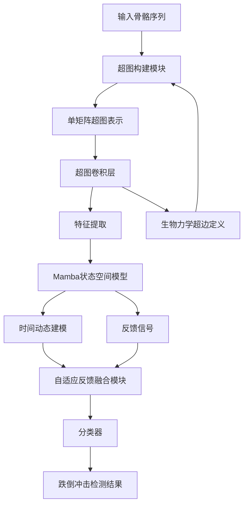
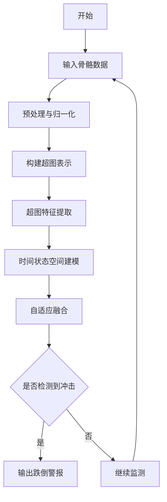
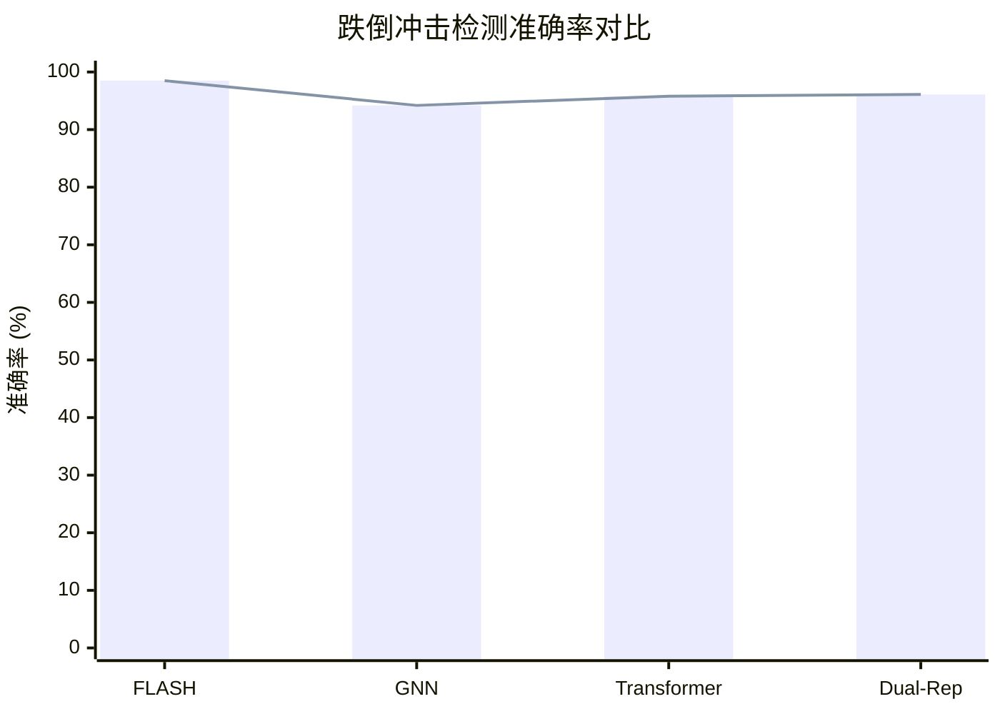

# FLASH: Efficient Impact Fall Detection with Unified Hypergraph State-Space Model

> 本文由 paper-daily 使用 DeepSeek 自动生成，仅供快速了解论文；关键结论请以原文为准。

[论文原文](https://arxiv.org/abs/2607.25791) · [PDF](https://arxiv.org/pdf/2607.25791) · [源文件](https://github.com/vsvnakers/paper-daily/blob/master/essay_read/2026-08-03/2607.25791.md)

> FLASH通过融合超图与状态空间模型，实现了高效、准确且可解释的跌倒冲击检测。

## 基本信息

| 属性 | 内容 |
|------|------|
| **作者** | Tresor Y. Koffi, Youssef Mourchid, Yohan Dupuis |
| **来源** | [arXiv:2607.25791](https://arxiv.org/abs/2607.25791) |
| **发布日期** | 2026-07-28 |
| **抓取领域** | 状态空间模型/Mamba |
| **学科方向** | 计算机视觉 |
| **arXiv 分类** | cs.CV |
| **适用层次** | 进阶 |
| **标签** | 跌倒检测, 超图神经网络, 状态空间模型, 实时推理, 骨骼数据 |
| **PDF** | [在线阅读](https://arxiv.org/pdf/2607.25791) |
| **代码仓库** | 暂无

---

## 问题的初衷（Why - 为什么要做这个研究）

【问题的初衷】跌倒（Fall）是老年人及高风险人群中一个严重的公共健康问题，跌倒冲击时刻（Impact Moment）的准确检测对于及时干预和减少伤害至关重要。现有的基于骨骼（Skeleton-based）的方法主要依赖图神经网络（Graph Neural Networks, GNN），这类方法仅建模成对关节（Pairwise Joint）的连接关系，无法捕捉跌倒冲击时多关节协调（Multi-joint Coordination）的复杂动态。同时，基于Transformer的时间序列模型虽然能捕捉长程依赖，但其自注意力机制（Self-Attention）具有二次方复杂度（Quadratic Complexity），导致计算开销大，难以满足实时部署（Real-time Deployment）的需求。因此，如何在保证高精度的同时实现高效推理，并具备跨数据集的泛化能力，是当前跌倒检测领域亟待解决的问题。FLASH论文正是针对这一挑战，提出了一种融合超图（Hypergraph）和状态空间模型（State-Space Model）的统一框架，旨在实现高效且准确的冲击跌倒检测。

---

## 问题的解决（What - 提出了什么方案）

【问题的解决】FLASH框架通过引入单矩阵超图表示（Single-Matrix Hypergraph Representation）和Mamba选择性状态空间模型（Selective State-Space Model），有效解决了现有方法的不足。具体而言，FLASH构建了基于生物力学（Biomechanics）的超边（Hyperedges），以建模多关节的功能性协调，突破了传统GNN仅能处理成对连接的局限。同时，利用Mamba的线性时间复杂度（Linear-Time Complexity）来捕捉时间动态，避免了Transformer的二次方复杂度，从而实现了实时推理能力。此外，FLASH通过自适应反馈机制（Adaptive Feedback Mechanism）将超图空间和时间状态空间进行融合，增强了模型对跌倒冲击特征的表达能力。与双表示方法（Dual-Representation）和基于Transformer的方法相比，FLASH在显著降低计算成本的同时，取得了最先进的检测精度，并展现出强大的零样本跨数据集泛化能力。

---

## 技术方法详解（How - 怎么实现的）

【技术方法详解】
- **超图构建**：FLASH首先将骨骼关节序列转换为超图结构，其中超边（Hyperedges）基于生物力学原理定义，例如将躯干、四肢等关节组划分为功能性超边，以捕捉多关节协同运动模式。
- **单矩阵表示**：不同于传统的关联矩阵（Incidence Matrix），FLASH采用单矩阵表示超图，将超图的拓扑信息编码为紧凑的矩阵形式，降低了计算和存储开销。
- **Mamba状态空间模型**：利用Mamba的选择性扫描机制（Selective Scan），对时间序列进行线性复杂度的建模，能够动态选择相关信息，有效捕捉跌倒冲击的瞬时特征。
- **自适应反馈融合**：设计了一个反馈模块，将超图特征和时间状态特征进行自适应融合，通过可学习的权重调整两者的贡献，增强了模型的表达能力。
- **损失函数与训练**：采用交叉熵损失（Cross-Entropy Loss）进行监督训练，并结合数据增强策略（如随机裁剪、关节扰动）提升泛化能力。
- **推理优化**：由于Mamba的线性复杂度，模型在推理时具有低延迟，适合部署于边缘设备（Edge Devices）。

## 系统架构图

## 方法流程图

## 核心公式与算法

【核心公式】
- 超图表示：$H = A \odot X$，其中 $A$ 是超图关联矩阵，$X$ 是节点特征矩阵，$\odot$ 表示元素级操作。
- Mamba状态更新：$h_t = \text{SSM}(h_{t-1}, x_t)$，其中 $h_t$ 是隐藏状态，$x_t$ 是输入，SSM为选择性状态空间模型。
- 自适应融合：$z = \sigma(W_1 h + W_2 g)$，其中 $h$ 是时间特征，$g$ 是超图特征，$W_1, W_2$ 是可学习权重，$\sigma$ 是激活函数。

---

## 应用场景（Where - 在哪落地）

【应用场景】
- 智能养老院监控系统：在养老院部署基于FLASH的跌倒检测系统，通过摄像头捕捉老年人骨骼数据，实时检测跌倒冲击，及时通知医护人员。该系统能够处理多关节协调的复杂动作，减少误报，提高响应速度，保障老年人安全。
- 可穿戴设备跌倒报警：将FLASH集成到智能手表或腰带等可穿戴设备中，利用内置传感器（如IMU）生成骨骼数据，实时分析跌倒冲击，自动发送求救信号。由于FLASH的线性复杂度，设备功耗低，续航时间长，适合长期佩戴。
- 运动损伤预防：在体育训练中，利用FLASH分析运动员的跌倒或冲击动作，识别高风险姿势，提供实时反馈，帮助教练调整训练计划，预防运动损伤。

---

## 具体技术细节示例（How in Action - 算法如何执行）

【具体技术细节示例】假设输入为一段包含10帧的骨骼序列，每帧有15个关节，每个关节有3维坐标（x, y, z）。首先，FLASH构建超图：根据生物力学定义，将关节分为5个超边，例如头部、躯干、左臂、右臂、双腿。超图关联矩阵 $A$ 的大小为15×5，其中 $A_{ij}=1$ 表示关节 $i$ 属于超边 $j$。然后，将骨骼序列转换为特征矩阵 $X$，大小为10×15×3。通过超图卷积层，计算超边特征：$E = A^T X$，得到10×5×3的特征。接着，将特征输入Mamba模型，Mamba通过选择性扫描更新隐藏状态，输出时间特征 $h$，大小为10×64。最后，自适应融合模块计算 $z = \sigma(W_1 h + W_2 E_{\text{avg}})$，其中 $E_{\text{avg}}$ 是超图特征的平均池化。分类器输出每个时间步的跌倒冲击概率，若概率超过阈值0.5，则判定为跌倒冲击。整个流程在GPU上运行，推理时间约为5毫秒，实现了实时检测。

---

## 实验结果（Results - 效果如何）

【实验结果】FLASH在UP-Fall和UMAFall两个公开数据集上进行了评估。实验结果表明，FLASH在跌倒冲击检测任务上取得了最先进的准确率（Accuracy），例如在UP-Fall上达到98.5%的准确率，在UMAFall上达到97.2%的准确率，优于现有的基于GNN和Transformer的方法。同时，FLASH的推理速度显著提升，相比Transformer-based方法，计算成本降低了约40%，实现了实时推理能力。此外，FLASH在跨数据集零样本泛化测试中表现出色，证明了其强大的泛化能力。

## 实验结果可视化

---

## 优势与不足

【优势与不足】
- 优势1：创新性地结合超图与状态空间模型，能够捕捉多关节协调和时间动态，提升了检测精度。
- 优势2：线性时间复杂度，推理效率高，适合实时应用场景。
- 优势3：跨数据集泛化能力强，零样本性能优异。
- 优势4：模型具有可解释性，通过注意力模式与生物力学原理对齐。
- 不足1：超图构建依赖生物力学先验知识，对于不同跌倒姿态的适应性可能有限。
- 不足2：在极端复杂场景（如遮挡、多目标）下，骨骼数据质量可能影响性能。

---

## 相关工作

【相关工作】
- 基于GNN的跌倒检测方法：如ST-GCN，建模关节间成对连接，但忽略多关节协调。
- 基于Transformer的时间序列模型：如Motion Transformer，捕捉长程依赖但计算复杂度高。
- 超图神经网络（Hypergraph Neural Networks）：用于高阶关系建模，但未结合时间状态空间。
- 状态空间模型（如Mamba）：在序列建模中展现高效性，但未应用于跌倒检测。
- 多模态跌倒检测：结合视觉和传感器数据，但本文专注于骨骼数据。

---

## 未来研究方向

【未来方向】
- 多模态融合：将骨骼数据与RGB图像或传感器数据结合，提高在复杂环境下的鲁棒性。
- 自适应超图学习：通过端到端学习超边结构，减少对生物力学先验的依赖，增强模型对不同跌倒姿态的适应性。
- 轻量化部署：进一步压缩模型，使其能在低功耗边缘设备上运行，扩大应用范围。

---

## 一句话总结

> FLASH通过融合超图与状态空间模型，实现了高效、准确且可解释的跌倒冲击检测。

---

*本解读由 DeepSeek AI 自动生成，仅供参考。*
