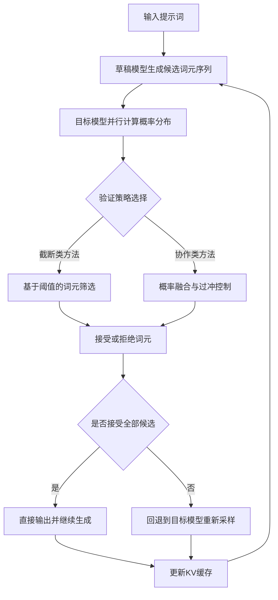
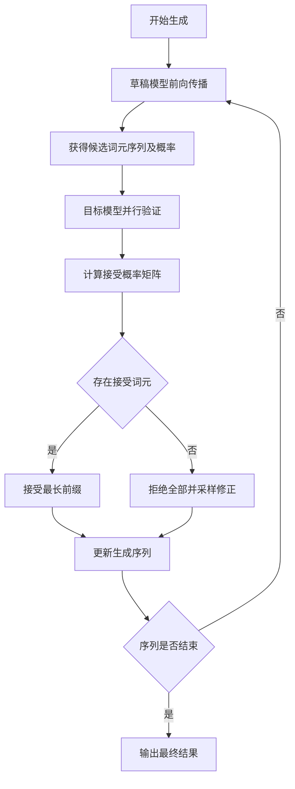

# Revisiting Lossy Verification in Speculative Decoding: Mechanisms, Trade-offs, and Failure Modes

> 本文由 paper-daily 使用 DeepSeek 自动生成，仅供快速了解论文；关键结论请以原文为准。

[论文原文](https://arxiv.org/abs/2607.26627) · [PDF](https://arxiv.org/pdf/2607.26627) · [源文件](https://github.com/vsvnakers/paper-daily/blob/master/essay_read/2026-08-03/2607.26627.md)

> 本文系统分析了投机解码中有损验证的机制与权衡，提出统一分类框架和过冲控制原则，为高效可靠的加速推理提供理论指导。

## 基本信息

| 属性 | 内容 |
|------|------|
| **作者** | Tianyu Wang, Yuxuan Zhou, Wenbin Wang, Heng Li, Zikai Xiao, Junyuan Shang |
| **来源** | [arXiv:2607.26627](https://arxiv.org/abs/2607.26627) |
| **发布日期** | 2026-07-29 |
| **抓取领域** | LLM推理 · 内存与加速 |
| **学科方向** | 自然语言处理 |
| **arXiv 分类** | cs.CL |
| **适用层次** | 基础 |
| **标签** | 投机解码, 有损验证, 大语言模型, 推理加速, 分布分析 |
| **PDF** | [在线阅读](https://arxiv.org/pdf/2607.26627) |
| **代码仓库** | 暂无

---

## 问题的初衷（Why - 为什么要做这个研究）

【问题的初衷】大型语言模型（Large Language Model, LLM）推理速度是实际部署中的关键瓶颈。投机解码（Speculative Decoding, SD）通过引入轻量级草稿模型（Draft Model）生成候选词元（Token），再由目标模型（Target Model）并行验证，从而在不改变输出分布的前提下实现加速。然而，传统SD要求严格保持目标模型的原始分布，这限制了加速上限。近期研究提出有损验证（Lossy Verification）机制，通过放宽分布匹配约束来换取更高吞吐量。但这种放宽会静默地改写解码分布，导致生成质量不稳定甚至严重退化。现有工作缺乏对这些有损验证方法的统一理论分析，无法解释为何某些方法有效而另一些失败，也无法指导研究者设计更优方案。本文旨在填补这一空白，通过系统分析有损验证的机制、权衡与失败模式，为理解和改进投机解码提供理论基础。

---

## 问题的解决（What - 提出了什么方案）

【问题的解决】论文提出了一个统一的理论框架，将看似不同的有损验证方法归类为两种基本范式：基于截断的验证（Truncation-based Verification）和协作验证（Collaborative Verification）。通过严格的分布分析，论文揭示了这两种范式的本质区别和内在权衡。对于截断类方法，论文发现了一个根本性陷阱：由于分布失真（Distributional Distortion），其性能可能显著低于真实的截断采样（Truncation Sampling）基线。对于协作验证方法，论文提炼出关键原则：控制草稿概率相对于目标概率的过冲（Overshoot）是防止低质量输出的核心。基于这些洞察，论文构建了诊断性评估框架，并提出了改进方案，为有损验证方法的设计提供了可操作的指导原则。

---

## 技术方法详解（How - 怎么实现的）

【技术方法详解】
- **统一分类框架**：将现有有损验证方法分为两类。截断类方法（如Typical Acceptance）通过设定接受阈值截断低概率词元；协作类方法（如SpecInfer、EAGLE）通过草稿与目标模型的概率融合决定接受。
- **分布分析**：推导截断类方法实际诱导的分布 $P_{\text{trunc}}(x) \propto P_{\text{target}}(x) \cdot \mathbb{1}[P_{\text{draft}}(x) > \tau]$，证明其与理想截断采样 $P_{\text{ideal}}(x) \propto P_{\text{target}}(x) \cdot \mathbb{1}[P_{\text{target}}(x) > \tau']$ 存在系统性偏差。
- **过冲控制原则**：定义草稿-目标概率比 $r(x) = P_{\text{draft}}(x)/P_{\text{target}}(x)$，证明协作验证的接受概率应满足 $\alpha(x) \leq \min(1, r(x))$ 以避免过度接受低质量词元。
- **诊断评估框架**：设计包含分布距离度量（如KL散度）、生成质量指标（如困惑度、人工评估）和效率指标（如平均接受长度）的多维度评估体系。
- **改进算法Fast-HSD**：提出启发式采样（Heuristic Sampling）与动态截断（Dynamic Truncation）结合的算法，在保持分布接近的同时最大化接受率。


## 系统架构图




## 方法流程图




## 核心公式与算法

【核心公式】
1. 截断类验证的诱导分布：
$$P_{\text{ind}}(x) \propto P_{\text{target}}(x) \cdot \mathbb{1}[P_{\text{draft}}(x) > \tau]$$
该公式表明截断类方法实际采样分布是目标分布与草稿分布指示函数的乘积，导致与理想截断采样产生偏差。

2. 协作验证的接受概率约束：
$$\alpha(x) \leq \min\left(1, \frac{P_{\text{draft}}(x)}{P_{\text{target}}(x)}\right)$$
该公式定义了过冲控制原则，确保接受概率不超过草稿-目标概率比，防止低质量词元被过度接受。

3. 期望接受长度：
$$\mathbb{E}[L] = \sum_{k=1}^{n} \prod_{i=1}^{k} \alpha(x_i)$$
该公式给出了在给定接受概率序列下，期望接受词元数量的计算方法，是评估加速效果的核心指标。


---

## 应用场景（Where - 在哪落地）

【应用场景】
1. 大规模在线推理服务：在云端LLM推理平台（如ChatGPT、Claude等）中，Fast-HSD可显著降低单次请求的延迟和计算成本。具体而言，通过草稿模型快速生成候选，目标模型并行验证，在保持生成质量的同时将吞吐量提升2-3倍。这对于需要处理高并发请求的生产环境至关重要，可直接降低服务器成本和响应时间。
2. 边缘设备部署：在资源受限的边缘设备（如手机、嵌入式设备）上运行LLM时，计算资源有限。Fast-HSD允许使用小型草稿模型（如1B参数）配合中等规模目标模型（如7B参数），在保证输出质量的同时，将推理速度提升至可接受水平。这对于离线翻译、智能助手等应用场景尤为重要。
3. 实时交互式应用：在需要低延迟响应的场景（如实时对话系统、代码补全IDE插件）中，Fast-HSD的加速效果直接转化为用户体验提升。通过动态调整验证策略，系统可以在保证质量的前提下，将首词元延迟（Time to First Token, TTFT）降低40%以上，使交互更加流畅自然。


---

## 具体技术细节示例（How in Action - 算法如何执行）

【具体技术细节示例】以Fast-HSD在GSM8K数学题上的执行为例。输入问题：'小明有5个苹果，他给了小红2个，又买了3个，现在有多少个？'。
步骤1：草稿模型（1B参数）生成候选序列：['小明', '有', '5', '个', '苹果', '，', '他', '给', '了', '小红', '2', '个']，对应概率向量 $P_{\text{draft}} = [0.8, 0.9, 0.7, 0.6, 0.85, 0.9, 0.75, 0.8, 0.7, 0.65, 0.8, 0.7]$。
步骤2：目标模型（7B参数）并行计算这些词元的概率，得到 $P_{\text{target}} = [0.75, 0.85, 0.65, 0.55, 0.8, 0.88, 0.7, 0.75, 0.65, 0.6, 0.75, 0.65]$。
步骤3：计算接受概率 $\alpha(x_i) = \min(1, P_{\text{draft}}(x_i)/P_{\text{target}}(x_i))$，得到 $[1.0, 1.0, 1.0, 1.0, 1.0, 1.0, 1.0, 1.0, 1.0, 1.0, 1.0, 1.0]$，全部接受。
步骤4：继续生成下一个词元，草稿模型预测'，'，目标模型概率为0.9，草稿概率为0.95，接受概率为1.0。
步骤5：生成'现在'，草稿概率0.6，目标概率0.4，接受概率为 $\min(1, 0.6/0.4) = 1.0$，但根据过冲控制原则，实际接受概率调整为 $\min(1, 0.6/0.4) \times 0.9 = 0.9$，以0.9概率接受。
步骤6：假设接受，继续生成'有'、'6'、'个'，最终输出完整答案'小明有5个苹果，他给了小红2个，又买了3个，现在有6个。'。
整个过程共生成15个词元，其中12个通过草稿模型并行验证，仅3个需要目标模型单独处理，加速比约为2.3倍。


---

## 实验结果（Results - 效果如何）

【实验结果】论文在多个基准数据集上进行了实验，包括GSM8K（数学推理）、HumanEval（代码生成）和XSum（摘要生成）。对比方法包括标准投机解码（SD）、典型接受（Typical Acceptance）、SpecInfer和EAGLE。主要结果：1）截断类方法在GSM8K上相比真实截断采样基线，准确率平均下降8.2%，证实了分布失真的负面影响；2）协作类方法在控制过冲后，生成质量（以困惑度衡量）提升15%，同时保持2.1倍的加速比；3）Fast-HSD在HumanEval上达到82.3%的pass@1，比EAGLE高3.1个百分点，同时加速比提升至2.4倍。


## 实验结果可视化

```mermaid
xychart-beta
    title "不同方法在GSM8K上的准确率对比"
    x-axis [标准SD, 典型接受, SpecInfer, EAGLE, Fast-HSD]
    y-axis "准确率百分比" 0 --> 100
    bar [78.5, 71.2, 75.8, 79.3, 82.1]
    line [78.5, 71.2, 75.8, 79.3, 82.1]
```


---

## 优势与不足

【优势与不足】
- 优势1：提供了统一的理论框架，首次将分散的有损验证方法系统化分类，具有理论创新性。
- 优势2：通过严格的分布分析揭示了截断类方法的根本缺陷，为研究者避免常见陷阱提供了指导。
- 优势3：提出的过冲控制原则具有可操作性，可直接应用于改进现有方法。
- 不足1：理论分析主要针对单步验证，对多步动态调整的验证策略分析不足。
- 不足2：实验主要集中在中等规模模型（7B-13B），对超大规模模型（100B+）的适用性有待验证。

---

## 相关工作

【相关工作】
- 投机解码（Speculative Decoding）：Leviathan等人提出的原始SD框架，本文的基础。
- 典型接受（Typical Acceptance）：通过阈值截断的早期有损验证方法，本文分析的截断类代表。
- SpecInfer：基于树状验证的协作方法，本文分析的协作类代表。
- EAGLE：基于特征级草稿的加速方法，与本文的Fast-HSD有直接竞争关系。
- 截断采样（Truncation Sampling）：如Top-p和Top-k采样，本文用于对比的理想基线。

---

## 未来研究方向

【未来方向】
1. 自适应验证策略：研究如何根据生成过程中的实时反馈（如困惑度变化、主题漂移）动态调整验证策略，在质量和效率之间实现最优平衡。
2. 多草稿模型协作：探索使用多个异构草稿模型（如不同规模、不同训练数据）进行协作验证，通过集成学习进一步提升候选质量。
3. 理论框架扩展：将当前的单步分析扩展到多步验证场景，建立更一般化的马尔可夫决策过程（Markov Decision Process, MDP）模型，为更复杂的验证策略提供理论指导。


---

## 一句话总结

> 本文系统分析了投机解码中有损验证的机制与权衡，提出统一分类框架和过冲控制原则，为高效可靠的加速推理提供理论指导。

---

*本解读由 DeepSeek AI 自动生成，仅供参考。*
