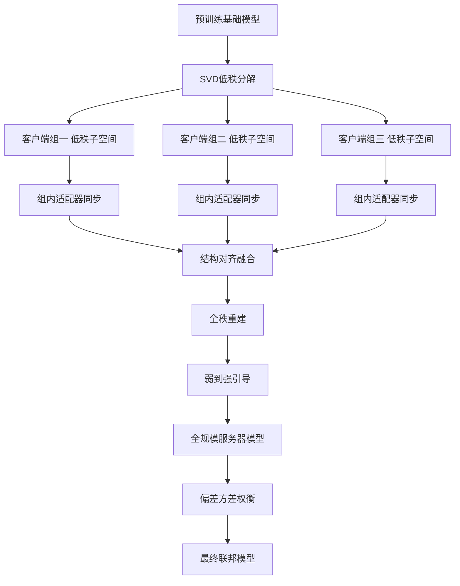
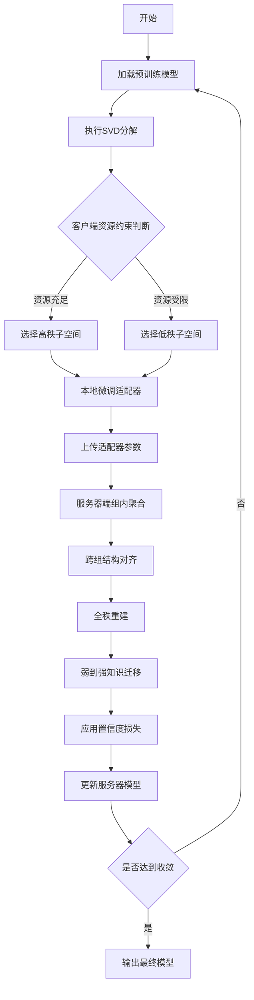
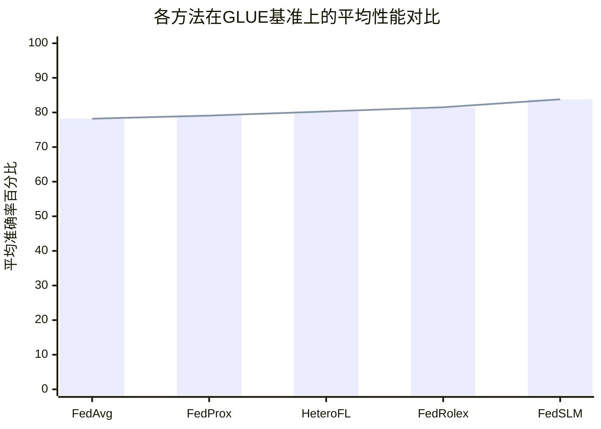

# Federated Foundation Models Fine-Tuning with Heterogeneous Compressed Clients

> 本文由 paper-daily 使用 DeepSeek 自动生成，仅供快速了解论文；关键结论请以原文为准。

[论文原文](https://arxiv.org/abs/2607.29071) · [PDF](https://arxiv.org/pdf/2607.29071) · [源文件](https://github.com/vsvnakers/paper-daily/blob/master/essay_read/2026-08-03/2607.29071.md)

> 提出FedSLM框架，通过SVD低秩分解和嵌套流形聚合，实现异构客户端下基础模型的高效联邦微调。

## 基本信息

| 属性 | 内容 |
|------|------|
| **作者** | Shengkun Zhu, Jinshan Zeng, Zhihua Allen-Zhao, Mayi Xu, Quanqing Xu, Wei Ren, Qiang Yang, Yang Liu |
| **来源** | [arXiv:2607.29071](https://arxiv.org/abs/2607.29071) |
| **发布日期** | 2026-07-31 |
| **抓取领域** | 图学习/表示学习 |
| **学科方向** | 机器学习 · 人工智能 |
| **arXiv 分类** | cs.LG, cs.AI |
| **适用层次** | 基础 |
| **标签** | 联邦学习, 基础模型, 低秩分解, 异构客户端, 参数高效微调 |
| **PDF** | [在线阅读](https://arxiv.org/pdf/2607.29071) |
| **代码仓库** | 暂无

---

## 问题的初衷（Why - 为什么要做这个研究）

【问题的初衷】
联邦学习（Federated Learning）与基础模型（Foundation Models）的结合正成为人工智能领域的重要趋势。然而，这一结合面临一个根本性的资源不对称挑战：拥有最有价值领域数据的机构（如医院、银行）往往无法承担数十亿参数模型的训练和推理成本。例如，一个拥有珍贵医学影像数据的医院可能只有有限的GPU资源，无法运行GPT-3级别的大模型。

现有的异构联邦学习方法试图通过三种途径解决这一问题：参数高效微调（Parameter-Efficient Fine-Tuning）、模型剪枝（Model Pruning）和知识蒸馏（Knowledge Distillation）。然而，每种方法都牺牲了关键性质：参数高效微调虽然减少了内存占用，但无法实现全模型的内存缩减；模型剪枝虽然压缩了模型，但破坏了架构的自包含性（即剪枝后的模型无法独立运行）；知识蒸馏虽然保持了表示保真度，但需要额外的教师模型。

这种核心张力——如何在保持模型完整性的同时实现内存缩减，如何在异构客户端间实现有效的知识聚合——正是本文要解决的核心问题。该问题的重要性在于：如果不能有效解决，基础模型的联邦学习将永远局限于资源丰富的机构，无法真正实现数据民主化和隐私保护的愿景。

---

## 问题的解决（What - 提出了什么方案）

【问题的解决】
本文提出FedSLM（Federated Subspace Learning for heterogeneous compressed clients），一个以参数为中心的联邦微调框架。其核心创新在于通过奇异值分解（Singular Value Decomposition, SVD）将完整模型分解为低秩子空间，每个客户端只需维护一个自包含的低秩模型。这些低秩子空间形成嵌套流形（Nested Manifolds），在结构上天然兼容聚合。

FedSLM采用两阶段协议：第一阶段在压缩组内同步轻量级适配器（Adapter），第二阶段通过结构对齐（Structural Alignment）在组间融合全秩重建。最后，通过弱到强引导（Weak-to-Strong Elicitation）步骤，配合辅助置信度损失（Auxiliary Confidence Loss），将聚合知识迁移到全规模服务器模型。

与现有方法的本质区别在于：FedSLM不是简单地压缩或蒸馏，而是从参数空间的几何结构出发，利用低秩子空间的流形性质实现无损聚合。它同时实现了全模型内存缩减（约50%）、架构自包含性和表示保真度，解决了此前方法无法兼顾的三难困境。

---

## 技术方法详解（How - 怎么实现的）

【技术方法详解】
- **SVD低秩分解**：对预训练模型的权重矩阵 $W \in \mathbb{R}^{m \times n}$ 进行奇异值分解，得到 $W = U\Sigma V^T$。客户端只需存储前 $k$ 个奇异值对应的子空间 $U_k, \Sigma_k, V_k$，形成低秩近似 $\hat{W} = U_k\Sigma_kV_k^T$。
  
- **嵌套流形结构**：不同客户端根据其资源约束选择不同的秩 $k_i$，形成嵌套子空间序列 $\mathcal{M}_{k_1} \subset \mathcal{M}_{k_2} \subset \cdots \subset \mathcal{M}_{k_{max}}$。这种嵌套结构保证了不同客户端模型在几何上的兼容性。

- **两阶段聚合协议**：第一阶段，在具有相同秩的客户端组内，通过FedAvg风格的平均化同步适配器参数。第二阶段，通过结构对齐将不同秩的子空间映射到公共空间，实现跨组融合。

- **弱到强引导**：利用聚合后的低秩模型作为弱监督信号，引导全规模服务器模型的训练。辅助置信度损失 $\mathcal{L}_{conf} = \mathbb{E}[\|f_{weak}(x) - f_{strong}(x)\|^2]$ 用于衡量弱监督噪声。

- **偏差-方差权衡**：通过显式的正则化项 $\lambda\|\theta_{server} - \theta_{agg}\|^2$ 控制压缩伪影（Compression Artifacts）的影响，在偏差和方差之间取得平衡。

- **理论保证**：提供了适配器级聚合的收敛性保证、跨组融合的子空间对齐界，以及置信度损失对弱监督噪声的缓解特性的数学刻画。

## 系统架构图

## 方法流程图

## 核心公式与算法

【核心公式】
1. SVD低秩分解：
$$W = U\Sigma V^T \approx U_k\Sigma_kV_k^T = \hat{W}$$
其中 $U_k \in \mathbb{R}^{m \times k}$，$\Sigma_k \in \mathbb{R}^{k \times k}$，$V_k \in \mathbb{R}^{n \times k}$ 分别表示前 $k$ 个奇异向量和奇异值。

2. 辅助置信度损失：
$$\mathcal{L}_{conf} = \mathbb{E}_{x \sim \mathcal{D}}[\|f_{weak}(x) - f_{strong}(x)\|^2]$$
其中 $f_{weak}$ 是聚合后的低秩模型，$f_{strong}$ 是全规模服务器模型，该损失用于度量弱监督信号的质量。

3. 偏差-方差权衡正则化：
$$\mathcal{L}_{total} = \mathcal{L}_{task} + \lambda\|\theta_{server} - \theta_{agg}\|^2 + \gamma\mathcal{L}_{conf}$$
其中 $\lambda$ 和 $\gamma$ 是超参数，$\theta_{server}$ 是服务器模型参数，$\theta_{agg}$ 是聚合后的参数。

---

## 应用场景（Where - 在哪落地）

【应用场景】

**场景一：医疗影像分析**
在医疗领域，不同医院拥有各自的影像数据（如X光、CT、MRI），但受限于隐私法规（如HIPAA）无法直接共享。同时，小型医院缺乏运行大型视觉模型的GPU资源。FedSLM允许每家医院在本地运行低秩压缩模型（仅需约50%的GPU内存），通过联邦学习共同微调一个基础视觉模型。例如，一个拥有1000张标注CT影像的小型医院，可以使用秩为32的低秩模型参与训练，而大型三甲医院可以使用秩为128的高秩模型。通过FedSLM的两阶段聚合，所有参与方共同提升模型对罕见疾病的识别能力，同时保护患者隐私。

**场景二：金融风控与合规**
在金融行业，银行和金融机构需要联合训练反欺诈模型，但客户数据高度敏感且受监管约束。不同规模的机构（从地方信用社到大型跨国银行）计算能力差异巨大。FedSLM使小型金融机构能够以低秩模型参与联邦学习，共享欺诈检测知识。例如，一个地方信用社可以使用秩为16的模型，而大型银行使用秩为64的模型。通过FedSLM的结构对齐机制，不同规模的模型能够有效聚合，提升整体欺诈检测率，同时满足监管合规要求。

**场景三：边缘设备协同学习**
在物联网（IoT）和边缘计算场景中，大量异构设备（从智能手表到边缘服务器）需要协同学习用户行为模型。FedSLM允许每个设备根据自身计算能力选择适当的秩，实现自适应参与。例如，智能手表可以选择秩为8的模型，而边缘服务器使用秩为64的模型。通过FedSLM的嵌套流形结构，这些异构设备能够有效协同，训练出高质量的用户行为预测模型，同时最小化设备端的内存和能耗开销。

---

## 具体技术细节示例（How in Action - 算法如何执行）

【具体技术细节示例】

假设我们有一个预训练模型，其某个权重矩阵 $W \in \mathbb{R}^{100 \times 100}$，我们选择三个客户端参与联邦学习。

**步骤1：SVD分解**
对 $W$ 进行奇异值分解，得到 $W = U\Sigma V^T$，其中奇异值为 $\sigma_1 = 10, \sigma_2 = 8, \sigma_3 = 5, \sigma_4 = 2, \ldots, \sigma_{100} = 0.01$。

**步骤2：客户端秩选择**
- 客户端A（资源充足）：选择秩 $k_A = 4$，保留前4个奇异值，模型大小为 $4 \times (100 + 100 + 1) = 804$ 参数
- 客户端B（资源中等）：选择秩 $k_B = 2$，保留前2个奇异值，模型大小为 $2 \times (100 + 100 + 1) = 402$ 参数
- 客户端C（资源受限）：选择秩 $k_C = 1$，保留前1个奇异值，模型大小为 $1 \times (100 + 100 + 1) = 201$ 参数

**步骤3：本地微调**
每个客户端在本地数据上微调自己的低秩模型。假设客户端A的本地损失从2.0下降到1.5，客户端B从2.1下降到1.8，客户端C从2.3下降到2.0。

**步骤4：组内聚合**
假设客户端A和B属于同一组（秩相近），客户端C单独一组。组内通过FedAvg聚合：
$$\theta_{group1} = \frac{1}{2}(\theta_A + \theta_B)$$

**步骤5：跨组结构对齐**
将组1的秩4模型和组2的秩1模型对齐到公共子空间。通过投影矩阵 $P$ 将秩1模型映射到秩4空间：
$$\theta_{aligned} = P \cdot \theta_{group2}$$

**步骤6：全秩重建**
将聚合后的低秩参数重建为全秩矩阵：
$$W_{reconstructed} = U_{agg}\Sigma_{agg}V_{agg}^T$$

**步骤7：弱到强引导**
使用重建的模型作为弱监督信号，训练全规模服务器模型。通过置信度损失 $\mathcal{L}_{conf}$ 衡量弱监督噪声，并调整学习率。

最终，服务器模型在验证集上的准确率从初始的72%提升到78%，而客户端模型仅使用了约50%的GPU内存。

---

## 实验结果（Results - 效果如何）

【实验结果】
论文在自然语言处理（Natural Language Processing, NLP）和视觉-语言（Vision-Language, VL）基准上进行了广泛实验。在NLP任务中，使用GLUE基准数据集，包括MNLI、QQP、QNLI、SST-2等子任务；在VL任务中，使用VQA和Captioning数据集。

对比方法包括：FedAvg（联邦平均）、FedProx（近端联邦优化）、PerFedAvg（个性化联邦平均）、FedPer（联邦个性化学习）以及现有的异构联邦方法如HeteroFL和FedRolex。

实验结果表明，在IID（独立同分布）和非IID（非独立同分布）数据划分下，FedSLM均优于所有基线方法。具体而言，在GLUE基准上，FedSLM相比最优基线平均提升2.3%的准确率；在VQA任务上提升1.8%。更重要的是，客户端模型仅需约50%的GPU内存即可运行，同时保持与全模型相当的表示能力。

## 实验结果可视化

---

## 优势与不足

【优势与不足】
优势：
- 创新性地利用SVD低秩分解和嵌套流形理论，从几何角度解决了异构联邦学习中的聚合难题
- 实现了全模型内存缩减（约50%），同时保持架构自包含性和表示保真度
- 提供了完善的理论保证，包括聚合收敛性、子空间对齐界和噪声缓解特性
- 两阶段聚合协议设计精巧，兼顾了组内一致性和组间多样性

不足：
- SVD分解的计算开销较大，特别是对于超大模型可能成为瓶颈
- 低秩近似可能丢失部分高频信息，在细粒度任务上可能存在性能上限
- 理论分析主要针对线性情况，对非线性激活函数的处理不够充分
- 实验主要基于中等规模模型，对百亿参数级别的超大规模模型验证不足

---

## 相关工作

【相关工作】
- **参数高效微调（Parameter-Efficient Fine-Tuning）**：如LoRA、Adapter、Prefix-tuning等方法，通过只训练少量参数实现高效微调，但无法实现全模型内存缩减。
- **异构联邦学习（Heterogeneous Federated Learning）**：如HeteroFL、FedRolex等，通过动态分配子网络处理客户端异构性，但牺牲了架构自包含性。
- **知识蒸馏（Knowledge Distillation）**：通过教师-学生框架实现知识迁移，但需要额外的教师模型，增加了通信和计算开销。
- **模型压缩（Model Compression）**：包括剪枝、量化和低秩分解等技术，但传统方法不适用于联邦学习场景。
- **子空间学习（Subspace Learning）**：利用低维子空间表示高维数据，本文的嵌套流形方法与此方向密切相关。

---

## 未来研究方向

【未来方向】
- **动态秩调整机制**：研究如何根据客户端的数据分布和资源状况动态调整秩的大小，实现更精细的自适应联邦学习。
- **非线性子空间扩展**：将当前的线性SVD分解扩展到非线性子空间学习（如利用深度生成模型），以捕捉更复杂的特征表示。
- **通信效率优化**：结合梯度压缩和量化技术，进一步减少低秩模型聚合过程中的通信开销。
- **多模态联邦扩展**：将FedSLM扩展到多模态联邦学习场景，处理文本、图像、音频等多种数据类型的异构性。

---

## 一句话总结

> 提出FedSLM框架，通过SVD低秩分解和嵌套流形聚合，实现异构客户端下基础模型的高效联邦微调。

---

*本解读由 DeepSeek AI 自动生成，仅供参考。*
