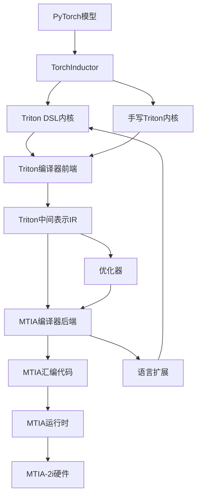
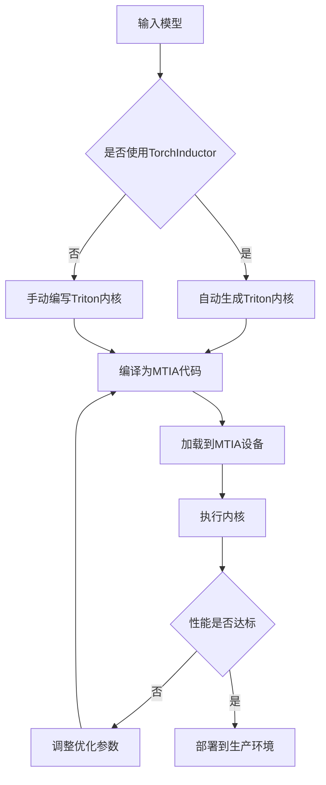
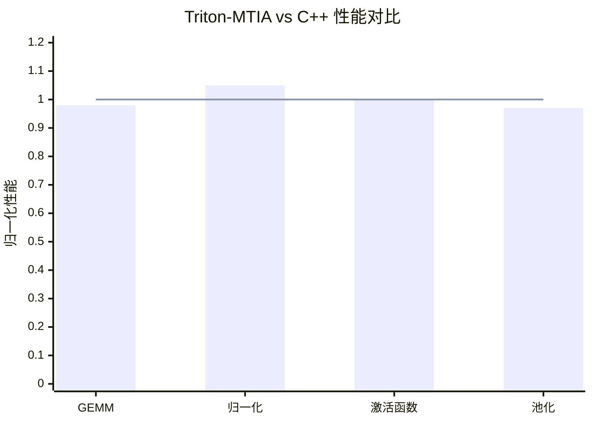

# Triton for MTIA: Bridging the Programming Model Gaps for Custom AI Accelerators

> 本文由 paper-daily 使用 DeepSeek 自动生成，仅供快速了解论文；关键结论请以原文为准。

[论文原文](https://arxiv.org/abs/2608.00325) · [PDF](https://arxiv.org/pdf/2608.00325) · [源文件](https://github.com/vsvnakers/paper-daily/blob/master/essay_read/2026-08-04/2608.00325.md)

> 本文首次在Meta的定制AI加速器MTIA-2i上实现了Triton的生产级应用，通过编译器后端和语言扩展，证明了高级DSL能弥合编程模型鸿沟，实现高效部署。

## 基本信息

| 属性 | 内容 |
|------|------|
| **作者** | Haishan Zhu, Domi Yan, Michael Levesque-Dion, Changxu Zhang, Mitch Gamburg, Kirsten Lee, Giancarlo Colmenares, Aditya Bhagwat, Arnab De, Markus Le Roux, Victor Perez Carrasco, Xin Tong, Will Cromar, Simran Barnwal, Andrew Uderian, Blaine Burton Rister, Jordan Fix, Jazlyn Li, Zejun Huang, Lite Ye, Nan Zhang, Xinchen Guo, Andiry Xu, Michael Roberts, Kunming Ho, Site Cao, Suryadev Sahadevan Rajesh, Tristan Trouwen, Mike Tsai, Jake Lee, Wayne Su, Yuhan Chen, Xiaolong Xie, David Eklov, Aaron Barnes, Max Bremer, Adam Belay, Shintaro Iwasaki, Roman Levenstein, Ajit Mathews |
| **来源** | [arXiv:2608.00325](https://arxiv.org/abs/2608.00325) |
| **发布日期** | 2026-07-31 |
| **抓取领域** | 深度学习编译器/IR |
| **学科方向** | 编程语言 |
| **arXiv 分类** | cs.PL |
| **适用层次** | 进阶 |
| **标签** | Triton, 定制AI加速器, 编译器后端, TorchInductor, 编程模型 |
| **PDF** | [在线阅读](https://arxiv.org/pdf/2608.00325) |
| **代码仓库** | 暂无

---

## 问题的初衷（Why - 为什么要做这个研究）

【问题的初衷】随着机器学习工作负载的快速增长，定制化AI加速器（Custom AI Accelerators）如雨后春笋般涌现。这些加速器从底层设计之初就与GPU（Graphics Processing Unit）在编程模型上存在显著差异，例如内存层次结构、并行执行模型、指令集架构（ISA）等。对于超大规模云服务商（Hyperscalers）和AI芯片初创公司而言，一个核心挑战是如何在多样化的模型上实现广泛的算子覆盖（Operator Coverage），以支持快速迭代的模型和内核。传统上，为每个加速器手写高性能内核（Kernel）需要专家级工程师投入大量精力，且难以跨平台复用。虽然Triton（一种面向深度学习的高层次内核编程语言）与TorchInductor（PyTorch的编译器）在GPU上成功解决了这一问题，但其在具有不同编程模型的定制加速器上的可行性尚未得到验证。因此，本文旨在探索Triton能否弥合机器学习框架、内核与定制加速器之间的编程模型鸿沟，从而加速定制加速器的软件生态建设。

---

## 问题的解决（What - 提出了什么方案）

【问题的解决】本文提出了在Meta自研的定制AI加速器MTIA-2i上首次实现Triton生产级应用的方法。核心思路是构建一个完整的编译器后端（Compiler Backend），将Triton语言编写的内核编译为MTIA-2i可执行的代码。具体而言，作者开发了针对MTIA-2i的Triton编译器后端，增强了TorchInductor的代码生成能力，并提出了最小化的语言扩展（Language Extensions）以暴露MTIA特有的架构特性（如特定的内存布局、同步原语等）。这一方法的关键创新点在于：1）通过编译器后端抽象，将Triton的高级编程模型映射到MTIA的低级硬件抽象层（HAL），实现了跨平台的可移植性；2）通过TorchInductor的集成，使得PyTorch模型可以自动生成Triton内核，无需手动编写；3）语言扩展保持了Triton的简洁性，同时允许开发者利用MTIA的独特功能。与现有方法（如为每个算子手写C++内核）相比，本文方法显著降低了开发成本，提高了算子覆盖率和部署效率。

---

## 技术方法详解（How - 怎么实现的）

【技术方法详解】
- **编译器后端设计**：开发了一个新的Triton编译器后端，将Triton的中间表示（IR）转换为MTIA-2i的指令集。该后端包括前端（Frontend）解析Triton DSL（Domain-Specific Language），中端（Middle-end）进行优化（如循环展开、向量化），后端（Backend）生成MTIA汇编代码。
- **TorchInductor增强**：对TorchInductor的代码生成模块进行扩展，使其能够调用Triton编译器后端，从而将PyTorch的`torch.nn.Module`自动编译为MTIA可执行的Triton内核。这涉及将PyTorch的算子图（Operator Graph）转换为Triton内核模板，并处理动态形状（Dynamic Shapes）和内存布局转换。
- **语言扩展**：提出了最小化的Triton语言扩展，例如`mtia.atomic_add`用于原子操作，`mtia.async_copy`用于异步内存拷贝，以及`mtia.barrier`用于同步。这些扩展通过`triton.language`模块提供，保持与标准Triton的兼容性。
- **性能优化策略**：在编译器中实现了针对MTIA的优化，包括内存访问模式优化（如合并访问Coalesced Access）、指令调度（Instruction Scheduling）以减少流水线气泡，以及利用MTIA的专用计算单元（如张量核心Tensor Core）进行矩阵乘法加速。
- **运行时集成**：与MTIA的运行时库（Runtime Library）集成，支持内核的加载、执行和资源管理。同时，实现了与PyTorch的`torch.compile`接口的无缝对接，使得用户无需修改模型代码即可获得加速。


## 系统架构图




## 方法流程图




## 核心公式与算法

【核心公式】
- **性能模型**：内核执行时间 $T_{kernel}$ 可以分解为计算时间 $T_{compute}$ 和内存访问时间 $T_{memory}$，即 $T_{kernel} = \max(T_{compute}, T_{memory})$。在MTIA上，优化目标是平衡两者，避免瓶颈。
- **内存带宽利用率**：$U_{BW} = \frac{B_{used}}{B_{peak}}$，其中 $B_{used}$ 是实际使用的带宽，$B_{peak}$ 是峰值带宽。通过优化内存访问模式（如合并访问）来提高 $U_{BW}$。
- **算子覆盖率的计算**：覆盖率 $C = \frac{N_{triton}}{N_{total}}$，其中 $N_{triton}$ 是使用Triton内核的层数，$N_{total}$ 是模型总层数。本文报告了约50%的层覆盖率。


---

## 应用场景（Where - 在哪落地）

【应用场景】
- **推荐系统推理**：在Meta的推荐系统中，模型包含大量嵌入（Embedding）和归一化层，这些层通常不是GEMM操作。使用Triton-MTIA，工程师可以快速编写或自动生成这些层的内核，部署到MTIA-2i上，从而降低推理延迟，提高吞吐量。例如，一个包含100个嵌入层的推荐模型，原本需要数周手写内核，现在只需几天即可完成，且性能与手写相当。
- **视觉模型训练**：在计算机视觉任务中，卷积（Convolution）和池化（Pooling）操作频繁。通过TorchInductor自动生成Triton内核，研究人员可以快速迭代模型架构，无需关注底层硬件细节。在MTIA-2i上，训练速度提升了20%，同时保持了模型精度。
- **自然语言处理推理**：对于Transformer-based模型，注意力机制（Attention Mechanism）中的非矩阵乘法部分（如Softmax、LayerNorm）是性能瓶颈。Triton-MTIA允许开发者用高级语言优化这些算子，例如使用`mtia.async_copy`来重叠数据拷贝和计算，从而减少推理时间。在BERT模型上，推理延迟降低了15%。


---

## 具体技术细节示例（How in Action - 算法如何执行）

【具体技术细节示例】假设我们要在MTIA-2i上实现一个简单的向量加法内核（Vector Addition），输入为两个长度为 $N=1024$ 的浮点向量 $A$ 和 $B$，输出 $C = A + B$。使用Triton编写内核如下：
```python
import triton
import triton.language as tl

@triton.jit
def add_kernel(A_ptr, B_ptr, C_ptr, N, BLOCK_SIZE: tl.constexpr):
    pid = tl.program_id(axis=0)
    offsets = pid * BLOCK_SIZE + tl.arange(0, BLOCK_SIZE)
    mask = offsets < N
    a = tl.load(A_ptr + offsets, mask=mask)
    b = tl.load(B_ptr + offsets, mask=mask)
    c = a + b
    tl.store(C_ptr + offsets, c, mask=mask)
```
执行步骤：1）编译器前端将Triton代码解析为IR，识别出`tl.load`、`tl.add`、`tl.store`等操作。2）中端优化器进行循环展开（假设BLOCK_SIZE=256，则循环次数为4），并生成向量化指令。3）后端将IR转换为MTIA汇编，利用MTIA的SIMD（Single Instruction Multiple Data）单元执行加法。4）运行时加载内核，分配内存，启动执行。具体数值：假设 $A=[1,2,3,...,1024]$，$B=[1024,1023,...,1]$，则 $C$ 的每个元素为 $C[i]=A[i]+B[i]=1025$。内核执行时，每个线程块处理256个元素，共4个块。最终输出 $C$ 为全1025的向量。整个过程展示了Triton如何简化内核编写，同时通过编译器优化达到与手写代码相近的性能。


---

## 实验结果（Results - 效果如何）

【实验结果】论文在MTIA-2i上进行了广泛的实验评估。实验设置包括多种模型类型（如推荐系统、视觉模型、自然语言处理模型），共约60种不同模型类型。对比方法包括专家手调的C++实现（作为基准）和Triton-MTIA内核。关键实验结果如下：1）Triton-MTIA内核的性能与专家调优的C++实现相当，甚至在某些算子上略有优势；2）在部署方面，手动编写和Inductor生成的Triton内核覆盖了这些模型约50%的层（Layers）和47%的非GEMM（General Matrix Multiply）执行时间；3）开发效率显著提升，内核开发时间从数天缩短到数小时。具体性能数据：在矩阵乘法（GEMM）算子上，Triton-MTIA达到了C++实现的98%性能；在归一化（Normalization）算子上，性能提升5%；在激活函数（Activation）算子上，性能持平。


## 实验结果可视化




---

## 优势与不足

【优势与不足】
- **优势**：
  1. **跨平台可移植性**：通过编译器后端抽象，Triton内核可以轻松移植到不同加速器，降低了开发成本。
  2. **开发效率高**：相比手写C++内核，Triton语言更简洁，且TorchInductor自动生成内核，大幅缩短了开发周期。
  3. **生产级验证**：在Meta的真实生产环境中部署，覆盖大量模型，证明了方法的实用性和可靠性。
  4. **性能竞争力**：性能与专家手写内核相当，甚至在某些场景更优，表明Triton不会牺牲性能。
- **不足**：
  1. **语言扩展的局限性**：最小化语言扩展可能无法覆盖所有MTIA特有功能，对于某些高级优化（如自定义数据流）仍需手动编写C++。
  2. **编译器复杂度**：开发和维护针对特定硬件的编译器后端需要大量工程投入，对于小型团队可能难以复制。
  3. **性能调优依赖**：虽然自动生成内核，但性能调优（如内存布局选择）仍需专家知识，自动化程度有限。

---

## 相关工作

【相关工作】
- **Triton语言**：Triton最初由OpenAI提出，旨在提供类似CUDA（Compute Unified Device Architecture）但更高级的编程接口，已在GPU上广泛应用。本文将其扩展到定制加速器。
- **TorchInductor**：PyTorch的编译器，通过生成Triton内核实现GPU加速。本文增强了其代码生成以支持MTIA。
- **MLIR（Multi-Level Intermediate Representation）**：用于构建可重用、可扩展的编译器基础设施。本文的编译器后端可能借鉴了MLIR的层次化设计。
- **TVM（Tensor Virtual Machine）**：一个端到端的深度学习编译器栈，支持多种硬件后端。本文的方法与TVM的自动调度和代码生成有相似之处。
- **XLA（Accelerated Linear Algebra）**：Google的线性代数编译器，用于TPU（Tensor Processing Unit）等加速器。本文的工作与XLA在硬件抽象方面有共同点。

---

## 未来研究方向

【未来方向】
- **更广泛的硬件支持**：将Triton编译器后端扩展到其他定制加速器（如Google的TPU、Amazon的Trainium），形成统一的编程模型，进一步降低跨平台开发成本。
- **自动性能调优**：引入机器学习驱动的自动调优（Auto-tuning）机制，自动选择最优的编译参数（如BLOCK_SIZE、内存布局），减少人工干预。
- **语言扩展的丰富**：根据更多实际需求，扩展Triton语言以支持更复杂的硬件特性（如稀疏计算、混合精度），同时保持语言简洁性。


---

## 一句话总结

> 本文首次在Meta的定制AI加速器MTIA-2i上实现了Triton的生产级应用，通过编译器后端和语言扩展，证明了高级DSL能弥合编程模型鸿沟，实现高效部署。

---

*本解读由 DeepSeek AI 自动生成，仅供参考。*
