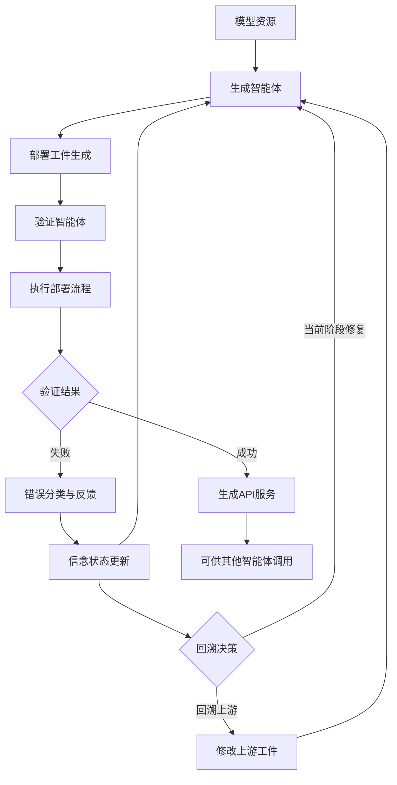
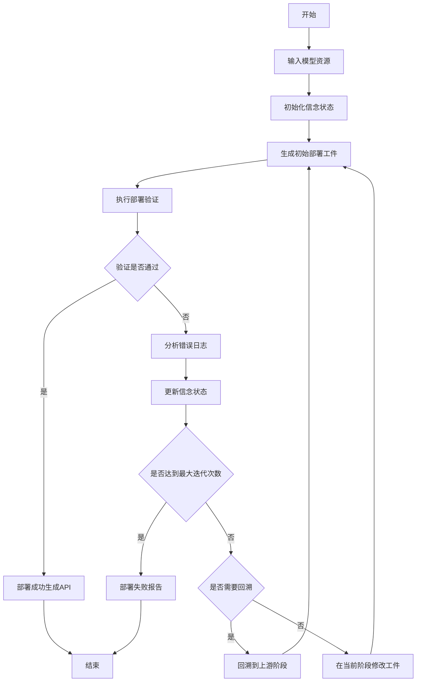
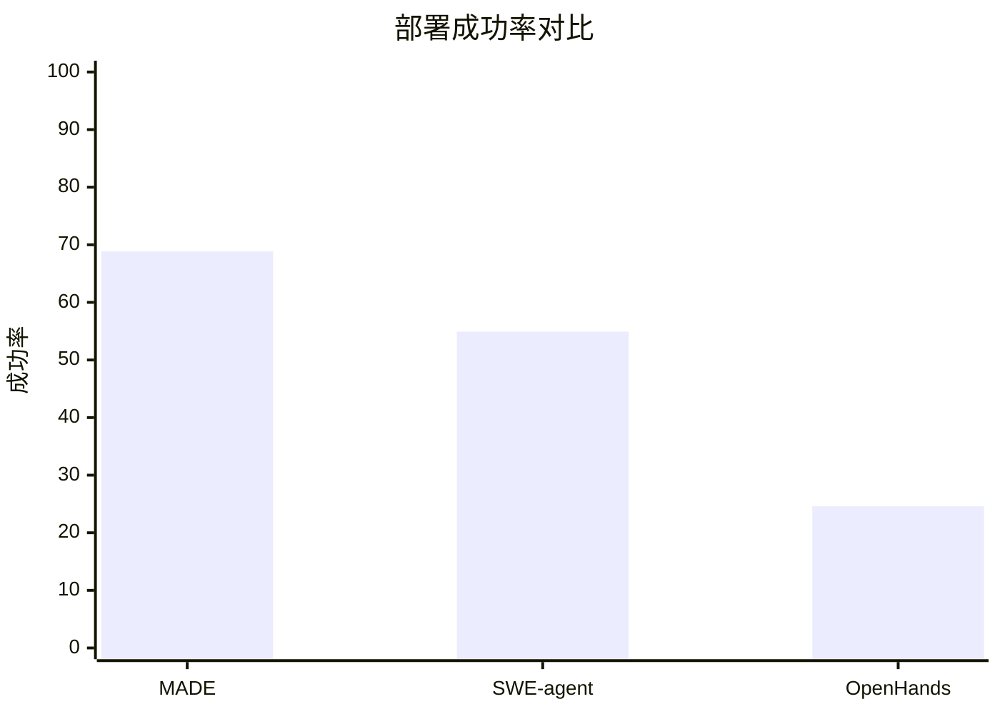

# MADE: Belief-Driven Dual-Agent Coordination for Autonomous Model Deployment

> 本文由 paper-daily 使用 DeepSeek 自动生成，仅供快速了解论文；关键结论请以原文为准。

[论文原文](https://arxiv.org/abs/2608.01189) · [PDF](https://arxiv.org/pdf/2608.01189) · [源文件](https://github.com/vsvnakers/paper-daily/blob/master/essay_read/2026-08-04/2608.01189.md)

> MADE通过信念驱动的双智能体协调机制，实现了从模型资源到可调用API的全自动部署，显著提升了部署成功率。

## 基本信息

| 属性 | 内容 |
|------|------|
| **作者** | Yicheng Liu, Bolin Zhang, Weiran Liu, Yakun Zhang, Yangqin Jiang, Zhiying Tu, Dianhui Chu |
| **来源** | [arXiv:2608.01189](https://arxiv.org/abs/2608.01189) |
| **发布日期** | 2026-08-02 |
| **抓取领域** | 深度学习编译器/IR |
| **学科方向** | 软件工程 |
| **arXiv 分类** | cs.SE |
| **适用层次** | 进阶 |
| **标签** | 模型部署, 双智能体, 信念驱动, LLM智能体, 自动化API |
| **PDF** | [在线阅读](https://arxiv.org/pdf/2608.01189) |
| **代码仓库** | 暂无

---

## 问题的初衷（Why - 为什么要做这个研究）

【问题的初衷】近年来，基于大语言模型（Large Language Model, LLM）的智能体（Agent）在通用任务上展现出强大的能力，但在处理特定领域任务时仍存在明显不足。为了扩展其能力边界，集成外部工具（如专用模型API）成为一种主流方案。开源社区提供了海量的AI模型，但这些模型通常以异构的研究工件（Research Artifact）形式发布，例如包含不同的权重格式、依赖环境、预处理逻辑和推理接口。将这些模型转化为可直接调用的API（Application Programming Interface）需要大量人工工作，包括编写推理脚本、配置环境、处理依赖冲突、优化性能等，成本高昂且易出错。因此，自动化模型部署成为连接模型资源与工具可用性的关键桥梁。然而，模型部署是一个长期、多阶段、高度依赖反馈循环的任务，涉及环境配置、代码编写、测试验证等多个环节，现有研究对此探索不足。现有智能体如SWE-agent和OpenHands主要面向软件工程任务，缺乏对模型部署领域特殊性的理解，导致部署成功率低。本文旨在解决这一空白，提出一个能够自主完成模型部署的智能体系统，以降低模型服务化的门槛，推动AI模型在真实应用中的快速落地。

---

## 问题的解决（What - 提出了什么方案）

【问题的解决】本文提出了模型自动部署引擎（Model Automated Deployment Engine, MADE），一种基于信念驱动的双智能体协调系统。其核心思路是将模型部署视为一个迭代的、信念更新的过程：系统首先根据模型资源生成初始部署工件（如Dockerfile、推理脚本），然后通过执行反馈（如编译错误、测试失败）更新对部署状态的信念（Belief），并据此决定是修正当前工件还是回溯到上游工件（如重新选择基础镜像或调整依赖版本）。MADE采用双智能体架构：一个负责生成和修改部署工件（称为生成智能体），另一个负责验证和提供反馈（称为验证智能体）。两者通过共享的信念状态进行协调，避免盲目重试，提高部署效率。与现有方法（如SWE-agent直接使用通用代码生成策略）相比，MADE的关键创新在于引入了领域特定的部署信念模型，能够区分不同错误类型（如环境错误、代码错误、资源错误），并优先处理高概率根因。此外，MADE还构建了M2ABench基准，包含122个真实世界模型和标准化测试用例，用于系统评估。实验表明，MADE的部署成功率达68.85%，分别比SWE-agent和OpenHands高出13.93和44.26个百分点，验证了方法的有效性。

---

## 技术方法详解（How - 怎么实现的）

【技术方法详解】
- **双智能体架构**：MADE包含两个核心智能体：生成智能体（Generator Agent）和验证智能体（Validator Agent）。生成智能体负责根据当前信念状态和模型资源生成或修改部署工件，包括Dockerfile、依赖文件、推理脚本等；验证智能体负责执行部署流程，收集错误日志和测试结果，并生成结构化反馈。两者通过一个共享的信念状态（Belief State）进行通信，该状态记录当前部署阶段、已尝试的解决方案、错误类型统计等。
- **信念驱动机制**：信念状态是一个概率分布，表示对部署工件正确性的置信度。初始时，信念基于模型资源的元数据（如框架类型、依赖列表）设定。每次验证反馈后，信念通过贝叶斯更新（Bayesian Update）调整。例如，若连续出现导入错误，系统会提高对依赖配置错误的信念，并优先修正requirements.txt。
- **迭代回溯策略**：MADE支持多级回溯。当验证失败时，系统首先尝试在当前阶段（如依赖安装）内修正；若多次失败，则回溯到上游阶段（如基础镜像选择）。回溯决策由信念状态驱动，避免盲目重试。具体地，系统维护一个阶段树，每个阶段有对应的错误类型和修复策略。
- **错误分类与优先级**：验证智能体将错误分为三类：环境错误（如缺少系统库）、依赖错误（如版本冲突）、代码错误（如API使用不当）。系统根据错误类型和出现频率动态调整修复优先级。例如，环境错误通常优先于代码错误，因为前者影响后续所有步骤。
- **上下文压缩与记忆**：由于部署过程可能产生大量日志，MADE采用上下文压缩技术，只保留关键错误信息和修复历史，避免超出LLM的上下文窗口。同时，系统维护一个短期记忆，记录最近的成功修复模式，用于指导后续决策。
- **M2ABench基准**：为了评估，作者收集了122个真实模型，涵盖图像分类、目标检测、文本生成等任务，并设计了标准化的测试用例（如输入输出格式检查、性能测试）。每个模型附带元数据（如框架、依赖），用于模拟真实部署场景。

## 系统架构图

## 方法流程图

## 核心公式与算法

【核心公式】
- 信念更新公式：$P(s_t | e_{1:t}) \propto P(e_t | s_t) \cdot P(s_t | e_{1:t-1})$，其中 $s_t$ 表示第 $t$ 次迭代时的部署状态（如依赖配置正确、代码正确），$e_t$ 表示第 $t$ 次验证得到的错误类型。该公式基于贝叶斯定理，用于更新对当前部署状态的置信度。
- 回溯决策函数：$\text{Decision}(s_t) = \arg\max_{a \in \{fix, backtrack\}} Q(s_t, a)$，其中 $Q$ 是价值函数，根据历史修复成功率计算。当回溯的预期收益高于当前阶段修复时，系统选择回溯。
- 部署成功率：$\text{SuccessRate} = \frac{N_{\text{success}}}{N_{\text{total}}}$，其中 $N_{\text{success}}$ 是成功部署的模型数，$N_{\text{total}}$ 是总模型数。

---

## 应用场景（Where - 在哪落地）

【应用场景】
- 场景1：企业内部模型服务化平台。企业通常拥有多个训练好的模型（如推荐模型、风控模型），需要快速部署为API供业务系统调用。使用MADE，数据科学家只需上传模型文件和元数据，系统自动完成环境配置、依赖安装、推理脚本生成和测试，将部署时间从数天缩短到小时级，显著提升迭代效率。
- 场景2：开源模型生态的自动化集成。开源社区（如Hugging Face）有大量模型，但许多模型缺乏现成的API。MADE可以作为一个自动化的模型转换服务，用户提交模型链接后，系统自动生成可调用的API并托管，降低模型使用门槛，促进模型共享和复用。
- 场景3：边缘计算中的模型部署。在边缘设备上部署模型需要针对特定硬件（如GPU、NPU）进行优化，MADE可以根据设备信息自动调整部署配置（如使用TensorRT优化），并验证性能，确保模型在资源受限环境下高效运行。

---

## 具体技术细节示例（How in Action - 算法如何执行）

【具体技术细节示例】假设输入一个PyTorch图像分类模型，包含模型权重文件model.pth和元数据（框架：PyTorch 1.9，依赖：torchvision, numpy）。
- 步骤1：初始化信念状态。系统根据元数据设定初始信念：依赖配置正确概率0.7，代码正确概率0.5，环境正确概率0.8。
- 步骤2：生成智能体生成初始工件：Dockerfile（基于python:3.8镜像），requirements.txt（包含torch==1.9, torchvision==0.10, numpy），推理脚本infer.py（使用torch.load加载模型，定义预处理和后处理）。
- 步骤3：验证智能体执行Docker构建和运行测试。测试用例输入一张图片，期望输出类别标签。执行结果：构建成功，但运行时报错“ModuleNotFoundError: No module named 'torchvision'”。
- 步骤4：错误分类为依赖错误。信念更新：依赖配置正确概率降至0.3，代码正确概率保持0.5。系统决定在当前阶段修复，修改requirements.txt，添加torchvision==0.10.0（明确版本）。
- 步骤5：重新验证。运行成功，但输出类别与预期不符（因为预处理未归一化）。错误分类为代码错误。信念更新：代码正确概率降至0.2。系统回溯到代码阶段，修改infer.py，添加标准化步骤（mean=[0.485,0.456,0.406], std=[0.229,0.224,0.225]）。
- 步骤6：再次验证，测试通过。系统生成API服务（使用FastAPI），部署成功。最终输出：一个HTTP接口，可接收图片返回类别。整个过程中，信念状态指导了修复优先级，避免了盲目重试。

---

## 实验结果（Results - 效果如何）

【实验结果】实验基于M2ABench基准，包含122个真实模型，覆盖图像分类、目标检测、文本生成等任务。对比方法包括SWE-agent和OpenHands，两者均为先进的通用代码生成智能体。评估指标为部署成功率，即模型成功转化为可调用API的比例。结果显示，MADE的部署成功率为68.85%，显著高于SWE-agent的54.92%和OpenHands的24.59%。此外，MADE在平均迭代次数和平均部署时间上也优于基线，表明其不仅成功率更高，而且效率更高。作者还进行了消融实验，移除信念更新机制后成功率下降约10个百分点，验证了信念驱动设计的有效性。错误类型分析显示，MADE在依赖配置错误和代码错误上的修复成功率最高，而在环境错误上仍有提升空间。

## 实验结果可视化

---

## 优势与不足

【优势与不足】
- 优势1：创新性地提出信念驱动机制，将部署过程建模为迭代信念更新，显著提高了部署成功率，相比通用智能体有大幅提升。
- 优势2：双智能体架构分工明确，生成与验证解耦，使得系统能够并行处理不同阶段，且易于扩展新的错误类型。
- 优势3：构建了M2ABench基准，填补了模型部署评估的空白，为后续研究提供了标准化的测试平台。
- 不足1：对硬件资源要求较高，部署过程中需要实际运行模型进行验证，对于大型模型（如超过GPU内存）可能无法处理，限制了应用范围。
- 不足2：信念更新机制依赖于错误分类的准确性，对于罕见或模糊的错误类型，系统可能陷入无效回溯，导致迭代次数增加。

---

## 相关工作

【相关工作】
- 基于LLM的软件工程智能体（如SWE-agent、OpenHands）：这些工作利用LLM自动修复代码问题，但未针对模型部署领域进行优化，MADE借鉴了其迭代修复思路，但引入了领域特定的信念机制。
- 模型服务化工具（如MLflow、BentoML）：这些工具提供半自动化的模型打包和部署，但需要人工配置，缺乏智能决策能力，MADE旨在实现全自动化。
- 自动化机器学习（AutoML）：AutoML关注模型训练和调优，而MADE关注部署阶段，两者互补，可结合形成端到端自动化流水线。
- 多智能体系统（Multi-Agent System）：MADE采用双智能体协调，与通用多智能体协作框架（如AutoGen）相关，但更专注于部署任务。
- 错误诊断与修复（如程序修复）：MADE的错误分类和回溯策略借鉴了程序自动修复技术，但针对部署环境进行了定制。

---

## 未来研究方向

【未来方向】
- 方向1：引入强化学习（Reinforcement Learning）来优化回溯决策，通过大量部署任务训练一个策略网络，自动学习何时修复当前阶段、何时回溯，进一步提高成功率。
- 方向2：扩展到多模型协同部署场景，例如一个API需要调用多个模型（如级联模型），MADE可以扩展为多智能体协调，管理模型间的依赖关系。
- 方向3：结合模型性能优化，在部署过程中自动进行推理加速（如量化、剪枝），在保证准确率的同时提升API响应速度，满足实时性要求。

---

## 一句话总结

> MADE通过信念驱动的双智能体协调机制，实现了从模型资源到可调用API的全自动部署，显著提升了部署成功率。

---

*本解读由 DeepSeek AI 自动生成，仅供参考。*
