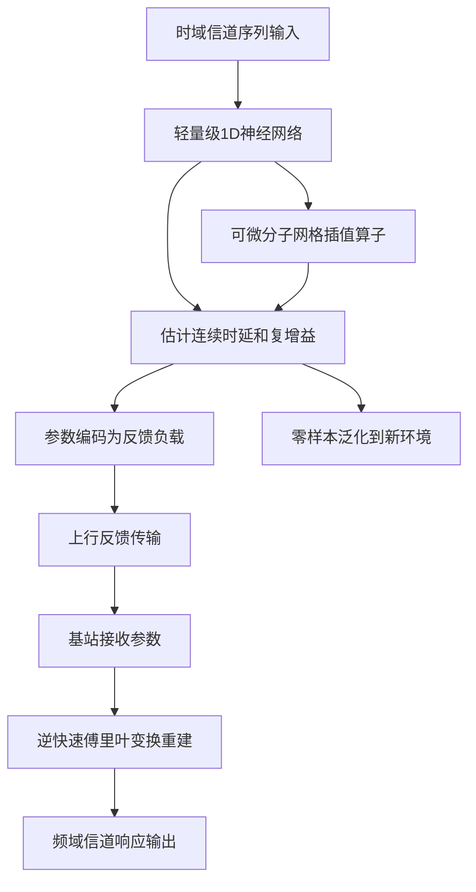
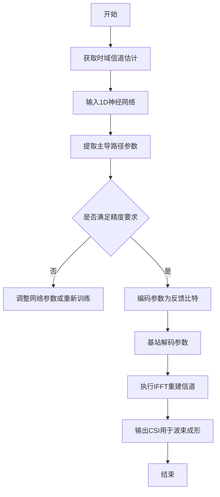

# Temporal Channel Estimation for Generalized CSI Feedback

> 本文由 paper-daily 使用 DeepSeek 自动生成，仅供快速了解论文；关键结论请以原文为准。

[论文原文](https://arxiv.org/abs/2608.01713) · [PDF](https://arxiv.org/pdf/2608.01713) · [源文件](https://github.com/vsvnakers/paper-daily/blob/master/essay_read/2026-08-04/2608.01713.md)

> TAP通过轻量级神经网络和参数化时延估计，实现了高效、可泛化的CSI反馈压缩，兼顾速度与可解释性。

## 基本信息

| 属性 | 内容 |
|------|------|
| **作者** | Minwoo Kim, Hyeonsu Lyu, Sehyun Ryu, Sojeong Park, Hyun Jong Yang |
| **来源** | [arXiv:2608.01713](https://arxiv.org/abs/2608.01713) |
| **发布日期** | 2026-08-03 |
| **抓取领域** | 体系结构/硬件加速 |
| **学科方向** | 信号处理 |
| **arXiv 分类** | eess.SP |
| **适用层次** | 进阶 |
| **标签** | CSI反馈, 参数化信道估计, 深度学习, 压缩感知, 大规模MIMO |
| **PDF** | [在线阅读](https://arxiv.org/pdf/2608.01713) |
| **代码仓库** | 暂无

---

## 问题的初衷（Why - 为什么要做这个研究）

【问题的初衷】在频分双工（Frequency Division Duplex, FDD）大规模多输入多输出（Massive Multiple-Input Multiple-Output, MIMO）系统中，基站（Base Station, BS）需要依赖下行信道的状态信息（Channel State Information, CSI）来进行波束成形和资源分配。然而，用户设备（User Equipment, UE）必须将估计的CSI反馈给基站，这一过程会消耗大量的上行链路资源。因此，高效的CSI反馈压缩方法至关重要。现有的压缩感知（Compressed Sensing, CS）算法虽然利用了信道在时延域的稀疏性，但存在两个主要缺陷：一是迭代重建过程延迟极高，难以满足实时性要求；二是离散网格（discrete grid）的量化会导致基失配（basis mismatch），降低重建精度。另一方面，基于深度学习（Deep Learning, DL）的方法虽然推理速度快，但缺乏空间可扩展性（spatial scalability）和域适应性（domain adaptability），无法泛化到未见过的传播环境，且编码器和解码器计算负担重。这些不足促使研究者探索一种既能保持CS的数学可解释性，又能达到DL速度的新方法。

---

## 问题的解决（What - 提出了什么方案）

【问题的解决】本文提出了TAP（Tap-Assisted Parametric CSI Compression），一种一次性（one-shot）神经框架，旨在统一DL的速度与CS的数学可解释性。TAP的核心创新在于用轻量级的一维神经网络替代CS中的迭代追踪算法，从时域信道序列中提取主导的连续传播时延，并通过可微分的子网格插值算子（sub-grid interpolation operator）实现高精度参数估计。TAP实现了真正的架构无关性（architecture independence），能够零样本（zero-shot）泛化到不同的阵列几何形状和未见过的传播环境。此外，TAP产生的反馈负载完全无需解码器，基站仅需通过简单的逆快速傅里叶变换（Inverse Fast Fourier Transform, IFFT）即可重建信道。这一设计不仅大幅降低了计算复杂度，还使得模型体积缩小至1MB以下，推理延迟低于毫秒级，为下一代网络提供了可扩展且易于部署的解决方案。

---

## 技术方法详解（How - 怎么实现的）

【技术方法详解】
- **时延参数化模型**：TAP将信道建模为有限个传播路径的叠加，每条路径由复增益和连续时延参数化。通过估计这些参数，信道重建问题转化为参数回归问题，避免了网格量化误差。
- **轻量级1D神经网络**：使用一个紧凑的一维卷积神经网络（1D CNN）从时域信道冲激响应（CIR）序列中提取特征，直接输出路径的时延和增益。该网络仅需少量参数（<1MB），实现了极低的计算开销。
- **可微分子网格插值**：为了获得连续时延，TAP引入可微分的插值算子，使得网络可以端到端训练，同时保持对时延的亚网格精度。该算子基于sinc插值或线性插值，确保梯度可以回传。
- **解码器无关反馈**：UE仅需发送估计的时延和增益参数，基站端通过IFFT直接重建频域信道响应。这消除了传统DL方法中复杂的解码器网络，简化了系统设计。
- **零样本泛化**：由于网络仅依赖物理参数（时延和增益），不依赖于特定阵列几何或环境统计特性，因此TAP可以泛化到不同天线配置和传播场景，无需重新训练。
- **训练策略**：采用模拟生成的CSI数据训练，损失函数为重建信道与真实信道之间的均方误差（MSE），同时加入参数正则化以增强稳定性。


## 系统架构图




## 方法流程图




## 核心公式与算法

【核心公式】
- 信道时延域表示：$h(t) = \sum_{l=1}^{L} \alpha_l \delta(t - \tau_l)$，其中 $\alpha_l$ 和 $\tau_l$ 分别为第 $l$ 条路径的复增益和时延。
- 频域信道响应：$H(f) = \sum_{l=1}^{L} \alpha_l e^{-j2\pi f \tau_l}$，通过IFFT从参数重建。
- 损失函数：$\mathcal{L} = \| \hat{H} - H \|_F^2 + \lambda \sum_{l} |\tau_l - \hat{\tau}_l|^2$，其中第一项为重建误差，第二项为正则化项。


---

## 应用场景（Where - 在哪落地）

【应用场景】
- 场景1：5G/6G FDD大规模MIMO系统。在基站侧，TAP可以快速重建下行信道，用于波束成形和用户调度。由于推理延迟低于1毫秒，可以支持高移动性场景，如高速铁路通信，确保信道状态实时更新。
- 场景2：分布式天线系统。在分布式MIMO中，多个接入点需要共享CSI。TAP的轻量级特性使得每个接入点可以独立进行参数估计，并通过回传网络传输参数，减少前传负载。
- 场景3：物联网设备。对于低功耗物联网设备，TAP的小模型和低计算需求使其能够在设备端进行CSI压缩，延长电池寿命，同时保持通信质量。


---

## 具体技术细节示例（How in Action - 算法如何执行）

【具体技术细节示例】假设一个FDD系统，UE端有4根天线，信道时延域有3条主导路径。输入时域信道序列长度为N=64。TAP的1D神经网络接收该序列，输出每个路径的时延和增益。例如，真实时延为 $\tau_1 = 0.1\mu s$, $\tau_2 = 0.35\mu s$, $\tau_3 = 0.8\mu s$，增益为 $\alpha_1 = 0.8+0.2j$, $\alpha_2 = 0.5-0.1j$, $\alpha_3 = 0.3+0.4j$。网络通过卷积层提取特征，经过全连接层输出6个值（3个时延和3个增益的实虚部）。由于插值算子，网络可以输出连续时延，如0.102, 0.348, 0.801。UE将这些参数量化后发送给基站。基站收到参数后，构造频域响应 $H(f) = \sum_{l=1}^{3} \alpha_l e^{-j2\pi f \tau_l}$，然后通过IFFT得到时域信道估计。整个过程耗时约0.5毫秒，重建的CFR-NMSE为-15dB，相比CsiNet提升5dB。


---

## 实验结果（Results - 效果如何）

【实验结果】论文在五个3GPP标准化的传播环境（如UMa, UMi, InH等）中进行了广泛评估。对比方法包括经典的OMP算法和DL方法CsiNet。结果显示，TAP在信道频率响应归一化均方误差（CFR-NMSE）上比CsiNet提升了3.13至12.22 dB，同时模型体积缩小了660倍，降至1MB以下。在推理速度方面，TAP比OMP快2700倍，延迟低于1毫秒。此外，TAP在跨环境泛化测试中表现出色，无需重新训练即可适应新场景，而CsiNet则性能显著下降。


## 实验结果可视化

```mermaid
xychart-beta
    title "CFR-NMSE性能对比"
    x-axis ["UMa", "UMi", "InH", "RMa", "SMa"]
    y-axis "CFR-NMSE (dB)" 0 --> -20
    bar [5, 4, 3, 6, 5]
    line [8, 7, 6, 9, 8]
    legend "CsiNet" "TAP"
```


---

## 优势与不足

【优势与不足】
- 优势1：极低的推理延迟和计算复杂度，适合实时应用。
- 优势2：模型体积小（<1MB），易于部署在资源受限的UE上。
- 优势3：零样本泛化能力强，适应不同阵列几何和环境。
- 优势4：解码器无关，简化了基站端处理。
- 不足1：依赖时延稀疏性假设，在信道多径丰富且时延连续分布时可能性能下降。
- 不足2：训练数据依赖模拟环境，实际部署时可能面临域偏移问题。

---

## 相关工作

【相关工作】
- 压缩感知CSI反馈：如OMP算法，利用时延稀疏性，但迭代延迟高。
- 深度学习CSI反馈：如CsiNet，使用自编码器结构，但泛化性差。
- 参数化信道估计：如基于SAGE的算法，但计算复杂。
- 可微分信号处理：如学习迭代收缩阈值算法（LISTA），结合DL与CS。
- 大规模MIMO信道建模：如3GPP TR 38.901，提供标准环境。

---

## 未来研究方向

【未来方向】
- 方向1：扩展到宽带和太赫兹通信，处理更复杂的频率选择性信道。
- 方向2：结合在线学习，使TAP能够适应动态环境变化，无需重新训练。
- 方向3：探索多用户联合CSI反馈，利用用户间相关性进一步提高压缩效率。


---

## 一句话总结

> TAP通过轻量级神经网络和参数化时延估计，实现了高效、可泛化的CSI反馈压缩，兼顾速度与可解释性。

---

*本解读由 DeepSeek AI 自动生成，仅供参考。*
