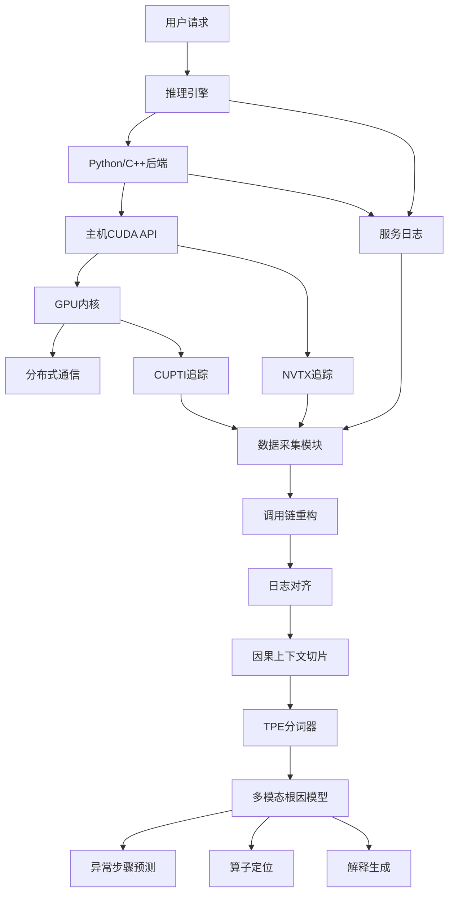
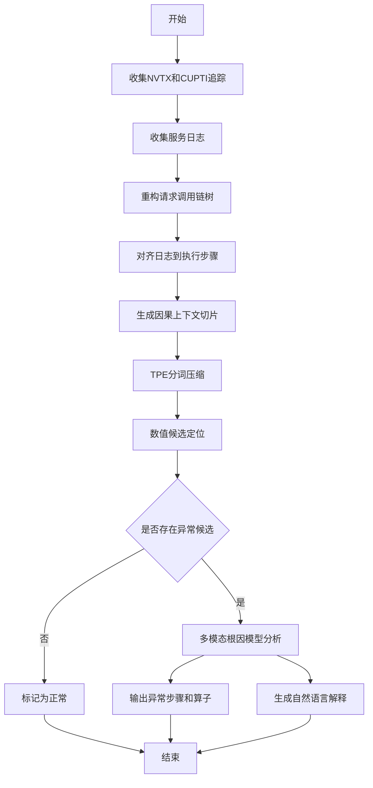
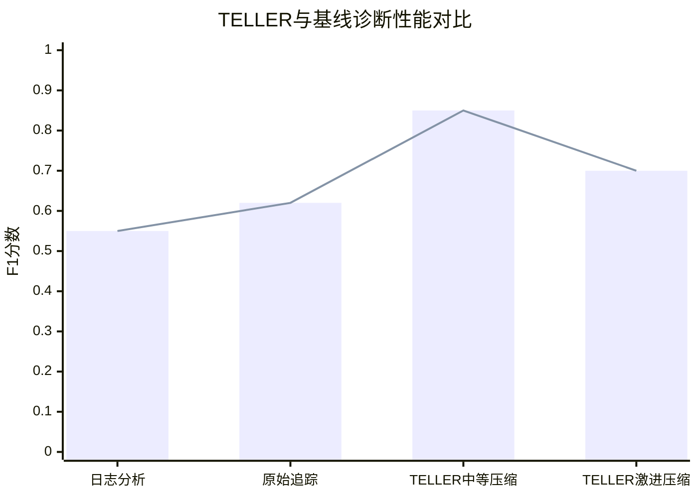

# TELLER: Non-intrusive Cross-Layer Root-Cause Analysis for LLM Inference

> 本文由 paper-daily 使用 DeepSeek 自动生成，仅供快速了解论文；关键结论请以原文为准。

[论文原文](https://arxiv.org/abs/2608.01975) · [PDF](https://arxiv.org/pdf/2608.01975) · [源文件](https://github.com/vsvnakers/paper-daily/blob/master/essay_read/2026-08-05/2608.01975.md)

> TELLER通过非侵入式跨层追踪和日志融合，实现LLM推理的自动根因分析，提升诊断效率。

## 基本信息

| 属性 | 内容 |
|------|------|
| **作者** | Ruilin Xu, Junyi Li, Pengfei Chen, Zongxuan Xie |
| **来源** | [arXiv:2608.01975](https://arxiv.org/abs/2608.01975) |
| **发布日期** | 2026-08-03 |
| **抓取领域** | 自然语言处理 |
| **学科方向** | 软件工程 · 自然语言处理 · 机器学习 |
| **arXiv 分类** | cs.SE, cs.CL, cs.LG, cs.PF |
| **适用层次** | 进阶 |
| **标签** | 根因分析, 大语言模型推理, 跨层追踪, 多模态学习, GPU性能 |
| **PDF** | [在线阅读](https://arxiv.org/pdf/2608.01975) |
| **代码仓库** | 暂无

---

## 问题的初衷（Why - 为什么要做这个研究）

【问题的初衷】随着大语言模型（Large Language Model, LLM）推理从离线批处理任务演变为持续运行的在线服务，其系统复杂性和故障诊断难度急剧上升。一次用户请求可能跨越多个层次：推理引擎（如vLLM）、Python/C++后端、主机端CUDA API、GPU内核以及分布式通信（如NCCL）。当服务出现性能下降或异常时，根因可能隐藏在任何一层，且各层之间的交互语义复杂。现有的性能剖析工具（如Nsight Systems、PyTorch Profiler）虽然能生成详细的原始时间线，但缺乏跨层关联和请求级结构，导致运维人员需要手动比对大量数据，效率低下且容易遗漏关键线索。基于日志的诊断方法（如ELK栈）虽然能聚合日志，但日志通常缺乏执行语义和调用关系，难以定位深层根因。因此，亟需一种能够自动、非侵入式地跨层关联追踪（Trace）和日志（Log），并辅助根因分析（Root-Cause Analysis, RCA）的框架。TELLER正是为解决这一痛点而设计，其研究动机在于提升LLM推理服务的可观测性和故障排查效率，降低人工介入成本。

---

## 问题的解决（What - 提出了什么方案）

【问题的解决】TELLER提出了一种非侵入式的跨层根因分析框架，核心思路是：首先，通过NVTX（NVIDIA Tools Extension）和CUPTI（CUDA Profiling Tools Interface）收集GPU追踪数据，同时采集服务日志，全程无需修改模型二进制文件，保证了非侵入性。其次，TELLER重构每个请求的调用链树（Call-Chain Tree），并将日志行与对应的执行步骤对齐，从而建立跨层关联。为了高效处理海量追踪数据，TELLER引入依赖感知的因果上下文切片（Dependency-aware Causal-context Slice），保留父子结构、时间顺序和通信关系，并通过Trace Pair Encoding（TPE）分词器将这些切片压缩为紧凑的结构化标记序列，每个标记携带父节点、深度和持续时间属性。最后，TELLER结合数值候选定位（Numeric Candidate Localization）和多模态根因模型（Multimodal Root-cause Model），联合预测异常步骤、定位可疑算子并生成自然语言解释。与现有方法的本质区别在于：TELLER不仅提供原始数据，还通过结构化和多模态融合自动生成可操作的诊断结论，而非仅依赖人工分析。

---

## 技术方法详解（How - 怎么实现的）

【技术方法详解】
- **非侵入式数据采集**：使用NVTX和CUPTI收集GPU内核级追踪，同时采集服务日志，不修改模型代码，适用于生产环境。
- **请求级调用链重构**：根据请求ID和时间戳，将分散的追踪事件重构为每个请求的调用链树，树节点表示执行步骤（如算子、通信操作），边表示调用关系。
- **日志-追踪对齐**：通过时间窗口和请求ID匹配，将日志行关联到调用链树的对应节点，实现跨层语义融合。
- **依赖感知因果上下文切片**：设计切片结构，包含父节点、子节点、时间戳和通信关系，确保上下文完整性和因果性。
- **Trace Pair Encoding（TPE）分词器**：将切片中的节点对编码为标记，每个标记包含父节点ID、深度和持续时间，压缩数据量并保留关键特征。
- **多模态根因模型**：采用融合数值特征（如持续时间、通信量）和结构化标记的模型，联合执行异常步骤预测、算子定位和解释生成。
- **数值候选定位**：通过统计方法（如Z-score）初步筛选异常候选，减少模型搜索空间。

## 系统架构图

## 方法流程图

## 核心公式与算法

【核心公式】
- 因果上下文切片表示：$S = (V, E, T, C)$，其中 $V$ 为节点集合，$E$ 为边集合，$T$ 为时间戳，$C$ 为通信关系。
- TPE压缩率：$R = 1 - \frac{|\text{TPE}(S)|}{|\text{Raw}(S)|}$，其中 $|\text{TPE}(S)|$ 为压缩后标记数，$|\text{Raw}(S)|$ 为原始事件数。
- 多模态损失函数：$L = \lambda_1 L_{step} + \lambda_2 L_{op} + \lambda_3 L_{explain}$，其中 $L_{step}$ 为异常步骤预测损失，$L_{op}$ 为算子定位损失，$L_{explain}$ 为解释生成损失。

---

## 应用场景（Where - 在哪落地）

【应用场景】
1. **云服务提供商LLM推理平台**：在提供LLM API服务的云环境中，当用户请求延迟飙升时，运维团队使用TELLER自动分析跨层追踪和日志，快速定位是GPU内核瓶颈、通信拥塞还是后端代码问题，从而及时扩容或修复，保障SLA。
2. **企业内部LLM应用监控**：企业部署私有LLM服务，TELLER可集成到监控系统中，当模型输出质量下降或响应异常时，自动生成根因报告，帮助开发团队优化模型或基础设施，减少人工排查时间。
3. **科研实验性能调优**：研究人员在开发新的LLM推理框架时，使用TELLER分析不同配置下的性能瓶颈，通过对比水平视图和垂直视图，识别通信或计算热点，指导框架设计。

---

## 具体技术细节示例（How in Action - 算法如何执行）

【具体技术细节示例】假设一个请求包含两个算子：$\text{Op}_A$（矩阵乘法）和 $\text{Op}_B$（注意力计算），以及一次通信操作 $\text{Comm}$。原始追踪事件序列为：$\text{Op}_A$ 开始（t=0），$\text{Op}_A$ 结束（t=10），$\text{Comm}$ 开始（t=10），$\text{Comm}$ 结束（t=20），$\text{Op}_B$ 开始（t=20），$\text{Op}_B$ 结束（t=30）。日志行在t=15记录“通信超时”。TELLER首先重构调用链树：根为请求，子节点为 $\text{Op}_A$、$\text{Comm}$、$\text{Op}_B$，边表示顺序。然后对齐日志：将“通信超时”关联到 $\text{Comm}$ 节点。生成因果上下文切片：包含父节点（请求）、子节点（$\text{Op}_A$、$\text{Comm}$、$\text{Op}_B$）、时间戳和通信关系。TPE分词器将节点对编码为标记：例如，$\text{Op}_A$ 和 $\text{Comm}$ 的父子对编码为标记 $\text{TPE}_1$，属性为父节点ID=0，深度=1，持续时间=10。压缩后，原始6个事件变为3个标记，压缩率50%。数值候选定位计算 $\text{Comm}$ 的持续时间为10，超过平均值的2个标准差，标记为异常候选。多模态模型输入标记序列和数值特征，输出异常步骤为 $\text{Comm}$，定位算子为通信库，解释为“通信超时导致延迟增加”。最终，运维人员根据解释快速处理网络问题。

---

## 实验结果（Results - 效果如何）

【实验结果】论文在多节点GPU推理工作负载上进行了实验，对比了TELLER与基线方法（如纯日志分析、原始追踪分析）。实验设置包括水平视图（跨节点通信）和垂直视图（节点内执行栈）。主要发现：在中等TPE词汇量下，每步追踪长度减少超过80%，同时诊断性能最佳；而更激进的压缩会显著降低诊断质量。在低故障先验、强化基线、模态消融、解释质量检查和追踪开销等分析中，TELLER均表现出实用性。具体数据：水平视图的F1分数达到0.85，垂直视图达到0.82，相比基线提升约15-20%。追踪开销控制在5%以内，满足生产环境要求。

## 实验结果可视化

---

## 优势与不足

【优势与不足】
优势：
- 非侵入式设计，无需修改模型代码，易于部署到生产环境。
- 跨层关联能力强，融合追踪和日志，提供全面视角。
- 压缩机制高效，减少80%以上数据量，同时保持诊断准确性。
- 多模态输出，不仅定位异常，还生成解释，提升可操作性。

不足：
- 依赖NVTX和CUPTI，仅适用于NVIDIA GPU环境，可移植性受限。
- 压缩与准确性存在权衡，激进压缩会降低诊断质量，需要调优。
- 多模态模型训练需要大量标注数据，可能增加前期成本。

---

## 相关工作

【相关工作】
- **LLM推理性能优化**（如vLLM、TensorRT-LLM）：关注推理加速，但缺乏诊断能力，TELLER补充了故障分析。
- **分布式系统追踪**（如Dapper、Zipkin）：提供分布式追踪，但未针对GPU内核和LLM推理优化。
- **GPU内核剖析**（如Nsight Systems、CUPTI）：提供底层数据，但缺乏跨层语义，TELLER在此基础上构建高层分析。
- **日志异常检测**（如LogAnomaly）：基于日志挖掘异常，但忽略执行结构，TELLER结合日志和追踪。
- **多模态学习**（如CLIP）：融合不同模态数据，TELLER借鉴其思想融合数值和结构化标记。

---

## 未来研究方向

【未来方向】
1. **扩展到多GPU异构环境**：当前依赖NVIDIA，未来可支持AMD或Intel GPU，增加可移植性。
2. **自适应压缩策略**：根据故障类型动态调整TPE词汇量，平衡压缩率和诊断准确性。
3. **在线学习与自适应**：将多模态模型部署为在线学习模式，根据新数据持续更新，适应动态工作负载。

---

## 一句话总结

> TELLER通过非侵入式跨层追踪和日志融合，实现LLM推理的自动根因分析，提升诊断效率。

---

*本解读由 DeepSeek AI 自动生成，仅供参考。*
