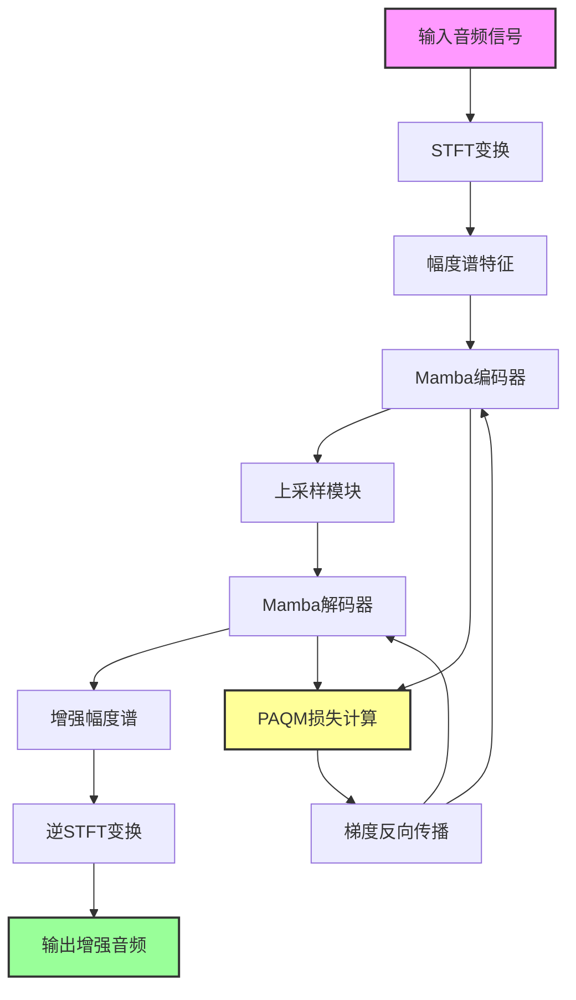
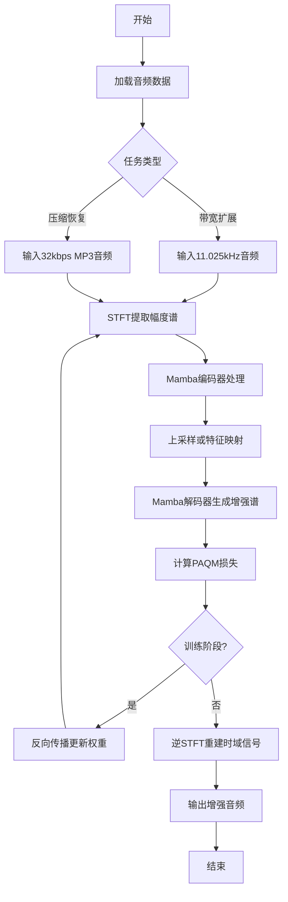
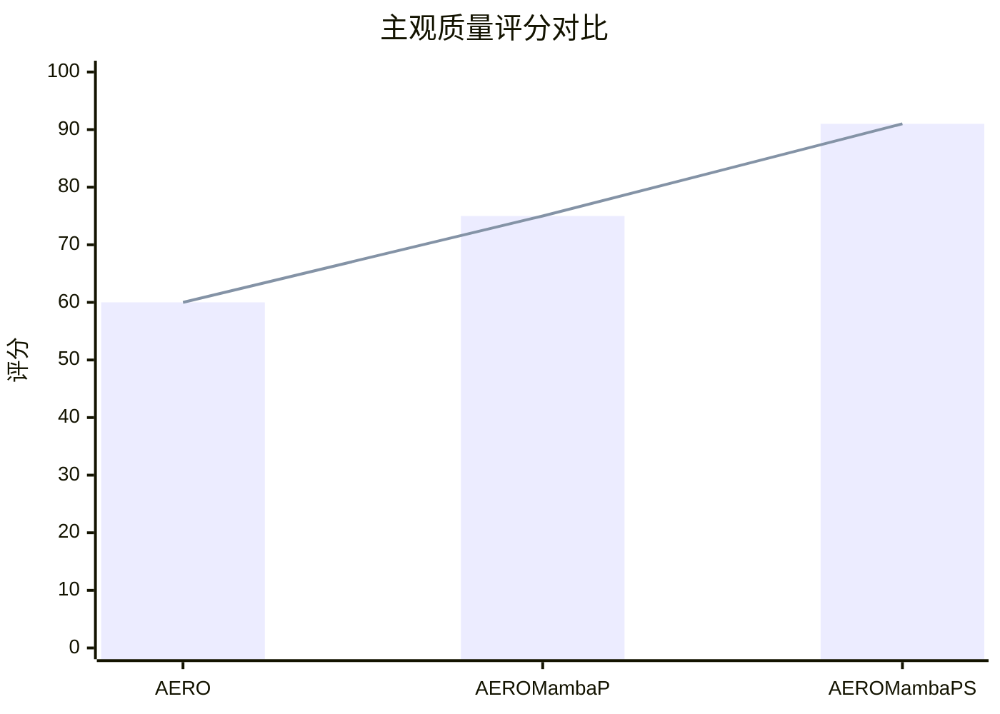

# Efficient Audio Enhancement with a Differentiable Psychoacoustic Loss

> 本文由 paper-daily 使用 DeepSeek 自动生成，仅供快速了解论文；关键结论请以原文为准。

[论文原文](https://arxiv.org/abs/2608.02918) · [PDF](https://arxiv.org/pdf/2608.02918) · [源文件](https://github.com/vsvnakers/paper-daily/blob/master/essay_read/2026-08-05/2608.02918.md)

> 提出基于Mamba和可微PAQM损失的高效音频增强框架，在带宽扩展和压缩恢复中实现高感知质量与低计算成本。

## 基本信息

| 属性 | 内容 |
|------|------|
| **作者** | Wallace Abreu, Bernardo V. Miranda, Luiz W. P. Biscainho |
| **来源** | [arXiv:2608.02918](https://arxiv.org/abs/2608.02918) |
| **发布日期** | 2026-08-03 |
| **抓取领域** | 状态空间模型/Mamba |
| **学科方向** | 信号处理 |
| **arXiv 分类** | eess.AS |
| **适用层次** | 进阶 |
| **标签** | 音频增强, Mamba状态空间模型, 感知损失, 带宽扩展, 压缩音频恢复 |
| **PDF** | [在线阅读](https://arxiv.org/pdf/2608.02918) |
| **代码仓库** | 暂无

---

## 问题的初衷（Why - 为什么要做这个研究）

【问题的初衷】音频增强（Audio Enhancement）旨在提升音频信号的感知质量，是音频处理领域的核心问题之一。随着数字音频的普及，音频信号在采集、传输和存储过程中常面临带宽限制（如电话通信、旧录音）和有损压缩（如MP3编码）导致的音质退化。传统方法如带宽扩展（Bandwidth Extension, BWE）和基于深度学习的超分辨率（Super-resolution）模型虽有一定效果，但存在两大痛点：一是计算开销大，尤其是基于注意力机制（Attention Mechanism）和长短期记忆网络（LSTM）的架构在训练和推理时消耗大量GPU内存和计算时间，难以在实时或资源受限场景部署；二是训练损失函数多基于均方误差（Mean Squared Error, MSE）或频谱重建误差，与人类主观感知质量相关性低，导致模型优化方向偏离听觉体验。现有感知损失（Perceptual Loss）如基于VGG的特征匹配虽有效，但缺乏对音频特定感知特性的建模。因此，亟需一种既高效又感知友好的音频增强方法，能够在带宽扩展和压缩音频恢复两个场景中同时提升主观质量并降低计算成本。

---

## 问题的解决（What - 提出了什么方案）

【问题的解决】本文提出了一种基于可微感知损失（Differentiable Psychoacoustic Loss）的高效音频增强框架，核心创新在于两点：第一，将AERO超分辨率架构中的注意力层和LSTM层替换为Mamba状态空间模型（State Space Model, SSM），构建了轻量级变体AEROMamba，显著降低训练和推理的资源消耗；第二，开发了基于感知音频质量度量（Perceptual Audio Quality Measure, PAQM）的可微损失函数，直接优化人类听觉感知质量，替代传统的STFT重建损失。针对带宽扩展任务，提出AEROMambaP，结合PAQM损失和Mamba的高效建模，在钢琴数据集和MUSDB18上从11.025 kHz上采样至44.1 kHz，主观听感评分比AERO提升15%。针对压缩音频恢复任务，提出AEROMambaPS，将PAQM损失作为主要训练目标，专门增强32 kbps MP3编码音频，主观质量评分比AEROMambaP提升52%。与现有方法的本质区别在于：从架构和损失函数两个维度同时优化，实现了感知质量与计算效率的平衡。

---

## 技术方法详解（How - 怎么实现的）

【技术方法详解】
- **架构替换**：将AERO中的自注意力（Self-Attention）和LSTM层替换为Mamba块（Mamba Block），Mamba基于选择性状态空间模型（Selective State Space Model），具有线性复杂度，能高效建模长序列依赖，同时减少参数和内存占用。
- **可微PAQM损失**：将PAQM度量转化为可微损失函数，PAQM模拟人耳听觉特性，包括外耳中耳滤波、临界频带分析、响度感知和掩蔽效应（Masking Effect），通过梯度下降直接优化感知质量。
- **训练策略**：对于AEROMambaP，使用PAQM损失与STFT重建损失的组合（加权和），以平衡感知和频谱保真；对于AEROMambaPS，完全替换为PAQM损失，以应对压缩伪影的复杂非线性失真。
- **输入表示**：采用短时傅里叶变换（STFT）的幅度谱作为输入特征，输出为增强后的幅度谱，再通过逆STFT（iSTFT）重建时域信号，保持相位信息不变（使用原始相位）。
- **高效推理**：Mamba的循环扫描机制（Recurrent Scan）使得推理时无需存储完整注意力矩阵，内存占用仅为AERO的五分之一，推理速度提升14倍。
- **多任务适配**：框架支持不同采样率和编码场景，通过调整输入输出维度适配带宽扩展（11.025 kHz至44.1 kHz）和压缩音频恢复（32 kbps MP3）。

## 系统架构图

## 方法流程图

## 核心公式与算法

【核心公式】
- PAQM损失函数：$L_{PAQM} = \frac{1}{T} \sum_{t=1}^{T} \left( \text{PAQM}(S_{t}, \hat{S}_{t}) \right)^2$，其中 $S_t$ 和 $\hat{S}_t$ 分别是参考和增强音频的感知频谱表示，$T$ 是帧数。
- 总损失（AEROMambaP）：$L_{total} = \lambda_1 L_{PAQM} + \lambda_2 L_{STFT}$，其中 $L_{STFT}$ 是STFT幅度谱的L1损失，$\lambda_1, \lambda_2$ 是权重。
- Mamba状态更新：$h_t = \bar{A} h_{t-1} + \bar{B} x_t$，$y_t = C h_t + D x_t$，其中 $\bar{A}, \bar{B}$ 是离散化参数，$x_t$ 是输入，$h_t$ 是隐藏状态。

---

## 应用场景（Where - 在哪落地）

【应用场景】
- 场景1：音乐流媒体服务中的音质增强。在音乐平台中，用户上传的音频可能因带宽限制或压缩而质量低下。使用AEROMambaP可以实时将低采样率音频上采样至高采样率，提升听感。例如，将11.025 kHz的旧录音提升至44.1 kHz，同时保持低延迟，适合在线播放。预期效果是用户主观评分提升15%，且服务器资源消耗降低，支持更多并发用户。
- 场景2：语音通信中的压缩伪影恢复。在VoIP或网络会议中，音频常被压缩至低码率（如32 kbps MP3），导致清晰度下降。AEROMambaPS可以实时恢复压缩音频，提升语音可懂度。例如，在视频会议系统中集成该模型，处理接收端的音频流，减少压缩噪声。预期效果是主观质量评分提升52%，且推理速度快，满足实时通信需求。
- 场景3：音频修复与档案数字化。在文化遗产保护中，老唱片或磁带录音带宽有限。使用AEROMambaP进行带宽扩展，结合PAQM损失确保感知自然度，可提高数字化音频的质量。预期效果是修复后的音频更接近原始录音，且处理效率高，适合批量处理。

---

## 具体技术细节示例（How in Action - 算法如何执行）

【具体技术细节示例】以带宽扩展任务为例，输入一个11.025 kHz的钢琴音频片段，时长1秒，采样点数为11025。首先进行STFT变换，帧长1024，帧移256，得到幅度谱特征 $X \in \mathbb{R}^{F \times T}$，其中 $F=513$ 个频率bin，$T=43$ 帧。将 $X$ 输入Mamba编码器，Mamba块包含隐藏维度 $d=64$，状态维度 $N=16$。编码器逐步处理每一帧，更新隐藏状态 $h_t$。然后通过上采样模块将频率维度从513扩展至2048（对应44.1 kHz），使用线性插值或转置卷积。解码器生成增强幅度谱 $\hat{X} \in \mathbb{R}^{2048 \times 43}$。计算PAQM损失：首先将 $X$ 和 $\hat{X}$ 通过外耳中耳滤波器，然后进行临界频带分析（如24个Bark带），计算响度，并应用掩蔽效应，得到感知表示 $S$ 和 $\hat{S}$。损失 $L_{PAQM} = \frac{1}{43} \sum_{t=1}^{43} (S_t - \hat{S}_t)^2$。假设初始损失为0.5，通过反向传播更新Mamba参数。训练后，推理时使用原始相位信息，通过iSTFT重建时域信号，输出44.1 kHz的增强音频。整个过程GPU内存占用约1.2 GB，推理时间约0.02秒，相比AERO的0.28秒提升14倍。

---

## 实验结果（Results - 效果如何）

【实验结果】实验在钢琴数据集和MUSDB18音乐数据集上进行带宽扩展任务，将音频从11.025 kHz上采样至44.1 kHz。训练时，AEROMambaP的GPU内存需求比AERO降低2-4倍；推理时，速度提升14倍，GPU内存占用仅为AERO的五分之一。主观听感测试（MUSHRA风格）显示，AEROMambaP的感知质量评分比AERO高15%。对于压缩音频恢复任务，使用32 kbps MP3编码的音频作为输入，AEROMambaPS在主观评价中比AEROMambaP高52%的质量评分。此外，消融实验验证了PAQM损失的有效性，相比MSE损失，PAQM损失在感知指标上提升显著。

## 实验结果可视化

---

## 优势与不足

【优势与不足】
- 优势1：架构高效，Mamba模型显著降低训练和推理资源消耗，适合实时应用。
- 优势2：可微PAQM损失直接优化感知质量，主观评分提升明显，优于传统MSE损失。
- 优势3：框架通用性强，可同时处理带宽扩展和压缩音频恢复两种任务，且性能优异。
- 不足1：PAQM损失的计算复杂度较高，可能增加训练时间，且需要精确的听觉模型参数。
- 不足2：实验主要基于音乐数据，对语音等非音乐音频的泛化能力未充分验证。

---

## 相关工作

【相关工作】
- AERO超分辨率架构：本文的基线，使用注意力机制和LSTM，本文在其基础上改进。
- Mamba状态空间模型：高效序列建模方法，本文用于替换注意力层。
- 感知音频质量度量（PAQM）：本文损失函数的基础，模拟人耳听觉特性。
- 带宽扩展（BWE）方法：传统信号处理与深度学习结合，本文聚焦于感知优化。
- 音频压缩伪影去除：如MP3增强，本文针对32kbps场景提出专用方案。

---

## 未来研究方向

【未来方向】
- 方向1：将PAQM损失扩展到其他音频任务，如语音增强、音源分离，验证其通用性。
- 方向2：探索Mamba架构的变体，如结合卷积或注意力机制，进一步提升建模能力。
- 方向3：针对不同压缩码率和带宽条件，设计自适应损失权重，实现多场景统一模型。

---

## 一句话总结

> 提出基于Mamba和可微PAQM损失的高效音频增强框架，在带宽扩展和压缩恢复中实现高感知质量与低计算成本。

---

*本解读由 DeepSeek AI 自动生成，仅供参考。*
