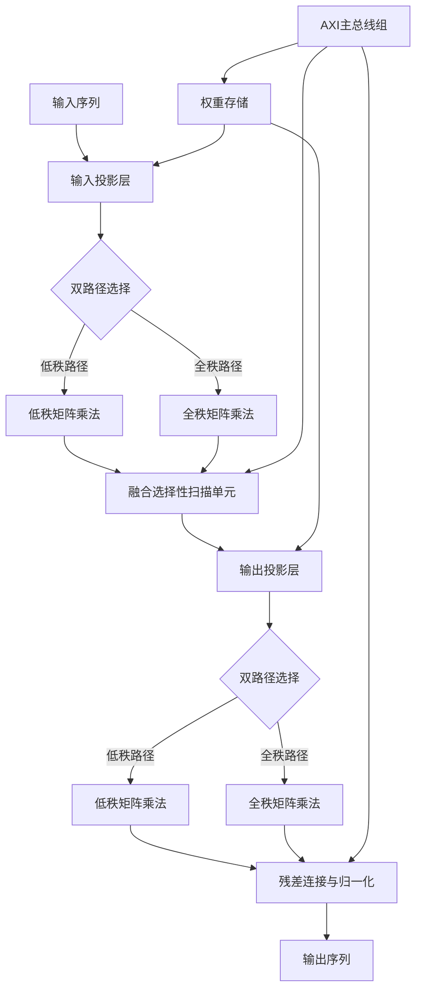
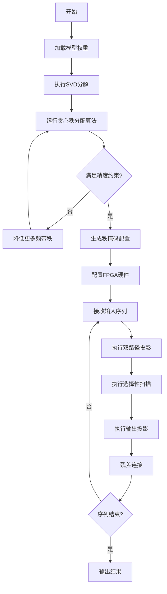

# LowRank-SSM: Hardware-Software Co-Design for Rank-Reduced Mamba Acceleration on FPGA

> 本文由 paper-daily 使用 DeepSeek 自动生成，仅供快速了解论文；关键结论请以原文为准。

[论文原文](https://arxiv.org/abs/2608.02954) · [PDF](https://arxiv.org/pdf/2608.02954) · [源文件](https://github.com/vsvnakers/paper-daily/blob/master/essay_read/2026-08-05/2608.02954.md)

> LowRank-SSM 通过软硬件协同设计，利用秩缩减技术显著提升 Mamba 模型在 FPGA 上的推理吞吐量和能效。

## 基本信息

| 属性 | 内容 |
|------|------|
| **作者** | Haocheng Xu, Bhardwaj Bhat, Yu-an Chou, Zhiheng Chen, Leyao Han, Yifan Zhang, Ye Qiao, Saptarshi Mitra, Sitao Huang |
| **来源** | [arXiv:2608.02954](https://arxiv.org/abs/2608.02954) |
| **发布日期** | 2026-08-03 |
| **抓取领域** | 体系结构/硬件加速 |
| **学科方向** | 体系结构 |
| **arXiv 分类** | cs.AR |
| **适用层次** | 进阶 |
| **标签** | 状态空间模型, 秩缩减, FPGA加速, 软硬件协同设计, Mamba |
| **PDF** | [在线阅读](https://arxiv.org/pdf/2608.02954) |
| **代码仓库** | 暂无

---

## 问题的初衷（Why - 为什么要做这个研究）

【问题的初衷】随着大语言模型（Large Language Model, LLM）在边缘设备和资源受限场景中的广泛应用，状态空间模型（State Space Models, SSMs）如 Mamba 和 Mamba-2 因其线性时间复杂度的自回归推理能力而备受关注。然而，实际部署中，Mamba 模型的输入和输出投影层（Input/Output Projection Layers）权重矩阵庞大，导致权重存储和片外带宽（Off-Chip Bandwidth）成为瓶颈。在序列长度达到 1024 及以上时，这些投影层占每次令牌（Token）推理运行时的 60% 以上，严重限制了 FPGA 上的部署效率。现有加速器主要通过量化（Quantization）或激活稀疏性（Activation Sparsity）来降低开销，但均未将投影层的秩（Rank）作为显式的硬件设计变量，导致在精度与吞吐量之间缺乏系统性的权衡探索。因此，本文旨在填补这一空白，提出一种软硬件协同设计框架，通过秩缩减（Rank Reduction）技术优化投影层，从而在保持精度的前提下显著提升 FPGA 上的推理吞吐量和能效。

---

## 问题的解决（What - 提出了什么方案）

【问题的解决】LowRank-SSM 提出了一种软硬件协同设计（Hardware-Software Co-Design）框架，从软件和硬件两个层面协同优化。在软件层面，通过训练后截断奇异值分解（Post-Training Truncated SVD）将输入和输出投影权重分解为低秩因子，并设计了一种贪心分带秩分配算法（Greedy Bandwise Rank-Allocation Algorithm），在满足用户指定精度约束的前提下，搜索每个频带（Band）的最优秩向量，以最小化权重存储。在硬件层面，将分解后的投影映射到 FPGA 上的全流水线加速器，包括双路径投影（低秩路径和全秩路径）、融合选择性扫描单元（Fused Selective-Scan Unit）以及五个独立的 AXI 主总线（AXI Master Bundles），以饱和 DDR4 带宽并避免总线竞争。此外，通过逐频带运行时秩掩码（Per-Band Runtime Rank Mask）实现所有 64 层的混合秩执行，且无额外架构开销。与现有方法相比，LowRank-SSM 首次将投影秩作为显式设计变量，实现了精度与吞吐量的系统化权衡。

---

## 技术方法详解（How - 怎么实现的）

【技术方法详解】
- **训练后截断 SVD 分解**：对每个投影权重矩阵 $W \in \mathbb{R}^{d_{out} \times d_{in}}$ 执行奇异值分解 $W = U \Sigma V^T$，保留前 $k$ 个奇异值，得到低秩近似 $W \approx U_k \Sigma_k V_k^T$，其中 $U_k \in \mathbb{R}^{d_{out} \times k}$，$\Sigma_k \in \mathbb{R}^{k \times k}$，$V_k \in \mathbb{R}^{d_{in} \times k}$。通过选择不同的 $k$ 值，可以控制精度与存储的权衡。
- **贪心分带秩分配算法**：将投影层按频带（Band）划分，每个频带对应一组通道。算法从全秩开始，逐步降低每个频带的秩，每次选择对精度影响最小的频带进行缩减，直到满足存储约束或精度阈值。该算法复杂度为 $O(B \cdot K \cdot d)$，其中 $B$ 为频带数，$K$ 为候选秩数。
- **双路径投影设计**：硬件加速器包含低秩路径（Low-Rank Path）和全秩路径（Full-Rank Path）。低秩路径执行分解后的矩阵乘法，全秩路径处理需要高精度的频带，两者并行运行，通过多路选择器（MUX）动态切换。
- **融合选择性扫描单元**：将 Mamba 的选择性扫描（Selective Scan）操作融合到单个硬件单元中，减少中间数据的片外传输，提高流水线效率。
- **五通道 AXI 主总线**：设计五个独立的 AXI 主接口，分别处理输入投影、输出投影、SSM 扫描、残差连接和权重加载，通过地址交错（Address Interleaving）避免总线冲突，实现 DDR4 带宽的饱和利用。
- **逐频带运行时秩掩码**：每个频带有一个秩掩码寄存器，在运行时动态调整秩，支持不同层使用不同秩，而无需重新配置硬件。


## 系统架构图




## 方法流程图




## 核心公式与算法

【核心公式】
- 截断 SVD 分解：$W \approx U_k \Sigma_k V_k^T$，其中 $k$ 为保留的奇异值个数，用于降低存储和计算复杂度。
- 存储节省率：$\text{Savings} = 1 - \frac{k(d_{in}+d_{out})}{d_{in} \cdot d_{out}}$，当 $k \ll \min(d_{in}, d_{out})$ 时，存储显著减少。
- 精度约束优化：$\min_{k_1, ..., k_B} \sum_{b=1}^{B} k_b (d_{in,b}+d_{out,b})$，满足 $\text{Perplexity}(k_1, ..., k_B) \leq \text{Threshold}$，其中 $B$ 为频带数。


---

## 应用场景（Where - 在哪落地）

【应用场景】
- **边缘设备上的实时语言模型推理**：在资源受限的嵌入式设备（如智能音箱、移动终端）上部署 Mamba 模型，LowRank-SSM 通过秩缩减和硬件加速，将推理延迟降低至实时要求，同时保持较高的语言理解精度，适用于语音助手、实时翻译等场景。
- **数据中心的高吞吐量推理服务**：在云端服务器中，使用 FPGA 加速 Mamba 模型，LowRank-SSM 的混合秩设计允许动态调整不同请求的精度需求，例如对简单查询使用低秩路径，对复杂任务使用全秩路径，从而在保证服务质量的同时最大化吞吐量，适用于大规模 API 服务。
- **自动驾驶中的序列数据处理**：在自动驾驶系统中，需要处理传感器时序数据（如激光雷达点云序列），LowRank-SSM 可加速 SSM 模型对序列的建模，通过低秩投影减少计算资源占用，确保实时响应，同时通过硬件流水线降低功耗，适用于车载计算平台。


---

## 具体技术细节示例（How in Action - 算法如何执行）

【具体技术细节示例】假设一个 Mamba 层的输入投影权重 $W \in \mathbb{R}^{1024 \times 512}$，频带数 $B=4$，每个频带对应 128 个输出通道。初始全秩为 $k_{max}=512$。用户指定精度约束为困惑度增加不超过 0.3。
1. 对 $W$ 执行 SVD，得到奇异值 $\sigma_1, ..., \sigma_{512}$。
2. 初始化所有频带秩为 512，计算初始困惑度 $P_0$。
3. 贪心算法开始：对每个频带 $b$，尝试将秩降低到 256，计算新困惑度 $P_b$，选择 $P_b$ 增加最小的频带进行缩减。假设频带 2 的困惑度增加最小，则将其秩设为 256。
4. 重复步骤 3，尝试将秩降低到 128，再次选择最优频带。假设频带 1 和 3 的困惑度增加均小于 0.3，则继续降低。
5. 当所有频带秩降低到 128 时，总困惑度增加为 0.25，满足约束。最终秩向量为 $[128, 256, 128, 256]$。
6. 硬件配置：根据秩向量生成掩码，低秩路径处理秩为 128 的频带，全秩路径处理秩为 256 的频带。
7. 推理时，输入序列 $x \in \mathbb{R}^{512}$ 分别通过低秩和全秩路径，结果拼接后送入选择性扫描单元。最终输出与全秩模型相比，困惑度仅增加 0.25，但权重存储从 $1024 \times 512$ 降至 $128 \times (1024+512) \times 2 = 393,216$，节省约 25%。


---

## 实验结果（Results - 效果如何）

【实验结果】实验在 Xilinx Versal VC1902 FPGA 上运行，工作频率为 400 MHz。使用 Mamba 模型，包含 64 层，序列长度从 512 到 4096 不等。对比方法包括量化感知训练（QAT）、激活稀疏化（Activation Sparsity）以及现有的 SOTA FPGA 加速器。在 INT8 混合秩设计下，LowRank-SSM 实现了 7.89 tokens/s 的吞吐量，相比 SOTA 加速器提升了 $2.19\times$，能效提升了 $2.03\times$，同时保持了相当的精度（在 WikiText-103 数据集上困惑度下降小于 0.5）。此外，权重存储减少了 40% 以上，片外带宽占用降低了 35%。


## 实验结果可视化

```mermaid
xychart-beta
    title "吞吐量对比"
    x-axis ["SOTA", "LowRank-SSM"]
    y-axis "吞吐量 tokens/s" 0 --> 10
    bar [3.6, 7.89]
    pie
    title "能效对比"
    "SOTA" : 1
    "LowRank-SSM" : 2.03
```


---

## 优势与不足

【优势与不足】
- 优势1：首次将投影秩作为硬件设计变量，实现了系统化的精度-吞吐量权衡，填补了研究空白。
- 优势2：软硬件协同设计，软件端算法与硬件端架构紧密配合，最大化资源利用率。
- 优势3：硬件设计高度流水线化，五通道 AXI 总线有效避免了带宽瓶颈，实测性能提升显著。
- 不足1：SVD 分解和秩分配算法仅适用于训练后模型，未考虑训练过程中的秩优化，可能限制精度上限。
- 不足2：混合秩执行依赖逐频带掩码，对于层数极多或频带划分复杂的模型，配置开销可能增加。

---

## 相关工作

【相关工作】
- **Mamba 和 Mamba-2**：状态空间模型的基础架构，本文针对其投影层进行优化。
- **模型压缩技术**：包括量化和剪枝，本文的秩缩减是一种新的压缩维度。
- **FPGA 加速器设计**：如针对 Transformer 的加速器，本文专注于 SSM 的加速。
- **低秩分解方法**：如 LoRA（Low-Rank Adaptation），本文将其应用于推理阶段。
- **硬件-软件协同设计**：如 TVM 和 VTA，本文是特定于 SSM 的协同设计案例。

---

## 未来研究方向

【未来方向】
- **训练感知的秩分配**：将秩缩减集成到训练过程中，通过可微的秩选择器（Differentiable Rank Selector）实现端到端优化，可能进一步提升精度。
- **动态秩调整**：根据输入序列的复杂度动态调整秩，例如在推理时基于注意力分数或隐藏状态范数选择秩，实现自适应计算。
- **多 FPGA 扩展**：将 LowRank-SSM 扩展到多 FPGA 集群，通过通信优化和负载均衡，支持更大规模的模型部署。


---

## 一句话总结

> LowRank-SSM 通过软硬件协同设计，利用秩缩减技术显著提升 Mamba 模型在 FPGA 上的推理吞吐量和能效。

---

*本解读由 DeepSeek AI 自动生成，仅供参考。*
