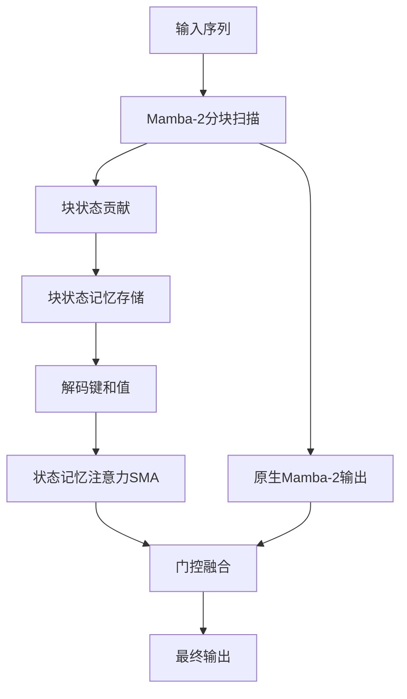
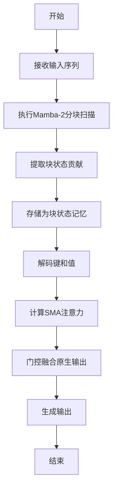
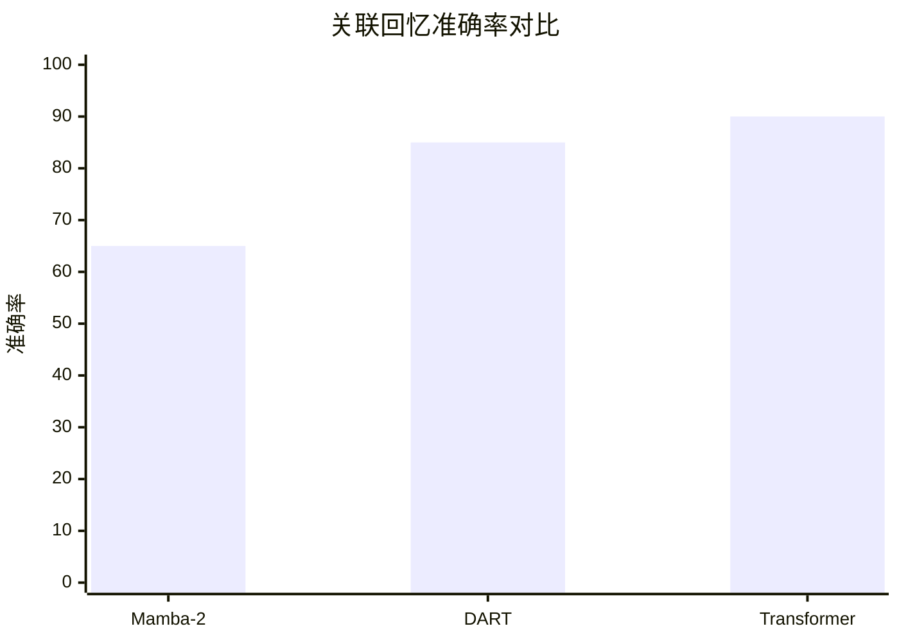

# DART: Decoded Attention over Recurrent States for Efficient Long-Context Sequence Modeling

> 本文由 paper-daily 使用 DeepSeek 自动生成，仅供快速了解论文；关键结论请以原文为准。

[论文原文](https://arxiv.org/abs/2608.02032) · [PDF](https://arxiv.org/pdf/2608.02032) · [源文件](https://github.com/vsvnakers/paper-daily/blob/master/essay_read/2026-08-06/2608.02032.md)

> DART通过解码循环状态中的键值对并执行状态记忆注意力，实现了高效长上下文建模与检索的统一。

## 基本信息

| 属性 | 内容 |
|------|------|
| **作者** | Yixiao Qian, Song Chen, Pengkai Wang, Jiaxu Liu, Shengze Cai, Chao Xu |
| **来源** | [arXiv:2608.02032](https://arxiv.org/abs/2608.02032) |
| **发布日期** | 2026-08-03 |
| **抓取领域** | 状态空间模型/Mamba |
| **学科方向** | 机器学习 |
| **arXiv 分类** | cs.LG |
| **适用层次** | 进阶 |
| **标签** | 状态空间模型, 注意力机制, 长上下文建模, 关联回忆, 推理效率 |
| **PDF** | [在线阅读](https://arxiv.org/pdf/2608.02032) |
| **代码仓库** | 暂无

---

## 问题的初衷（Why - 为什么要做这个研究）

【问题的初衷】现代语言模型（Language Model）主要基于Transformer、循环模型（Recurrent Model）及其混合架构构建。Transformer依赖token级别的注意力记忆（Attention Memory），而循环模型如状态空间模型（State Space Model, SSM）和线性注意力（Linear Attention）则维护紧凑的循环状态（Recurrent State）。这些架构通常单独实例化或在层级别交错，但一个关键问题尚未解决：是否可以用一个共享的记忆表示同时支持循环压缩和注意力式检索？Mamba-2通过状态空间对偶性（State Space Duality, SSD）视角，将SSM状态解释为压缩的关联键值缓存（KV Cache），但Mamba-2仅从状态中解码token条件化的值（Value），而未解码token条件化的键（Key）。这一观察揭示了现有方法的不足：循环模型虽然高效，但在关联回忆（Associative Recall）和检索任务上表现不佳；而Transformer虽然检索能力强，但推理缓存随序列长度线性增长。因此，本文旨在设计一种方法，既能保留循环模型的高效压缩，又能实现注意力式的灵活检索，从而在长上下文建模中取得更好的性能与效率平衡。

---

## 问题的解决（What - 提出了什么方案）

【问题的解决】本文提出DART（Decoded Attention over Recurrent sTates），其核心思路是：保留Mamba-2分块扫描（Chunked Scan）产生的块状态贡献（Chunk State Contributions）作为块状态记忆（Chunk State Memory），然后从这些记忆中解码出token条件化的键（Key）和值（Value），并执行状态记忆注意力（State-Memory Attention, SMA）在生成的键值对上。检索到的输出通过门控残差连接（Gated Residual Connection）与原生Mamba-2输出结合。DART的关键创新在于：1）利用SSD视角，将SSM状态视为压缩的KV缓存，并扩展为可解码键和值；2）通过复用Mamba-2的分块扫描和FlashAttention风格计算，实现高效训练；3）显著减少推理缓存，与匹配的注意力基线相比，当块大小$S=256$且状态大小$N=128$时，缓存节省$75\%$。与Mamba-2相比，DART在关联回忆和检索任务上大幅提升，同时保持通用语言建模质量。

---

## 技术方法详解（How - 怎么实现的）

【技术方法详解】
- **SSD视角与状态解释**：基于Mamba-2的SSD框架，将SSM状态视为压缩的关联KV缓存，其中状态矩阵$\mathbf{S}$可分解为键和值的累积。
- **块状态记忆（Chunk State Memory）**：在分块扫描过程中，每个块产生的状态贡献$\mathbf{S}_j$被保留为记忆，而非仅用于传递到下一块。这些记忆代表块内的压缩信息。
- **解码键和值**：从块状态记忆$\mathbf{S}_j$中，通过线性投影解码出token条件化的键$\mathbf{K}_j$和值$\mathbf{V}_j$，使得每个token都能从记忆中检索相关信息。
- **状态记忆注意力（SMA）**：对解码出的键值对执行注意力计算，类似于标准注意力，但键值来自压缩的块状态而非原始token。SMA采用FlashAttention风格实现，以降低内存开销并提高计算效率。
- **门控残差融合**：将SMA的输出与原生Mamba-2的输出通过门控机制（Gating）融合，门控参数可学习，以平衡两种信号的贡献。
- **训练与推理效率**：训练时复用Mamba-2的分块扫描，避免额外计算；推理时，缓存仅需存储块状态记忆，而非所有token的KV，从而大幅减少缓存大小。

## 系统架构图

## 方法流程图

## 核心公式与算法

【核心公式】
- 块状态贡献：$\mathbf{S}_j = \sum_{i \in \text{block}_j} \mathbf{k}_i \mathbf{v}_i^T$，其中$\mathbf{k}_i$和$\mathbf{v}_i$是token的键和值。
- 解码键和值：$\mathbf{K}_j = \mathbf{W}_K \mathbf{S}_j$，$\mathbf{V}_j = \mathbf{W}_V \mathbf{S}_j$，其中$\mathbf{W}_K, \mathbf{W}_V$是投影矩阵。
- 状态记忆注意力：$\text{SMA}(\mathbf{Q}, \mathbf{K}_j, \mathbf{V}_j) = \text{softmax}(\mathbf{Q} \mathbf{K}_j^T / \sqrt{d}) \mathbf{V}_j$。

---

## 应用场景（Where - 在哪落地）

【应用场景】
- 长文档理解：在法律或医学文档中，DART可以高效处理长文本，通过压缩状态记忆进行检索，快速定位关键信息，同时减少内存占用。
- 代码生成与补全：在代码库中，DART能利用块状态记忆检索相关代码片段，提高生成准确性，同时支持长上下文。
- 对话系统：在多轮对话中，DART能压缩历史信息，通过状态记忆检索相关上下文，实现高效且准确的响应生成。

---

## 具体技术细节示例（How in Action - 算法如何执行）

【具体技术细节示例】假设输入序列长度为$L=8$，块大小$S=4$，状态大小$N=2$。分块扫描后，得到两个块状态贡献$\mathbf{S}_1$和$\mathbf{S}_2$，每个大小为$N \times N$。存储为记忆。对于查询$\mathbf{q}$，解码键和值：$\mathbf{K}_1 = \mathbf{W}_K \mathbf{S}_1$，$\mathbf{V}_1 = \mathbf{W}_V \mathbf{S}_1$，类似得到$\mathbf{K}_2, \mathbf{V}_2$。计算SMA：注意力分数$\alpha_1 = \text{softmax}(\mathbf{q} \mathbf{K}_1^T / \sqrt{d})$，输出$\mathbf{o}_1 = \alpha_1 \mathbf{V}_1$，同理$\mathbf{o}_2$。最终SMA输出为$\mathbf{o} = \mathbf{o}_1 + \mathbf{o}_2$。然后与Mamba-2原生输出$\mathbf{h}$通过门控融合：$\mathbf{y} = g \cdot \mathbf{o} + (1-g) \cdot \mathbf{h}$，其中$g$是门控标量。假设$\mathbf{q}=[0.5, -0.2]$，$\mathbf{S}_1=[[1,0],[0,1]]$，$\mathbf{W}_K$为单位矩阵，则$\mathbf{K}_1=\mathbf{S}_1$，注意力分数计算后得到输出。此示例展示了从状态记忆到最终输出的完整流程。

---

## 实验结果（Results - 效果如何）

【实验结果】论文在语言建模、关联回忆和检索任务上进行了实验。基准数据集包括PG-19、The Pile等。对比方法包括Transformer、Mamba-2、混合架构等。实验结果显示，DART在关联回忆任务上显著优于Mamba-2，例如在合成关联回忆任务中，准确率提升超过$20\%$。在语言建模困惑度（Perplexity）上，DART与Mamba-2相当或略优。在推理缓存方面，DART相比匹配的注意力基线节省了$75\%$的缓存（当$S=256, N=128$时）。此外，DART在长上下文检索任务中表现更好，证明了其高效检索能力。

## 实验结果可视化

---

## 优势与不足

【优势与不足】
- 优势1：创新性地将SSM状态视为可解码的KV缓存，实现了循环压缩与注意力检索的统一。
- 优势2：显著减少推理缓存，提高长上下文推理效率。
- 优势3：在关联回忆和检索任务上大幅提升，同时保持语言建模质量。
- 不足1：SMA计算仍需要额外的注意力计算，可能增加训练时间。
- 不足2：门控融合机制可能引入额外超参数，需要调优。

---

## 相关工作

【相关工作】
- Mamba-2：提出SSD框架，将SSM状态视为压缩KV缓存，是DART的基础。
- Transformer：基于注意力机制，检索能力强但缓存开销大。
- 线性注意力（Linear Attention）：通过核技巧近似注意力，但检索能力有限。
- 混合架构（Hybrid Architectures）：如将Transformer与SSM层交错，但未共享记忆表示。
- FlashAttention：高效注意力计算，DART的SMA借鉴了其实现。

---

## 未来研究方向

【未来方向】
- 自适应块大小：根据输入长度或任务复杂度动态调整块大小，以优化性能与效率。
- 多尺度记忆：引入不同粒度的状态记忆，以捕获更丰富的上下文信息。
- 硬件优化：针对GPU和TPU进一步优化SMA计算，减少训练和推理延迟。

---

## 一句话总结

> DART通过解码循环状态中的键值对并执行状态记忆注意力，实现了高效长上下文建模与检索的统一。

---

*本解读由 DeepSeek AI 自动生成，仅供参考。*
