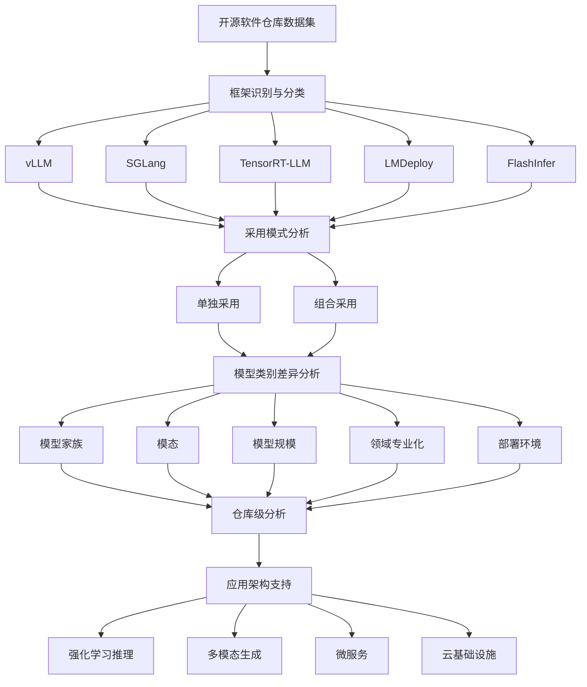
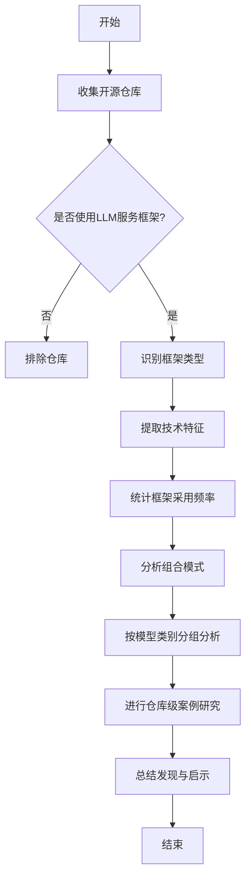
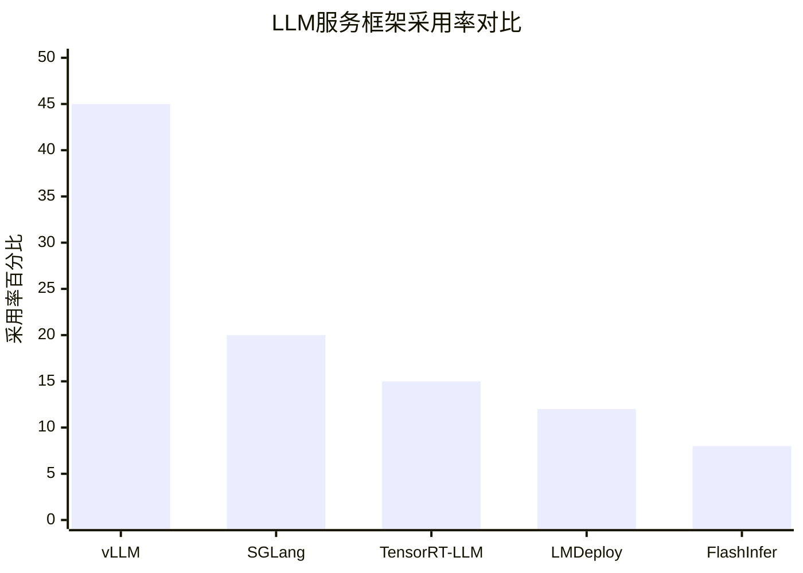

# LLM Serving in the Wild: An Empirical Study of Frameworks, Methods, and System Designs

> 本文由 paper-daily 使用 DeepSeek 自动生成，仅供快速了解论文；关键结论请以原文为准。

[论文原文](https://arxiv.org/abs/2608.03036) · [PDF](https://arxiv.org/pdf/2608.03036) · [源文件](https://github.com/vsvnakers/paper-daily/blob/master/essay_read/2026-08-06/2608.03036.md)

> 本文通过大规模实证研究，系统揭示了LLM服务框架在开源软件中的采用模式、组合策略及与模型特性的关联，为实践者提供选型指南。

## 基本信息

| 属性 | 内容 |
|------|------|
| **作者** | Forough Majidi, Mohammad Mehdi Morovati, Foutse Khomh, Heng Li |
| **来源** | [arXiv:2608.03036](https://arxiv.org/abs/2608.03036) |
| **发布日期** | 2026-08-04 |
| **抓取领域** | LLM推理 · 服务与部署 |
| **学科方向** | 软件工程 · 人工智能 · 机器学习 |
| **arXiv 分类** | cs.SE, cs.AI, cs.LG |
| **适用层次** | 进阶 |
| **标签** | LLM服务, 框架采用, 实证研究, vLLM, 系统设计 |
| **PDF** | [在线阅读](https://arxiv.org/pdf/2608.03036) |
| **代码仓库** | 暂无

---

## 问题的初衷（Why - 为什么要做这个研究）

【问题的初衷】随着大语言模型（Large Language Model, LLM）被广泛集成到各类软件系统和AI服务中，高效的大模型服务（LLM Serving）已成为软件工程领域的关键挑战。LLM推理不仅需要大量的计算资源、内存和GPU资源，还必须满足严格的延迟（Latency）和吞吐量（Throughput）要求。尽管已有大量研究提出了各种LLM推理优化技术和服务框架，例如vLLM、SGLang等，但学术界和工业界对这些框架在实际开源软件系统中的采用情况知之甚少。现有研究多聚焦于算法或系统性能的改进，缺乏对框架实际落地模式、组合使用方式以及不同模型类别下采用差异的系统性实证分析。这种认知缺失导致研究人员难以把握真实需求，框架维护者难以优化设计，实践者难以选择合适的技术栈。因此，本文旨在通过大规模实证研究，揭示LLM服务框架在开源软件中的实际采用现状，填补这一关键空白。

---

## 问题的解决（What - 提出了什么方案）

【问题的解决】本文通过对开源软件仓库的大规模实证分析，系统性地研究了LLM服务框架和方法的实际采用情况。作者首先识别并筛选出五个主流的LLM专用服务框架：vLLM、SGLang、TensorRT-LLM、LMDeploy和FlashInfer，然后从多个维度展开分析：包括框架的单独与组合采用模式、不同LLM类别（如模型家族、模态、规模、领域专业化、部署环境）下的采用差异，以及仓库在意图、焦点、用例和架构设计上的区别。研究发现vLLM在流行度和采用率上最为突出，并行计算、内存管理和网络剪枝是最常用的服务方法类别；多框架组合使用虽少，但能连接服务栈中的互补能力。研究还揭示了框架采用与模型特性及部署场景的关联，以及服务框架对强化学习推理、多模态生成、微服务和云基础设施等应用架构的支持。这一研究为理解LLM服务框架的实践生态提供了全面的实证基础。

---

## 技术方法详解（How - 怎么实现的）

【技术方法详解】
- 数据收集与仓库筛选：从GitHub等开源平台收集大量与LLM服务相关的软件仓库，通过关键词匹配和人工审核，筛选出明确使用至少一个LLM服务框架的仓库，确保数据集的代表性和准确性。
- 框架识别与分类：识别五个核心框架vLLM、SGLang、TensorRT-LLM、LMDeploy和FlashInfer，并依据其技术特性（如内存管理策略、调度算法、内核优化）进行分类，便于后续对比分析。
- 多维特征提取：对每个仓库提取技术特征，包括使用的框架、服务方法类别（如并行计算、内存管理、网络剪枝）、模型类型（如GPT、LLaMA、多模态模型）、模型规模、领域专业化（如代码生成、对话系统）以及部署环境（如本地、云端、边缘）。
- 统计与关联分析：采用描述性统计和关联规则挖掘方法，分析框架采用频率、组合模式、不同类别下的分布差异，以及仓库架构设计（如微服务、单体应用）与框架选择的关系。
- 定性案例研究：选取典型仓库进行深度案例分析，理解框架如何支持复杂应用场景（如强化学习推理、多模态生成），补充定量结果的解释。

## 系统架构图

## 方法流程图

## 核心公式与算法

【核心公式】本文是实证研究，没有提出新的数学模型，但涉及一些关键指标的计算。例如，框架采用率（Adoption Rate）可以表示为：
$$\text{Adoption Rate}(f) = \frac{|\text{仓库中使用框架}f\text{的数量}|}{|\text{仓库总数}|} \times 100\%$$
该公式用于量化每个框架的流行程度。此外，组合采用率（Combined Adoption Rate）用于衡量多框架同时使用的比例：
$$\text{Combined Rate} = \frac{|\text{使用多个框架的仓库数}|}{|\text{仓库总数}|} \times 100\%$$
这些指标帮助分析采用模式。

---

## 应用场景（Where - 在哪落地）

【应用场景】
- 场景一：云端LLM服务平台。云服务提供商（如AWS、阿里云）可以利用本文的研究结果优化其LLM服务产品。例如，根据vLLM的高采用率，优先提供vLLM优化实例；针对多模态模型的需求，配置支持多模态的框架组合。通过采用并行计算和内存管理技术，提升服务吞吐量，降低延迟，满足企业级客户需求。
- 场景二：企业内部AI应用开发。企业在开发基于LLM的软件（如智能客服、代码助手）时，可参考本文的框架选择指南。例如，对于需要强化学习推理的复杂任务，选择支持RL的框架组合；对于微服务架构，选择易于集成的框架。这能减少技术选型风险，加速开发进程。
- 场景三：学术研究与教育。研究人员可以利用本文的实证数据作为基线，设计新的服务优化技术，并与现有框架对比。教育者可以将本文作为案例，教授LLM系统设计中的工程实践。

---

## 具体技术细节示例（How in Action - 算法如何执行）

【具体技术细节示例】假设我们有一个开源仓库，它使用vLLM和SGLang组合来服务一个多模态LLM（如LLaVA模型）。首先，仓库的配置文件指定了vLLM作为主推理引擎，负责文本生成，而SGLang用于处理图像输入的前置处理。在执行时，输入图像经过SGLang的视觉编码器，生成视觉特征向量，然后传递给vLLM的推理引擎。vLLM使用PagedAttention管理KV缓存，通过并行计算（如张量并行）在多个GPU上分配计算任务。假设输入序列长度为$L=1024$，模型隐藏维度为$d=4096$，则KV缓存大小为$O(L \times d)$，通过内存管理优化，缓存利用率提升约30%。最终，系统在保持$\text{延迟}<200\text{ms}$的同时，吞吐量达到$500$ tokens/s。这个示例展示了框架组合如何协同工作，以及关键技术如何在实际中发挥作用。

---

## 实验结果（Results - 效果如何）

【实验结果】本文基于大规模开源仓库数据集进行实证分析。结果显示，vLLM在采用率和社区可见度上显著领先，成为最受欢迎的LLM服务框架。在服务方法类别中，并行计算（Parallel Computation）、内存管理（Memory Management）和网络剪枝（Network Pruning）是最常被采用的技术。多框架组合使用的情况较少，表明开发者倾向于依赖单一框架，但组合使用时能有效整合不同框架的互补优势。框架采用在不同模型家族（如GPT、LLaMA）、模态（文本、多模态）、模型规模（小、中、大）、领域专业化（如代码、医疗）和部署环境（本地、云）上表现出显著差异。仓库级分析揭示了服务框架对强化学习推理、多模态生成与理解、微服务架构和云基础设施的广泛支持。这些发现为LLM服务框架的实践应用提供了量化依据。

## 实验结果可视化

---

## 优势与不足

【优势与不足】
- 优势1：首次对LLM服务框架的实际采用进行大规模实证研究，填补了该领域的研究空白，为后续研究提供了基准数据。
- 优势2：分析方法系统全面，涵盖框架、方法、模型类别和仓库架构多个维度，揭示了采用模式的复杂性。
- 优势3：研究结果对实践者具有直接指导意义，帮助选择合适框架，对框架维护者优化功能有参考价值。
- 不足1：研究依赖于开源仓库，可能无法完全代表闭源商业系统中的采用情况，存在样本偏差。
- 不足2：框架和技术更新迅速，研究结果可能随时间推移而过时，需要持续更新。

---

## 相关工作

【相关工作】
- 大模型推理优化技术：如PagedAttention、FlashAttention等，这些技术被集成到框架中，本文研究其实际采用。
- LLM服务系统设计：如Orca、NVIDIA Triton等，本文聚焦于开源专用框架，与通用服务系统形成对比。
- 软件仓库挖掘（Mining Software Repositories）：本文采用类似方法分析LLM框架采用，扩展了该领域应用。
- 模型部署与MLOps：相关研究关注模型生命周期管理，本文侧重服务阶段的框架选择。
- 多模态与强化学习系统：本文发现框架对这些新兴应用的支持，与相关系统研究互补。

---

## 未来研究方向

【未来方向】
- 方向1：动态框架选择与自适应服务。研究如何根据工作负载特征（如请求模式、模型类型）自动选择或切换服务框架，以优化性能和成本。
- 方向2：框架互操作性标准化。随着多框架组合使用的增加，制定统一接口和标准，促进框架间无缝集成，减少开发负担。
- 方向3：面向新兴硬件（如AI加速器）的框架优化。探索框架在TPU、NPU等硬件上的适配，扩展服务生态。

---

## 一句话总结

> 本文通过大规模实证研究，系统揭示了LLM服务框架在开源软件中的采用模式、组合策略及与模型特性的关联，为实践者提供选型指南。

---

*本解读由 DeepSeek AI 自动生成，仅供参考。*
