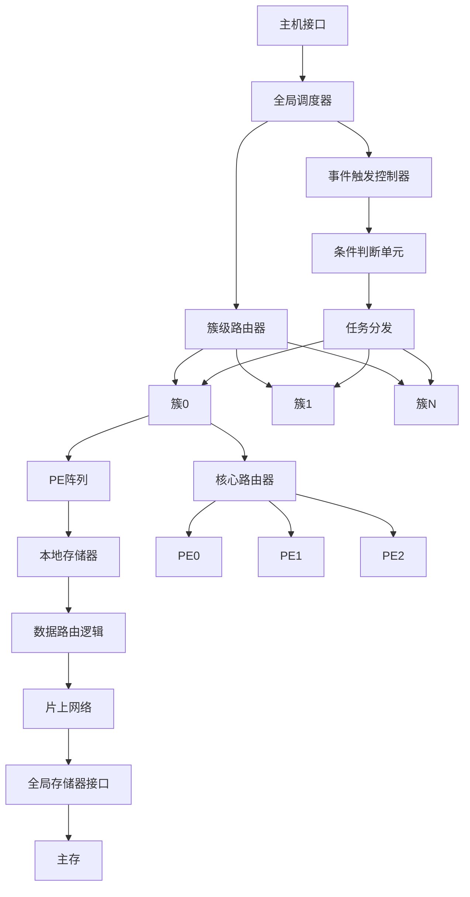
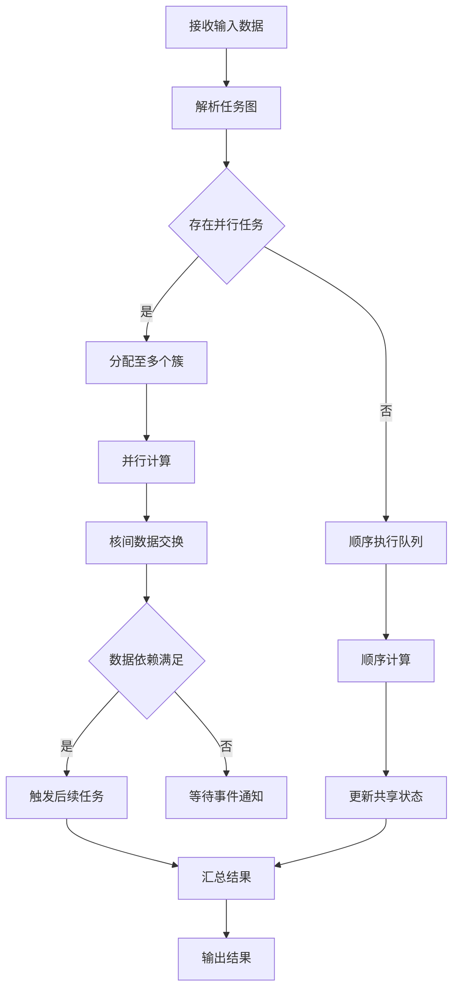
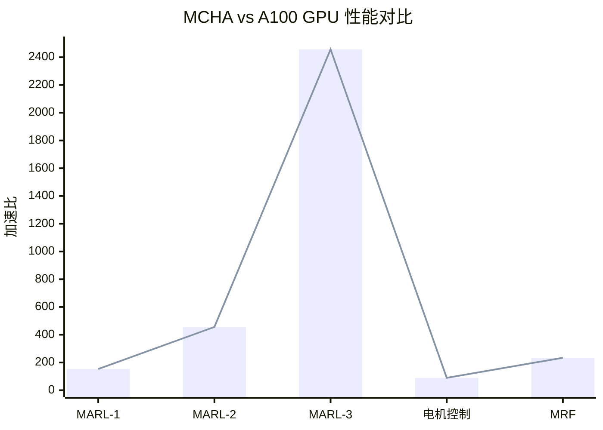

# MCHA: A Memory-Centric Hierarchical Architecture for Parallel-Sequential Computing

> 本文由 paper-daily 使用 DeepSeek 自动生成，仅供快速了解论文；关键结论请以原文为准。

[论文原文](https://arxiv.org/abs/2608.04443) · [PDF](https://arxiv.org/pdf/2608.04443) · [源文件](https://github.com/vsvnakers/paper-daily/blob/master/essay_read/2026-08-06/2608.04443.md)

> 提出内存中心层次化架构MCHA，通过层次化通信和事件驱动机制，实现并行-顺序计算的高效加速。

## 基本信息

| 属性 | 内容 |
|------|------|
| **作者** | Daijing Shi, Hongxiao Zhao, Yihan Fu, Zhan Chen, Jiayi Li, Yihang Zhu, Anjunyi Fan, Yaoyu Tao, Yuchao Yang, Bonan Yan |
| **来源** | [arXiv:2608.04443](https://arxiv.org/abs/2608.04443) |
| **发布日期** | 2026-08-05 |
| **抓取领域** | 强化学习 |
| **学科方向** | 体系结构 · 分布式系统 · cs.MA |
| **arXiv 分类** | cs.AR, cs.DC, cs.MA |
| **适用层次** | 基础 |
| **标签** | 内存中心架构, 并行-顺序计算, 多智能体强化学习, 层次化通信, 事件驱动 |
| **PDF** | [在线阅读](https://arxiv.org/pdf/2608.04443) |
| **代码仓库** | 暂无

---

## 问题的初衷（Why - 为什么要做这个研究）

【问题的初衷】随着人工智能技术的快速发展，涌现出大量新型计算密集型工作负载，如多智能体强化学习（Multi-Agent Reinforcement Learning, MARL）、大规模神经形态计算（Neuromorphic Computing）和概率图模型（Probabilistic Graphical Models）等。这些工作负载具有一个共同特征：并行-顺序混合计算模式（Parallel-Sequential Computing Pattern）。具体而言，它们既需要大规模并行计算以追求高吞吐量，又包含严格的顺序依赖关系，导致数据访问模式不规则且高度集中于主存（Main Memory）。传统冯·诺依曼架构和现有加速器在执行这类任务时面临根本性瓶颈：一方面，全局缓冲区（Global Buffer）因频繁的数据交换而迅速饱和；另一方面，主存带宽成为系统性能的严重制约因素，即内存受限（Memory-Bound）问题。现有GPU架构虽然提供强大的并行计算能力，但其内存层次结构并不适合这种不规则、集中式的数据访问模式，导致计算单元大量空闲等待数据。因此，迫切需要一种新的硬件架构，能够从根本上重新思考计算与内存的关系，以高效支持并行-顺序混合计算模式。

---

## 问题的解决（What - 提出了什么方案）

【问题的解决】针对上述挑战，论文提出了内存中心层次化架构（Memory-Centric Hierarchical Architecture, MCHA），这是一种专为并行-顺序执行模式设计的可重构硬件解决方案。MCHA的核心创新在于采用层次化通信策略（Hierarchical Communication Strategy），实现分布式核间数据路由（Distributed Inter-Core Data Routing），从而显著降低全局内存的带宽压力。与传统的以计算为中心（Compute-Centric）的架构不同，MCHA将内存访问模式作为设计的第一优先级，通过构建多层次的片上通信网络，使数据能够在邻近的处理单元（Processing Element, PE）之间直接传输，避免所有数据都经过主存。此外，MCHA还配套提出了一种新颖的并行-顺序编程模型（Parallel-Sequential Programming Model），利用事件驱动的条件触发机制（Event-Driven Conditional Triggers）将数据传输延迟隐藏在流水线执行中，实现计算与通信的重叠。这种软硬件协同设计的方法，从根本上解决了全局缓冲区饱和和内存带宽瓶颈问题，与现有方法有本质区别。

---

## 技术方法详解（How - 怎么实现的）

【技术方法详解】
- **层次化通信架构**：MCHA设计了多级片上网络（Network-on-Chip, NoC），包括核心级（Core-Level）、簇级（Cluster-Level）和全局级（Global-Level）三层通信层次。数据优先在最低层次完成交换，只有跨簇数据才需要访问更高层次，从而大幅减少主存访问次数。
- **分布式数据路由机制**：每个处理单元配备小型本地存储器（Local Memory）和路由逻辑，支持数据在核间直接转发。通过智能的路由算法，数据包可以在片上网络中沿着最短路径传输，避免集中式全局缓冲区的瓶颈。
- **事件驱动条件触发模型**：编程模型采用事件驱动范式，每个计算任务由特定事件（Event）触发执行。条件触发机制（Conditional Trigger）允许任务在数据尚未完全就绪时提前启动，实现流水线级的数据传输延迟隐藏。
- **可重构计算单元设计**：处理单元采用可重构设计，能够灵活配置为不同位宽的计算模式（如8位、16位、32位），适应不同应用场景的精度需求。每个PE支持多种运算类型，包括矩阵乘法、激活函数和概率计算等。
- **并行-顺序任务调度器**：硬件调度器（Hardware Scheduler）能够识别任务图中的并行区域和顺序依赖区域，动态分配计算资源。对于顺序依赖的任务链，采用数据流（Dataflow）执行模式；对于并行区域，则充分利用所有可用PE。
- **内存访问优化策略**：通过数据本地化（Data Locality）优化，将频繁访问的数据尽量驻留在片上存储器中。采用数据复制（Data Replication）和迁移（Migration）策略，在运行时动态调整数据分布，使内存访问从主存转移到片上。

## 系统架构图

## 方法流程图

## 核心公式与算法

【核心公式】
- 主存访问减少率公式：$\text{Reduction} = \frac{N_{main}^{baseline} - N_{main}^{MCHA}}{N_{main}^{baseline}} \times 100\%$，其中 $N_{main}$ 表示主存访问次数，该公式量化了MCHA在减少主存访问方面的效果。
- 性能加速比公式：$\text{Speedup} = \frac{T_{A100}}{T_{MCHA}}$，其中 $T$ 表示任务执行时间，该公式衡量MCHA相对于GPU的性能提升。
- 数据路由延迟公式：$T_{route} = T_{local} + T_{cluster} + T_{global}$，其中 $T_{local}$、$T_{cluster}$、$T_{global}$ 分别表示本地、簇级和全局通信延迟，该公式描述了层次化通信的延迟构成。

---

## 应用场景（Where - 在哪落地）

【应用场景】
- 场景一：多智能体系统仿真。在自动驾驶车队协同、无人机编队控制等领域，需要同时处理多个智能体的感知、决策和通信任务。MCHA的并行-顺序计算能力可以高效执行MARL算法，每个智能体分配一个或多个PE，通过层次化通信实现智能体间的状态同步。预期效果：相比GPU方案，可降低决策延迟一个数量级，支持更大规模的智能体群体（如100+智能体）实时协同。
- 场景二：神经形态计算加速。在类脑计算和脉冲神经网络（Spiking Neural Network, SNN）仿真中，神经元事件具有典型的并行-顺序特征。MCHA的事件驱动机制天然匹配SNN的事件触发特性，每个PE可模拟多个神经元，通过片上网络传递脉冲事件。预期效果：实现比现有神经形态芯片更灵活的配置能力，同时保持低功耗特性（115mW），适合边缘端智能应用。
- 场景三：概率图模型推理。在医疗诊断、金融风险评估等领域，贝叶斯网络和马尔可夫随机场的推理过程涉及大量并行计算和顺序依赖。MCHA可加速吉布斯采样（Gibbs Sampling）等迭代算法，通过条件触发机制实现变量更新的流水线化。预期效果：相比CPU/GPU方案，推理速度提升2-3个数量级，同时降低能耗，适合实时决策系统。

---

## 具体技术细节示例（How in Action - 算法如何执行）

【具体技术细节示例】假设我们运行一个简化的MARL任务，包含4个智能体（Agent 0-3），每个智能体需要执行状态更新（State Update）和策略计算（Policy Computation）两步操作。MCHA配置为2个簇，每个簇包含2个PE。

执行过程如下：
1. 初始状态：任务图解析后，调度器将Agent 0和1分配给簇0，Agent 2和3分配给簇1。每个PE加载对应的智能体参数到本地存储器。
2. 并行计算阶段：簇0的PE0和PE1同时执行Agent 0和1的状态更新操作。假设状态更新需要读取其他智能体的状态，此时PE0需要Agent 1的状态数据。由于Agent 1在同一个簇内，数据通过簇级路由器直接传输，延迟为 $T_{cluster}=5$ 个时钟周期。
3. 跨簇通信：Agent 0还需要Agent 2的状态数据。由于Agent 2在簇1，数据必须通过全局路由器传输，延迟为 $T_{global}=20$ 个时钟周期。此时，事件触发控制器检测到Agent 0的策略计算不依赖于Agent 2的数据，因此提前触发策略计算任务，实现延迟隐藏。
4. 条件触发执行：Agent 0的策略计算在等待Agent 2数据的同时开始执行，利用流水线技术将 $T_{global}$ 的延迟隐藏在计算过程中。
5. 结果汇总：所有智能体完成计算后，调度器收集结果并输出。

整个过程中，主存访问次数为2次（初始加载和最终存储），而传统架构需要至少8次主存访问（每个智能体状态更新和策略计算各一次）。通过层次化通信和事件驱动机制，MCHA将主存访问减少了75%，同时实现了计算与通信的重叠。

---

## 实验结果（Results - 效果如何）

【实验结果】论文使用开源的周期精确模拟器（Cycle-Accurate Simulator）对MCHA进行了全面评估。实验覆盖三类典型并行-顺序任务：多智能体强化学习（MARL）、电机变量控制（Motor Variable Control）和马尔可夫随机场（Markov Random Field, MRF）。对比基准为NVIDIA A100 GPU。实验结果显示：在MARL工作负载上，MCHA实现了153.06倍至2456.96倍的性能加速；主存访问比例从96%大幅降低至5.44%，充分验证了层次化通信策略的有效性。在28nm工艺下综合实现，MCHA芯片面积仅为2.92mm²，功耗为115.36mW，工作频率200MHz。此外，MCHA在电机控制和MRF任务上也展现出良好的编程灵活性和性能优势。

## 实验结果可视化

---

## 优势与不足

【优势与不足】
- 优势1：创新性地提出内存中心架构理念，从根本上解决内存带宽瓶颈问题，主存访问降低90%以上。
- 优势2：层次化通信设计具有良好的可扩展性，支持大规模PE阵列扩展，适应不同规模的应用需求。
- 优势3：事件驱动编程模型简化了并行-顺序任务的开发难度，提供硬件感知的编程抽象。
- 优势4：在性能、功耗和面积方面均表现出色，28nm工艺下仅需2.92mm²和115.36mW。
- 不足1：目前仅在模拟器上验证，缺乏真实芯片流片测试数据，实际性能可能与模拟结果存在偏差。
- 不足2：对特定应用领域（如MARL）优化明显，但通用计算场景下的性能表现尚需进一步验证。
- 不足3：编程模型需要开发者理解事件驱动范式，存在一定的学习曲线。

---

## 相关工作

【相关工作】
- 数据流架构（Dataflow Architecture）：如Systolic Array和Reconfigurable Dataflow，强调计算与数据移动的流水线化，MCHA在此基础上增加了层次化通信。
- 近内存计算（Near-Memory Computing）：将计算单元靠近内存放置以减少数据移动，MCHA通过分布式路由实现类似效果。
- 多核片上网络（Multi-Core NoC）：如Tile-based架构，MCHA借鉴了NoC设计但针对并行-顺序模式进行了优化。
- 可重构计算（Reconfigurable Computing）：如CGRA（Coarse-Grained Reconfigurable Architecture），MCHA的可重构PE设计与其相关。
- 强化学习专用加速器：如用于MARL的专用芯片设计，MCHA提供了更通用的并行-顺序计算支持。

---

## 未来研究方向

【未来方向】
- 方向一：动态可重构层次化架构。当前MCHA的层次结构是静态配置的，未来可研究根据应用特征动态调整簇大小和通信层次，实现更优的资源利用率。
- 方向二：多芯片扩展与互联。研究如何将多个MCHA芯片通过高速接口互联，构建更大规模的计算系统，支持超大规模并行-顺序任务（如千级智能体MARL）。
- 方向三：编译器与编程框架优化。开发自动化的编译器工具链，能够将高级语言（如Python、C++）描述的并行-顺序任务自动映射到MCHA架构，降低编程门槛。

---

## 一句话总结

> 提出内存中心层次化架构MCHA，通过层次化通信和事件驱动机制，实现并行-顺序计算的高效加速。

---

*本解读由 DeepSeek AI 自动生成，仅供参考。*
