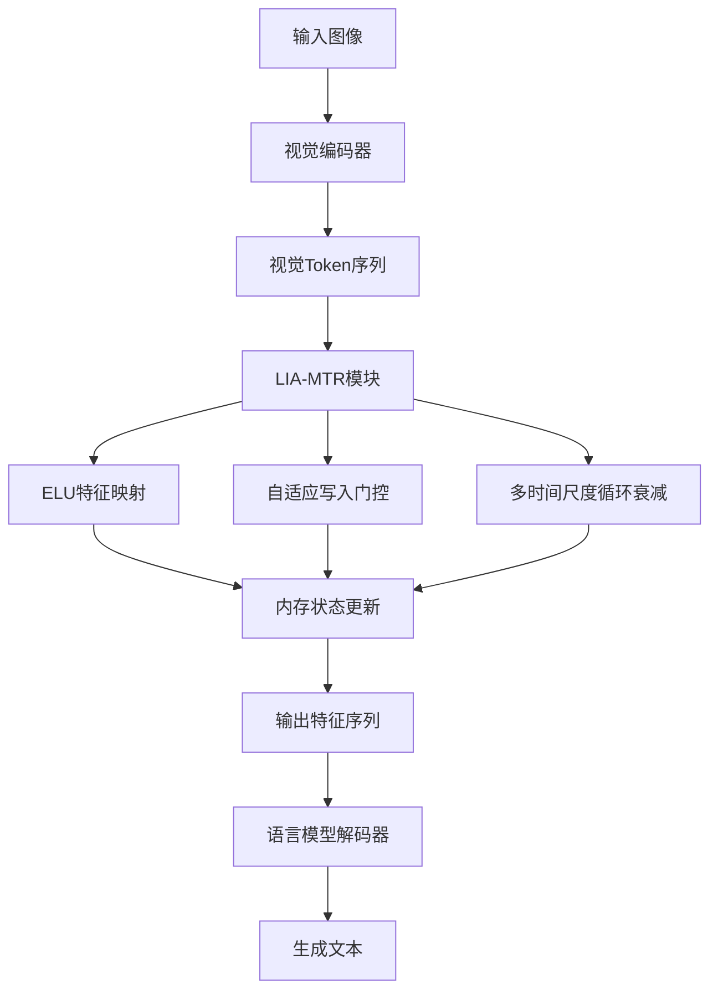
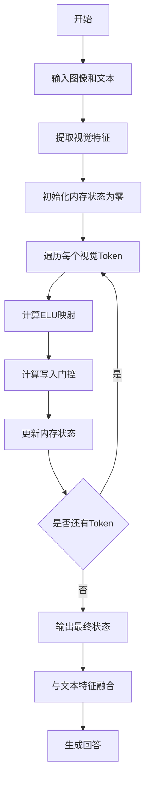

# Linear Multi-Timescale Retention as a Memory-Efficient Vision-Language Bridge

> 本文由 paper-daily 使用 DeepSeek 自动生成，仅供快速了解论文；关键结论请以原文为准。

[论文原文](https://arxiv.org/abs/2608.01614) · [PDF](https://arxiv.org/pdf/2608.01614) · [源文件](https://github.com/vsvnakers/paper-daily/blob/master/essay_read/2026-08-07/2608.01614.md)

> 提出线性多时间尺度保留模块，实现线性复杂度视觉语言桥接，支持无限上下文处理。

## 基本信息

| 属性 | 内容 |
|------|------|
| **作者** | Ashfak Yeafi, Mehedi Hasan, Md Khairul Islam |
| **来源** | [arXiv:2608.01614](https://arxiv.org/abs/2608.01614) |
| **发布日期** | 2026-08-03 |
| **抓取领域** | 注意力机制 · 稀疏/高效Attention |
| **学科方向** | 计算机视觉 · 人工智能 |
| **arXiv 分类** | cs.CV, cs.AI |
| **适用层次** | 进阶 |
| **标签** | 线性注意力, 视觉语言模型, 多时间尺度, 记忆高效, 无限上下文 |
| **PDF** | [在线阅读](https://arxiv.org/pdf/2608.01614) |
| **代码仓库** | 暂无

---

## 问题的初衷（Why - 为什么要做这个研究）

【问题的初衷】视觉语言模型（Vision-Language Models, VLMs）在处理高分辨率图像时面临严重的计算瓶颈。传统的Softmax多头注意力机制（Multi-Head Attention, MHA）具有$O(N^2)$的内存复杂度，其中$N$是序列长度（如视觉token数量）。随着图像分辨率提高，视觉token数量急剧增加，导致显存消耗呈二次方增长，使得模型难以处理高分辨率图像或长视觉序列。虽然已有研究尝试用独立的多层感知机（Multi-Layer Perceptrons, MLP）替代MHA以实现$O(N)$的线性复杂度，但这种做法完全去除了空间序列路由能力，导致模型无法有效建模视觉token之间的空间关系和全局场景理解，出现物体持久性（object permanence）严重下降的问题。因此，需要一种既能保持线性复杂度又能保留序列路由能力的跨模态桥接机制，以实现在有限显存下处理无限上下文（infinite context）的视觉语言融合。

---

## 问题的解决（What - 提出了什么方案）

【问题的解决】本文提出线性多时间尺度保留模块（Linear Multi-Timescale Retention, LIA-MTR），作为记忆高效的跨模态桥接模块。核心思路是：通过ELU（Exponential Linear Unit）基的正特征映射将视觉序列非线性变换到高维特征空间，结合自适应写入门控（adaptive write-gating）和log线性分布的多时间尺度循环衰减（log-linearly distributed recurrent decays），将连续的视觉序列数学上压缩为有界的内存状态。这样，模型在推理时只需维护固定大小的状态向量，实现严格的$O(N)$序列交互复杂度。与MLP基线相比，LIA-MTR保留了序列路由能力，能够建模视觉token间的空间关系；与标准MHA相比，避免了$O(N^2)$的显存开销。理论分析证明了其线性复杂度，实验验证了其在长序列检索、显存扩展性和下游任务性能上的优势。

---

## 技术方法详解（How - 怎么实现的）

【技术方法详解】
- **ELU特征映射**：使用ELU激活函数将输入特征映射到正数域，确保状态更新的非负性，避免信息丢失。具体为$f(x) = \text{ELU}(x) + 1$，使得输出始终为正。
- **自适应写入门控**：通过可学习的门控机制控制新信息写入内存状态的比例，类似于LSTM中的输入门，但更轻量。门控值由当前输入和状态共同决定。
- **多时间尺度循环衰减**：将内存状态分为多个通道，每个通道使用不同的衰减因子$\tau_i$，这些因子按log线性分布（如从$\tau_{\min}$到$\tau_{\max}$），从而捕捉不同时间尺度的依赖关系。
- **线性复杂度保证**：由于状态更新是逐token进行的，每个token只与当前状态交互，因此总复杂度为$O(N \cdot d)$，其中$d$是状态维度，严格线性。
- **与MHA和MLP的对比**：MHA需要计算所有token对之间的注意力权重，复杂度$O(N^2)$；MLP完全独立处理每个token，无序列交互；LIA-MTR通过循环状态实现序列交互，但复杂度仅为$O(N)$。
- **训练稳定性**：使用梯度裁剪和层归一化确保循环结构的训练稳定性，避免梯度爆炸或消失。


## 系统架构图




## 方法流程图




## 核心公式与算法

【核心公式】
- 状态更新公式：$s_t = \alpha_t \odot f(x_t) + (1 - \alpha_t) \odot (\gamma \odot s_{t-1})$，其中$\alpha_t$是写入门控，$\gamma$是衰减因子向量，$f$是ELU映射。
- 输出公式：$y_t = g(s_t)$，其中$g$是输出投影。
- 复杂度分析：总计算量$O(N \cdot d)$，其中$N$是序列长度，$d$是状态维度。


---

## 应用场景（Where - 在哪落地）

【应用场景】
- 高分辨率图像理解：在医疗影像分析中，高分辨率CT或MRI图像包含数百万像素，传统VLM无法直接处理。LIA-MTR可以线性扩展，处理完整图像而不丢失细节，帮助医生更准确诊断。
- 视频理解：视频由多帧组成，每帧可视为视觉token序列。LIA-MTR能处理长视频序列，实现实时视频问答或摘要生成，应用于监控安防或内容审核。
- 移动端部署：由于显存占用低，LIA-MTR适合在资源受限的设备（如手机）上运行，实现离线图像描述或视觉辅助功能。


---

## 具体技术细节示例（How in Action - 算法如何执行）

【具体技术细节示例】假设输入视觉序列长度为$N=4$，每个token的维度为$d=2$，状态维度也为2。设定两个时间尺度衰减因子$\gamma = [0.9, 0.5]$。初始状态$s_0 = [0, 0]$。输入token序列：$x_1 = [1, 2]$, $x_2 = [3, 4]$, $x_3 = [5, 6]$, $x_4 = [7, 8]$。ELU映射$f(x) = \text{ELU}(x) + 1$，假设ELU(x) = x for x>0, else exp(x)-1。因此$f(x_1) = [2, 3]$, $f(x_2) = [4, 5]$, $f(x_3) = [6, 7]$, $f(x_4) = [8, 9]$。写入门控$\alpha_t$由当前输入和状态决定，假设为固定值0.5。则状态更新：$s_1 = 0.5 * [2,3] + 0.5 * ([0.9,0.5] * [0,0]) = [1, 1.5]$。$s_2 = 0.5 * [4,5] + 0.5 * ([0.9,0.5] * [1,1.5]) = [2, 2.5] + [0.45, 0.375] = [2.45, 2.875]$。$s_3 = 0.5 * [6,7] + 0.5 * ([0.9,0.5] * [2.45,2.875]) = [3, 3.5] + [1.1025, 0.71875] = [4.1025, 4.21875]$。$s_4 = 0.5 * [8,9] + 0.5 * ([0.9,0.5] * [4.1025,4.21875]) = [4, 4.5] + [1.846125, 1.0546875] = [5.846125, 5.5546875]$。最终输出状态$s_4$作为序列的压缩表示，用于后续语言模型生成。此示例展示了如何通过循环更新压缩信息，且计算量随$N$线性增长。


---

## 实验结果（Results - 效果如何）

【实验结果】论文在多个层面进行了实验。首先，在合成检索任务中，LIA-MTR在16,000个token的序列上实现了完美的上下文路由，消除了线性注意力常见的“中间丢失”（Lost in the Middle）问题。其次，硬件基准测试显示，LIA-MTR能够处理262,144个视觉patch，仅占用11.2 GB显存，而标准MHA在16,384个patch时即发生显存溢出（OOM）。最后，在665K对话样本上进行指令微调后，LIA-MTR在MME基准上达到71.00%的准确率，显著优于MLP基线的68.11%，其中物体持久性绝对提升10%，全局语义提取能力也更强。


## 实验结果可视化

```mermaid
xychart-beta
    title "显存占用对比"
    x-axis ["1K", "4K", "16K", "64K", "262K"]
    y-axis "显存占用GB" 0 --> 20
    line [0.5, 1.2, 4.5, 11.2, 11.2]
    line [0.5, 2.0, 16.0, null, null]
```


---

## 优势与不足

【优势与不足】
- 优势1：严格的$O(N)$复杂度，支持无限上下文处理，显存占用恒定。
- 优势2：保留了序列路由能力，优于MLP的全局理解能力。
- 优势3：理论分析严谨，实验验证充分，包括合成任务和真实基准。
- 不足1：循环结构可能难以并行化，训练速度可能不如Transformer。
- 不足2：多时间尺度衰减的设定需要手动调整超参数，可能影响泛化性。

---

## 相关工作

【相关工作】
- 线性注意力机制（Linear Attention）：如Performer、Linear Transformer，通过核方法近似注意力，但常丢失上下文信息。
- 状态空间模型（State Space Models）：如Mamba、S4，使用循环状态建模序列，但主要针对一维序列。
- 视觉语言模型桥接（Vision-Language Bridges）：如Q-Former、MLP桥接，但Q-Former仍使用注意力，MLP缺乏序列建模。
- 长序列Transformer：如Longformer、BigBird，通过稀疏注意力降低复杂度，但仍有超线性开销。

---

## 未来研究方向

【未来方向】
- 将LIA-MTR扩展到多模态生成任务，如视觉问答和图像描述，进一步验证其泛化能力。
- 探索自适应时间尺度衰减，让模型自动学习最优衰减因子，减少人工调参。
- 结合稀疏注意力或局部注意力，在保持线性复杂度的同时增强局部细节建模。


---

## 一句话总结

> 提出线性多时间尺度保留模块，实现线性复杂度视觉语言桥接，支持无限上下文处理。

---

*本解读由 DeepSeek AI 自动生成，仅供参考。*
