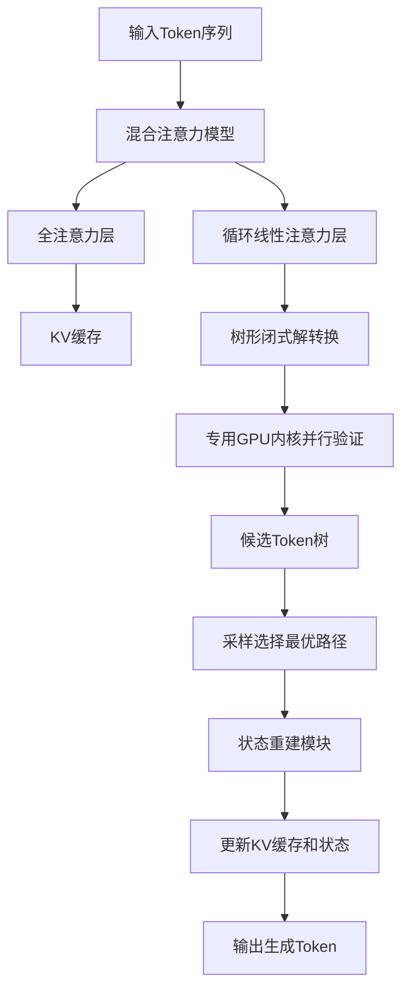
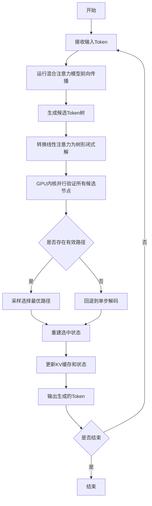

# Bole: Efficient Tree Speculation for Hybrid-Attention Language Models

> 本文由 paper-daily 使用 DeepSeek 自动生成，仅供快速了解论文；关键结论请以原文为准。

[论文原文](https://arxiv.org/abs/2608.01651) · [PDF](https://arxiv.org/pdf/2608.01651) · [源文件](https://github.com/vsvnakers/paper-daily/blob/master/essay_read/2026-08-07/2608.01651.md)

> Bole通过内核-运行时协同设计，将混合注意力模型的树形投机解码效率提升数倍，显著降低内存占用和延迟。

## 基本信息

| 属性 | 内容 |
|------|------|
| **作者** | Li Wang, Yi Su, Xiabao Wu, Chiran You, Yongchao Liu, Zhan Qiu, Juelu Zhang, Jiajun Zheng, Fangxin Liu, Jie Zhang, Chen Tian, Chengying Huan |
| **来源** | [arXiv:2608.01651](https://arxiv.org/abs/2608.01651) |
| **发布日期** | 2026-08-03 |
| **抓取领域** | LLM推理 · 内存与加速 |
| **学科方向** | 分布式系统 · 自然语言处理 · 机器学习 |
| **arXiv 分类** | cs.DC, cs.CL, cs.LG |
| **适用层次** | 进阶 |
| **标签** | 混合注意力, 树形投机解码, GPU内核优化, 内存优化, LLM推理加速 |
| **PDF** | [在线阅读](https://arxiv.org/pdf/2608.01651) |
| **代码仓库** | 暂无

---

## 问题的初衷（Why - 为什么要做这个研究）

【问题的初衷】随着大语言模型（Large Language Model, LLM）在长上下文任务中的广泛应用，其推理成本成为关键瓶颈。混合注意力（Hybrid-Attention）模型通过结合全注意力（Full Attention）与循环线性注意力（Recurrent Linear Attention）机制，旨在降低长上下文推理的计算复杂度。然而，这类模型的自回归解码（Autoregressive Decoding）过程仍然受限于内存带宽（Memory-Bound），导致生成速度缓慢。树形投机解码（Tree Speculative Decoding）通过并行验证多个候选token序列来加速解码，但现有系统（如Medusa、EAGLE）主要针对全注意力模型的键值缓存（Key-Value Cache）设计。在混合注意力模型上，这些系统需要逐分支遍历循环层，并为每个候选节点物化完整的状态向量，导致验证延迟和瞬时内存占用随树大小和批大小（Batch Size）急剧增长。这种低效性严重制约了混合注意力模型在实际生产环境中的部署效率。因此，亟需一种专门针对混合注意力模型特性的高效树形投机解码方案，以充分释放其长上下文推理的潜力。

---

## 问题的解决（What - 提出了什么方案）

【问题的解决】论文提出了Bole，一个内核-运行时协同设计（Kernel-Runtime Co-Design）系统，旨在实现混合注意力LLM的高效树形投机解码。Bole的核心创新在于将循环线性注意力的递推计算转化为树形结构的闭式解（Closed-Form），并利用资源高效的GPU内核并行验证所有候选节点，从而显著加速线性注意力的树形验证过程（加速3.4-7.7倍）。同时，Bole将投机状态更新无损编码为token级别的因子，仅在采样后重建被选中的状态，从而将瞬时状态内存占用减少82-99倍，释放GPU容量用于KV缓存。此外，Bole集成到生产级LLM服务引擎SGLang中，通过高效的批级验证预算（Batch-Wide Verification Budget）与完整的混合前向传播（Hybrid Forward）校准，实现了状态管理与验证效率的协同优化。与现有方法相比，Bole从内核优化和运行时管理两个层面同时解决瓶颈，而非仅依赖算法层面的改进，这是其本质区别。

---

## 技术方法详解（How - 怎么实现的）

【技术方法详解】
- **树形闭式解转换**：将线性注意力的递推公式 $S_t = \lambda S_{t-1} + k_t v_t^T$ 转换为树形结构，使得每个候选节点可以独立计算其状态，无需依赖前序节点的完整状态，从而支持并行验证。
- **专用GPU内核设计**：开发了资源高效的GPU内核，利用共享内存（Shared Memory）和寄存器（Register）优化，减少全局内存访问，实现所有候选节点的并行验证。
- **无损状态编码**：将投机解码过程中的状态更新分解为token级别的因子（Token-Level Factors），仅在采样后根据选中的token序列重建完整状态，避免为每个候选节点物化完整状态矩阵。
- **批级验证预算校准**：在SGLang运行时中，根据混合前向传播的计算特性，动态调整批级验证预算，确保GPU资源在KV缓存和状态重建之间的最优分配。
- **内核-运行时协同**：通过内核级优化降低单次验证延迟，同时通过运行时调度减少状态切换开销，实现端到端的性能提升。


## 系统架构图




## 方法流程图




## 核心公式与算法

【核心公式】
- 线性注意力递推公式：$$S_t = \lambda S_{t-1} + k_t v_t^T$$ 其中 $S_t$ 是时间步 $t$ 的状态矩阵，$\lambda$ 是衰减因子，$k_t$ 和 $v_t$ 分别是键和值向量。Bole将其转换为树形闭式解，使得每个节点可独立计算。
- 树形闭式解形式：$$S_{node} = \sum_{i \in path} \lambda^{depth_i} k_i v_i^T$$ 其中 $path$ 是从根到该节点的路径，$depth_i$ 是节点 $i$ 的深度，允许并行计算。
- 状态重建公式：$$S_{selected} = \prod_{j=1}^{m} f_j \cdot S_{root}$$ 其中 $f_j$ 是token级别的因子，$m$ 是采样路径长度，用于从根状态重建选中状态。


---

## 应用场景（Where - 在哪落地）

【应用场景】
- **长上下文对话系统**：在智能客服或虚拟助手中，用户可能提供很长的历史对话，混合注意力模型能高效处理长上下文，而Bole的加速解码使得实时响应成为可能。例如，在在线客服场景中，系统需要快速生成回复，Bole通过并行验证多个候选回复，将TPOT降低49.9%，显著提升用户体验。
- **代码生成与补全**：在集成开发环境（IDE）中，代码补全需要低延迟响应。Bole的树形投机解码可以同时验证多个代码片段候选，加速生成过程。在大型代码库中，长上下文理解至关重要，混合注意力模型结合Bole能提供更准确的补全建议，同时减少等待时间。
- **实时文档摘要**：在新闻聚合或法律文档处理中，需要快速生成长文档的摘要。Bole通过提升解码吞吐量，使得在GPU资源有限的情况下，仍能高效处理大量文档，降低服务成本。


---

## 具体技术细节示例（How in Action - 算法如何执行）

【具体技术细节示例】假设输入序列为 $[x_1, x_2, x_3]$，混合注意力模型包含一个线性注意力层。在投机解码中，模型生成一个候选树，包含三个候选分支：分支A（token $a_1, a_2$）、分支B（token $b_1$）和分支C（token $c_1, c_2, c_3$）。

1. **树形闭式解转换**：对于每个候选节点，计算其状态。例如，分支A的第二个节点 $a_2$ 的状态为 $S_{a_2} = \lambda^2 S_{root} + \lambda k_{a_1} v_{a_1}^T + k_{a_2} v_{a_2}^T$，其中 $S_{root}$ 是输入序列的最终状态。
2. **并行验证**：GPU内核同时计算所有候选节点的状态，并验证每个分支的最终token是否与模型输出一致。假设分支A的 $a_2$ 和分支C的 $c_3$ 被验证为有效，其他无效。
3. **采样选择**：根据概率分布，采样选择分支C作为最优路径，因为其长度更长且概率更高。
4. **状态重建**：Bole仅重建分支C的最终状态 $S_{c_3} = \lambda^3 S_{root} + \lambda^2 k_{c_1} v_{c_1}^T + \lambda k_{c_2} v_{c_2}^T + k_{c_3} v_{c_3}^T$，而无需存储其他候选节点的状态。
5. **输出**：生成token $c_1, c_2, c_3$，并更新KV缓存和状态。整个过程将验证延迟从逐分支遍历的 $O(N \cdot L)$ 降低到并行验证的 $O(L)$，其中 $N$ 是候选节点数，$L$ 是树深度。


---

## 实验结果（Results - 效果如何）

【实验结果】论文在四个混合注意力模型（包括基于Llama架构的变体）、两种GPU平台（A100和H100）以及多种数据集（包括长上下文基准和对话数据集）上进行了广泛实验。实验结果显示，Bole在离线解码吞吐量上比自回归解码（Autoregressive Decoding）最高提升4.72倍，比最强的树形投机基线（Tree-Speculative Baseline）最高提升2.03倍。在在线Agent工作负载下，Bole相比最强树形投机基线，将首Token生成时间（Time To First Token, TTFT）降低最高67.6%，将每个输出Token生成时间（Time Per Output Token, TPOT）降低最高49.9%。此外，线性注意力树形验证速度提升3.4-7.7倍，瞬时状态内存占用减少82-99倍。


## 实验结果可视化

```mermaid
xychart-beta
    title "离线解码吞吐量对比"
    x-axis [自回归解码, 树形投机基线, Bole]
    y-axis "吞吐量相对提升" 0 --> 5
    bar [1.0, 2.33, 4.72]
```


---

## 优势与不足

【优势与不足】
- **优势**：
  1. 创新性地将线性注意力递推转化为树形闭式解，实现了并行验证，大幅提升验证速度。
  2. 无损状态编码显著降低瞬时内存占用，使GPU资源更高效地用于KV缓存，提升整体吞吐量。
  3. 内核-运行时协同设计，兼顾底层硬件优化和上层调度策略，具有实际部署价值。
- **不足**：
  1. 树形闭式解转换对线性注意力的特定形式有依赖，可能不适用于所有混合注意力变体。
  2. 批级验证预算校准需要针对不同模型和硬件进行调优，增加了部署复杂性。

---

## 相关工作

【相关工作】
- **投机解码（Speculative Decoding）**：如Medusa和EAGLE，通过草稿模型或并行解码加速生成，但主要针对全注意力模型。
- **混合注意力模型**：如Mamba和RetNet，结合线性注意力与全注意力以平衡效率和效果，但缺乏高效解码优化。
- **GPU内核优化**：如FlashAttention，通过内存访问优化提升注意力计算效率，Bole借鉴了类似的内核设计思想。
- **LLM服务系统**：如vLLM和SGLang，关注推理调度和内存管理，Bole集成于SGLang以利用其运行时基础设施。

---

## 未来研究方向

【未来方向】
- **扩展到更多混合注意力变体**：当前Bole针对特定形式的线性注意力，未来可研究更通用的树形闭式解转换方法，以支持更多混合架构。
- **动态树结构优化**：结合强化学习或预测模型，动态调整候选树的结构和大小，以最大化验证效率。
- **多GPU分布式部署**：将Bole扩展到多GPU环境，通过模型并行和数据并行进一步降低延迟，支持更大规模的模型和服务。


---

## 一句话总结

> Bole通过内核-运行时协同设计，将混合注意力模型的树形投机解码效率提升数倍，显著降低内存占用和延迟。

---

*本解读由 DeepSeek AI 自动生成，仅供参考。*
