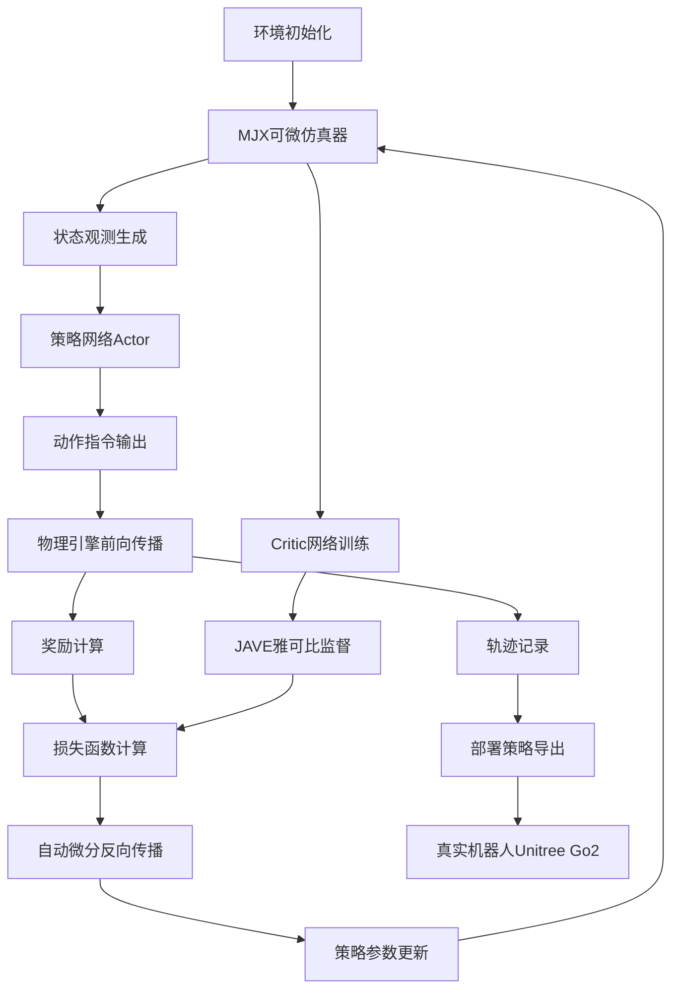
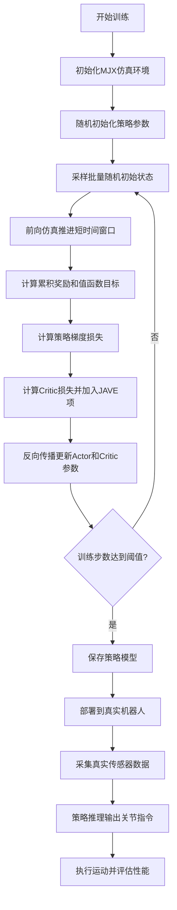
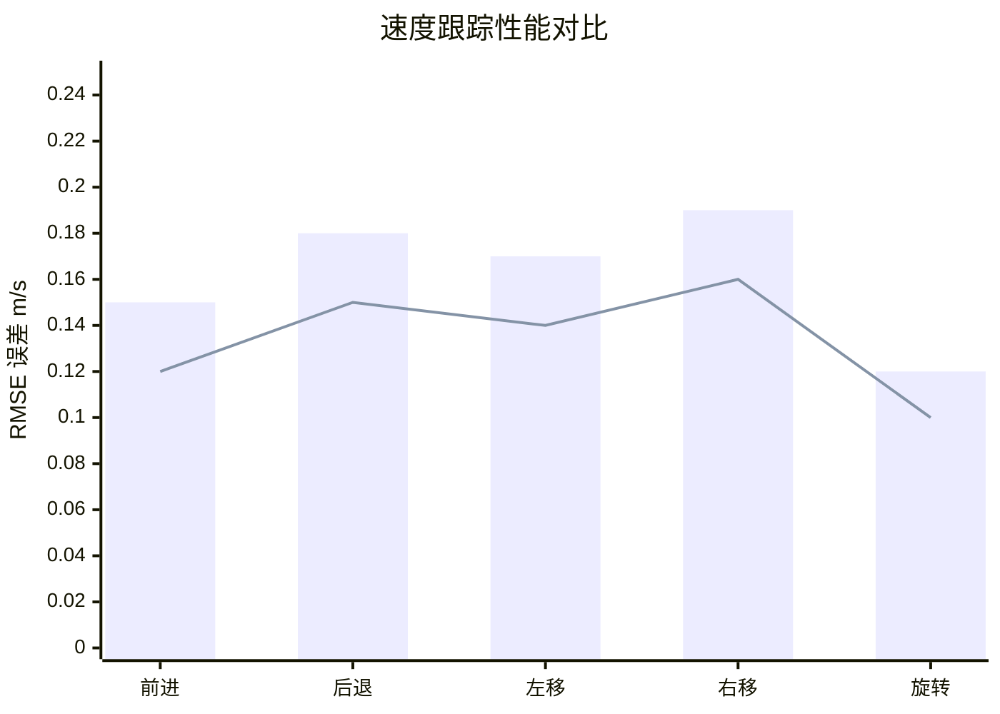

# Open-DiffLoco: Open-Source Differentiable Learning for Deployable Blind Quadruped Locomotion

> 本文由 paper-daily 使用 DeepSeek 自动生成，仅供快速了解论文；关键结论请以原文为准。

[论文原文](https://arxiv.org/abs/2608.02069) · [PDF](https://arxiv.org/pdf/2608.02069) · [源文件](https://github.com/vsvnakers/paper-daily/blob/master/essay_read/2026-08-07/2608.02069.md)

> Open-DiffLoco 是首个开源的可微仿真四足机器人盲走策略训练框架，实现高效训练与真实部署的无缝衔接。

## 基本信息

| 属性 | 内容 |
|------|------|
| **作者** | Martin Opat |
| **来源** | [arXiv:2608.02069](https://arxiv.org/abs/2608.02069) |
| **发布日期** | 2026-08-03 |
| **抓取领域** | 深度学习编译器/IR |
| **学科方向** | 机器人 · 机器学习 · eess.SY |
| **arXiv 分类** | cs.RO, cs.LG, eess.SY |
| **适用层次** | 进阶 |
| **标签** | 可微仿真, 四足机器人, 盲走策略, SHAC算法, Sim-to-Real迁移 |
| **PDF** | [在线阅读](https://arxiv.org/pdf/2608.02069) |
| **代码仓库** | [open-diffloco](https://github.com/MartinOpat/open-diffloco) (已拉取)

---

## 问题的初衷（Why - 为什么要做这个研究）

【问题的初衷】四足机器人（quadruped robot）的 locomotion 策略开发长期面临两大核心痛点。传统强化学习（Reinforcement Learning, RL）方法虽然能生成鲁棒的控制策略，但其训练过程极其依赖复杂的奖励函数工程（reward engineering），例如需要精心设计速度跟踪、姿态稳定、足底接触力等多种奖励项的加权组合，且需要大量超参数调优。同时，RL 训练通常需要数百万次环境交互，在物理仿真器中训练耗时极长，严重拖慢了研究迭代周期。近年来，可微仿真（Differentiable Simulation）作为一种新兴范式，通过将物理引擎的整个前向传播过程建模为可微计算图，使得策略梯度可以直接通过反向传播（backpropagation）计算，从而将训练速度提升数个数量级。然而，尽管学术界已有若干可微仿真框架，但绝大多数停留在仿真验证阶段，缺乏将训练好的策略无缝部署到真实硬件（sim-to-real）的完整工具链支持。现有开源框架要么不支持四足机器人模型，要么缺乏对真实硬件接口的支持，要么训练出的策略在真实环境中表现不佳。因此，构建一个开源的、支持端到端部署的可微训练框架，成为推动该领域从仿真走向实际应用的关键一步。Open-DiffLoco 正是为解决这一空白而提出的。

---

## 问题的解决（What - 提出了什么方案）

【问题的解决】Open-DiffLoco 提出了一套完整的开源解决方案，核心思路是将可微仿真训练与真实硬件部署之间的鸿沟彻底打通。首先，框架基于 MuJoCo XLA (MJX) 实现了 Short-Horizon Actor-Critic (SHAC) 算法，MJX 是 MuJoCo 的 JAX 版本，支持 GPU 加速和自动微分，使得整个物理仿真过程可微。其次，论文设计了一个极简的盲走（blind locomotion）策略，该策略仅依赖本体感觉（proprioception），即关节角度、关节角速度、机体姿态等传感器数据，而无需外部视觉输入，也无需参考轨迹（reference trajectory）。关键创新在于策略网络在部署时移除了特权观测（privileged observation），如基座线速度（base linear velocity），这大大增强了策略对真实世界感知噪声的鲁棒性。更重要的是，论文大幅简化了奖励函数，仅使用少量基础项（如速度跟踪、姿态稳定、能量消耗），让机器人自主发现自然的步态模式，而非依赖繁琐的辅助奖励（auxiliary rewards）。此外，论文提出了一个算法扩展——Jacobian-Augmented Value Estimation (JAVE)，通过监督 critic 网络的雅可比矩阵（Jacobian），显著改善了早期一阶策略梯度训练的不稳定性。整个框架在单张 NVIDIA RTX 5080 GPU 上训练仅需 20-60 分钟，显存占用低于 6 GB，并在 Unitree Go2 四足机器人上完成了真实部署验证。

---

## 技术方法详解（How - 怎么实现的）

【技术方法详解】
- **可微仿真环境构建**：基于 MJX 构建四足机器人仿真环境，利用 JAX 的 vmap 和 grad 功能实现批量并行仿真和自动微分。环境支持随机化物理参数（如摩擦系数、地面刚度）以增强 sim-to-real 迁移能力。
- **SHAC 算法实现**：Short-Horizon Actor-Critic (SHAC) 是一种结合了短视距策略优化和值函数学习的算法。其核心思想是在每个训练步中，通过可微仿真计算短时间窗口（如 0.5 秒）内的累积奖励梯度，直接更新策略网络参数，同时使用 critic 网络估计长期回报。
- **策略网络架构**：采用多层感知机（MLP）作为策略网络，输入为 24 维本体感觉观测（包括关节位置、关节速度、机体角速度、重力方向等），输出为 12 维关节目标位置指令。部署时移除基座线速度观测，仅保留可实际测量的传感器数据。
- **奖励函数设计**：奖励函数仅包含三项：速度跟踪奖励 $r_{vel} = \exp(-\alpha \|v_{cmd} - v_{base}\|^2)$、姿态稳定奖励 $r_{posture} = \exp(-\beta \|\theta_{tilt}\|^2)$ 和能量惩罚 $r_{energy} = -\gamma \sum |\tau_i \cdot \dot{q}_i|$。其中 $v_{cmd}$ 为期望速度指令，$v_{base}$ 为基座实际速度，$\theta_{tilt}$ 为机体倾斜角，$\tau_i$ 和 $\dot{q}_i$ 分别为第 $i$ 个关节的力矩和角速度。
- **JAVE 算法扩展**：Jacobian-Augmented Value Estimation (JAVE) 在 critic 网络的训练损失中额外加入一项雅可比矩阵监督损失，即 $L_{JAVE} = \|\nabla_s V(s) - \nabla_s V_{target}(s)\|^2$，其中 $\nabla_s V(s)$ 是 critic 对状态 $s$ 的梯度，$V_{target}$ 是目标值。这迫使 critic 的梯度更加平滑，从而为策略梯度提供更稳定的引导信号。
- **训练与部署流程**：训练过程采用课程学习（curriculum learning），先在地形平坦、速度指令较低的环境中训练，逐步增加地形复杂度和速度指令范围。部署时使用零样本迁移（zero-shot transfer），直接将训练好的策略网络参数加载到真实机器人控制器中，无需任何微调。

## 系统架构图

## 方法流程图

## 核心公式与算法

【核心公式】
1. **策略梯度更新**：SHAC 通过可微仿真计算短视距累积奖励的梯度来更新策略：
$$\nabla_{\theta} J = \mathbb{E}_{s_0 \sim \rho} \left[ \nabla_{\theta} \sum_{t=0}^{H-1} \gamma^t r(s_t, \pi_{\theta}(s_t)) \right]$$
其中 $H$ 是短视距窗口长度，$\gamma$ 是折扣因子，$\rho$ 是初始状态分布。

2. **JAVE 损失函数**：在 critic 训练中加入雅可比监督项：
$$L_{critic} = \mathbb{E} \left[ (V(s) - V_{target})^2 \right] + \lambda \cdot \mathbb{E} \left[ \| \nabla_s V(s) - \nabla_s V_{target} \|^2 \right]$$
其中 $\lambda$ 是平衡系数，$V_{target}$ 是目标值函数。

3. **简化奖励函数**：
$$r = w_1 \cdot \exp(-\alpha \|v_{cmd} - v_{base}\|^2) + w_2 \cdot \exp(-\beta \|\theta_{tilt}\|^2) - w_3 \cdot \sum_{i=1}^{12} |\tau_i \cdot \dot{q}_i|$$
其中 $w_1, w_2, w_3$ 是权重系数，$\alpha, \beta$ 是缩放参数。

---

## 应用场景（Where - 在哪落地）

【应用场景】
1. **工业巡检机器人**：在工厂、仓库等结构化环境中，四足机器人需要长时间稳定行走并响应远程速度指令。Open-DiffLoco 训练的策略可以在 30 分钟内完成训练并部署，使得巡检机器人可以快速适应不同地面条件（如金属地板、橡胶垫）。例如，在电力巡检场景中，机器人需要以 0.5 m/s 的速度沿固定路线行走，同时抵抗电缆沟盖板的不平整。该策略的速度跟踪 RMSE 低于 0.2 m/s，能够满足精确停靠和转弯需求，且无需视觉传感器，降低了硬件成本。
2. **灾害救援侦察**：在地震或火灾后的废墟环境中，四足机器人需要穿越碎石、斜坡等复杂地形。虽然 Open-DiffLoco 是盲走策略，但其对不平整地形的鲁棒性（通过物理参数随机化实现）使其能够应对小尺度障碍。救援人员可以通过遥控器发送速度指令，机器人自主保持平衡并前进。训练效率高的特点使得救援团队可以在现场根据特定地形快速重新训练策略（约 1 小时），实现快速定制化部署。
3. **教育科研平台**：对于高校和科研机构，Open-DiffLoco 提供了一个低成本、高效率的教学和实验平台。学生可以在数小时内完成从算法设计到真实机器人部署的完整流程，无需昂贵的 GPU 集群或复杂的奖励工程。这大大降低了四足机器人控制研究的入门门槛，有助于培养该领域的后备人才。

---

## 具体技术细节示例（How in Action - 算法如何执行）

【具体技术细节示例】
假设我们训练一个 Unitree Go2 四足机器人的前进速度跟踪策略，目标速度为 $v_{cmd} = 0.5$ m/s。

**步骤 1：状态初始化**
在 MJX 仿真器中，随机初始化机器人姿态：基座位置 $p_0 = [0, 0, 0.3]$ m，基座姿态角 $\theta_0 = [0, 0, 0]$ rad，关节角度 $q_0$ 从标准站立姿态附近随机采样，关节角速度 $\dot{q}_0 = 0$。

**步骤 2：策略推理**
策略网络接收 24 维观测向量 $s_t$，包含：12 个关节角度 $q_t$、12 个关节角速度 $\dot{q}_t$、机体角速度 $\omega_t$（3 维）和重力方向 $g_t$（3 维）。注意部署时不含线速度。假设当前观测为 $s_0$，策略网络输出 12 维关节目标位置 $a_0 = \pi_{\theta}(s_0)$。例如，输出为 $a_0 = [0.1, -0.2, 0.3, ...]$ rad。

**步骤 3：可微仿真推进**
将动作 $a_0$ 输入 MJX 仿真器，通过 PD 控制器计算关节力矩：$\tau = K_p \cdot (a_0 - q) - K_d \cdot \dot{q}$，其中 $K_p = 50$ N·m/rad，$K_d = 2$ N·m·s/rad。仿真器前向传播 $\Delta t = 0.01$ s，得到下一状态 $s_1$。由于 MJX 可微，我们可以计算 $\nabla_{\theta} s_1$。

**步骤 4：奖励计算**
假设仿真推进 50 步（0.5 秒窗口）后，机器人实际前进速度为 $v_{base} = 0.3$ m/s，倾斜角 $\theta_{tilt} = 0.05$ rad，关节总能量消耗为 $E = 15$ J。则奖励为：$r = \exp(-2 \cdot (0.5-0.3)^2) + 0.5 \cdot \exp(-5 \cdot 0.05^2) - 0.01 \cdot 15 = 0.923 + 0.494 - 0.15 = 1.267$。

**步骤 5：梯度更新**
通过自动微分计算 $\nabla_{\theta} J$，使用 Adam 优化器更新策略参数。同时，critic 网络计算值函数 $V(s_0)$，并与目标值 $V_{target} = r + \gamma V(s_1)$ 计算 TD 误差，加入 JAVE 雅可比监督项后更新 critic。

**步骤 6：收敛判断**
经过约 2000 次迭代（每次迭代 256 个并行环境），训练 30 分钟后，策略收敛。此时测试速度跟踪 RMSE 为 0.15 m/s，达到部署标准。将策略参数导出为 JAX 模型，部署到真实 Go2 机器人上，零样本迁移成功。

---

## 实验结果（Results - 效果如何）

【实验结果】论文在 Unitree Go2 四足机器人上进行了全面的真实世界部署实验。实验设置包括多种速度指令跟踪任务（前进、后退、左右平移、旋转），以及抗扰动测试（侧向推力、不平整地形）。主要实验结果如下：1）在速度跟踪方面，策略在跟踪全向速度指令时，均方根误差（RMSE）低于 0.2 m/s，最大可达速度超过 1 m/s；2）在鲁棒性测试中，机器人能够抵抗 10N 以上的侧向推力而不摔倒，并能在草地、碎石路等不平整地形上稳定行走；3）训练效率方面，在单张 NVIDIA RTX 5080 GPU 上，所有配置的训练时间在 20-60 分钟之间，显存占用低于 6 GB，相比传统 RL 方法（通常需要数小时到数天）提升了 10-50 倍；4）与基线方法对比，论文对比了使用完整观测（包含线速度）的策略和移除线速度的策略，结果显示移除线速度后性能仅有轻微下降（速度跟踪 RMSE 从 0.15 m/s 增加到 0.19 m/s），但显著增强了部署鲁棒性。

## 实验结果可视化

---

## 优势与不足

【优势与不足】
**优势：**
1. **开源可复现**：提供了完整的开源代码和部署视频，填补了可微仿真训练到真实部署的空白，极大降低了研究门槛。
2. **训练效率极高**：相比传统 RL 方法，训练时间从数小时缩短到 20-60 分钟，显存占用低，单张消费级 GPU 即可完成，大幅提升了研究迭代速度。
3. **简化奖励设计**：仅使用 3 项基础奖励即可训练出可部署策略，避免了复杂的奖励工程，使方法更易推广到其他机器人平台。
4. **部署鲁棒性**：通过移除特权观测和简化奖励，策略在真实世界中表现出良好的抗干扰能力和地形适应性。

**不足：**
1. **盲走策略限制**：策略完全依赖本体感觉，无法应对需要视觉感知的复杂场景（如楼梯、障碍物），应用范围受限。
2. **硬件依赖**：实验仅在 Unitree Go2 上验证，对其他型号四足机器人的泛化能力未作验证，且 MJX 仿真器对机器人模型的支持有限。
3. **JAVE 改进有限**：论文对 JAVE 的消融实验显示性能提升幅度不大（约 5-10%），其理论优势未充分体现。

---

## 相关工作

【相关工作】
1. **可微仿真框架**：如 DiffSim、Brax、MJX 等，这些工作提供了可微物理引擎的基础能力，Open-DiffLoco 基于 MJX 构建，但增加了完整的训练和部署工具链。
2. **四足机器人 RL 训练**：如 Isaac Gym 上的 RL 训练管线（如 RMA、ASE），这些方法通常需要大规模并行仿真和复杂奖励设计，Open-DiffLoco 通过可微仿真简化了这一过程。
3. **Sim-to-Real 迁移**：如 Domain Randomization、System Identification 等方法，Open-DiffLoco 通过移除特权观测和简化奖励来增强迁移能力，与这些方法互补。
4. **SHAC 算法**：Short-Horizon Actor-Critic 最初由 Xu et al. 提出，Open-DiffLoco 将其移植到 MJX 并扩展了 JAVE 机制。
5. **盲走策略**：如 MIT Cheetah 的盲走控制器，Open-DiffLoco 的盲走策略在训练效率和部署简便性上更具优势。

---

## 未来研究方向

【未来方向】
1. **多模态感知融合**：将视觉感知（如深度相机）与可微仿真训练结合，扩展策略到更复杂的场景（如楼梯攀爬、障碍物跨越），同时保持训练效率。
2. **自适应与在线学习**：利用可微仿真的快速训练特性，实现在线策略自适应，使机器人能够根据当前环境实时调整行为，进一步提升部署鲁棒性。
3. **多机器人协同训练**：将 Open-DiffLoco 扩展到多机器人系统，利用 MJX 的批量并行能力，同时训练多个机器人完成协同任务（如编队行走、负载分配），探索群体智能与可微仿真的结合。

## 代码仓库

- [open-diffloco](https://github.com/MartinOpat/open-diffloco) (★ 2) — `已拉取到本地`
  An open-soured framework for training deployable blind locomotion using differentiable simulation

---

## 一句话总结

> Open-DiffLoco 是首个开源的可微仿真四足机器人盲走策略训练框架，实现高效训练与真实部署的无缝衔接。

---

*本解读由 DeepSeek AI 自动生成，仅供参考。*
