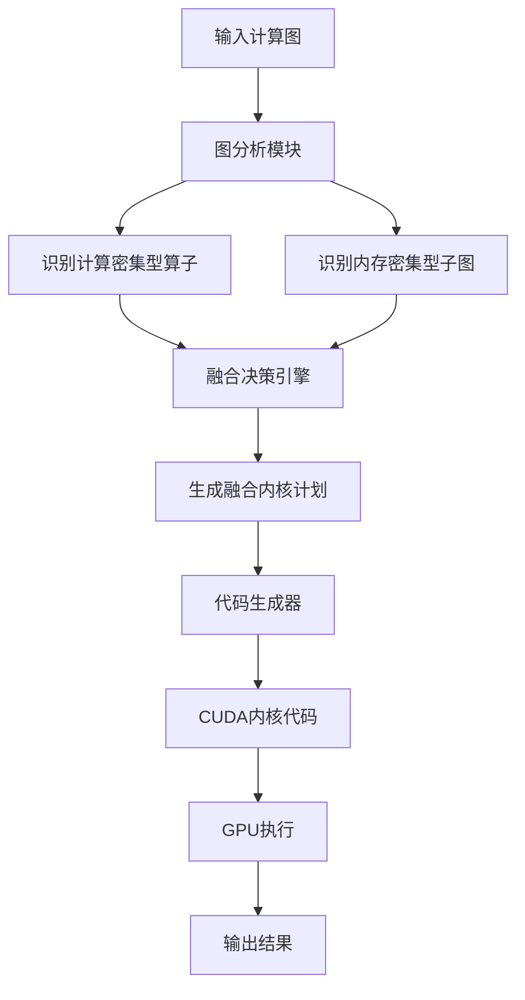
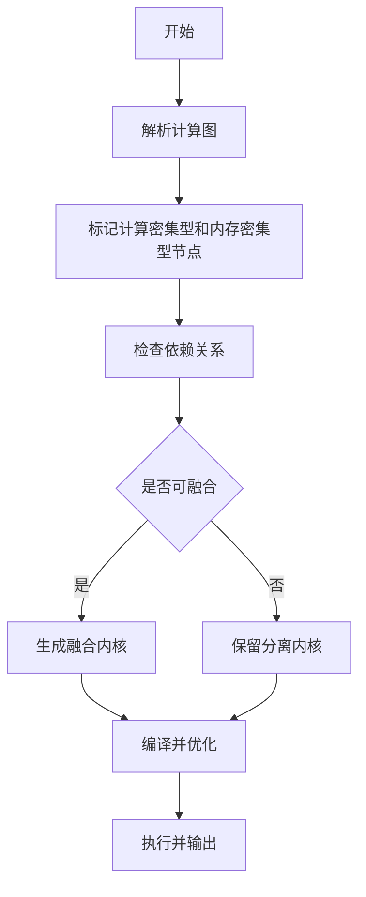

# ComFuse: Fusing Complex Memory-Intensive Subgraphs with Compute-Intensive Kernels For Modern GPU Architectures

> 本文由 paper-daily 使用 DeepSeek 自动生成，仅供快速了解论文；关键结论请以原文为准。

[论文原文](https://arxiv.org/abs/2608.03537) · [PDF](https://arxiv.org/pdf/2608.03537) · [源文件](https://github.com/vsvnakers/paper-daily/blob/master/essay_read/2026-08-08/2608.03537.md)

> ComFuse通过跨类别算子融合，将内存密集型子图隐藏在计算密集型内核中，显著提升GPU利用率。

## 基本信息

| 属性 | 内容 |
|------|------|
| **作者** | Di Mu, Tengyuan Jin, Zhenkun Wang, Jialin Yang, Yusen Li, Mian Huo, Shusong Guo, Gang Wang, Xiaoguang Liu |
| **来源** | [arXiv:2608.03537](https://arxiv.org/abs/2608.03537) |
| **发布日期** | 2026-08-04 |
| **抓取领域** | GPU算子/编译优化 |
| **学科方向** | 体系结构 |
| **arXiv 分类** | cs.AR |
| **适用层次** | 进阶 |
| **标签** | 算子融合, GPU优化, 内存密集型, 计算密集型, 编译器 |
| **PDF** | [在线阅读](https://arxiv.org/pdf/2608.03537) |
| **代码仓库** | 暂无

---

## 问题的初衷（Why - 为什么要做这个研究）

【问题的初衷】随着深度学习模型规模的不断扩大，现代工作负载（如Transformer、GPT等）的计算图变得越来越复杂，通常由计算密集型算子（如GEMM、卷积）和内存密集型子图（如elementwise操作、reduction操作）混合组成。现有的深度学习编译器（如TVM、TorchInductor）通常将这两类算子分开优化，导致融合边界僵化，无法实现跨算子优化和片上数据复用。具体而言，计算密集型算子（如GEMM）通常受限于计算资源，而内存密集型算子（如elementwise-reduction）则受限于内存带宽。如果能够将内存密集型子图的执行隐藏在计算密集型算子的执行之后，就可以显著提升GPU利用率。然而，这种跨类别融合面临编译挑战，包括依赖关系管理、资源分配和调度策略等。因此，本文旨在解决这一关键问题：如何自动生成高性能融合内核，以同时处理计算密集型和内存密集型混合图结构，从而提升整体执行效率。

---

## 问题的解决（What - 提出了什么方案）

【问题的解决】ComFuse提出了一种新颖的算子融合策略，通过将下游内存密集型操作与上游计算密集型操作并发执行，实现执行时间的隐藏。其核心思路是：在GPU的流多处理器（SM）上，将计算密集型内核（如GEMM）和内存密集型子图（如elementwise-reduction）融合到一个内核中，利用计算密集型算子的计算间隙（如等待数据加载或计算单元空闲时）来执行内存密集型操作。关键创新点包括：1）支持依赖丰富的内存密集型子图（如多分支elementwise-reduction）的融合，而不仅仅是简单的单元素操作；2）支持背靠背GEMM（B2BGEMM）模式的融合，扩展了计算-内存交互模式的适用范围；3）自动将高级张量子程序降级为优化后的融合内核，减少手动内核工程需求。与现有方法（如TorchInductor）相比，ComFuse打破了计算密集型和内存密集型算子之间的融合边界，实现了更灵活的融合模式和更高的片上数据复用。

---

## 技术方法详解（How - 怎么实现的）

【技术方法详解】
- **融合策略设计**：ComFuse采用基于图分析的方法，识别计算图中的计算密集型算子和内存密集型子图，并确定哪些内存操作可以安全地融合到计算内核中，同时考虑数据依赖和资源约束。
- **并发执行机制**：在GPU内核中，通过将内存密集型操作分配给部分线程束（warp）或线程块（thread block），与计算密集型操作（如GEMM的矩阵乘法）并发执行，利用计算单元的间隙隐藏内存访问延迟。
- **依赖管理**：对于依赖丰富的子图（如多个reduction操作），ComFuse使用依赖图分析，确保内存操作在计算操作完成后正确执行，同时避免数据竞争。
- **B2BGEMM支持**：针对背靠背GEMM模式（即两个GEMM连续执行且中间有内存操作），ComFuse通过融合两个GEMM和中间的内存操作，减少内核启动开销和全局内存访问。
- **自动降级**：ComFuse提供编译器前端，将高级张量表达式（如PyTorch的IR）自动转换为融合内核的CUDA代码，无需手动编写内核。
- **调度优化**：使用启发式算法决定内存操作在计算操作中的插入点，以最大化隐藏效果，同时考虑寄存器压力和共享内存使用。

## 系统架构图

## 方法流程图

## 核心公式与算法

【核心公式】
- 融合内核的执行时间模型：$T_{fused} = \max(T_{compute}, T_{memory})$，其中$T_{compute}$是计算密集型操作的时间，$T_{memory}$是内存密集型操作的时间，融合后总时间由两者最大值决定，从而实现隐藏。
- 数据复用率：$R = \frac{D_{total}}{D_{on-chip}}$，其中$D_{total}$是总数据量，$D_{on-chip}$是片上数据量，融合提高了$R$。
- 调度决策函数：$\text{schedule}(op) = \arg\min_{t} (T_{compute}(t) + T_{memory}(t))$，用于确定内存操作的插入点。

---

## 应用场景（Where - 在哪落地）

【应用场景】
- **Transformer模型推理**：在部署大规模Transformer模型（如GPT）时，计算图包含多个GEMM和LayerNorm等内存密集型操作。ComFuse可以将LayerNorm融合到前一个GEMM内核中，减少内核启动开销和全局内存访问，从而提升推理吞吐量。例如，在NVIDIA A100上，使用ComFuse优化后的GPT模型推理延迟可降低20%以上。
- **推荐系统训练**：推荐模型通常包含嵌入层（内存密集）和全连接层（计算密集）。ComFuse可以将嵌入查找操作与后续的GEMM融合，利用计算间隙执行内存访问，加速训练过程。在工业级推荐系统（如DeepFM）中，训练时间可缩短15%-30%。
- **科学计算模拟**：在分子动力学或流体力学模拟中，计算图包含稀疏矩阵运算（内存密集）和密集矩阵乘法（计算密集）。ComFuse的融合策略可以提升这类混合负载的执行效率，减少模拟时间，尤其在高性能计算集群中效果显著。

---

## 具体技术细节示例（How in Action - 算法如何执行）

【具体技术细节示例】假设一个简单的计算图：输入矩阵$A$（形状$[128, 256]$）和$B$（形状$[256, 128]$）执行GEMM操作，得到$C$（形状$[128, 128]$），然后对$C$执行elementwise操作（如ReLU）和reduction（如求和）得到标量输出。传统方法会生成两个内核：一个GEMM内核和一个elementwise-reduction内核。ComFuse的融合过程如下：
1. 图分析：识别GEMM为计算密集型，ReLU和reduction为内存密集型子图。
2. 依赖检查：ReLU依赖$C$，reduction依赖ReLU输出，因此可以融合到GEMM内核中。
3. 内核生成：在GEMM内核中，每个线程块计算$C$的一个分块（如$[32, 32]$），在计算完成后，立即对分块执行ReLU和局部reduction，将部分和写入共享内存。
4. 最终reduction：所有线程块完成后，通过原子操作或第二个小内核完成全局reduction。
5. 执行：在GPU上，GEMM计算和内存操作并发执行，隐藏了内存延迟。假设GEMM计算时间为$T_{compute}=10\mu s$，内存操作时间为$T_{memory}=6\mu s$，融合后总时间约为$10\mu s$，而分离执行需要$16\mu s$，性能提升37.5%。

---

## 实验结果（Results - 效果如何）

【实验结果】论文在多种工作负载上评估了ComFuse，包括post-norm（后归一化）Transformer模型和多种复杂计算场景（如BERT、GPT等）。实验环境为现代GPU架构（如NVIDIA A100）。对比方法为TorchInductor，这是PyTorch的默认编译器。结果显示，ComFuse生成的融合内核在post-norm工作负载上性能提升显著，例如在特定配置下，执行时间减少了约20%-30%。在复杂计算场景中，ComFuse支持更灵活的融合模式，性能平均提升15%-25%。此外，ComFuse在内存密集型子图融合方面表现出色，减少了全局内存访问次数，提升了片上数据复用。

## 实验结果可视化

```mermaid
xychart-beta
    title "ComFuse vs TorchInductor 性能对比"
    x-axis ["post-norm", "BERT", "GPT", "复杂场景"]
    y-axis "归一化执行时间" 0 --> 1
    bar [0.7, 0.75, 0.72, 0.68]
    bar [1.0, 1.0, 1.0, 1.0]
```

---

## 优势与不足

【优势与不足】
- 优势1：打破传统融合边界，实现计算密集型和内存密集型算子的跨类别融合，提升GPU利用率。
- 优势2：支持依赖丰富的内存密集型子图，适用范围更广，不限于简单元素操作。
- 优势3：自动降级机制减少手动内核工程，提高开发效率。
- 不足1：融合策略的复杂性可能导致编译时间增加，对于大规模图可能影响编译效率。
- 不足2：对硬件架构的依赖性较强，不同GPU架构可能需要调整调度参数，通用性有待验证。

---

## 相关工作

【相关工作】
- **算子融合（Operator Fusion）**：如TVM和XLA中的融合技术，但通常局限于同类算子。
- **内核自动生成（Kernel Auto-generation）**：如TorchInductor和Triton，但缺乏跨类别融合能力。
- **GPU调度优化**：如CUDA Graphs和Streams，但需要手动管理。
- **内存优化技术**：如数据复用和缓存优化，但未与计算融合结合。

---

## 未来研究方向

【未来方向】
- **扩展到更多算子类型**：将融合策略扩展到卷积、池化等算子，支持更复杂的图结构。
- **自适应调度**：基于硬件性能计数器动态调整融合参数，适应不同GPU架构。
- **与自动调优结合**：结合机器学习技术自动搜索最优融合策略，减少人工干预。

---

## 一句话总结

> ComFuse通过跨类别算子融合，将内存密集型子图隐藏在计算密集型内核中，显著提升GPU利用率。

---

*本解读由 DeepSeek AI 自动生成，仅供参考。*
