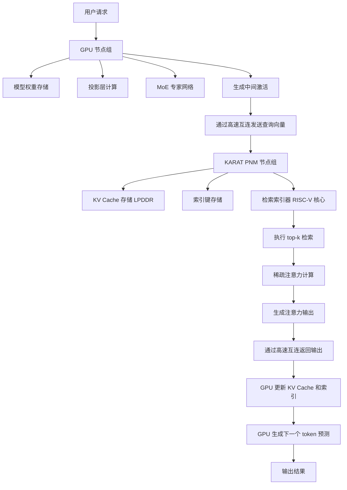
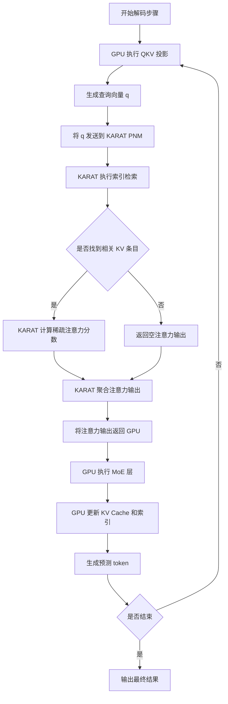
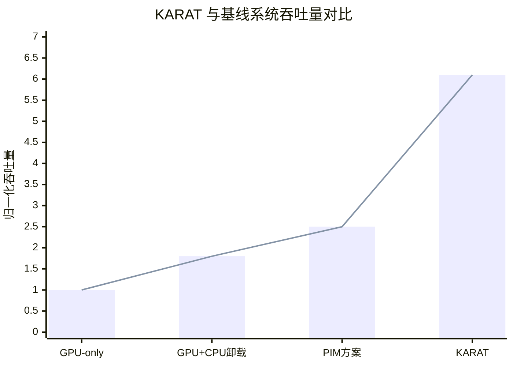

# Heterogeneous LLM Serving with General-Purpose Processing-Near-Memory for Retrieval-Based Sparse Attention

> 本文由 paper-daily 使用 DeepSeek 自动生成，仅供快速了解论文；关键结论请以原文为准。

[论文原文](https://arxiv.org/abs/2608.03555) · [PDF](https://arxiv.org/pdf/2608.03555) · [源文件](https://github.com/vsvnakers/paper-daily/blob/master/essay_read/2026-08-08/2608.03555.md)

> KARAT 通过将 KV Cache 驻留在通用 PNM 节点上，实现了百万级上下文的高效异构 LLM 解码服务。

## 基本信息

| 属性 | 内容 |
|------|------|
| **作者** | Hyungkyu Ham, Junhyeong Bae, Seungheon Lee, Myeongjae Jeon, Gwangsun Kim |
| **来源** | [arXiv:2608.03555](https://arxiv.org/abs/2608.03555) |
| **发布日期** | 2026-08-04 |
| **抓取领域** | LLM推理 · 服务与部署 |
| **学科方向** | 体系结构 |
| **arXiv 分类** | cs.AR |
| **适用层次** | 进阶 |
| **标签** | KV Cache, 处理近内存, 稀疏注意力, 异构计算, 大语言模型推理 |
| **PDF** | [在线阅读](https://arxiv.org/pdf/2608.03555) |
| **代码仓库** | 暂无

---

## 问题的初衷（Why - 为什么要做这个研究）

【问题的初衷】近年来，前沿大语言模型（Large Language Model, LLM）如 Gemini 1.5 和 GPT-4 Turbo 等，开始采用检索式稀疏注意力（Retrieval-Based Sparse Attention）机制来支持百万级 token 的上下文窗口。这种机制的核心思想是：在解码（decode）阶段，并非所有历史 token 的键值缓存（KV Cache）都需要参与注意力计算，而是通过检索（retrieval）操作只选择最相关的少数 token 进行计算。然而，这种机制带来了一个严重的系统瓶颈：KV Cache 的规模随上下文长度线性增长，对于百万级 token 的上下文，KV Cache 可能达到数十 GB 甚至数百 GB，远超 GPU 显存（如 H100 的 80GB）的容量。传统方案要么将 KV Cache 全部驻留在 GPU 显存中，这严重限制了可服务的上下文长度；要么将 KV Cache 卸载到 CPU 内存或 SSD，但这会引入巨大的 PCIe 或网络传输开销，导致解码延迟急剧增加。现有针对 PIM（Processing-In-Memory）和 PNM（Processing-Near-Memory）的设计主要针对低计算强度的 GEMV（General Matrix-Vector Multiplication）操作，但检索式稀疏注意力中的索引检索（index retrieval）和稀疏注意力计算具有不同的操作特征，这些假设不再成立。因此，亟需一种新的异构系统架构，能够在保持低延迟的同时，高效地支持百万级上下文的稀疏注意力解码。

---

## 问题的解决（What - 提出了什么方案）

【问题的解决】本文提出了 KARAT（KV-cache-resident Accelerator for Retrieval-based ATtention）系统，其核心思想是将解码阶段的计算按操作类型进行异构分区：GPU 节点持有模型权重并执行投影（projection）和混合专家（Mixture-of-Experts, MoE）层，而处理近内存（Processing-Near-Memory, PNM）节点持有 KV Cache 和索引键（index keys），并执行所有读取这些数据的操作。这种分区方式从根本上消除了 KV Cache 在 GPU 和 PNM 之间的移动需求。KARAT 设备的设计基于四个关键需求：1）高带宽内存以匹配检索密集型操作；2）通用计算能力以支持多样化的稀疏注意力算法；3）足够的片上存储以容纳索引结构；4）与 GPU 的高效互连。KARAT 将大容量 LPDDR 内存与为检索索引器（retrieval indexer）定制的通用计算单元相结合，实现了超越传统 PIM/PNM 设计的操作强度（operational intensity）。此外，论文还提出了机会性细粒度微批调度（Opportunistic Fine-grained Micro-batch Scheduling, OFMS）和上下文长度感知微批再平衡（Context-length-aware Micro-batch Rebalancing, CMR）两种调度策略，分别用于隐藏专家全对全通信（all-to-all）延迟和均衡不同上下文长度的微批 token 数量，从而减少 GPU 和 PNM 设备交替执行微批时的流水线气泡（pipeline bubbles）。

---

## 技术方法详解（How - 怎么实现的）

【技术方法详解】
- **异构分区策略**：将解码步骤按操作类型分为两类。GPU 负责计算量密集但不需要 KV Cache 的操作，包括 QKV 投影、MoE 层的专家前馈网络（Feed-Forward Network, FFN）等。PNM 负责所有需要读取 KV Cache 的操作，包括索引检索（index retrieval）、注意力分数计算、注意力输出聚合等。
- **KARAT 设备架构**：每个 KARAT 设备集成大容量 LPDDR5 内存（用于存储 KV Cache 和索引）和一组通用 RISC-V 核心（用于执行检索和稀疏注意力计算）。其设计目标是达到 $O(n)$ 的操作强度（operational intensity），即每字节数据执行 $O(n)$ 次浮点运算，这远高于传统 PIM 设计针对 GEMV 的 $O(1)$ 强度。
- **索引结构**：KARAT 使用基于倒排索引（inverted index）的检索机制。每个 KV 条目根据其键（key）被分配到多个列表（posting list）中。查询时，通过计算查询向量与列表中心（centroid）的相似度，选择 top-k 个最相关的列表进行扫描。
- **机会性细粒度微批调度（OFMS）**：在 MoE 模型中，专家 all-to-all 通信是主要瓶颈。OFMS 将微批（micro-batch）进一步细分为更小的子批次，并交错调度 GPU 和 PNM 的执行，使得一个设备的 GEMM 计算与另一个设备的 all-to-all 通信重叠，从而隐藏通信延迟。
- **上下文长度感知微批再平衡（CMR）**：由于不同请求的上下文长度差异巨大，导致分配给不同设备的微批 token 数量不均。CMR 根据每个微批的实际上下文长度动态调整其 token 分配，使得 GPU 和 PNM 的工作负载更加均衡，减少流水线气泡。
- **稀疏注意力算法兼容性**：KARAT 的通用计算核心可以支持多种稀疏注意力算法，包括基于聚类的（如 ClusterKV）、基于检索的（如 InfLLM）和基于窗口的（如 StreamingLLM）等，而固定功能单元（fixed-function unit）则无法适应算法的快速演进。

## 系统架构图

## 方法流程图

## 核心公式与算法

【核心公式】
1. **操作强度定义**：
$$\text{Operational Intensity} = \frac{\text{FLOPs}}{\text{Bytes Moved}}$$
KARAT 的目标是使检索和注意力计算的操作强度达到 $O(n)$，即每读取一个字节的 KV 数据执行 $O(n)$ 次浮点运算，这远高于传统 GEMV 的 $O(1)$ 强度。

2. **稀疏注意力计算**：
$$\text{Attention}(Q, K, V) = \text{softmax}\left(\frac{QK^T}{\sqrt{d_k}} \odot M\right)V$$
其中 $M$ 是稀疏掩码矩阵，由检索结果决定。KARAT 在 PNM 上执行此计算，只访问被检索到的 KV 条目。

3. **微批再平衡目标**：
$$\min \sum_{i} |T_i^{GPU} - T_i^{PNM}|$$
其中 $T_i^{GPU}$ 和 $T_i^{PNM}$ 分别是第 $i$ 个微批在 GPU 和 PNM 上的执行时间。CMR 通过调整微批的 token 分配来最小化两者之间的差异。

---

## 应用场景（Where - 在哪落地）

【应用场景】
1. **长上下文对话系统**：在智能客服、虚拟助手等场景中，系统需要维护多轮对话的完整历史。使用 KARAT 架构，可以支持超过百万 token 的对话历史，使得 AI 能够记住用户数月前的偏好和需求。例如，一个金融顾问 AI 可以同时处理数百个客户的长期投资记录，每个记录包含数万 token 的交易历史和市场分析。KARAT 的 PNM 节点存储所有客户的 KV Cache，GPU 只需处理当前查询的投影和 MoE 计算，实现了高并发和低延迟。

2. **代码生成与理解**：在软件开发场景中，AI 编程助手需要理解整个代码仓库的结构。一个大型项目可能包含数百万行代码，对应数千万 token。使用 KARAT，代码仓库的 KV Cache 可以完整驻留在 PNM 的大容量 LPDDR 中，GPU 负责生成代码补全建议。当开发者请求补全时，KARAT 的检索索引器快速定位相关代码片段，GPU 基于这些上下文生成高质量的代码建议。

3. **多文档分析**：在法律、医疗、科研等领域，专业人员需要同时分析大量文档。例如，法律 AI 需要阅读数百份判例文书，每份可能超过 10 万 token。KARAT 系统可以将所有文书的 KV Cache 存储在 PNM 节点，律师提问时，系统通过检索快速定位相关判例，并在 GPU 上生成综合法律意见。这大大提高了文档分析的效率和准确性。

---

## 具体技术细节示例（How in Action - 算法如何执行）

【具体技术细节示例】假设我们有一个 KARAT 系统，包含 1 个 GPU 节点和 1 个 KARAT PNM 节点。当前有一个请求，上下文长度为 100K token，查询向量 $q$ 的维度为 $d_k = 128$。

**步骤 1：GPU 执行投影**
GPU 接收输入 token，执行 QKV 投影，生成查询向量 $q \in \mathbb{R}^{128}$。假设投影计算耗时 $T_{proj} = 50\mu s$。

**步骤 2：发送查询向量**
GPU 通过 NVLink 将 $q$ 发送到 KARAT PNM。假设互连带宽为 100 GB/s，$q$ 大小为 $128 \times 4 = 512$ 字节，传输耗时 $T_{send} = 512 / 100 \times 10^9 = 5.12ns$，可忽略不计。

**步骤 3：KARAT 执行索引检索**
KARAT 的检索索引器接收 $q$，计算与所有索引中心的余弦相似度。假设索引有 $C = 1000$ 个中心，每个中心维度为 128。计算相似度需要 $1000 \times 128 = 128K$ 次乘加运算。KARAT 的 RISC-V 核心以 1 GHz 运行，每次乘加耗时 1ns，总耗时 $T_{retrieve} = 128K \times 1ns = 128\mu s$。选择 top-10 个最相关的中心，每个中心对应一个 posting list，平均每个 list 包含 1000 个 KV 条目。

**步骤 4：KARAT 执行稀疏注意力**
需要扫描 $10 \times 1000 = 10K$ 个 KV 条目。每个 KV 条目包含键 $k \in \mathbb{R}^{128}$ 和值 $v \in \mathbb{R}^{128}$。计算注意力分数需要 $10K \times 128 = 1.28M$ 次乘加运算，耗时 $T_{score} = 1.28M \times 1ns = 1.28ms$。然后计算注意力输出，需要对选中的 KV 值进行加权求和，同样需要 $1.28M$ 次乘加运算，耗时 $T_{output} = 1.28ms$。总注意力计算耗时 $T_{attn} = T_{score} + T_{output} = 2.56ms$。

**步骤 5：返回注意力输出**
KARAT 将注意力输出向量 $o \in \mathbb{R}^{128}$ 返回 GPU，传输耗时可忽略。

**步骤 6：GPU 执行 MoE 层**
GPU 接收注意力输出，执行 MoE 层。假设 MoE 层包含 8 个专家，每个专家是一个 FFN，计算量约为 $T_{moe} = 200\mu s$。同时，GPU 更新 KV Cache 和索引，将新的 KV 条目添加到对应的 posting list 中。

**总耗时**：$T_{total} = T_{proj} + T_{send} + T_{retrieve} + T_{attn} + T_{moe} = 50\mu s + 5ns + 128\mu s + 2.56ms + 200\mu s \approx 2.94ms$。

**对比 GPU-only 方案**：如果 KV Cache 在 GPU 显存中，GPU 需要执行全量注意力计算，即 $100K \times 128 = 12.8M$ 次乘加运算，耗时 $T_{full} = 12.8M \times 1ns = 12.8ms$。KARAT 通过稀疏检索将计算量减少了约 10 倍，显著降低了延迟。

---

## 实验结果（Results - 效果如何）

【实验结果】论文在三个最先进的模型上进行了评估：一个基于 MoE 的 8B 激活参数模型（模拟 GPT-4 风格）、一个 7B 稠密模型和一个 70B 稠密模型。使用真实的 agentic 追踪（agentic traces）作为工作负载，这些追踪模拟了多轮对话和工具调用场景，上下文长度从 10K 到 1M token 不等。对比基线包括：GPU-only 系统（KV Cache 全部驻留显存）、GPU+CPU 卸载系统、以及基于 PIM 的稀疏注意力系统。实验结果显示，在服务级目标（Service-Level Objective, SLO）约束下，KARAT 系统相比 GPU-only 基线实现了 2.09-6.13x 的每 TDP 吞吐量提升。对于无需训练的稀疏注意力方法（如 ClusterKV、InfLLM），KARAT 实现了 1.36-3.21x 的性能提升。此外，KARAT 成功支持了 1M token 的上下文长度，而 GPU-only 基线在 100K token 时即因显存不足而失败。

## 实验结果可视化

---

## 优势与不足

【优势与不足】
**优势：**
1. **架构创新性**：首次提出将 KV Cache 完全移出 GPU 并驻留在 PNM 上的异构解码架构，从根本上解决了显存容量瓶颈。
2. **算法通用性**：基于通用计算核心的设计可以灵活支持多种稀疏注意力算法，适应算法快速演进的趋势，而固定功能单元则无法做到。
3. **系统级优化**：提出的 OFMS 和 CMR 调度策略有效解决了异构设备间的负载均衡和通信隐藏问题，显著提升了系统吞吐量。
4. **可扩展性**：PNM 节点可以按需扩展，支持更大的上下文长度和并发请求数。

**不足：**
1. **硬件实现成本**：KARAT 需要定制化的 PNM 硬件，包括大容量 LPDDR 和通用计算核心，实际部署成本较高。
2. **互连带宽依赖**：GPU 和 PNM 之间的高速互连是系统性能的关键，如果互连带宽不足，可能成为新的瓶颈。
3. **索引维护开销**：随着 KV Cache 的不断增长，索引结构的更新和维护会带来额外的计算和存储开销。

---

## 相关工作

【相关工作】
1. **KV Cache 卸载技术**：如 FlexGen、DeepSpeed-Inference 等，将 KV Cache 卸载到 CPU 或 SSD，但受限于 PCIe 带宽。
2. **处理近内存架构（PNM）**：如 UpMem、Samsung's PNM 等，将计算单元靠近内存放置，但主要针对 GEMV 等低强度操作。
3. **稀疏注意力机制**：如 Longformer、BigBird、ClusterKV、InfLLM 等，通过稀疏化注意力计算来降低计算复杂度。
4. **MoE 模型推理优化**：如 FasterMoE、Tutel 等，针对 MoE 层的 all-to-all 通信进行优化。
5. **异构计算调度**：如 Orca、vLLM 等，通过连续批处理和 PagedAttention 优化 GPU 利用率。

---

## 未来研究方向

【未来方向】
1. **自适应索引结构**：当前 KARAT 使用静态的倒排索引，未来可以研究基于学习到的索引（learned index）或动态调整聚类中心的方法，以适应 KV Cache 分布的变化，进一步提高检索效率。
2. **多级存储层次**：将 KARAT 的 PNM 设计与 SSD 等持久化存储结合，实现 KV Cache 的多级驻留，支持无限长度的上下文，同时利用智能预取（prefetching）技术减少冷启动延迟。
3. **端到端联合优化**：将 KARAT 的硬件设计与上层调度器（如 vLLM、Ray）深度集成，实现 KV Cache 感知的请求路由和负载均衡，进一步优化整体系统吞吐量和资源利用率。

---

## 一句话总结

> KARAT 通过将 KV Cache 驻留在通用 PNM 节点上，实现了百万级上下文的高效异构 LLM 解码服务。

---

*本解读由 DeepSeek AI 自动生成，仅供参考。*
