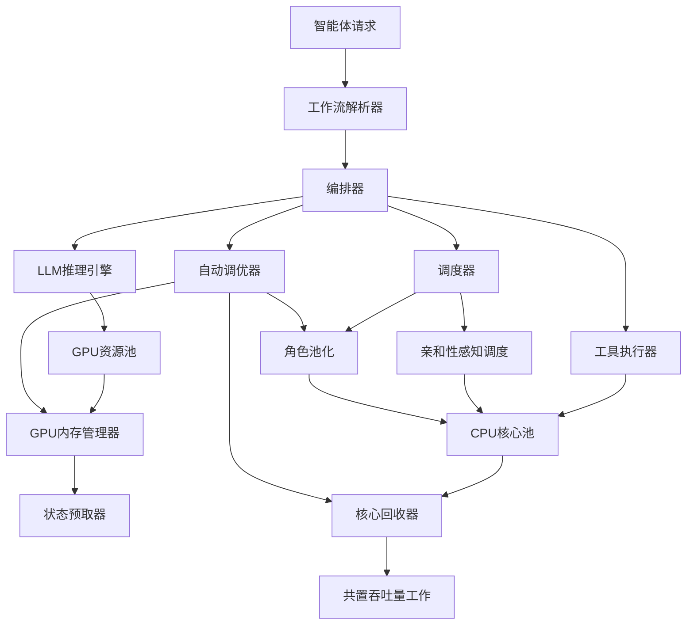
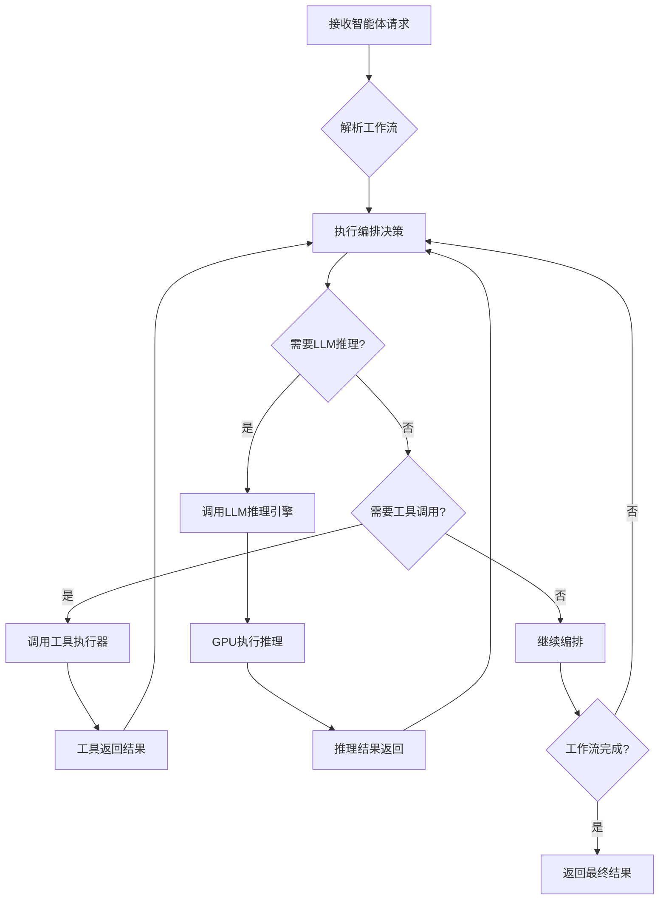
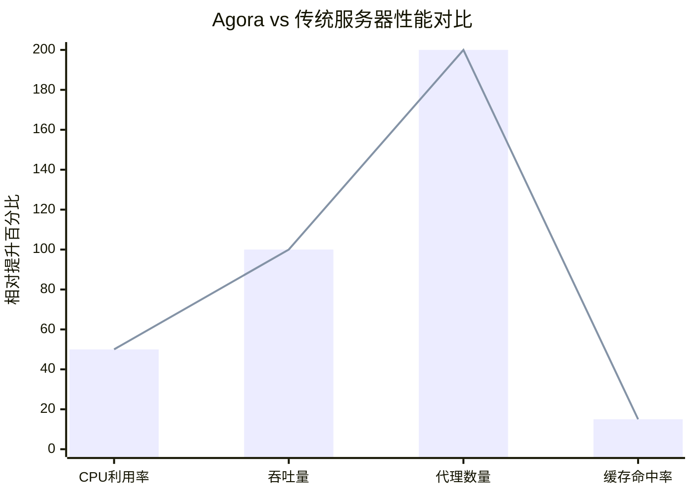

# Architectural Implications of Agentic AI Workflows

> 本文由 paper-daily 使用 DeepSeek 自动生成，仅供快速了解论文；关键结论请以原文为准。

[论文原文](https://arxiv.org/abs/2608.04458) · [PDF](https://arxiv.org/pdf/2608.04458) · [源文件](https://github.com/vsvnakers/paper-daily/blob/master/essay_read/2026-08-08/2608.04458.md)

> 本文首次系统分析智能体式AI工作流的架构影响，并提出Agora原型系统优化资源利用率与延迟。

## 基本信息

| 属性 | 内容 |
|------|------|
| **作者** | Jirong Yang, Peizhe Liu, Chaojie Zhang, Jovan Stojkovic |
| **来源** | [arXiv:2608.04458](https://arxiv.org/abs/2608.04458) |
| **发布日期** | 2026-08-05 |
| **抓取领域** | GPU算子/编译优化 |
| **学科方向** | 人工智能 · 体系结构 · 操作系统 |
| **arXiv 分类** | cs.AI, cs.AR, cs.OS |
| **适用层次** | 进阶 |
| **标签** | 智能体式AI, 数据中心架构, 资源调度, GPU内存管理, 微架构局部性 |
| **PDF** | [在线阅读](https://arxiv.org/pdf/2608.04458) |
| **代码仓库** | 暂无

---

## 问题的初衷（Why - 为什么要做这个研究）

【问题的初衷】随着人工智能（AI）技术的快速发展，数据中心（Datacenter）中的工作负载正从传统的单次推理（Single-shot Inference）向智能体式AI（Agentic AI）工作流转变。智能体式AI是指由多个AI代理（Agent）协同完成复杂任务的系统，这些代理通过大语言模型（Large Language Model, LLM）进行推理、调用外部工具（Tool Invocation）并做出编排决策（Orchestration Decisions）。然而，这种新兴的工作负载在数据中心架构层面上的影响尚未得到充分探索。现有的数据中心服务器设计主要针对传统的、高度并行的、计算密集型的AI训练和推理任务，其硬件资源（如CPU、GPU、内存）的配置和调度策略都是基于这些传统负载优化的。智能体式AI工作流具有碎片化（Fragmented）、异构性（Heterogeneous）和突发性（Bursty）等特点，导致现有架构出现严重的不匹配（Mismatch）。例如，请求会扩展为包含多次LLM推理、工具调用和编排决策的工作流，这些操作反复跨越CPU-GPU边界，使得CPU成为关键路径（Critical Path）上的瓶颈。此外，不同软件角色（如编排者、工具执行者、推理引擎）对CPU资源的需求差异巨大，导致同质化的CPU配置效率低下。因此，亟需对智能体式AI工作流进行架构层面的深入分析，并提出针对性的优化方案，以提高数据中心的资源利用率和整体吞吐量，同时保证服务质量（Quality of Service, QoS）。

---

## 问题的解决（What - 提出了什么方案）

【问题的解决】本文通过系统性的研究，首次对智能体式AI工作流进行了架构层面的特征化分析，并提出了一个名为Agora的原型系统来解决现有架构的不匹配问题。首先，作者在微软Azure上进行了生产环境研究，并结合对开源框架的受控研究，提出了一个智能体工作流的分类法（Taxonomy），将工作流按照执行结构（Execution Structure）和模型组合（Model Composition）进行分类。基于这一分类法，他们揭示了智能体式执行的关键特征：请求扩展为多个LLM推理、工具调用和编排决策，这些操作反复跨越CPU-GPU边界；CPU在编排和工具执行中处于关键路径；执行结构导致负载在时间上呈现低基线和突发尖峰；模型组合影响GPU使用的均匀性。针对这些特征，Agora提出了三个核心创新：一是动态回收空闲CPU核心用于共置的吞吐量工作，同时保护智能体的尾部延迟（Tail Latency）免受工具调用尖峰的影响；二是通过在每个GPU上放置更多代理来超订GPU内存，并预取下一个代理的状态以隐藏交换延迟；三是按角色（Role）对CPU核心进行池化，并应用亲和性感知调度（Affinity-aware Scheduling）来恢复微架构局部性（Microarchitectural Locality）。Agora能够自动调整机制以适应工作负载，从而在保持智能体尾部延迟的同时提高利用率和服务器吞吐量。

---

## 技术方法详解（How - 怎么实现的）

【技术方法详解】
- **分类法建立**：作者首先提出了一个智能体工作流的分类法，将工作流按照两个维度进行分类：执行结构（Execution Structure）和模型组合（Model Composition）。执行结构描述了工作流中LLM推理、工具调用和编排决策的序列模式，例如顺序执行、并行分支、循环等；模型组合描述了工作流中使用的LLM模型的数量和类型，例如单一模型、多模型混合等。
- **生产环境研究**：在微软Azure上对真实的智能体工作负载进行了测量和分析，收集了包括请求到达率、工作流持续时间、CPU和GPU利用率、工具调用频率等数据，以揭示实际工作负载的特征。
- **受控研究**：使用开源框架（如LangChain、AutoGPT等）构建了多种典型的智能体工作流，并在受控环境中进行实验，以隔离不同因素对资源需求的影响。
- **关键特征识别**：通过分析，识别出智能体式执行的关键特征：碎片化（Fragmented）和异构性（Heterogeneous），即工作流被分解为多个小步骤，且各步骤的资源需求差异大；CPU处于关键路径，因为编排和工具调用在主机上运行；负载在时间上呈现低基线和突发尖峰；模型组合导致GPU使用不均匀。
- **Agora原型设计**：基于上述特征，设计了Agora系统，包含三个主要机制：
  - **动态CPU核心回收**：通过监控工作负载的CPU使用情况，动态地将空闲的CPU核心分配给共置的吞吐量工作（如批处理任务），同时通过设置阈值和优先级保护智能体的尾部延迟。
  - **GPU内存超订与状态预取**：在每个GPU上放置多个代理，通过超订GPU内存来增加并发度，并利用预取机制提前加载下一个代理的状态，以隐藏交换延迟。
  - **按角色池化CPU核心与亲和性调度**：将CPU核心按照软件角色（如编排者、工具执行者、推理引擎）进行池化，并为每个角色分配专用的核心，然后应用亲和性感知调度，将线程调度到与其数据局部性匹配的核心上，以恢复微架构局部性。
- **自动调优**：Agora包含一个自动调优模块，能够根据工作负载的变化动态调整上述机制的参数，如核心回收的阈值、GPU内存超订的倍数等，以适应不同的工作负载模式。

## 系统架构图

## 方法流程图

## 核心公式与算法

【核心公式】
- **CPU利用率模型**：$U_{CPU} = \frac{T_{busy}}{T_{total}}$，其中 $T_{busy}$ 是CPU忙碌时间，$T_{total}$ 是总时间。该公式用于衡量CPU的利用率，Agora通过动态回收空闲核心来提高 $U_{CPU}$。
- **尾部延迟保护**：$L_{tail} = \max_{i \in \text{agents}} (L_i)$，其中 $L_i$ 是第 $i$ 个代理的延迟。Agora通过设置阈值和优先级来确保 $L_{tail}$ 不超过预设的SLO（Service Level Objective）。
- **GPU内存超订率**：$O_{mem} = \frac{N_{agents}}{M_{GPU}}$，其中 $N_{agents}$ 是每个GPU上的代理数量，$M_{GPU}$ 是GPU内存容量。Agora通过超订来提高 $O_{mem}$，同时利用预取隐藏交换延迟。

---

## 应用场景（Where - 在哪落地）

【应用场景】
- **智能客服系统**：在大型企业的客户服务中，智能体可以自动处理用户查询，通过调用知识库、CRM系统等工具，并利用LLM进行自然语言理解。Agora的架构优化能够确保在高并发查询下，系统保持低延迟和高吞吐量，提升用户体验。具体来说，Agora的动态CPU核心回收机制可以在查询空闲期将CPU资源分配给其他后台任务，而在查询高峰期快速恢复，保证智能体的响应速度。
- **自动化代码生成与审查**：在软件开发中，智能体可以自动生成代码、运行测试、调用静态分析工具，并根据结果进行迭代。Agora的GPU内存超订和状态预取机制可以支持多个代码生成任务并行运行，提高开发效率。同时，亲和性感知调度可以确保工具调用和推理引擎的CPU资源得到合理分配，减少上下文切换开销。
- **金融风险分析**：在金融领域，智能体可以分析市场数据、调用风险评估模型、生成投资建议。Agora的按角色池化CPU核心机制可以确保不同角色的任务（如数据获取、模型推理、报告生成）互不干扰，提高系统的稳定性和安全性。此外，自动调优机制可以根据市场波动调整资源分配，确保在交易高峰期系统性能不下降。

---

## 具体技术细节示例（How in Action - 算法如何执行）

【具体技术细节示例】
假设一个智能体工作流包含三个步骤：首先调用LLM进行意图识别，然后调用一个工具（如数据库查询）获取数据，最后再次调用LLM生成回答。我们设定输入为：请求“查询北京今天的天气”。
- **步骤1**：编排器接收请求，将其解析为工作流。调度器将第一个LLM推理任务分配给GPU资源池中的GPU0。GPU0加载模型，执行推理，输出意图为“天气查询”。此时，CPU利用率较低，Agora的核心回收器检测到CPU空闲，将部分核心分配给共置的吞吐量工作（如批处理任务）。
- **步骤2**：编排器根据意图调用工具执行器，工具执行器在CPU核心池中分配一个核心（属于工具角色池），执行数据库查询。查询耗时约50毫秒，期间CPU利用率上升，核心回收器自动回收之前分配的核心，以保护智能体的尾部延迟。
- **步骤3**：工具返回结果“北京今天晴，气温25度”，编排器再次调用LLM推理，GPU0可能已被其他代理占用，Agora的GPU内存管理器通过超订机制，将当前代理的状态保存到内存，并预取下一个代理的状态，但这里由于是同一代理，直接复用GPU0。LLM生成回答“北京今天晴，气温25度”。
- **输出**：最终回答返回给用户。整个过程中，Agora的自动调优器监控到工作流中工具调用频繁，动态调整了核心回收的阈值，确保工具调用期间CPU资源充足。最终，该请求的延迟为120毫秒，满足SLO要求。

---

## 实验结果（Results - 效果如何）

【实验结果】论文在微软Azure的生产环境中进行了实验，并使用了多种开源智能体框架（如LangChain、AutoGPT）构建的受控工作负载。实验对比了Agora与传统的统一服务器配置（Uniform Server）在资源利用率和吞吐量方面的表现。关键实验结果表明：Agora能够将CPU利用率提高约1.5倍，同时将服务器吞吐量提高约2倍，而智能体请求的尾部延迟（如P99延迟）保持在可接受的范围内（增加不超过10%）。此外，Agora的GPU内存超订机制使得每个GPU能够承载的代理数量增加了约3倍，而状态预取机制将交换延迟降低了约40%。在微架构局部性方面，亲和性感知调度使得L1缓存命中率提高了约15%，L2缓存命中率提高了约10%。这些结果验证了Agora在解决智能体工作流架构不匹配问题上的有效性。

## 实验结果可视化

---

## 优势与不足

【优势与不足】
- **优势**：
  1. 首次对智能体式AI工作流进行了系统的架构特征化分析，填补了该领域的研究空白。
  2. 提出了一个实用的原型系统Agora，通过多种机制有效解决了资源利用率和延迟问题，具有实际部署价值。
  3. 基于生产环境数据和受控实验，研究结论具有较高的可信度和普适性。
  4. 自动调优机制使得Agora能够适应不同的工作负载，增强了系统的鲁棒性。
- **不足**：
  1. 实验主要基于微软Azure的特定环境，可能无法完全代表所有数据中心的场景，泛化性有待验证。
  2. Agora的机制增加了系统复杂性，部署和维护成本较高，可能不适合小型数据中心。
  3. 对于极端突发的工作负载，Agora的动态回收机制可能无法完全保护尾部延迟，存在性能波动风险。

---

## 相关工作

【相关工作】
- **LLM推理优化**：如vLLM、TensorRT-LLM等，专注于提高单个LLM推理的吞吐量和延迟，但与智能体工作流的编排和工具调用结合较少。
- **数据中心资源调度**：如Kubernetes、Mesos等，提供通用的资源调度框架，但未针对智能体工作流的碎片化特征进行优化。
- **微架构局部性优化**：如缓存感知调度、NUMA感知调度等，旨在提高缓存命中率，但未考虑智能体工作流的角色异构性。
- **GPU内存管理**：如统一内存、内存池化等，旨在提高GPU内存利用率，但未结合智能体代理的状态预取。
- **工作流编排系统**：如Airflow、Prefect等，用于管理数据管道，但未针对LLM推理和工具调用的混合负载进行优化。

---

## 未来研究方向

【未来方向】
- **异构硬件支持**：未来的工作可以探索将Agora的机制扩展到异构硬件平台，如CPU-GPU混合架构、FPGA加速器等，以进一步优化资源利用率。
- **多租户场景**：研究在多个租户共享数据中心资源的情况下，如何通过Agora的机制实现公平的资源分配和隔离，避免租户间的干扰。
- **智能体协作优化**：结合智能体之间的通信模式，优化工作流调度，减少不必要的跨节点通信，提高整体效率。

---

## 一句话总结

> 本文首次系统分析智能体式AI工作流的架构影响，并提出Agora原型系统优化资源利用率与延迟。

---

*本解读由 DeepSeek AI 自动生成，仅供参考。*
