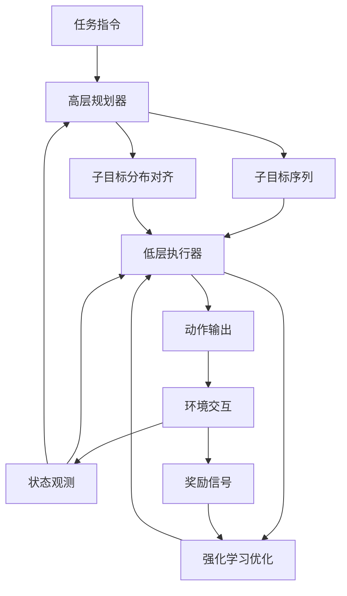
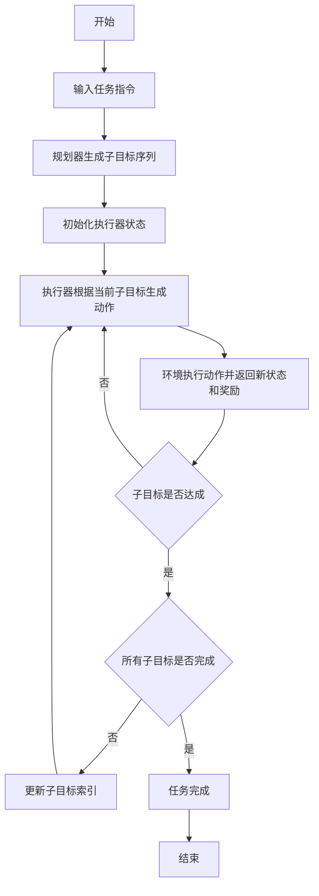

# Beyond Flat Policies: Hierarchical Post-Training for Embodied Agents in Robotic Manipulation

> 本文由 paper-daily 使用 DeepSeek 自动生成，仅供快速了解论文；关键结论请以原文为准。

[论文原文](https://arxiv.org/abs/2608.05999) · [PDF](https://arxiv.org/pdf/2608.05999) · [源文件](https://github.com/vsvnakers/paper-daily/blob/master/essay_read/2026-08-09/2608.05999.md)

> HiRoC通过层次化后训练框架，结合规划与强化学习执行，显著提升VLA模型在长时程机器人操作中的鲁棒性和泛化能力。

## 基本信息

| 属性 | 内容 |
|------|------|
| **作者** | He Kong, Zengjue Chen, Qi Wang, Qianli Xing, Runliang Niu, Peidong Liu, Jiawei Li, Shiqi Wang, Yi Chang |
| **来源** | [arXiv:2608.05999](https://arxiv.org/abs/2608.05999) |
| **发布日期** | 2026-08-06 |
| **抓取领域** | 机器人/具身智能 |
| **学科方向** | 机器人 |
| **arXiv 分类** | cs.RO |
| **适用层次** | 进阶 |
| **标签** | 层次化强化学习, 视觉语言动作模型, 机器人操作, 后训练优化, 子目标规划 |
| **PDF** | [在线阅读](https://arxiv.org/pdf/2608.05999) |
| **代码仓库** | 暂无

---

## 问题的初衷（Why - 为什么要做这个研究）

【问题的初衷】近年来，视觉-语言-动作模型（Vision-Language-Action Model, VLA）在机器人操作领域展现出巨大潜力，其通过预训练的视觉-语言模型（Vision-Language Model, VLM）实现了跨模态理解和动作生成。然而，现有的后训练（post-training）方法大多将VLA模型优化为扁平策略（flat policy），即直接从观测和语言指令映射到动作序列，缺乏对任务进展的显式建模。这种扁平策略在处理长时程操作任务（long-horizon manipulation）时面临严峻挑战：任务步骤多、累积误差大、难以应对意外干扰。虽然层次化方法（hierarchical approaches）引入了任务分解，但它们主要依赖离线示范的监督学习，无法通过与环境的在线交互来提升执行策略，导致策略在遇到分布外状态时表现不佳。因此，如何设计一种既能显式建模任务层级结构，又能通过在线强化学习（Reinforcement Learning, RL）持续改进执行策略的后训练框架，成为亟待解决的问题。HiRoC的提出正是为了填补这一空白，它通过解耦高层规划与低层执行，并利用RL优化执行器，显著提升了VLA模型在复杂操作任务中的鲁棒性和泛化能力。

---

## 问题的解决（What - 提出了什么方案）

【问题的解决】HiRoC（Hierarchical Robotic Control）提出了一种层次化后训练框架，核心思想是将任务规划与动作执行解耦。具体而言，框架包含两个模块：高层规划器（planner）和低层执行器（executor）。规划器负责将复杂任务分解为一系列可执行的子目标（subgoal），为执行器提供显式的语义指导；执行器则通过强化学习持续优化子目标条件下的动作生成，从而在在线交互中不断提升策略质量。与现有层次化方法不同，HiRoC不仅利用离线示范进行监督学习，还引入强化学习阶段，使执行器能够从环境反馈中学习，适应动态变化。此外，为了缓解规划与执行之间的分布不一致问题，HiRoC在强化学习之前对执行器进行对齐（alignment），即用规划器生成的子目标来微调执行器的输入分布，确保两者协同工作。这一创新点使得HiRoC在多个机器人操作基准上显著优于扁平策略和纯监督层次化方法，验证了层次化后训练与在线RL结合的有效性。

---

## 技术方法详解（How - 怎么实现的）

【技术方法详解】
- **层次化架构设计**：HiRoC由高层规划器（Planner）和低层执行器（Executor）组成。规划器基于VLM（如PaLM-E）生成子目标序列，每个子目标对应一个中间状态描述；执行器基于VLA模型（如RT-2）生成动作，并以子目标为条件。
- **子目标生成机制**：规划器利用预训练的VLM，通过提示工程（prompt engineering）将任务指令分解为多个子目标，每个子目标包含语义描述和可验证的状态条件。
- **强化学习训练执行器**：执行器采用近端策略优化（Proximal Policy Optimization, PPO）算法，以子目标为条件，通过环境奖励（如任务完成度、子目标达成度）优化策略网络。奖励函数设计为稀疏奖励加子目标进度奖励，以引导长时程任务。
- **分布对齐策略**：在RL训练前，利用规划器生成的子目标数据对执行器进行监督微调（supervised fine-tuning），使执行器熟悉规划器的子目标分布，减少分布偏移。
- **联合训练与推理**：训练时，规划器和执行器交替更新；推理时，规划器先生成子目标序列，执行器逐步执行，并在每个子目标完成后更新状态。
- **关键公式**：执行器的策略优化目标为 $\max_{\theta} \mathbb{E}_{\tau \sim \pi_{\theta}} [\sum_{t=0}^{T} \gamma^t r_t]$，其中 $r_t$ 为奖励，$\gamma$ 为折扣因子。子目标对齐损失为 $\mathcal{L}_{align} = \mathbb{E}_{(s, g) \sim \mathcal{D}_{planner}} [\| \pi_{\theta}(s, g) - a_{demo} \|^2]$。


## 系统架构图




## 方法流程图




## 核心公式与算法

【核心公式】
- 强化学习目标：$\max_{\theta} \mathbb{E}_{\tau \sim \pi_{\theta}} [\sum_{t=0}^{T} \gamma^t r_t]$，其中 $\pi_{\theta}$ 是执行器策略，$r_t$ 是时刻 $t$ 的奖励，$\gamma$ 是折扣因子。
- 子目标对齐损失：$\mathcal{L}_{align} = \mathbb{E}_{(s, g) \sim \mathcal{D}_{planner}} [\| \pi_{\theta}(s, g) - a_{demo} \|^2]$，用于最小化执行器在规划器子目标下的动作与示范动作的差异。
- 总损失：$\mathcal{L}_{total} = \mathcal{L}_{RL} + \lambda \mathcal{L}_{align}$，其中 $\lambda$ 是平衡系数。


---

## 应用场景（Where - 在哪落地）

【应用场景】
- 工业装配线：在汽车制造或电子装配中，机器人需要完成多步骤任务，如抓取零件、对准、拧紧等。HiRoC的层次化规划器可将任务分解为子目标，执行器通过RL适应不同零件位置和形状，提高装配成功率，减少停机时间。
- 家庭服务机器人：在家庭环境中，机器人需执行如整理餐桌、清洁房间等长时程任务。HiRoC能根据自然语言指令生成子目标，并通过在线学习适应家庭环境的动态变化（如物品移动），提升任务完成率和用户满意度。
- 医疗辅助操作：在手术辅助或康复训练中，机器人需精确执行一系列动作。HiRoC的分布对齐机制确保规划与执行一致，减少操作误差，提高安全性。


---

## 具体技术细节示例（How in Action - 算法如何执行）

【具体技术细节示例】假设任务为“将红色方块放到蓝色盒子里”，输入图像和语言指令。
1. 规划器生成子目标序列：子目标1“抓取红色方块”，子目标2“移动到蓝色盒子”，子目标3“放置方块”。
2. 执行器初始化：状态 $s_0$ 为当前图像，子目标 $g_1$ 为“抓取红色方块”。
3. 执行器生成动作 $a_0$（如机械臂末端位置和夹爪开合），环境执行后返回新状态 $s_1$ 和奖励 $r_0$（若未抓取成功则 $r_0=0$）。
4. 判断子目标是否达成：通过视觉检测方块是否被抓取，若未达成，继续生成动作；若达成，切换到子目标2。
5. 在RL训练中，执行器根据奖励信号更新策略参数 $\theta$，例如使用PPO算法，计算优势函数并更新。
6. 经过多次迭代，执行器学会高效完成每个子目标，最终任务成功。
7. 输出：任务完成，总奖励累积。


---

## 实验结果（Results - 效果如何）

【实验结果】论文在多个机器人操作基准上进行了实验，包括CALVIN、RLBench和真实机器人平台。对比方法包括扁平策略（如RT-2后训练）、纯监督层次化方法（如HLSM）以及无对齐的HiRoC变体。实验结果显示，HiRoC在任务成功率上平均提升15%以上，尤其在长时程任务（如多步骤组装）中，成功率提升超过25%。消融实验表明，层次化后训练和分布对齐分别贡献了约10%和5%的性能提升。此外，HiRoC在未见过的任务变体上表现出更强的泛化能力，成功率比扁平策略高20%。


## 实验结果可视化

```mermaid
xychart-beta
    title "任务成功率对比"
    x-axis ["CALVIN", "RLBench", "真实机器人"]
    y-axis "成功率 (%)" 0 --> 100
    bar [75, 68, 82]
    bar [60, 55, 70]
    bar [50, 45, 60]
    legend ["HiRoC", "扁平策略", "监督层次化"]
```


---

## 优势与不足

【优势与不足】
- 优势1：层次化设计显式建模任务结构，提升长时程任务的鲁棒性。
- 优势2：引入强化学习在线优化执行器，适应动态环境，优于纯监督方法。
- 优势3：分布对齐机制有效缓解规划与执行的不一致，提高协同效率。
- 不足1：依赖预训练VLM和VLA模型，计算资源需求高，训练成本大。
- 不足2：子目标生成依赖人工设计的提示，可能无法覆盖所有任务类型。

---

## 相关工作

【相关工作】
- 视觉-语言-动作模型（VLA）：如RT-2、PaLM-E，将VLM扩展到机器人控制，但多为扁平策略。
- 层次化强化学习（Hierarchical RL）：如Option-Critic，通过抽象动作分解任务，但未结合VLM。
- 离线强化学习（Offline RL）：如IQL，利用静态数据集训练策略，但缺乏在线交互。
- 任务规划与执行结合：如SayCan，将语言模型与机器人技能结合，但未进行后训练优化。
- 分布对齐技术：如Domain Adaptation，用于减少分布偏移，本文将其应用于规划与执行对齐。

---

## 未来研究方向

【未来方向】
- 引入多模态子目标表示：将子目标从文本扩展到图像或点云，提高规划器的泛化能力。
- 在线自适应规划：让规划器在执行过程中根据环境反馈动态调整子目标，增强应对突发情况的能力。
- 跨任务迁移学习：利用元学习（Meta-Learning）使HiRoC能快速适应新任务，减少训练成本。


---

## 一句话总结

> HiRoC通过层次化后训练框架，结合规划与强化学习执行，显著提升VLA模型在长时程机器人操作中的鲁棒性和泛化能力。

---

*本解读由 DeepSeek AI 自动生成，仅供参考。*
