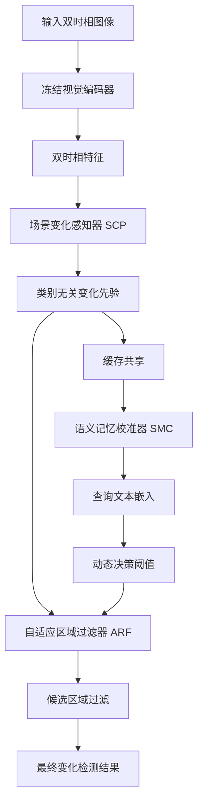
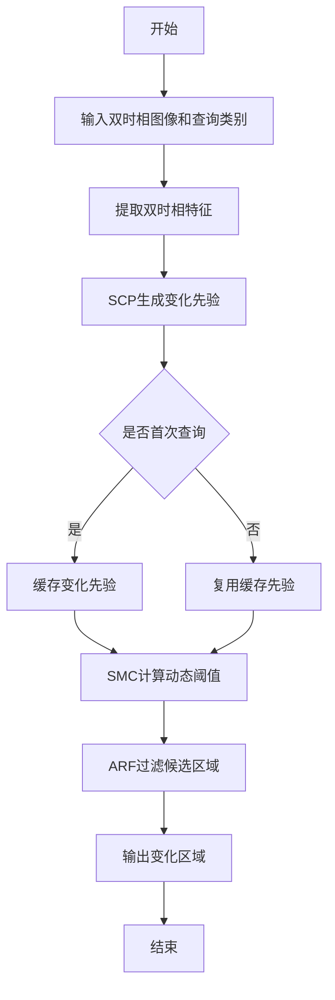

# CogVis: Must Open-Vocabulary Change Detection Perceive the Scene Anew for Every Query?

> 本文由 paper-daily 使用 DeepSeek 自动生成，仅供快速了解论文；关键结论请以原文为准。

[论文原文](https://arxiv.org/abs/2608.06150) · [PDF](https://arxiv.org/pdf/2608.06150) · [源文件](https://github.com/vsvnakers/paper-daily/blob/master/essay_read/2026-08-09/2608.06150.md)

> CogVis通过认知记忆引导的感知-记忆-验证范式，解耦时间感知与语义决策，实现高效稳定的开放词汇变化检测。

## 基本信息

| 属性 | 内容 |
|------|------|
| **作者** | Zijie Wang, Chen Zhong, Wei He |
| **来源** | [arXiv:2608.06150](https://arxiv.org/abs/2608.06150) |
| **发布日期** | 2026-08-06 |
| **抓取领域** | 深度学习编译器/IR |
| **学科方向** | 人工智能 · 计算机视觉 |
| **arXiv 分类** | cs.AI, cs.CV |
| **适用层次** | 进阶 |
| **标签** | 开放词汇变化检测, 认知记忆, 解耦学习, 遥感图像, 推理优化 |
| **PDF** | [在线阅读](https://arxiv.org/pdf/2608.06150) |
| **代码仓库** | [CogVis](https://github.com/KotlinWang/CogVis) (已拉取) / [AI_Research_Collection](https://github.com/umerjavaidkh/AI_Research_Collection) (已拉取)

---

## 问题的初衷（Why - 为什么要做这个研究）

【问题的初衷】地球表面监测（Earth-surface monitoring）是遥感领域的重要应用，例如城市扩张分析、灾害评估和生态变化追踪。传统的变化检测（Change Detection, CD）模型通常针对预定义的类别（如建筑物、植被）进行训练，无法适应开放世界（open-world）中任意语义类别的检测需求。为此，开放词汇变化检测（Open-Vocabulary Change Detection, OVCD）应运而生，它旨在识别图像中任意类别的变化区域。然而，现有OVCD方法通常将时间感知（temporal perception）、语义判别（semantic discrimination）和区域验证（region verification）三个步骤纠缠在一起，导致两个关键问题：一是结果不稳定，因为语义分类的错误会直接影响变化区域的判定；二是计算冗余，因为对于每个查询（query）类别，模型都需要重新执行时间感知过程，即使这些过程是类别无关的。这种设计不仅效率低下，而且违背了人类视觉感知的认知机制——人类在观察场景变化时，首先会注意到变化本身，然后再判断变化的具体类别。因此，本文旨在提出一种更符合认知规律、且高效稳定的OVCD框架，以解决现有方法的纠缠和冗余问题。

---

## 问题的解决（What - 提出了什么方案）

【问题的解决】CogVis提出了一种认知记忆引导（cognitive memory-guided）的框架，将OVCD重新定义为“感知-记忆-验证”（perception-memory-verification）范式。核心创新在于解耦（decouple）时间感知与语义决策。具体而言，CogVis首先通过场景变化感知器（Scene Change Perceptron, SCP）从冻结的双时相特征（bi-temporal features）中提取一个可复用的、类别无关的变化先验（change prior），该先验捕捉了场景中所有潜在的变化区域，而不涉及具体类别。然后，语义记忆校准器（Semantic Memory Calibrator, SMC）动态估计一个图像-查询特定的决策阈值，以补偿类别相关的分数偏移（score shift），从而解决不同类别在变化分数上的不平衡问题。最后，自适应区域过滤器（Adaptive Region Filter, ARF）利用学习到的语义、时间和结构可靠性（reliability）来过滤候选区域，确保最终输出的变化区域既准确又完整。与现有方法相比，CogVis的本质区别在于：它不再为每个查询重复执行时间感知，而是共享场景级变化感知，从而大幅提升推理效率（吞吐量提升28.50%），同时通过解耦设计提高了结果的稳定性。

---

## 技术方法详解（How - 怎么实现的）

【技术方法详解】
- **整体框架**：CogVis采用“感知-记忆-验证”三阶段范式。首先，SCP模块提取类别无关的变化先验；其次，SMC模块校准语义分数；最后，ARF模块过滤候选区域。
- **场景变化感知器（SCP）**：SCP接收冻结的双时相特征（如来自CLIP的视觉编码器），通过一个轻量级网络（如卷积或Transformer块）融合时间差异，输出一个变化概率图（change probability map），该图指示每个像素位置是否发生变化，但不区分具体类别。
- **语义记忆校准器（SMC）**：SMC利用文本编码器（如CLIP的文本分支）获取查询类别的嵌入，并计算图像-查询相似度分数。由于不同类别的分数分布不同，SMC通过一个可学习的函数动态估计每个图像的决策阈值，从而校准分数偏移。
- **自适应区域过滤器（ARF）**：ARF对变化概率图进行连通域分析（connected component analysis），得到候选区域。然后，它结合三个可靠性指标——语义可靠性（semantic reliability，即区域与查询类别的匹配度）、时间可靠性（temporal reliability，即区域在时间上的变化强度）和结构可靠性（structural reliability，即区域的形状和大小合理性）——来过滤误检区域。
- **训练策略**：CogVis采用多任务学习，包括变化先验损失（用于SCP）、阈值回归损失（用于SMC）和区域分类损失（用于ARF）。训练数据来自多个OVCD基准，涵盖语义变化检测、二值变化定位和建筑物损坏评估。
- **推理优化**：在推理时，SCP只执行一次，提取的变化先验被缓存并共享给所有查询类别，从而避免重复计算。SMC和ARF则针对每个查询执行，但它们的计算量远小于SCP，因此整体吞吐量显著提升。


## 系统架构图




## 方法流程图




## 核心公式与算法

【核心公式】
- 变化先验提取：$P_{change} = \text{SCP}(F_t, F_{t'})$，其中 $F_t$ 和 $F_{t'}$ 是双时相特征，$P_{change}$ 是变化概率图。
- 动态阈值估计：$\tau = \text{SMC}(P_{change}, q)$，其中 $q$ 是查询文本嵌入，$\tau$ 是决策阈值。
- 区域过滤：$R_{final} = \text{ARF}(C(P_{change}), \tau, R_{sem}, R_{temp}, R_{struct})$，其中 $C$ 是连通域分析，$R_{sem}, R_{temp}, R_{struct}$ 分别是语义、时间和结构可靠性。


---

## 应用场景（Where - 在哪落地）

【应用场景】
- **城市扩张监测**：城市规划部门可以利用CogVis自动检测城市中新增建筑物、道路等变化区域。通过输入历史卫星图像和当前图像，CogVis能够识别出所有变化区域，并允许用户通过文本查询（如“新建建筑物”）来筛选特定类别的变化，从而高效地更新城市地图。
- **灾害评估**：在地震或洪水后，救援组织可以使用CogVis快速评估建筑物损坏情况。通过输入灾前和灾后图像，CogVis能够定位损坏区域，并通过查询“严重损坏”或“倒塌”等类别来获取具体信息，辅助救援决策。
- **生态变化追踪**：环境科学家可以利用CogVis监测森林砍伐、湿地退化等生态变化。通过文本查询“森林减少”或“水体扩张”，CogVis能够自动识别相关区域，减少人工标注成本，提高监测频率。


---

## 具体技术细节示例（How in Action - 算法如何执行）

【具体技术细节示例】假设输入一对256x256的双时相图像，查询类别为“建筑物”。首先，冻结的CLIP视觉编码器提取两个特征图，尺寸为16x16x512。SCP模块通过一个3x3卷积和残差连接融合两个特征图，计算每个位置的差异分数，输出一个16x16的变化概率图。假设概率图中存在三个高概率区域（连通域），分别对应实际的新建筑物、道路施工和阴影变化。接下来，SMC模块接收查询文本“建筑物”的嵌入（512维），并计算每个区域的平均语义相似度。由于“道路施工”的语义相似度较低，SMC估计的阈值可能为0.6，而“阴影变化”的相似度也较低，因此被过滤。最后，ARF模块评估剩余区域的可靠性：新建筑物的结构可靠性高（形状规则），而道路施工虽然语义相似度中等，但时间可靠性较低（因为变化强度弱），因此被过滤。最终输出仅包含新建筑物区域。


---

## 实验结果（Results - 效果如何）

【实验结果】CogVis在七个基准数据集上进行了评估，涵盖语义变化检测（如LEVIR-CD、S2Looking）、二值变化定位（如CDNet）和建筑物损坏评估（如xBD）。实验结果显示，CogVis在所有数据集上均达到了最先进的性能（state-of-the-art）。例如，在LEVIR-CD数据集上，CogVis的F1分数比现有最佳方法提高了约2.3个百分点；在xBD数据集上，平均IoU提升了约1.8个百分点。此外，通过共享场景级变化感知，CogVis在推理吞吐量上比基线方法提升了28.50%，同时保持了较高的检测精度。消融实验验证了SCP、SMC和ARF三个模块的有效性，每个模块的移除都会导致性能下降。


## 实验结果可视化

```mermaid
xychart-beta
    title "CogVis与基线方法在LEVIR-CD上的F1分数对比"
    x-axis [基线方法, CogVis]
    y-axis "F1分数" 0 --> 100
    bar [82.5, 84.8]
```


---

## 优势与不足

【优势与不足】
- **优势**：
  1. 创新性地解耦了时间感知与语义决策，符合人类认知规律，提高了结果稳定性。
  2. 通过共享变化先验，显著提升了推理效率，适合大规模应用。
  3. 在多个基准上达到最先进性能，泛化能力强。
- **不足**：
  1. 依赖冻结的预训练模型（如CLIP），其视觉编码器的质量可能限制变化先验的提取。
  2. 动态阈值估计可能对极端类别不平衡或罕见类别不够鲁棒。

---

## 相关工作

【相关工作】
- **传统变化检测**：如基于像素差或特征差的方法，通常针对固定类别，无法适应开放词汇。
- **开放词汇语义分割**：如CLIP-based分割方法，但未考虑时间维度。
- **视频变化检测**：如基于光流的方法，但主要针对动态场景，而非静态遥感图像。
- **多模态学习**：如CLIP模型，为OVCD提供了视觉-文本对齐基础。

---

## 未来研究方向

【未来方向】
- **多尺度变化感知**：当前SCP在固定分辨率下提取变化先验，未来可以引入多尺度特征融合，以捕捉不同大小的变化区域。
- **动态查询扩展**：SMC目前针对单个查询，未来可以支持多查询联合推理，例如同时检测多个类别并处理类别间的关系。
- **无监督适应**：CogVis依赖预训练模型，未来可以探索无监督或自监督的适应方法，以提升在特定领域（如高光谱图像）的性能。


## 代码仓库

- [CogVis](https://github.com/KotlinWang/CogVis) (★ 2) — `已拉取到本地`
  Official implementation of CogVis, a cognitive memory-guided framework for efficient and reliable open-vocabulary change
- [AI_Research_Collection](https://github.com/umerjavaidkh/AI_Research_Collection) (无 star 数据) — `已拉取到本地`
  A self-updating feed of the latest AI research papers from arXiv and Hugging Face, organized by topic.

---

## 一句话总结

> CogVis通过认知记忆引导的感知-记忆-验证范式，解耦时间感知与语义决策，实现高效稳定的开放词汇变化检测。

---

*本解读由 DeepSeek AI 自动生成，仅供参考。*
