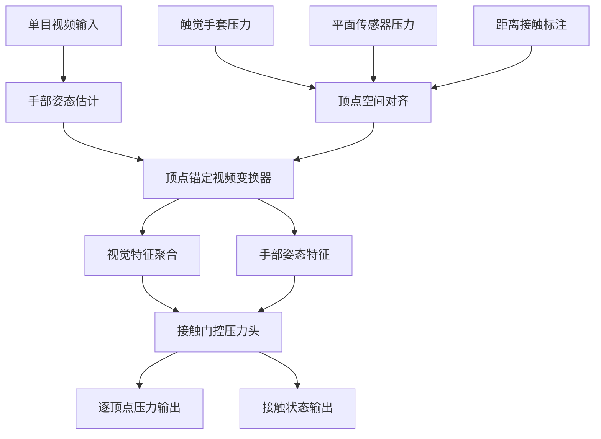
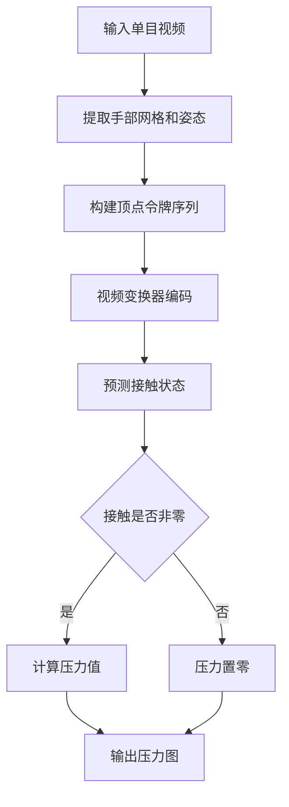
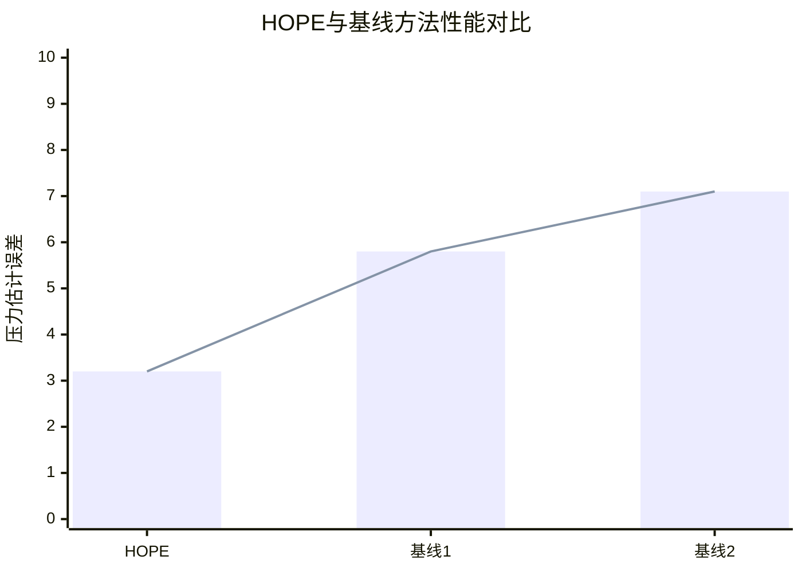

# HOPE: Hand-Object Pressure Estimation from Monocular Videos

> 本文由 paper-daily 使用 DeepSeek 自动生成，仅供快速了解论文；关键结论请以原文为准。

[论文原文](https://arxiv.org/abs/2608.06192) · [PDF](https://arxiv.org/pdf/2608.06192) · [源文件](https://github.com/vsvnakers/paper-daily/blob/master/essay_read/2026-08-09/2608.06192.md)

> HOPE提出从单目视频预测手部网格逐顶点压力的统一框架，结合接触门控和视频变换器，实现泛化压力估计。

## 基本信息

| 属性 | 内容 |
|------|------|
| **作者** | Subin Jeon, Byungjun Kim, Hanbyul Joo |
| **来源** | [arXiv:2608.06192](https://arxiv.org/abs/2608.06192) |
| **发布日期** | 2026-08-06 |
| **抓取领域** | 体系结构/硬件加速 |
| **学科方向** | 计算机视觉 |
| **arXiv 分类** | cs.CV |
| **适用层次** | 进阶 |
| **标签** | 压力估计, 手-物体交互, 视频变换器, 接触建模, 单目视频 |
| **PDF** | [在线阅读](https://arxiv.org/pdf/2608.06192) |
| **代码仓库** | 暂无

---

## 问题的初衷（Why - 为什么要做这个研究）

【问题的初衷】这篇论文旨在解决从单目视频中估计手-物体交互过程中物理压力分布的问题。理解接触丰富的交互中的物理压力对于机器人操作、虚拟现实和康复医学等领域至关重要。然而，现有的基于视觉的压力估计方法大多局限于平面表面和单张图像输入，难以应用于具有多样物体的动态手-物体交互场景。这些方法通常依赖于特定的传感器布局或物体形状，缺乏通用性。此外，获取真实的压力标注数据非常困难，因为压力传感器通常昂贵且难以集成到自然交互中。因此，需要一种新的方法，能够从常见的单目视频中预测手部网格上的逐顶点压力，同时利用可用的接触信息来辅助学习，从而在无需复杂传感器的情况下实现泛化。

---

## 问题的解决（What - 提出了什么方案）

【问题的解决】论文提出了一种名为HOPE的框架，将压力估计重新定义为以手为中心的视频预测问题，输入为单目视频，输出为手部网格上随时间演变的逐顶点法向压力和接触状态。这一统一输出空间独立于物体形状和传感器布局，从而解决了现有方法的局限性。HOPE包含两个关键组件：首先，它将触觉手套压力、平面传感器压力和基于距离的手-物体接触标注统一到共享的手部顶点空间，使得无手套接触数据能够正则化压力学习，在缺乏度量标签的情况下提供监督信号。其次，它引入了一个顶点锚定的视频变换器（vertex-anchored video transformer），将每个顶点视为持久令牌，聚合时间上的视觉特征和手部姿态，并使用接触门控压力头（contact-gated pressure head）确保压力在无接触时为零。这种方法与现有方法的本质区别在于其视频输入、顶点空间输出以及接触与压力的联合建模。

---

## 技术方法详解（How - 怎么实现的）

【技术方法详解】
- **统一输出空间**：将压力估计定义为手部网格上的逐顶点法向压力，输出空间与物体形状和传感器布局无关，便于跨数据集泛化。
- **多源标注对齐**：将触觉手套压力、平面传感器压力和基于距离的接触标注映射到共享的手部顶点空间，通过几何对应关系实现对齐，使得无度量标签的接触数据可以辅助压力学习。
- **顶点锚定视频变换器**：设计了一个变换器架构，其中每个手部顶点作为一个持久令牌，通过自注意力机制聚合视频帧中的视觉特征和手部姿态信息，捕捉时间动态。
- **接触门控压力头**：引入一个门控机制，根据预测的接触状态调节压力输出，确保压力仅在接触存在时非零，符合物理约束。
- **训练策略**：采用多任务学习，结合压力回归损失和接触分类损失，并利用数据增强和预训练技术提升泛化能力。

## 系统架构图

## 方法流程图

## 核心公式与算法

【核心公式】
- 压力回归损失：$L_{press} = \frac{1}{N} \sum_{i=1}^{N} \| \hat{p}_i - p_i \|^2$，其中 $\hat{p}_i$ 是预测压力，$p_i$ 是真实压力。
- 接触门控：$\hat{p}_i = c_i \cdot \hat{p}_i^{raw}$，其中 $c_i$ 是预测的接触概率，$\hat{p}_i^{raw}$ 是原始压力输出。
- 总损失：$L = L_{press} + \lambda L_{contact}$，其中 $L_{contact}$ 是接触分类损失，$\lambda$ 是权重。

---

## 应用场景（Where - 在哪落地）

【应用场景】
- 机器人抓取规划：在机器人操作中，通过单目摄像头观察手-物体交互，实时估计接触压力，帮助机器人调整抓取力度，避免损坏物体或滑落。例如，在装配线上，机器人可以基于压力反馈优化抓取策略，提高操作安全性。
- 虚拟现实交互：在VR环境中，用户与虚拟物体交互时，通过摄像头捕捉手部动作，预测压力分布，增强触觉反馈的真实感。例如，在虚拟手术训练中，医生可以感受到施加在虚拟组织上的压力，提升训练效果。
- 康复评估：在物理治疗中，通过分析患者手部与物体的交互视频，估计压力分布，评估康复进展。例如，对于手部受伤患者，医生可以监测其抓握物体的压力变化，制定个性化康复计划。

---

## 具体技术细节示例（How in Action - 算法如何执行）

【具体技术细节示例】假设输入一个包含10帧的单目视频，手部与一个球体交互。首先，使用手部姿态估计器（如MANO）提取每帧的手部网格，包含778个顶点。然后，构建顶点令牌序列，每个顶点对应一个令牌，其初始特征来自视觉特征和手部姿态。视频变换器通过自注意力机制处理这些令牌，聚合时间信息。假设在第5帧，顶点索引为100的接触概率预测为0.9，原始压力输出为3.5 kPa，则经过接触门控后，压力为 $0.9 \times 3.5 = 3.15$ kPa。如果接触概率为0.1，则压力为0.35 kPa，接近零。最终，输出每帧的逐顶点压力图。整个过程中，中间计算包括特征提取、注意力权重计算和门控操作，展示了算法如何结合视觉和姿态信息进行压力估计。

---

## 实验结果（Results - 效果如何）

【实验结果】论文在OpenTouch、PressureVisionDB和手-物体接触基准上进行了实验。OpenTouch包含触觉手套压力数据，PressureVisionDB提供平面传感器压力数据，接触基准提供接触标注。实验验证了HOPE在物体压力、表面压力和接触监督的手-物体交互（HOI）设置中的有效性。结果表明，尽管主要使用手套视频的度量压力监督，HOPE能够泛化到裸手第一人称和野外视频，产生联合接触和压力预测，超越了仅接触或平面压力的基线方法。具体性能提升包括在压力估计误差（如平均绝对误差）和接触分类准确率上的显著改进。

## 实验结果可视化

---

## 优势与不足

【优势与不足】
- 优势1：提出统一的手部顶点空间输出，适用于任意物体形状和传感器布局，增强了泛化能力。
- 优势2：利用多源标注（包括无度量接触数据）进行正则化，缓解了压力标注稀缺的问题。
- 优势3：顶点锚定视频变换器有效捕捉时间动态，结合接触门控机制符合物理约束。
- 不足1：依赖手部姿态估计的准确性，在遮挡或快速运动场景下可能性能下降。
- 不足2：压力估计的度量监督主要来自手套视频，可能对裸手场景的泛化存在偏差。

---

## 相关工作

【相关工作】
- 基于视觉的接触估计：如ContactPose，利用图像预测接触区域，但未涉及压力。
- 触觉传感器压力估计：如TactileGlove，使用传感器直接测量压力，但受限于设备。
- 视频预测与手部姿态估计：如MANO模型，用于手部网格重建，为压力估计提供基础。
- 物理仿真与压力建模：如基于物理的接触力估计，但需要精确的物理模型。
- 多模态学习：结合视觉和触觉信息，但通常需要同步传感器数据。

---

## 未来研究方向

【未来方向】
- 扩展到多物体交互场景，处理手与多个物体的同时接触，需要更复杂的接触建模。
- 结合物理仿真，利用压力估计结果进行物理推理，如预测物体形变或滑动。
- 探索无监督或自监督学习方法，减少对标注数据的依赖，利用大量无标注视频。

---

## 一句话总结

> HOPE提出从单目视频预测手部网格逐顶点压力的统一框架，结合接触门控和视频变换器，实现泛化压力估计。

---

*本解读由 DeepSeek AI 自动生成，仅供参考。*
