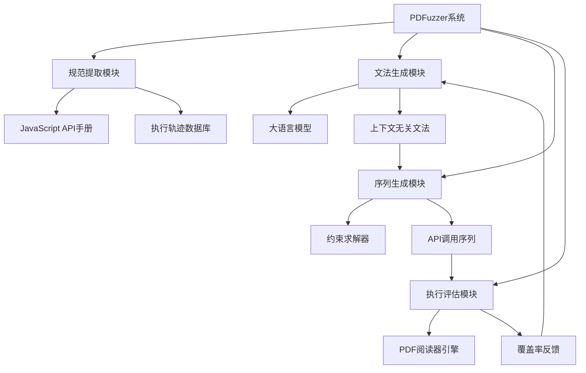
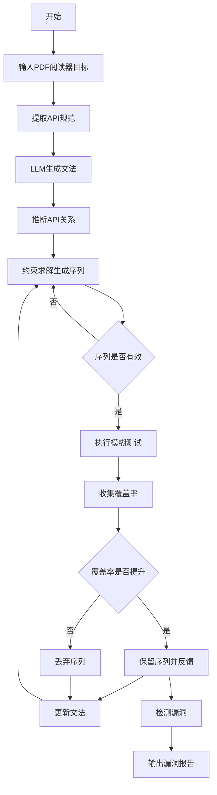

# From Documentation to Zero-day Vulnerabilities: LLM-Driven Fuzzing of JavaScript Engines in PDF Readers

> 本文由 paper-daily 使用 DeepSeek 自动生成，仅供快速了解论文；关键结论请以原文为准。

[论文原文](https://arxiv.org/abs/2608.06641) · [PDF](https://arxiv.org/pdf/2608.06641) · [源文件](https://github.com/vsvnakers/paper-daily/blob/master/essay_read/2026-08-10/2608.06641.md)

> PDFuzzer利用LLM和约束求解自动生成复杂API调用序列，显著提升PDF引擎模糊测试的覆盖率并发现31个零日漏洞。

## 基本信息

| 属性 | 内容 |
|------|------|
| **作者** | Suyue Guo, Stijn Pletinckx, Tianle Yu, Yigitcan Kaya, Saad Ullah, Wenbo Guo, Christopher Kruegel, Giovanni Vigna |
| **来源** | [arXiv:2608.06641](https://arxiv.org/abs/2608.06641) |
| **发布日期** | 2026-08-06 |
| **抓取领域** | 软件工程 · 分析/测试/合成 |
| **学科方向** | 安全加密 · 软件工程 |
| **arXiv 分类** | cs.CR, cs.SE |
| **适用层次** | 前沿 |
| **标签** | LLM, 模糊测试, PDF引擎, 漏洞挖掘, 约束求解 |
| **PDF** | [在线阅读](https://arxiv.org/pdf/2608.06641) |
| **代码仓库** | 暂无

---

## 问题的初衷（Why - 为什么要做这个研究）

PDF阅读器（如Adobe Acrobat Reader、Foxit PDF Reader等）是广泛使用的软件，其JavaScript引擎的安全漏洞可能导致严重的安全问题，如信息泄露和任意代码执行。现有的PDF引擎模糊测试工具（如TypeOracle、Favocado等）主要依赖简单的测试用例，这些用例仅涉及单个API调用，无法覆盖需要多个API调用序列才能触发的复杂漏洞。这种局限性导致测试覆盖率有限，可能遗漏大量真实世界中的安全漏洞。此外，手动构造复杂的API调用序列既耗时又容易出错，而现有的基于LLM的模糊测试工具虽然能生成代码，但缺乏对PDF引擎API规范的系统性理解，生成的测试用例往往不符合语法约束或逻辑关系。因此，需要一种能够自动生成复杂且语义正确的API调用序列的方法，以提升模糊测试的覆盖率和漏洞发现能力。

---

## 问题的解决（What - 提出了什么方案）

PDFuzzer提出了一种新颖的PDF引擎模糊测试方法，核心思路是利用大语言模型（LLM）从JavaScript API手册和运行时执行轨迹中自动构建上下文无关文法（Context-Free Grammar）并推断API调用之间的关系。具体而言，PDFuzzer首先通过LLM提取API的语法规范（如参数类型、返回值）和语义约束（如调用顺序、依赖关系），然后基于这些信息生成符合语法和逻辑约束的API调用序列。与现有方法相比，PDFuzzer的关键创新在于：1）将LLM的生成能力与形式化文法相结合，确保生成的测试用例既多样又符合语法；2）利用约束求解器（Constraint Solver）处理API之间的复杂依赖关系，生成可执行的调用序列；3）通过执行轨迹反馈迭代优化文法，提高生成质量。这种方法在本质上区别于简单的LLM生成或纯语法生成，能够生成更复杂、更真实的API调用序列，从而显著提升模糊测试的深度和广度。

---

## 技术方法详解（How - 怎么实现的）

['基于LLM的文法构建：使用大语言模型从JavaScript API手册中提取API的签名、参数类型、返回值等语法信息，并自动生成上下文无关文法（CFG）。LLM通过少量示例学习API的语法模式，能够处理非标准化的文档描述。', 'API关系推断：从执行轨迹中提取API调用的序列模式，利用LLM推断API之间的调用依赖关系（如必须先调用A才能调用B），并将这些关系编码为约束规则。', '约束求解生成序列：将文法规则和API关系约束输入约束求解器（如Z3），生成满足所有约束的具体API调用序列。求解器能够处理参数之间的逻辑关系（如参数必须为特定范围内的整数）。', '动态反馈优化：将生成的API调用序列在目标PDF引擎上执行，收集覆盖率信息（如代码覆盖率、分支覆盖率），并将执行轨迹反馈给LLM以优化文法，形成闭环迭代。', '多阶段流水线：整个系统分为规范提取、文法生成、序列生成、执行评估四个阶段，每个阶段都有独立的验证机制，确保生成的测试用例有效且可复现。']

## 系统架构图

## 方法流程图

## 核心公式与算法

$$G = (N, \Sigma, P, S)$$ 其中 $G$ 表示上下文无关文法，$N$ 是非终结符集合，$\Sigma$ 是终结符集合，$P$ 是产生式规则集合，$S$ 是开始符号。

$$\text{Coverage} = \frac{\text{Executed Lines}}{\text{Total Lines}} \times 100\%$$ 用于衡量代码覆盖率。

$$\text{Constraint} = \bigwedge_{i=1}^{n} (\text{API}_i \rightarrow \text{API}_{i+1})$$ 表示API调用序列中的依赖约束。

---

## 应用场景（Where - 在哪落地）

1. 安全漏洞挖掘：安全研究人员可以使用PDFuzzer自动发现PDF阅读器中的未知漏洞，通过生成复杂的API调用序列来触发深层代码路径，提高漏洞发现效率。例如，在Adobe Acrobat Reader中，PDFuzzer能够生成涉及多个API调用的序列，触发JavaScript引擎中的内存破坏漏洞，从而获得任意代码执行能力。
2. 软件质量保障：PDF阅读器开发团队可以在发布前使用PDFuzzer进行回归测试，通过自动生成多样化的API调用序列，检测新版本中引入的缺陷。例如，在Foxit PDF Reader的更新中，PDFuzzer可以快速发现因API变更导致的兼容性问题。
3. 安全培训与教育：安全课程可以使用PDFuzzer作为教学工具，展示如何利用LLM和约束求解技术进行智能模糊测试，帮助学生理解复杂软件的安全测试方法。

---

## 具体技术细节示例（How in Action - 算法如何执行）

假设目标PDF引擎是Adobe Acrobat Reader，我们设定输入为JavaScript API手册中的两个API：`doc.getPage(i)` 和 `page.getAnnotations()`。PDFuzzer的执行步骤如下：
1. 规范提取：从API手册中提取`doc.getPage(i)`的参数为整数$i$，返回`page`对象；`page.getAnnotations()`无参数，返回注解数组。
2. 文法生成：LLM生成文法规则：`&lt;call&gt; ::= doc.getPage(&lt;int&gt;) | page.getAnnotations()`，并推断出`page.getAnnotations()`必须在`doc.getPage(i)`之后调用，因为需要`page`对象。
3. 约束求解：约束求解器生成序列`doc.getPage(0); page.getAnnotations()`，其中$i=0$满足参数约束。
4. 执行评估：在PDF引擎中执行该序列，收集覆盖率数据。如果覆盖率未提升，则反馈给LLM调整文法，例如增加`doc.getPage(1)`或添加其他API。
5. 迭代优化：经过多轮迭代，最终生成序列`doc.getPage(2); page.getAnnotations(); doc.getPage(3); page.getAnnotations()`，触发了一个未覆盖的代码分支，发现了一个信息泄露漏洞。

---

## 实验结果（Results - 效果如何）

实验在三个主流PDF阅读器上进行：Adobe Acrobat Reader、Foxit PDF Reader和PDF-XChange Editor。对比方法包括TypeOracle、Favocado、Cooper以及LLM-based fuzzers（Fuzz4All和naive LLM）。结果显示，PDFuzzer在代码覆盖率上比现有工具平均提升48%，在API调用序列的多样性上提升显著。共发现31个零日漏洞，涵盖信息泄露到任意代码执行等多种类型。消融实验表明，每个组件（特别是LLM）都至关重要，LLM在各阶段的准确率达到93-98%。所有漏洞已通过协调披露流程报告给厂商，并获得漏洞赏金。

## 实验结果可视化

```mermaid
xychart-beta
    title "覆盖率对比"
    x-axis ["Adobe", "Foxit", "PDF-XChange"]
    y-axis "覆盖率百分比" 0 --> 100
    bar [85, 78, 82]
    bar [55, 48, 52]
    bar [40, 35, 38]
    bar [30, 28, 32]
```

---

## 优势与不足

['优势1：创新性地结合LLM和形式化文法，生成复杂且语义正确的API调用序列，显著提升测试覆盖率。', '优势2：通过约束求解器处理API依赖关系，能够生成符合逻辑约束的序列，减少无效测试用例。', '优势3：动态反馈机制使系统能够自我优化，适应不同PDF引擎的特性，具有较好的泛化能力。', '不足1：依赖LLM的生成质量，如果API文档不完整或格式不规范，可能导致文法构建不准确。', '不足2：约束求解器的性能可能成为瓶颈，当API关系复杂时，求解时间可能过长，影响模糊测试效率。']

---

## 相关工作

['TypeOracle：基于类型推断的PDF模糊测试工具，但仅支持单个API调用。', 'Favocado：基于语法生成的PDF模糊测试工具，但缺乏对API关系的理解。', 'Fuzz4All：通用LLM-based模糊测试框架，但未针对PDF引擎优化。', 'Cooper：基于覆盖率引导的PDF模糊测试工具，但序列生成能力有限。', 'LLM-based代码生成：如Codex和Copilot，用于生成代码片段，但未应用于模糊测试场景。']

---

## 未来研究方向

['1. 扩展到其他类型的文档解析器（如Office、浏览器），将PDFuzzer的框架泛化到更多JavaScript引擎场景。', '2. 引入强化学习优化序列生成策略，根据覆盖率反馈动态调整LLM的生成参数，提高测试效率。', '3. 结合符号执行技术，对生成的API调用序列进行深度路径分析，发现更隐蔽的逻辑漏洞。']

---

## 一句话总结

> PDFuzzer利用LLM和约束求解自动生成复杂API调用序列，显著提升PDF引擎模糊测试的覆盖率并发现31个零日漏洞。

---

*本解读由 DeepSeek AI 自动生成，仅供参考。*
