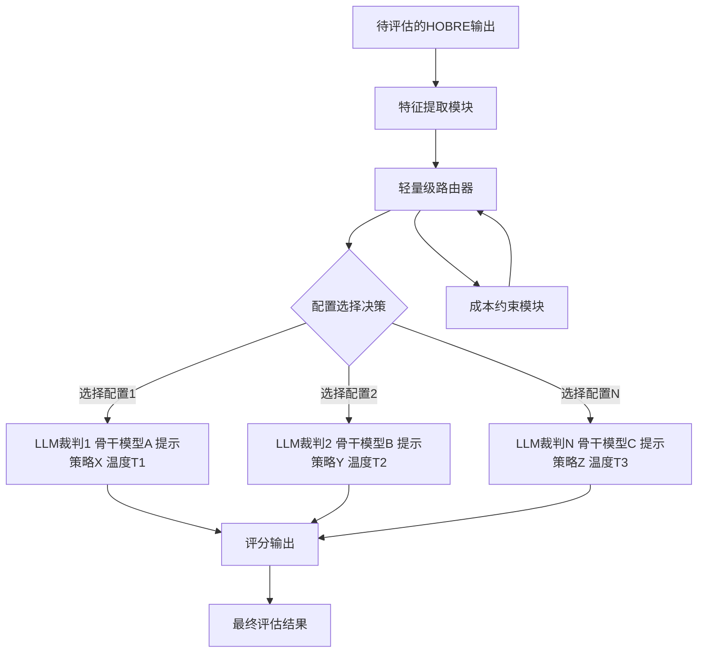
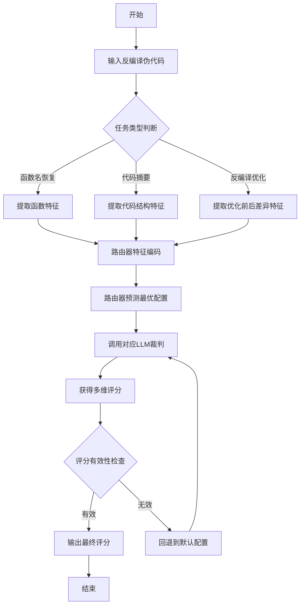
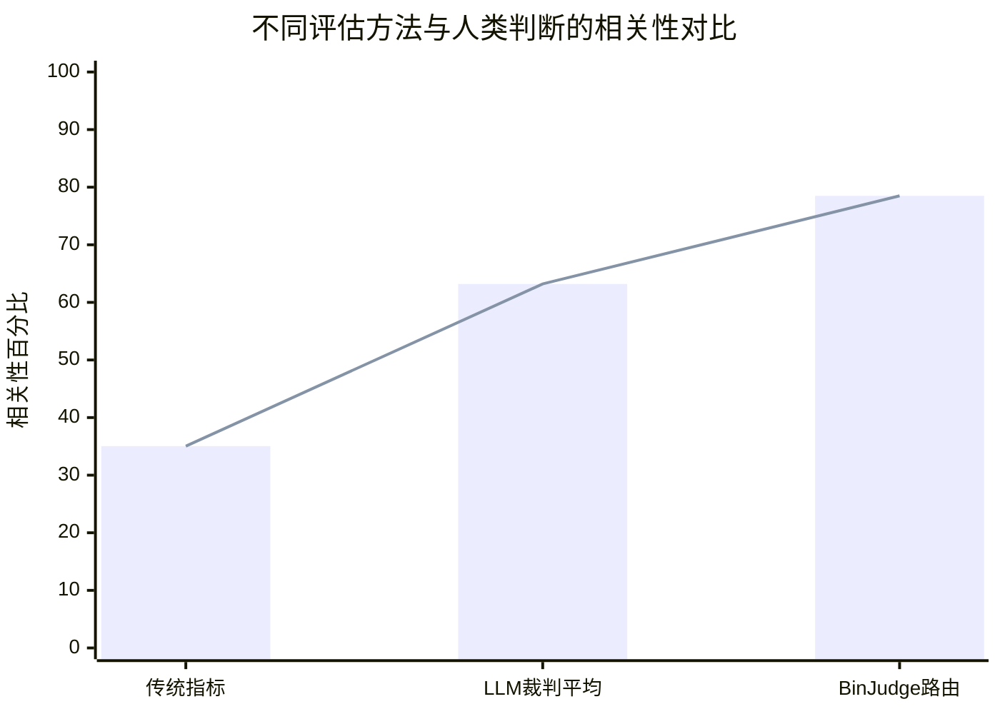

# Beyond Text Matching: Towards Reference-Free Evaluation for Human-Oriented Binary Reverse Engineering

> 本文由 paper-daily 使用 DeepSeek 自动生成，仅供快速了解论文；关键结论请以原文为准。

[论文原文](https://arxiv.org/abs/2608.07038) · [PDF](https://arxiv.org/pdf/2608.07038) · [源文件](https://github.com/vsvnakers/paper-daily/blob/master/essay_read/2026-08-10/2608.07038.md)

> 首次系统研究LLM-as-a-Judge范式用于二进制逆向工程评估，提出BinJudgeBench基准和自适应路由机制BinJudge，实现高保真低成本评估。

## 基本信息

| 属性 | 内容 |
|------|------|
| **作者** | Xiuwei Shang, Li Hu, Xiao Jiang, Jieke Shi, Junda He, Zhou Yang, Shaoyin Cheng, Guoqiang Chen, Weiming Zhang, David Lo |
| **来源** | [arXiv:2608.07038](https://arxiv.org/abs/2608.07038) |
| **发布日期** | 2026-08-07 |
| **抓取领域** | 体系结构/硬件加速 |
| **学科方向** | 软件工程 · 人工智能 · 安全加密 |
| **arXiv 分类** | cs.SE, cs.AI, cs.CR |
| **适用层次** | 基础 |
| **标签** | LLM-as-a-Judge, 二进制逆向工程, 无参考评估, 路由机制, 函数名恢复 |
| **PDF** | [在线阅读](https://arxiv.org/pdf/2608.07038) |
| **代码仓库** | 暂无

---

## 问题的初衷（Why - 为什么要做这个研究）

【问题的初衷】二进制逆向工程（Binary Reverse Engineering）是安全分析、漏洞挖掘和恶意软件分析中的关键环节。传统反编译器（如 IDA Pro、Ghidra）输出的伪代码（pseudocode）虽然保留了程序语义，但变量名、函数名和结构往往晦涩难懂，给分析人员带来巨大的认知负担。为此，面向人类友好的二进制逆向工程（Human-Oriented Binary Reverse Engineering, HOBRE）应运而生，旨在将反编译伪代码转换为更接近人类编写风格的可读表示，例如恢复有意义的函数名、生成自然语言代码摘要、优化反编译代码结构等。然而，如何可靠地评估 HOBRE 的输出质量是一个根本性挑战：人工评估成本高昂、耗时且难以规模化；现有的自动化指标要么需要可执行测试用例和运行时环境（对真实世界二进制往往不可用），要么依赖高质量源代码作为参考（通常不可获取，且无法捕捉语义等价但词汇多样的输出）。尽管 LLM-as-a-Judge（大语言模型作为裁判）范式天然适合 HOBRE 评估，但其有效性尚未被系统探索。本文正是针对这一空白，首次系统性地研究 LLM-as-a-Judge 范式在 HOBRE 评估中的应用。

---

## 问题的解决（What - 提出了什么方案）

【问题的解决】论文提出了一个两阶段解决方案。首先，构建了 BinJudgeBench，这是第一个基于多维人类判断的专家标注、无参考（reference-free）评估基准。该基准覆盖三个代表性任务：函数名恢复（Function Name Recovery）、二进制代码摘要（Binary Code Summarization）和反编译优化（Decompilation Optimization）。通过在该基准上的系统实验，论文发现 LLM-as-a-Judge 与人类判断的平均相关性达到 63.20%，显著优于传统自动化指标的 35.04%。其次，针对实验中发现的不存在“一刀切”配置的问题（即最优的 LLM 骨干网络、提示策略和解码温度因任务和样本而异），论文提出了 BinJudge 框架，它采用轻量级路由机制（lightweight routing mechanism）为每个任务和样本自适应选择最优的裁判配置。BinJudge 将人类专家相关性提升了 4.5%-24.7%，同时将 API 成本降低到静态最优配置的 0.06 倍至 0.84 倍，提供了一个可扩展、成本效益高且高保真的 HOBRE 自动化评估方案。

---

## 技术方法详解（How - 怎么实现的）

【技术方法详解】
- **任务定义与基准构建**：论文定义了 HOBRE 的三个核心任务，并邀请二进制逆向工程专家对模型输出进行多维度的质量评分（如正确性、可读性、完整性等），构建了 BinJudgeBench 基准。该基准完全无参考，不依赖原始源代码。
- **LLM-as-a-Judge 配置空间**：系统探索了裁判配置空间，包括三个维度：骨干 LLM（如 GPT-4、Claude、Llama 等）、提示策略（如零样本、少样本、思维链 Chain-of-Thought）和解码温度（temperature）。
- **路由机制设计**：BinJudge 的核心是一个轻量级路由器（router），它接收待评估的样本特征（如任务类型、代码长度、复杂度特征等），输出一个配置选择决策。路由器本身是一个小型分类模型或基于规则的打分函数。
- **训练数据生成**：为了训练路由器，论文在 BinJudgeBench 上对每个样本运行所有候选裁判配置，记录每个配置与人类评分的相关性，将最优配置作为标签，构建训练数据集。
- **成本感知优化**：路由机制不仅考虑评估准确性，还将 API 调用成本纳入优化目标，通过权衡准确率和成本来选择配置，实现成本效益最大化。
- **评估协议**：采用 Spearman 秩相关系数（Spearman's rank correlation coefficient）作为核心评估指标，衡量裁判评分与人类专家评分之间的一致性。


## 系统架构图




## 方法流程图




## 核心公式与算法

$$\rho = 1 - \frac{6\sum d_i^2}{n(n^2-1)}$$
其中 $\rho$ 是 Spearman 秩相关系数，$d_i$ 是第 $i$ 个样本的秩差，$n$ 是样本总数。该公式用于衡量裁判评分与人类评分之间的一致性。

$$\text{Cost}_{total} = \sum_{i=1}^{N} \text{Cost}(\text{config}_i) \cdot \mathbb{1}[\text{router}(x_i) = \text{config}_i]$$
其中 $N$ 是样本总数，$\text{Cost}(\text{config}_i)$ 是第 $i$ 个配置的 API 调用成本，$\mathbb{1}[\cdot]$ 是指示函数，$\text{router}(x_i)$ 是路由器对样本 $x_i$ 选择的配置。该公式描述了路由机制的总成本计算方式。


---

## 应用场景（Where - 在哪落地）

【应用场景】
- 场景 1：恶意软件分析。安全分析师在分析恶意二进制时，可以使用 HOBRE 工具将反编译代码转换为更易读的形式。BinJudge 可以自动评估这些转换工具的输出质量，帮助分析师选择最可靠的转换结果，提高分析效率和准确性。例如，在分析勒索软件时，准确的函数名恢复和代码摘要能帮助分析师快速理解恶意行为。
- 场景 2：漏洞挖掘与固件安全。在物联网设备固件安全审计中，研究人员需要快速理解大量二进制代码。BinJudge 可以作为一个评估层，对不同的反编译优化工具进行持续评估，确保工具输出的质量，从而加速漏洞发现流程。
- 场景 3：逆向工程工具链开发。开发反编译器或 HOBRE 工具的团队可以使用 BinJudge 作为自动化回归测试工具，在开发过程中持续评估新版本输出质量，确保改进方向正确，同时大幅减少人工评估成本。


---

## 具体技术细节示例（How in Action - 算法如何执行）

【具体技术细节示例】假设我们有一个待评估的 HOBRE 输出样本，它是一个函数名恢复任务的输出。输入的反编译伪代码如下：
```c
int sub_401000(int a1, int a2) {
    int v3;
    v3 = a1 + a2;
    return v3 * 2;
}
```
模型输出的函数名建议为 "calculate_double_sum"。

步骤 1：特征提取。路由器提取样本特征，包括：任务类型（函数名恢复）、代码长度（约 50 个 token）、包含的算术操作数量（2 个）、是否有循环（无）、是否有指针操作（无）等。这些特征被编码为一个特征向量 $x = [1, 50, 2, 0, 0]$。

步骤 2：路由决策。路由器根据训练好的模型，计算每个候选配置的得分。假设候选配置有 3 个：配置 A（GPT-4，零样本，温度 0.2）、配置 B（Claude，少样本，温度 0.5）、配置 C（Llama，思维链，温度 0.8）。路由器输出概率分布 $P = [0.1, 0.7, 0.2]$，因此选择配置 B。

步骤 3：LLM 裁判评估。使用配置 B（Claude，少样本提示）对输出 "calculate_double_sum" 进行评分。提示中包含几个示例，指导模型从正确性、可读性、语义保真度三个维度打分。Claude 返回评分：正确性 4/5，可读性 5/5，语义保真度 4/5。

步骤 4：结果整合。将三个维度的评分加权平均，得到最终评分 4.33/5。同时记录本次评估的 API 成本为 0.002 美元。

步骤 5：输出。最终输出为评分 4.33 和成本 0.002 美元，供用户参考。


---

## 实验结果（Results - 效果如何）

【实验结果】论文在 BinJudgeBench 基准上进行了大量实验。基准包含三个任务，每个任务有数百个由专家标注的样本。主要发现如下：首先，LLM-as-a-Judge 范式在整体上显著优于传统自动化指标（如 BLEU、ROUGE、CodeBLEU 等），平均相关性达到 63.20%，而传统指标仅为 35.04%。其次，通过分析不同配置（骨干 LLM、提示策略、温度）的表现，论文发现不存在普遍最优的配置，最优配置因任务和样本特性而异。例如，对于函数名恢复任务，GPT-4 配合思维链提示效果最好；而对于代码摘要任务，Claude 配合少样本提示更优。最后，BinJudge 路由机制在保持高相关性的同时大幅降低成本，与人类专家相关性提升 4.5%-24.7%，API 成本仅为静态最优配置的 0.06 倍至 0.84 倍。


## 实验结果可视化




---

## 优势与不足

【优势与不足】
- 优势 1：首次系统性地研究了 LLM-as-a-Judge 范式在 HOBRE 评估中的应用，填补了该领域的空白。
- 优势 2：构建了第一个专家标注的无参考评估基准 BinJudgeBench，为后续研究提供了标准化的评测平台。
- 优势 3：提出的 BinJudge 路由机制实现了准确率和成本之间的良好平衡，具有实际部署价值。
- 优势 4：实验设计严谨，覆盖多个 LLM 骨干、提示策略和温度设置，结论具有普适性。
- 不足 1：路由机制本身依赖于训练数据，需要人工标注，这在一定程度上限制了其在新任务上的快速迁移。
- 不足 2：研究主要基于商业 API 模型，对于开源模型的适用性尚未充分验证，可能影响可复现性。

---

## 相关工作

【相关工作】
- 传统代码评估指标：如 BLEU、ROUGE、CodeBLEU 等，这些方法依赖参考代码或测试用例，无法处理无参考场景。
- 大语言模型评估范式（LLM-as-a-Judge）：在自然语言处理领域已有广泛应用，但尚未系统应用于二进制逆向工程领域。
- 二进制逆向工程自动化：包括函数名恢复、代码摘要生成等任务，本文的评估方法可直接服务于这些任务的模型开发。
- 路由与模型选择：在机器学习中已有混合专家模型（Mixture of Experts）等路由思想，本文将其应用于评估配置选择。

---

## 未来研究方向

【未来方向】
- 方向 1：多模态评估。将代码执行轨迹、内存状态等动态信息纳入评估，实现更全面的 HOBRE 输出质量评估。
- 方向 2：自适应路由优化。利用在线学习或强化学习技术，使路由器能够根据实时反馈持续优化配置选择策略，适应新出现的任务类型。
- 方向 3：开源模型适配。研究如何将 BinJudge 框架适配到开源 LLM 上，降低部署成本，提高可复现性和数据隐私保护。


---

## 一句话总结

> 首次系统研究LLM-as-a-Judge范式用于二进制逆向工程评估，提出BinJudgeBench基准和自适应路由机制BinJudge，实现高保真低成本评估。

---

*本解读由 DeepSeek AI 自动生成，仅供参考。*
