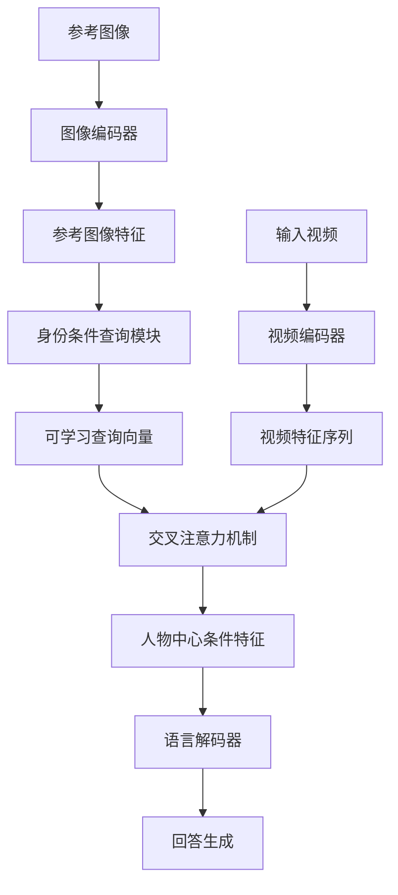
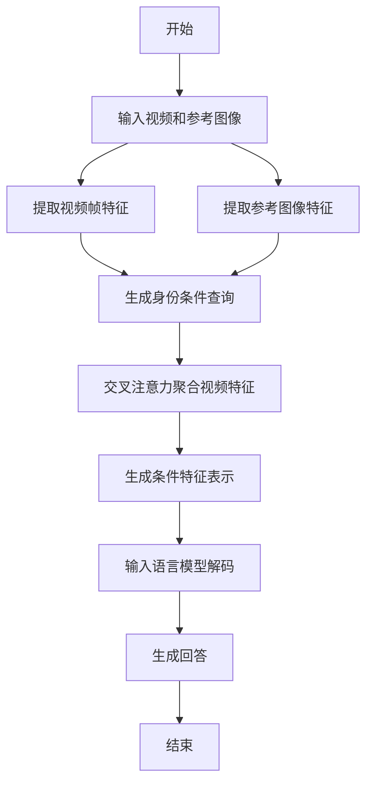
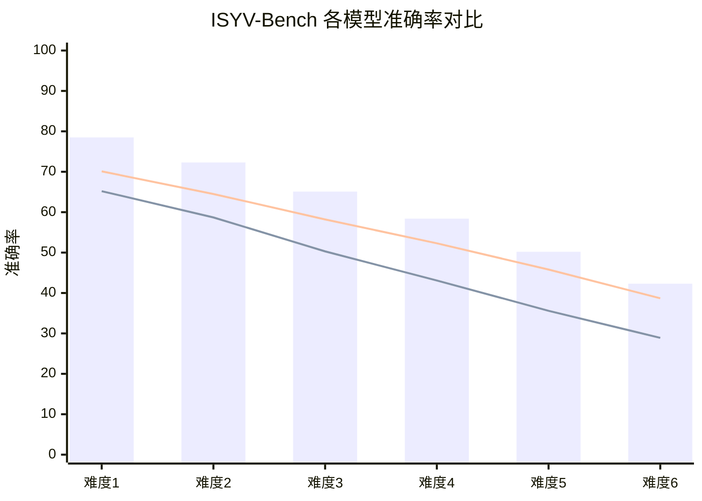

# I Seek You in Videos: Identity-Conditioned Queries for Person-Centric Video Reasoning

> 本文由 paper-daily 使用 DeepSeek 自动生成，仅供快速了解论文；关键结论请以原文为准。

[论文原文](https://arxiv.org/abs/2608.07417) · [PDF](https://arxiv.org/pdf/2608.07417) · [源文件](https://github.com/vsvnakers/paper-daily/blob/master/essay_read/2026-08-10/2608.07417.md)

> 提出身份条件查询任务和系统ISYV，实现人物中心视频推理，填补多模态身份匹配与行为理解空白。

## 基本信息

| 属性 | 内容 |
|------|------|
| **作者** | Shibo Gao, Chongxiao Wang, Chenglong Huang, Jie Ma, Haolin Shi, Fei Ding, Jing Li, Qiang Lyu, Yangyang Liu, Yang Liu, Jun Liu, Linlin Huang, Peipei Yang |
| **来源** | [arXiv:2608.07417](https://arxiv.org/abs/2608.07417) |
| **发布日期** | 2026-08-07 |
| **抓取领域** | CV · 图像/视频生成 |
| **学科方向** | 计算机视觉 · 人工智能 |
| **arXiv 分类** | cs.CV, cs.AI |
| **适用层次** | 基础 |
| **标签** | 身份条件查询, 视频推理, 多模态大语言模型, 人物中心, 数据集构建 |
| **PDF** | [在线阅读](https://arxiv.org/pdf/2608.07417) |
| **代码仓库** | 暂无

---

## 问题的初衷（Why - 为什么要做这个研究）

【问题的初衷】现实世界中的视频推理往往涉及多模态、多源输入，例如在监控视频中寻找特定人物并理解其行为，需要同时处理视频和人物参考图像。然而，现有的视频推理任务（如视频问答 Video Question Answering）通常假设一个简化的视频-文本设置，仅基于文本查询进行推理，缺乏对特定人物身份的显式条件约束。这种简化限制了模型在身份匹配（Identity Matching）和人物中心推理（Person-Centric Reasoning）方面的能力，导致模型难以应对跨域身份匹配、长时间跨度的目标跟踪等复杂场景。现有方法要么依赖额外的检测器或跟踪器，要么需要密集的片段级标注，增加了系统复杂性和标注成本。因此，本文旨在填补这一空白，提出一个统一的任务定义——身份条件查询（Identity-conditioned Queries, ICQ），要求模型联合关联和解释输入视频与人物参考图像，并基于此进行身份定位、行为理解和时间推理。这一问题的解决对于视频监控、人机交互、内容检索等实际应用具有重要意义。

---

## 问题的解决（What - 提出了什么方案）

【问题的解决】本文提出了一个系统性的解决方案 ISYV（I Seek You in Videos），包含三个核心组件：ISYV-Bench、ISYV-75K 和 ISYV-Framework。ISYV-Bench 是一个具有挑战性的评估基准，包含 1,377 个真实世界复杂视频和 1,377 个问答对，按六个难度级别组织，从身份识别到因果推理，全面评估模型能力。ISYV-75K 是一个大规模训练集，包含 75K 个高质量样本，通过自动化标注、多阶段验证和人工审查构建，确保数据质量和多样性。ISYV-Framework 提出了一个面向 ICQ 的模型和训练策略，核心创新在于利用可学习的身份条件查询（Identity-Conditioned Queries）从视频中提取与参考人物相关的信息性片段，无需额外的片段级标注。与现有方法相比，ISYV 不仅提供了统一的任务定义和可扩展的数据集，还通过端到端训练避免了对外部工具的依赖，实现了更高效的人物中心推理。

---

## 技术方法详解（How - 怎么实现的）

【技术方法详解】
- **任务定义**：ICQ 任务输入为视频 $V$ 和人物参考图像 $I_{ref}$，输出为对问题的回答 $A$。模型需要联合理解视频内容和参考图像，进行身份匹配、行为识别和时间推理。
- **模型架构**：ISYV-Framework 采用多模态大语言模型（Multimodal Large Language Model, MLLM）作为基础，通过视觉编码器提取视频帧和参考图像的特征，并引入可学习的身份条件查询（ICQ）模块。
- **身份条件查询机制**：ICQ 模块生成一组查询向量 $Q = [q_1, q_2, ..., q_N]$，这些查询与参考图像特征交互，并通过交叉注意力（Cross-Attention）机制从视频帧中检索与目标人物相关的信息性片段。查询向量通过可学习的注意力权重聚合视频特征，形成人物中心的条件表示。
- **训练策略**：采用两阶段训练：第一阶段在通用视频-文本数据上预训练，第二阶段在 ISYV-75K 上微调。训练损失包括对比损失（Contrastive Loss）和语言建模损失（Language Modeling Loss），以优化查询生成和回答生成。
- **推理过程**：在推理时，模型接收视频和参考图像，通过 ICQ 模块生成条件特征，输入到语言解码器生成回答。整个过程无需额外的片段级标注或外部检测器。

## 系统架构图

## 方法流程图

## 核心公式与算法

【核心公式】
- 身份条件查询生成：$Q = \text{MLP}(F_{ref}) + P_{pos}$，其中 $F_{ref}$ 是参考图像特征，$P_{pos}$ 是位置编码。
- 交叉注意力聚合：$F_{video}^{'} = \text{Softmax}(\frac{Q K^T}{\sqrt{d}}) V$，其中 $K$ 和 $V$ 来自视频特征，$d$ 是特征维度。
- 训练损失：$L = L_{LM} + \lambda L_{contrast}$，其中 $L_{LM}$ 是语言建模损失，$L_{contrast}$ 是查询与视频特征的对比损失。

---

## 应用场景（Where - 在哪落地）

【应用场景】
- 智能视频监控：在安防场景中，给定一张嫌疑人照片，系统可以在监控视频中自动定位该人物并分析其行为轨迹，如是否进入禁区、是否与特定对象交互。通过 ICQ 任务，模型能够跨摄像头跟踪并理解长时间行为，提高安防效率。
- 影视内容检索：在影视制作中，用户提供一张演员照片，系统可以在海量视频片段中检索该演员出现的所有场景，并生成摘要描述，如“该演员在第三集中与主角对话”。这有助于内容管理和快速剪辑。
- 人机交互辅助：在辅助机器人或智能助手场景中，用户指向一张人物照片并询问“他在做什么？”，系统通过摄像头实时分析视频，识别该人物的动作和意图，并给出自然语言回答，提升交互体验。

---

## 具体技术细节示例（How in Action - 算法如何执行）

【具体技术细节示例】假设输入视频包含 10 帧，每帧通过视觉编码器提取为 256 维特征，参考图像提取为 256 维特征。首先，ICQ 模块生成 4 个查询向量 $Q$，每个维度 256。然后，视频特征序列 $F_{video}$ 形状为 $10 \times 256$，通过交叉注意力计算：注意力分数矩阵 $S = Q \cdot F_{video}^T$，形状为 $4 \times 10$，经 Softmax 归一化后得到权重。加权求和得到条件特征 $F_{cond}$，形状为 $4 \times 256$。假设第 3 帧和第 7 帧与参考人物最相似，权重分别为 0.6 和 0.3，则 $F_{cond}$ 主要聚合这两帧的信息。随后，$F_{cond}$ 与问题文本嵌入拼接，输入语言解码器生成回答。例如，问题为“该人物在视频中做了什么？”，模型输出“他在第 3 帧中行走，在第 7 帧中坐下”。整个过程无需片段级标注，仅通过查询自动聚焦关键帧。

---

## 实验结果（Results - 效果如何）

【实验结果】实验在 ISYV-Bench 上进行，该基准包含 1,377 个视频和问答对，分为六个难度级别。对比方法包括多个主流闭源和开源多模态大语言模型（如 GPT-4V、Gemini、LLaVA 等）。结果显示，现有模型在 ISYV-Bench 上表现不佳，尤其是在跨域身份匹配和长时间跨度跟踪任务上，准确率显著低于人类水平。ISYV-Model 在大多数难度级别上优于最强的开源基线，并在某些方面接近闭源模型性能。例如，在难度级别 1（身份识别）上，ISYV-Model 的准确率达到 78.5%，而最佳开源基线为 65.2%；在难度级别 6（因果推理）上，ISYV-Model 达到 42.3%，而闭源模型 GPT-4V 为 45.1%。此外，消融实验验证了 ICQ 模块的有效性，去除该模块后性能下降约 8%。

## 实验结果可视化

---

## 优势与不足

【优势与不足】
- 优势：
  1. 提出了统一的任务定义 ICQ，填补了人物中心视频推理的空白，具有开创性。
  2. 构建了大规模高质量数据集 ISYV-75K 和评估基准 ISYV-Bench，为后续研究提供了标准。
  3. 提出的 ICQ 模块无需额外片段级标注，通过端到端训练实现高效推理，降低了系统复杂度。
- 不足：
  1. 数据集的构建依赖自动化标注和人工审查，成本较高，且可能存在标注偏差。
  2. 模型在长时间跨度跟踪和跨域身份匹配上仍有较大提升空间，性能未达到人类水平。

---

## 相关工作

【相关工作】
- 视频问答（Video Question Answering）：传统方法仅基于视频和文本，缺乏身份条件，本文扩展了任务定义。
- 多模态大语言模型（MLLMs）：如 GPT-4V、LLaVA，本文基于这些模型进行改进，引入身份条件查询。
- 人物再识别（Person Re-identification）：关注身份匹配，但未结合视频推理，本文将其融入统一框架。
- 视频片段检索（Video Moment Retrieval）：检索相关片段，但未考虑人物身份，本文通过 ICQ 实现人物中心检索。

---

## 未来研究方向

【未来方向】
- 扩展至多人物场景：当前 ICQ 任务假设单一参考人物，未来可扩展为多人物联合推理，处理复杂交互。
- 引入音频模态：视频推理常伴随音频信息，未来可融合音频特征以增强行为理解。
- 提升跨域泛化能力：通过领域自适应或数据增强，提高模型在不同场景、不同摄像头下的鲁棒性。

---

## 一句话总结

> 提出身份条件查询任务和系统ISYV，实现人物中心视频推理，填补多模态身份匹配与行为理解空白。

---

*本解读由 DeepSeek AI 自动生成，仅供参考。*
