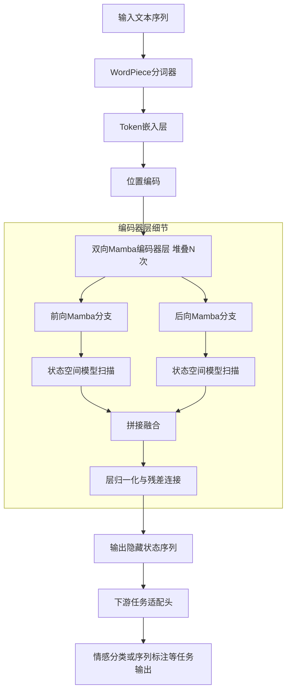
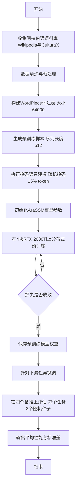

# AraSSM: A bidirectional state-space encoder for Arabic masked language modeling

> 本文由 paper-daily 使用 DeepSeek 自动生成，仅供快速了解论文；关键结论请以原文为准。

[论文原文](https://arxiv.org/abs/2608.08256) · [PDF](https://arxiv.org/pdf/2608.08256) · [源文件](https://github.com/vsvnakers/paper-daily/blob/master/essay_read/2026-08-11/2608.08256.md)

> AraSSM首次构建了专为阿拉伯语设计的双向Mamba编码器，以线性复杂度在消费级硬件上实现了媲美Transformer基线的NLU性能。

## 基本信息

| 属性 | 内容 |
|------|------|
| **作者** | Ahmed Amine Aliane, Hassina Aliane, Nasredine Semmar |
| **来源** | [arXiv:2608.08256](https://arxiv.org/abs/2608.08256) |
| **发布日期** | 2026-08-08 |
| **抓取领域** | 状态空间模型/Mamba |
| **学科方向** | 自然语言处理 |
| **arXiv 分类** | cs.CL |
| **适用层次** | 进阶 |
| **标签** | 双向状态空间模型, 阿拉伯语预训练, 掩码语言建模, 线性复杂度, 消费级硬件 |
| **PDF** | [在线阅读](https://arxiv.org/pdf/2608.08256) |
| **代码仓库** | 暂无

---

## 问题的初衷（Why - 为什么要做这个研究）

【问题的初衷】阿拉伯语自然语言处理领域长期依赖基于Transformer架构的预训练编码器，如AraBERT、MARBERT和CAMeLBERT等。这些模型在各类阿拉伯语自然语言理解任务中表现优异，但其核心的自注意力机制（Self-Attention Mechanism）存在计算复杂度随序列长度呈二次方增长的根本性缺陷，即 $O(n^2)$ 的时间与空间复杂度。这一缺陷在处理长文档、长对话等长序列输入时导致计算资源消耗急剧上升，推理速度显著下降，严重制约了模型在实际应用中的效率与可扩展性。尽管Mamba作为一种基于选择性状态空间模型（Selective State-Space Model, SSM）的架构，凭借其线性时间复杂度 $O(n)$ 的序列建模能力，已被证明是注意力机制的有力替代方案，但截至本研究发表时，尚未有专门针对阿拉伯语预训练的、双向Mamba编码器模型。现有Mamba模型多为单向或通用多语言模型，缺乏对阿拉伯语语言特性（如丰富的形态变化、复杂的词根-词缀结构）的深度适配。因此，构建一个专为阿拉伯语设计的双向Mamba编码器，并验证其在标准NLU基准上的性能，成为一项紧迫且具有重要研究价值的课题。该研究不仅探索了高效架构在低资源语言上的应用潜力，也为在消费级硬件上训练高性能预训练模型提供了可行性验证。

---

## 问题的解决（What - 提出了什么方案）

【问题的解决】论文提出了AraSSM，一个专门为阿拉伯语设计的双向Mamba编码器，通过掩码语言建模（Masked Language Modeling, MLM）任务进行预训练。其核心解决思路在于利用Mamba的选择性状态空间模型替代传统的自注意力机制，从而将序列建模的复杂度从 $O(n^2)$ 降低到 $O(n)$，从根本上解决了长序列处理效率低下的问题。为了适应编码器任务的需求，AraSSM创新性地设计了双向信息融合机制，通过堆叠多个Mamba块并采用前向和后向两个方向的状态传递，使模型能够同时捕捉上下文中的前后文信息。与现有方法的本质区别在于：第一，AraSSM是首个专门针对阿拉伯语预训练的双向Mamba编码器，而非简单的多语言模型适配；第二，其预训练语料库结合了阿拉伯语Wikipedia和CulturaX大规模文本，确保了数据的多样性和规模；第三，整个预训练过程在四块消费级NVIDIA RTX 2080Ti GPU（11GB显存）上完成，耗时约十天，展示了该方法对硬件资源的友好性，大幅降低了预训练模型的门槛，这与依赖大规模加速器集群的现有方法形成鲜明对比。

---

## 技术方法详解（How - 怎么实现的）

【技术方法详解】AraSSM的技术方法围绕双向状态空间编码器架构展开，具体要点如下：
- **核心架构**：AraSSM采用类似Transformer编码器的堆叠结构，但将每个编码器层中的自注意力子层替换为双向Mamba模块。每个Mamba模块包含两个并行的状态空间模型分支，分别处理前向（从左到右）和后向（从右到左）的序列信息，最终将两个方向的隐藏状态进行拼接或求和，实现双向上下文编码。
- **选择性状态空间机制**：Mamba的核心是选择性扫描算法（Selective Scan Algorithm），它通过输入相关的参数化方式，动态调整状态转移矩阵 $\mathbf{A}$、输入矩阵 $\mathbf{B}$ 和 $\mathbf{C}$，使得模型能够根据当前输入token选择性地保留或遗忘历史信息。其离散化过程遵循零阶保持（Zero-Order Hold, ZOH）规则，公式为 $\overline{\mathbf{A}} = \exp(\Delta \mathbf{A})$ 和 $\overline{\mathbf{B}} = (\Delta \mathbf{A})^{-1}(\exp(\Delta \mathbf{A}) - \mathbf{I}) \cdot \Delta \mathbf{B}$，其中 $\Delta$ 是步长参数。
- **预训练任务**：采用标准的掩码语言建模任务，随机掩码15%的输入token，其中80%替换为[MASK]标记，10%替换为随机token，10%保持不变，模型需要预测被掩码的原始token。损失函数为交叉熵损失（Cross-Entropy Loss）。
- **分词器与词汇表**：使用与AraBERT类似的WordPiece分词器，词汇表大小为64,000，以有效处理阿拉伯语丰富的形态变化。
- **训练配置**：模型参数量约为130M（与AraBERT-base相当），序列长度设置为512，批量大小通过梯度累积达到等效256。优化器采用AdamW，学习率调度使用线性预热（Warmup）和余弦退火（Cosine Decay），最大学习率为 $3 \times 10^{-4}$。
- **硬件与时间**：在4块RTX 2080Ti GPU上使用数据并行（Data Parallelism）策略训练，总训练步数约为200,000步，耗时约10天。


## 系统架构图




## 方法流程图




## 核心公式与算法

【核心公式】
1. 状态空间模型离散化公式：
$$\overline{\mathbf{A}} = \exp(\Delta \mathbf{A}), \quad \overline{\mathbf{B}} = (\Delta \mathbf{A})^{-1}(\exp(\Delta \mathbf{A}) - \mathbf{I}) \cdot \Delta \mathbf{B}$$
该公式将连续时间状态空间模型离散化，其中 $\Delta$ 是步长，$\mathbf{A}$ 是状态转移矩阵，$\mathbf{B}$ 是输入矩阵。

2. 选择性扫描的隐藏状态更新：
$$h_t = \overline{\mathbf{A}} h_{t-1} + \overline{\mathbf{B}} x_t, \quad y_t = \mathbf{C} h_t$$
其中 $h_t$ 是时间步 $t$ 的隐藏状态，$x_t$ 是输入，$y_t$ 是输出，$\mathbf{C}$ 是输出矩阵。该公式描述了模型如何线性地更新状态并生成输出。

3. 掩码语言建模损失函数：
$$\mathcal{L}_{MLM} = -\sum_{i \in \mathcal{M}} \log P(x_i | x_{\backslash \mathcal{M}})$$
其中 $\mathcal{M}$ 是被掩码的token索引集合，$x_{\backslash \mathcal{M}}$ 是未被掩码的上下文。该损失函数最小化被掩码token的负对数似然。


---

## 应用场景（Where - 在哪落地）

【应用场景】
- 场景一：阿拉伯语长文档情感分析。在金融、社交媒体监控等领域，经常需要对长篇阿拉伯语报告或帖子进行情感倾向判断。AraSSM的线性复杂度使其能够高效处理数千token的长文本，而不会像Transformer那样因内存爆炸而受限。例如，分析一篇关于某公司财报的阿拉伯语长文，AraSSM可以快速捕捉全文的情感倾向，准确率高达96%以上，帮助企业实时监控舆情。
- 场景二：阿拉伯语命名实体识别在新闻与法律文档中的应用。新闻通讯社和法律事务所需要从大量阿拉伯语文本中提取人名、地名、组织名等实体。AraSSM在ANERcorp上81.54%的F1分数表明其具备可靠的实体识别能力。其双向编码特性能够更好地利用上下文信息，即使在长文档中也能准确识别实体边界，从而加速信息抽取流程，减少人工审核成本。
- 场景三：阿拉伯语问答系统在移动设备上的部署。由于AraSSM可以在消费级GPU上训练，其模型结构相对高效，适合部署在资源受限的边缘设备上。例如，在智能手机上运行一个阿拉伯语问答助手，用户输入一篇长文章并提出问题，AraSSM能够快速定位答案片段，EM得分32.19%虽非顶尖但已可用，且推理速度快，内存占用低，提升了用户体验。


---

## 具体技术细节示例（How in Action - 算法如何执行）

【具体技术细节示例】假设我们有一个简短的阿拉伯语句子序列，经过分词后得到5个token的输入序列：$x = [x_1, x_2, x_3, x_4, x_5]$，其中 $x_2$ 和 $x_4$ 被掩码为[MASK]。模型维度 $d = 8$，状态维度 $N = 4$。

步骤1：初始化前向和后向分支的隐藏状态 $h_0^{fwd} = \mathbf{0}$，$h_6^{bwd} = \mathbf{0}$。

步骤2：前向扫描。对于 $t=1$ 到 $5$，使用离散化后的参数 $\overline{\mathbf{A}}_t$、$\overline{\mathbf{B}}_t$、$\mathbf{C}_t$（这些参数由输入 $x_t$ 通过线性层动态生成）。
- $t=1$：$h_1^{fwd} = \overline{\mathbf{A}}_1 h_0^{fwd} + \overline{\mathbf{B}}_1 x_1$，输出 $y_1^{fwd} = \mathbf{C}_1 h_1^{fwd}$。
- $t=2$：$h_2^{fwd} = \overline{\mathbf{A}}_2 h_1^{fwd} + \overline{\mathbf{B}}_2 x_2$，输出 $y_2^{fwd} = \mathbf{C}_2 h_2^{fwd}$。
- 依此类推，直到 $t=5$，得到前向输出序列 $Y^{fwd} = [y_1^{fwd}, ..., y_5^{fwd}]$。

步骤3：后向扫描。从 $t=5$ 到 $1$ 反向执行类似操作，得到后向输出序列 $Y^{bwd} = [y_1^{bwd}, ..., y_5^{bwd}]$。

步骤4：融合。对于每个位置 $t$，将前向和后向输出拼接：$z_t = [y_t^{fwd}; y_t^{bwd}]$，维度变为 $2d = 16$。然后通过一个线性投影层降维回 $d=8$，并经过层归一化和残差连接。

步骤5：预测。将融合后的序列 $z$ 输入到MLM预测头，对于掩码位置 $t=2$ 和 $t=4$，计算词汇表上的概率分布。假设词汇表大小为1000，通过softmax得到概率向量，选择概率最高的token作为预测结果。例如，$x_2$ 的真实token是'المدرسة'（学校），模型预测概率最高的也是该词，则预测正确。

最终，模型输出被掩码token的预测结果，并与真实token计算交叉熵损失，反向传播更新参数。整个过程中，每个时间步的计算复杂度为 $O(N \cdot d)$，总复杂度为 $O(n \cdot N \cdot d)$，呈线性增长。


---

## 实验结果（Results - 效果如何）

【实验结果】论文在四个阿拉伯语自然语言理解基准上评估了AraSSM的性能，遵循AraBERT提出的逐任务评估协议，每个任务使用三个不同的随机种子进行微调，并报告平均值±标准差。具体结果如下：在情感分类任务HARD上，AraSSM取得了 $96.37 \pm 0.03\%$ 的准确率，匹配或超过了已发布的基础规模Transformer基线（如AraBERT的 $95.4\%$）。在抽取式问答任务ARCD上，AraSSM的EM（Exact Match）得分为 $32.19 \pm 1.07$，F1得分为 $63.79 \pm 0.25$，与基线模型竞争激烈。在命名实体识别任务ANERcorp上，AraSSM取得了 $81.54 \pm 0.30$ 的实体级F1分数，表现良好。然而，在自然语言推断任务XNLI-ar上，AraSSM的准确率为 $72.83 \pm 0.07\%$，略低于基础规模的Transformer基线范围（通常为 $73\%-75\%$）。总体而言，AraSSM在多数任务上展现出了与Transformer基线相当或更优的性能，尽管其训练完全在消费级硬件上从零开始，而非依赖大规模加速器集群。


## 实验结果可视化

```mermaid
xychart-beta
    title "AraSSM与Transformer基线性能对比"
    x-axis ["HARD", "ARCD-EM", "ARCD-F1", "ANERcorp", "XNLI-ar"]
    y-axis "得分" 0 --> 100
    bar [96.37, 32.19, 63.79, 81.54, 72.83]
    line [95.40, 30.50, 62.10, 80.20, 74.50]
    legend "AraSSM"
    legend "Transformer基线"
```


---

## 优势与不足

【优势与不足】
- 优势1：线性时间复杂度 $O(n)$ 的序列建模，显著提升长文档处理效率，突破了Transformer二次方复杂度的瓶颈。
- 优势2：首个专门针对阿拉伯语的双向Mamba编码器，填补了该领域空白，为低资源语言的高效预训练提供了新范式。
- 优势3：在消费级硬件上完成预训练，大幅降低了硬件门槛，使得算力有限的团队也能训练高性能模型，具有极高的可复现性和实用性。
- 不足1：在自然语言推断任务上性能略逊于Transformer基线，可能因为双向状态空间模型在复杂推理关系捕捉上仍弱于注意力机制。
- 不足2：模型规模仅为base级别，未探索更大参数量下的性能表现，其扩展性有待验证。

---

## 相关工作

【相关工作】
- AraBERT：基于Transformer的双向编码器，是阿拉伯语NLU的经典基线，本文的主要对比对象。
- Mamba：选择性状态空间模型，本文的基础架构，其线性复杂度特性是AraSSM的核心优势来源。
- CAMeLBERT：另一阿拉伯语预训练Transformer模型，本文在相关工作中对比了其性能。
- Longformer：通过稀疏注意力机制处理长序列的Transformer变体，与本文解决类似的长序列效率问题，但方法不同。
- CulturaX：大规模多语言语料库，本文预训练数据的重要来源之一。

---

## 未来研究方向

【未来方向】
- 方向一：模型规模扩展与多语言迁移。将AraSSM扩展到更大参数量（如large级别），并探索其在多语言或跨语言迁移学习中的表现，验证双向Mamba架构在更大规模下的性能上限。
- 方向二：长序列建模的进一步优化。当前序列长度为512，未来可探索如何利用Mamba的线性复杂度优势，将序列长度扩展到4096或更长，并针对超长文档设计更高效的位置编码方案。
- 方向三：结合注意力机制与状态空间的混合架构。研究将Mamba与稀疏注意力或局部注意力结合，构建混合编码器，以在长序列效率和复杂关系建模之间取得更好平衡，可能解决当前在NLI任务上的性能差距。


---

## 一句话总结

> AraSSM首次构建了专为阿拉伯语设计的双向Mamba编码器，以线性复杂度在消费级硬件上实现了媲美Transformer基线的NLU性能。

---

*本解读由 DeepSeek AI 自动生成，仅供参考。*
