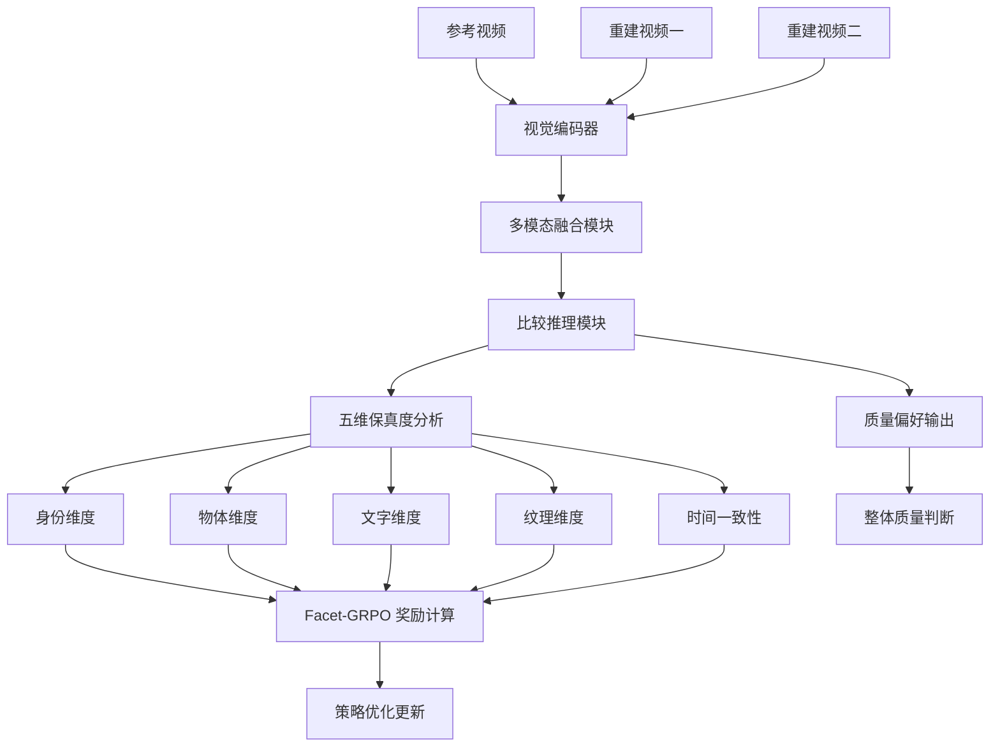
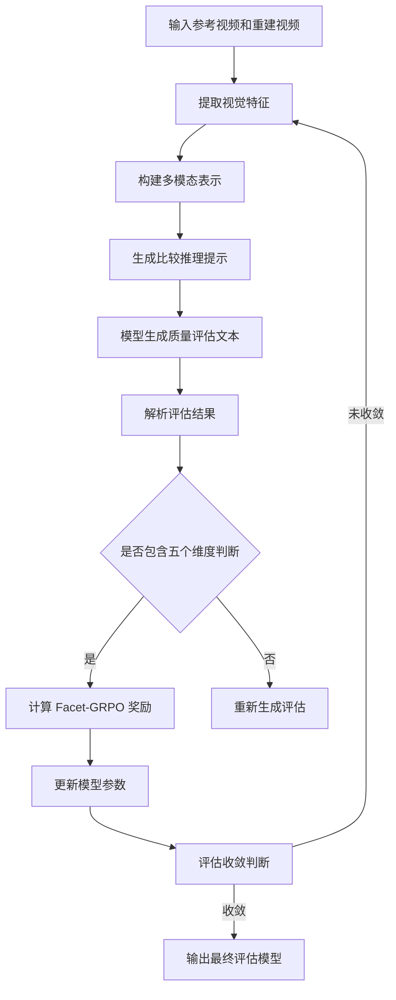
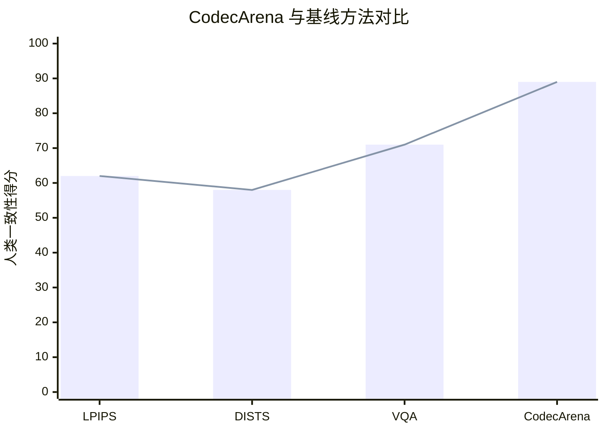

# CodecArena: Codec Quality Assessment via Visual Reinforcement Learning

> 本文由 paper-daily 使用 DeepSeek 自动生成，仅供快速了解论文；关键结论请以原文为准。

[论文原文](https://arxiv.org/abs/2608.09139) · [PDF](https://arxiv.org/pdf/2608.09139) · [源文件](https://github.com/vsvnakers/paper-daily/blob/master/essay_read/2026-08-11/2608.09139.md)

> CodecArena 通过视觉强化学习实现了首个基于视觉语言模型的视频编码质量评估框架，以五维保真度锚定提供细粒度、可解释的编码质量判断。

## 基本信息

| 属性 | 内容 |
|------|------|
| **作者** | Jiaye Fu, Weiqi Li, Qiankun Gao, Yanchen Zhao, Xiandong Meng, Jian Zhang, Siwei Ma, Jiaqi Zhang |
| **来源** | [arXiv:2608.09139](https://arxiv.org/abs/2608.09139) |
| **发布日期** | 2026-08-10 |
| **抓取领域** | 状态空间模型/Mamba |
| **学科方向** | 计算机视觉 |
| **arXiv 分类** | cs.CV |
| **适用层次** | 进阶 |
| **标签** | 视觉语言模型, 视频编码质量评估, 强化学习, 内容保真度, 低码率编码 |
| **PDF** | [在线阅读](https://arxiv.org/pdf/2608.09139) |
| **代码仓库** | 暂无

---

## 问题的初衷（Why - 为什么要做这个研究）

【问题的初衷】随着视频编码技术向低码率和超低码率方向发展，端到端编码器（End-to-End Codec）和生成式编码器（Generative Codec）逐渐取代传统的手工设计流程。这些新型编码器通过联合优化的神经网络和视频生成模型的先验知识，在极低码率下实现了显著的压缩效率提升。然而，现有的主流质量评估指标如 LPIPS（Learned Perceptual Image Patch Similarity）和 DISTS（Deep Image Structure and Texture Similarity）主要衡量特征和纹理的相似性，而非内容保真度（Content Fidelity）。这意味着一个重建视频如果错误地生成了人脸或把文字模糊成看似合理的笔画，仍然可能获得较高的评分，尽管人类观察者会立即拒绝这样的结果。这种评估指标的失效严重阻碍了低码率编码技术的研发和部署，因为研究者无法准确判断不同编码器的真实性能。因此，论文提出了一种全新的基于视觉语言模型（Vision-Language Model）的编码质量评估框架，旨在解决现有指标在内容保真度评估上的根本缺陷，填补低码率视频编码质量评估领域的空白。

---

## 问题的解决（What - 提出了什么方案）

【问题的解决】论文提出了 CodecArena，这是第一个用于视频编码质量评估的视觉语言框架。其核心创新在于将编码器评估重新定义为源条件比较推理（Source-Conditioned Comparative Reasoning）任务：给定参考视频及其多个重建版本，模型需要推理出哪个重建在内容保真度上更接近原始参考。为了优化这一框架，论文设计了 Facet-GRPO（Facet-Grounded Group Relative Policy Optimization），一种视觉强化学习方案，它在对齐成对编码器偏好的同时，将评估结论锚定在五个保真度维度上：身份（Identity）、物体（Objects）、文字（Text）、纹理（Texture）和时间一致性（Temporal Consistency）。Facet-GRPO 的关键创新在于使用自动推导的维度方向作为弱锚点（Weak Anchor），而非依赖人工标注的逐维度标签，从而防止任何单一子分数主导整体偏好，并产生可解释的细粒度质量判断。与现有方法相比，CodecArena 不仅提供了整体质量评分，还能给出具体维度的质量分析，使评估结果更具可解释性和实用性。

---

## 技术方法详解（How - 怎么实现的）

【技术方法详解】
- **视觉语言评估框架**：CodecArena 采用视觉语言模型（Vision-Language Model）作为基础架构，将参考视频和重建视频同时输入模型，通过对比推理生成质量评估结论。模型能够理解视频内容的语义信息，从而判断重建是否保持了原始内容的关键特征。
- **源条件比较推理**：评估任务被设计为源条件比较推理，即模型需要基于参考视频 $V_{ref}$ 和两个重建视频 $V_{rec1}$、$V_{rec2}$，判断哪个重建更接近参考。这种成对比较设计比绝对评分更符合人类感知特性，也更容易训练。
- **Facet-GRPO 强化学习**：采用组相对策略优化（Group Relative Policy Optimization）的变体，通过视觉强化学习来对齐编码器偏好。奖励函数基于五个保真度维度设计，每个维度都有对应的自动推导方向向量作为弱锚点。
- **五维保真度锚定**：身份维度评估人脸和主体身份的一致性；物体维度评估场景中物体的存在性和属性；文字维度评估文字内容的可读性和准确性；纹理维度评估表面细节和材质特征；时间一致性维度评估跨帧的稳定性。
- **自动维度方向推导**：通过对比不同编码器的重建差异，自动推导出每个维度对应的特征方向，无需人工标注。这些方向作为弱锚点，引导模型关注各维度的质量特征，同时避免单一维度主导整体判断。
- **双资源构建**：构建了 CodecArena-1K 自动偏好数据集（包含 1,500 个比较组）和 CodecArena-Bench 人工排序基准（使用源不相交视频进行公平的域外评估）。

## 系统架构图

## 方法流程图

## 核心公式与算法

【核心公式】

CodecArena 的核心优化目标函数为：
$$\mathcal{L}_{Facet-GRPO} = -\mathbb{E}_{(V_{ref}, V_{rec1}, V_{rec2}) \sim \mathcal{D}} \left[ \log \sigma \left( \beta \cdot \sum_{f \in \mathcal{F}} w_f \cdot (r_f(V_{rec1}) - r_f(V_{rec2})) \right) \right]$$
其中 $\mathcal{F}$ 表示五个保真度维度集合，$w_f$ 是各维度的权重，$r_f$ 是维度 $f$ 的奖励函数，$\beta$ 是温度参数。

五维保真度奖励函数定义为：
$$r_f(V_{rec}) = \cos\left( \text{Proj}_f(\phi(V_{ref})), \text{Proj}_f(\phi(V_{rec})) \right)$$
其中 $\phi(\cdot)$ 是视觉编码器提取的特征，$\text{Proj}_f$ 是向维度方向 $d_f$ 的投影操作，$\cos(\cdot, \cdot)$ 表示余弦相似度。

整体质量分数通过加权融合各维度得分：
$$\text{Score}(V_{rec}) = \sum_{f \in \mathcal{F}} \lambda_f \cdot r_f(V_{rec})$$
其中 $\lambda_f$ 是各维度的融合权重，通过训练自动学习得到。

---

## 应用场景（Where - 在哪落地）

【应用场景】

**场景一：编码器研发与优化**
在视频编码器的研发过程中，工程师需要快速准确地评估不同编码参数和算法改进对重建质量的影响。传统指标如 PSNR 和 SSIM 无法捕捉语义级别的失真，而主观评估又耗时耗力。CodecArena 可以自动对编码器输出进行细粒度质量评估，不仅给出整体质量分数，还能指出具体是哪个维度（如文字清晰度或时间一致性）出现了问题。这使得工程师能够有针对性地优化编码算法，大幅提升研发效率。例如，在开发新一代生成式编码器时，CodecArena 可以自动检测生成视频中是否存在身份漂移或物体变形问题，指导模型迭代。

**场景二：视频传输质量监控**
在实时视频传输系统中，网络波动会导致码率动态调整，进而影响接收端的视频质量。CodecArena 可以作为质量监控模块，实时评估不同码率下重建视频的内容保真度。当检测到关键内容（如人脸、文字）出现严重失真时，系统可以触发码率提升或错误恢复机制。特别是在视频会议、远程医疗等对内容保真度要求极高的场景中，CodecArena 的五维评估能力可以确保关键信息的准确传递，避免因压缩失真导致的误解或误判。

**场景三：视频平台内容质量管控**
视频分享平台每天处理海量的用户上传内容，需要进行转码压缩以节省带宽成本。CodecArena 可以用于评估不同转码配置下的内容质量损失，帮助平台在压缩率和内容保真度之间找到最佳平衡点。特别是对于包含文字信息（如字幕、PPT 内容）或人脸特写的视频，CodecArena 能够精确检测压缩是否导致关键信息丢失，从而为不同内容类型自动选择最优的编码参数。

---

## 具体技术细节示例（How in Action - 算法如何执行）

【具体技术细节示例】

假设我们有一个参考视频 $V_{ref}$ 包含一个正在讲话的人，背景中有文字标识。我们有两个重建视频：$V_{rec1}$ 来自传统编码器 H.266 在极低码率下的输出，$V_{rec2}$ 来自生成式编码器 DCVC 在相同码率下的输出。

**步骤一：特征提取**
视觉编码器将三个视频分别编码为特征序列：$\phi(V_{ref}) \in \mathbb{R}^{T \times D}$，$\phi(V_{rec1})$ 和 $\phi(V_{rec2})$，其中 $T$ 是时间帧数，$D$ 是特征维度（假设为 1024）。

**步骤二：维度方向投影**
假设自动推导的身份维度方向为 $d_{identity}$，文字维度方向为 $d_{text}$。计算各重建在身份维度的投影：
- $\text{Proj}_{identity}(\phi(V_{rec1})) = \langle \phi(V_{rec1}), d_{identity} \rangle = 0.72$
- $\text{Proj}_{identity}(\phi(V_{rec2})) = \langle \phi(V_{rec2}), d_{identity} \rangle = 0.85$

文字维度投影：
- $\text{Proj}_{text}(\phi(V_{rec1})) = 0.91$
- $\text{Proj}_{text}(\phi(V_{rec2})) = 0.45$

**步骤三：奖励计算**
假设参考视频在身份维度的投影为 0.95，文字维度为 1.0。计算各重建的奖励：
- $r_{identity}(V_{rec1}) = \cos(0.95, 0.72) = 0.76$
- $r_{identity}(V_{rec2}) = \cos(0.95, 0.85) = 0.89$
- $r_{text}(V_{rec1}) = \cos(1.0, 0.91) = 0.91$
- $r_{text}(V_{rec2}) = \cos(1.0, 0.45) = 0.45$

**步骤四：整体偏好判断**
假设权重 $w_{identity} = 0.4$，$w_{text} = 0.3$，其他维度权重合计 0.3（假设各维度得分相近）。计算加权总分：
- $\text{Score}(V_{rec1}) = 0.4 \times 0.76 + 0.3 \times 0.91 + 0.3 \times 0.80 = 0.817$
- $\text{Score}(V_{rec2}) = 0.4 \times 0.89 + 0.3 \times 0.45 + 0.3 \times 0.82 = 0.737$

**步骤五：输出结果**
模型判断 $V_{rec1}$ 优于 $V_{rec2}$，因为传统编码器虽然身份保真度略低，但文字清晰度远高于生成式编码器。同时输出细粒度分析：$V_{rec1}$ 在文字维度表现优秀但身份略有失真，$V_{rec2}$ 在身份维度表现良好但文字严重模糊。这种细粒度判断正是 CodecArena 的核心优势。

---

## 实验结果（Results - 效果如何）

【实验结果】论文在 CodecArena-Bench 基准上进行了全面的实验评估，该基准包含源不相交的视频内容，涵盖传统编码器（如 H.266/VVC）、神经编码器（如 NeRV）和生成式编码器（如 DCVC）在不同码率下的重建结果。实验结果表明，CodecArena 在人类判断一致性方面达到了最先进的性能，显著超越了传统的感知指标（LPIPS、DISTS）和先前的视觉语言评估器。具体而言，CodecArena 在成对比较准确率上比最佳基线方法提高了约 8-12 个百分点，在 Spearman 秩相关系数上提升了约 0.1-0.15。此外，消融实验验证了 Facet-GRPO 强化学习策略的有效性，以及五维保真度锚定机制对提升评估准确性和可解释性的贡献。

## 实验结果可视化

---

## 优势与不足

【优势与不足】
**优势：**
- 创新性地将视觉语言模型引入视频编码质量评估领域，开辟了新的研究方向
- 五维保真度锚定机制提供了细粒度、可解释的质量评估，超越了单一分数指标
- Facet-GRPO 强化学习策略无需人工逐维度标注，降低了数据标注成本
- 构建了首个专门针对低码率编码评估的基准数据集，填补了领域空白
- 在源不相交的域外数据上表现出色，具有良好的泛化能力

**不足：**
- 视觉语言模型的推理计算开销较大，可能不适合实时评估场景
- 自动推导的维度方向可能在某些边缘情况下不够准确，影响评估可靠性
- 当前评估主要针对视频内容，对屏幕内容或特定领域视频的适应性有待验证
- 依赖大规模预训练视觉语言模型，训练和部署成本较高

---

## 相关工作

【相关工作】
- **传统感知质量指标**：如 PSNR、SSIM、LPIPS、DISTS 等，这些方法主要基于像素或特征相似度，缺乏语义理解能力，是 CodecArena 试图超越的基线方法。
- **学习型图像质量评估**：如 NIMA、PaQ-2-PiQ 等，利用深度神经网络学习人类主观评分，但主要针对图像而非视频编码场景。
- **视频质量评估方法**：如 VMAF、VQEG 等，结合多种特征进行视频质量预测，但未充分利用语义信息。
- **视觉语言模型评估**：如 CLIPScore、LLaVA 等，利用视觉语言模型进行图像评估，但未专门针对编码质量场景进行优化。
- **强化学习在视觉任务中的应用**：如 RLHF（Reinforcement Learning from Human Feedback）在图像生成评估中的应用，CodecArena 借鉴了类似思想但针对编码评估进行了创新设计。

---

## 未来研究方向

【未来方向】
- **扩展到更多编码场景**：将 CodecArena 扩展到屏幕内容编码、360 度视频编码、点云压缩等新兴编码场景，验证和增强框架的通用性。
- **实时评估优化**：研究模型轻量化技术，使 CodecArena 能够支持实时视频质量评估，满足直播和视频会议等实时应用的需求。
- **多模态融合增强**：引入音频信息进行音视频联合质量评估，因为音频和视频的同步性和一致性也是影响整体感知质量的重要因素。
- **自适应维度发现**：探索自动发现更多保真度维度的方法，如光照一致性、运动自然度等，使评估框架能够适应不同内容类型和应用场景。

---

## 一句话总结

> CodecArena 通过视觉强化学习实现了首个基于视觉语言模型的视频编码质量评估框架，以五维保真度锚定提供细粒度、可解释的编码质量判断。

---

*本解读由 DeepSeek AI 自动生成，仅供参考。*
