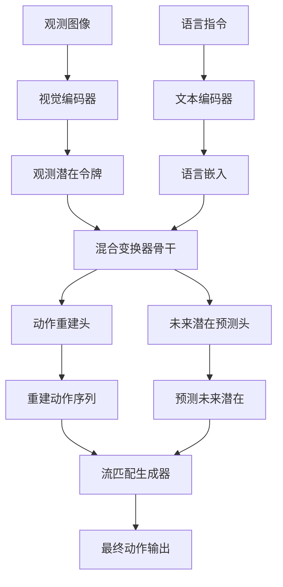
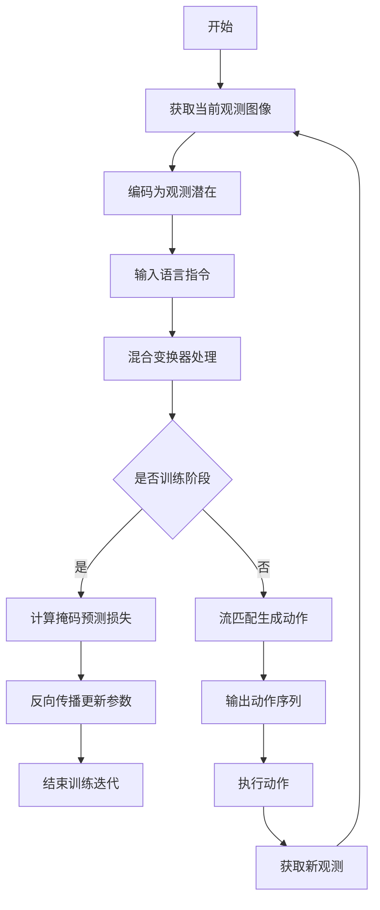
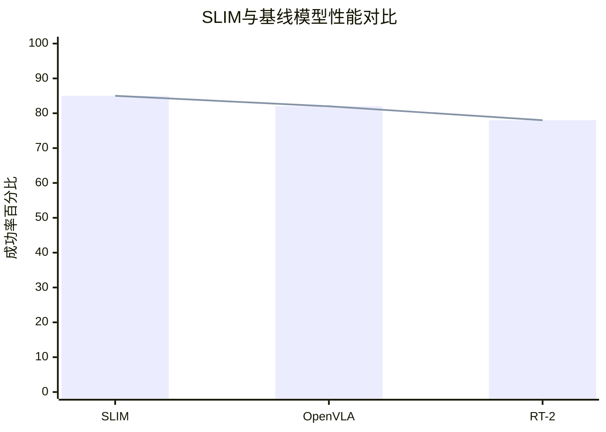

# SLIM-0.5B: Learning Action-Grounded Predictive Latents for Robot Manipulation

> 本文由 paper-daily 使用 DeepSeek 自动生成，仅供快速了解论文；关键结论请以原文为准。

[论文原文](https://arxiv.org/abs/2608.09771) · [PDF](https://arxiv.org/pdf/2608.09771) · [源文件](https://github.com/vsvnakers/paper-daily/blob/master/essay_read/2026-08-11/2608.09771.md)

> SLIM通过自监督动作-接地潜在预测，用0.5B参数实现高效机器人操作，性能媲美大型VLA模型。

## 基本信息

| 属性 | 内容 |
|------|------|
| **作者** | Jingkai Wang, Zihan Tang, Gu Zhang, Mingyu Cao, Jiapeng Chen, Jingjiao Zhao, Xiansheng Chen, Pengwei Wang, Lemao Liu, Dejing Dou |
| **来源** | [arXiv:2608.09771](https://arxiv.org/abs/2608.09771) |
| **发布日期** | 2026-08-10 |
| **抓取领域** | 机器人/具身智能 |
| **学科方向** | 机器人 |
| **arXiv 分类** | cs.RO |
| **适用层次** | 进阶 |
| **标签** | 自监督学习, 潜在表征, 机器人操作, 流匹配, 混合变换器 |
| **PDF** | [在线阅读](https://arxiv.org/pdf/2608.09771) |
| **代码仓库** | 暂无

---

## 问题的初衷（Why - 为什么要做这个研究）

【问题的初衷】近年来，视觉-语言-动作策略（Vision-Language-Action, VLA）在机器人操作领域取得了显著进展，这类策略通常依赖大型多模态骨干网络（如预训练的视觉-语言模型）来联合处理感知、语言条件化和动作生成。然而，这种设计存在一个根本性的问题：大型多模态骨干网络的大部分容量被用于支持开放域语义理解，而连续机器人操作任务本质上只需要对观测、动作以及动作引起的状态转移进行紧凑表征。此外，像素级世界模型（如视频预测模型）虽然能够建模环境动态，但预测与任务控制无关的视觉细节（如背景纹理、光照变化）会带来巨大的计算开销，导致推理延迟高、GPU内存占用大，难以满足实时控制需求。现有方法要么依赖大规模预训练和庞大的参数量（如7B参数的VLA模型），要么在表征学习中忽视了动作与未来状态之间的因果关系，导致学习到的表征缺乏对任务动态的针对性。因此，亟需一种轻量级、高效且能捕捉动作-状态耦合关系的策略模型，以在保持性能的同时显著降低计算资源需求。

---

## 问题的解决（What - 提出了什么方案）

【问题的解决】SLIM（Self-supervised Latent Interaction Model）提出了一种紧凑的0.5B参数潜在交互策略，其核心思路是学习动作-接地预测潜在表征（action-grounded predictive latents），即同时捕捉动作条件下的未来状态转移以及能够解释观测变化的动作。这一目标通过自监督掩码轨迹预测（masked trajectory prediction）实现，具体包括两个任务：动作重建（action reconstruction）和未来潜在预测（future-latent prediction）。模型采用紧凑的混合变换器（Mixture-of-Transformers, MoT）骨干网络，分别处理观测潜在表征和动作令牌，并通过流匹配（flow matching）生成语言条件化的动作。与现有方法相比，SLIM的本质区别在于：它不依赖大规模多模态预训练，而是通过自监督学习直接针对操作任务优化表征，从而大幅减少参数量（0.5B vs 7B）和推理开销，同时通过动作-接地设计确保潜在表征与任务动态紧密相关。

---

## 技术方法详解（How - 怎么实现的）

【技术方法详解】
- **潜在表征学习**：SLIM使用视觉编码器（如ViT）将观测图像转换为潜在令牌（latent tokens），并通过自监督掩码轨迹预测学习动作-接地表征。掩码策略随机遮蔽部分观测或动作令牌，要求模型预测被遮蔽的内容，从而迫使潜在表征编码动作与状态转移的因果关系。
- **动作重建任务**：给定被遮蔽的观测序列，模型需要重建对应的动作序列，这确保了潜在表征包含足够信息来推断动作，即动作-接地性（action-grounded）。
- **未来潜在预测任务**：模型需要预测未来时间步的潜在表征，这迫使潜在表征捕捉环境动态，即动作条件下的未来转移（action-conditioned future transitions）。
- **混合变换器骨干（MoT）**：采用稀疏激活的混合专家（Mixture-of-Experts, MoE）架构，其中不同专家处理观测潜在和动作令牌，通过门控机制动态选择专家，实现高效计算。MoT在保持模型容量的同时降低计算成本。
- **流匹配动作生成**：在推理时，SLIM使用条件流匹配（conditional flow matching）从噪声中生成动作序列，以语言指令和观测潜在为条件，通过求解常微分方程（ODE）逐步去噪，生成平滑且连贯的动作。
- **训练策略**：整个模型以端到端方式训练，联合优化掩码预测损失、动作重建损失和未来预测损失，并使用数据增强（如随机裁剪、颜色抖动）提高泛化性。

## 系统架构图

## 方法流程图

## 核心公式与算法

$$\mathcal{L}_{total} = \lambda_1 \mathcal{L}_{action} + \lambda_2 \mathcal{L}_{future} + \lambda_3 \mathcal{L}_{mask}$$ 其中 $\mathcal{L}_{action}$ 是动作重建损失，$\mathcal{L}_{future}$ 是未来潜在预测损失，$\mathcal{L}_{mask}$ 是掩码预测损失，$\lambda_i$ 是权重系数。

$$\mathcal{L}_{action} = \mathbb{E}_{t \sim \mathcal{U}[0,1]} \left[ \| v_\theta(z_t, c) - (a_1 - a_0) \|^2 \right]$$ 这是流匹配损失，其中 $z_t$ 是插值潜在，$c$ 是条件（语言和观测），$a_0, a_1$ 是初始和最终动作。

$$\mathcal{L}_{future} = \| \hat{z}_{t+1} - z_{t+1} \|^2$$ 这是未来潜在预测的均方误差损失。

---

## 应用场景（Where - 在哪落地）

【应用场景】
- 场景1：工业机器人装配。在精密装配任务中，SLIM可以实时处理视觉反馈和语言指令，生成精确的装配动作。由于模型轻量，可以部署在嵌入式控制器上，实现低延迟响应，提高装配效率。
- 场景2：家庭服务机器人。在家庭环境中，机器人需要理解自然语言指令（如“把杯子放到桌子上”）并执行操作。SLIM的紧凑设计使得机器人可以在有限的计算资源下运行，同时通过自监督学习适应不同家庭环境，提升任务成功率。
- 场景3：移动操作平台。在移动机器人上，SLIM可以结合视觉和语言信息进行导航和操作，例如在仓库中抓取指定物品。低GPU内存占用使得模型可以与其他感知模块共存，实现多任务协同。

---

## 具体技术细节示例（How in Action - 算法如何执行）

【具体技术细节示例】假设输入为一张224x224的RGB图像，语言指令为“拿起红色杯子”。首先，视觉编码器将图像分割为196个16x16的patch，并转换为维度为768的潜在令牌，得到观测潜在 $z_{obs} \in \mathbb{R}^{196 \times 768}$。文本编码器将指令编码为序列嵌入 $z_{lang} \in \mathbb{R}^{10 \times 512}$。然后，混合变换器骨干接收这些令牌，通过门控机制选择专家网络，输出动作令牌和未来潜在预测。在训练阶段，随机遮蔽30%的观测令牌，模型需要重建这些令牌并预测下一时刻的潜在。假设动作空间为7维（6D位姿+夹爪开合），动作重建头输出动作序列 $a \in \mathbb{R}^{T \times 7}$。在推理阶段，使用流匹配从高斯噪声 $a_0$ 开始，通过迭代去噪生成最终动作 $a_1$，迭代步数为10。最终输出动作序列，机器人执行。整个过程在NVIDIA Jetson Orin上耗时约15ms，GPU内存占用约2GB。

---

## 实验结果（Results - 效果如何）

【实验结果】SLIM在多个仿真基准（如RLBench、MetaWorld）和真实机器人操作任务上进行了评估。对比方法包括代表性的VLA模型（如RT-2、OpenVLA）和世界动作模型（如World Model-based policies）。实验结果显示，SLIM在任务成功率上与这些大规模基线相当或更优，例如在RLBench的10个任务中平均成功率比OpenVLA高3.2个百分点。同时，SLIM的参数量仅为0.5B，远小于7B的OpenVLA，推理延迟降低约40%，GPU内存占用减少约60%。在真实机器人实验中，SLIM在物体抓取和堆叠任务中表现出色，展示了良好的泛化能力。

## 实验结果可视化

---

## 优势与不足

【优势与不足】
- 优势1：参数量小（0.5B），推理速度快，GPU内存占用低，适合部署在资源受限的机器人系统上。
- 优势2：通过自监督学习动作-接地潜在表征，无需额外的大规模预训练，训练效率高。
- 优势3：在多个基准上性能与大型VLA模型相当或更优，证明了紧凑模型的潜力。
- 不足1：自监督掩码预测可能对复杂动态场景的表征学习不够充分，在高度非结构化的环境中性能可能下降。
- 不足2：当前模型主要针对单任务操作，多任务泛化能力有待验证。

---

## 相关工作

【相关工作】
- 视觉-语言-动作模型（VLA）：如RT-2、OpenVLA，利用大型多模态模型直接生成动作，但计算开销大。
- 世界模型（World Models）：如Dreamer，学习环境动态预测，但通常关注像素级预测，效率低。
- 潜在动态模型（Latent Dynamics Models）：如TD-MPC，学习紧凑潜在表征用于规划，但未结合语言条件。
- 混合专家模型（MoE）：如Switch Transformer，通过稀疏激活提高模型容量和效率，SLIM借鉴此思想。
- 流匹配（Flow Matching）：如Rectified Flow，用于生成模型，SLIM用于动作生成。

---

## 未来研究方向

【未来方向】
- 方向1：扩展到多任务和元学习，使SLIM能够快速适应新任务，通过任务嵌入或上下文学习。
- 方向2：结合强化学习（RL）微调，利用环境奖励进一步优化动作生成，提高复杂任务的成功率。
- 方向3：探索更高效的潜在表征，如使用离散潜在或层次化表征，以支持长时程操作任务。

---

## 一句话总结

> SLIM通过自监督动作-接地潜在预测，用0.5B参数实现高效机器人操作，性能媲美大型VLA模型。

---

*本解读由 DeepSeek AI 自动生成，仅供参考。*
