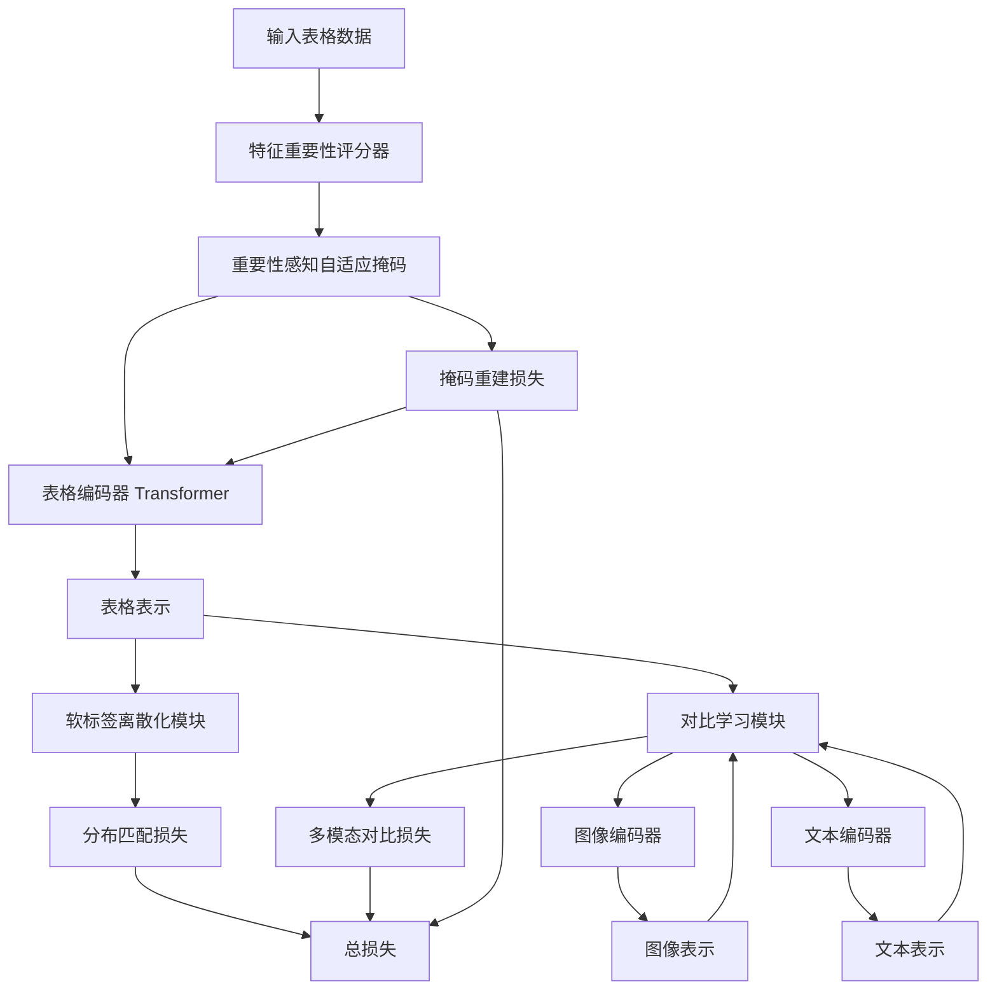
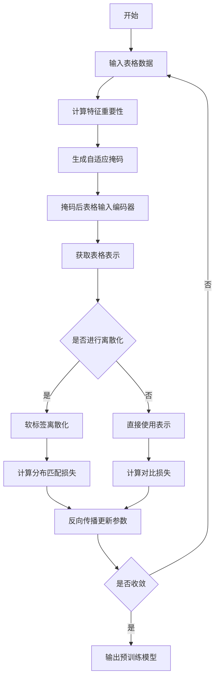

# Unlocking the Power of Medical Tabular Data via Semantic-Aware Multimodal Pre-training

> 本文由 paper-daily 使用 DeepSeek 自动生成，仅供快速了解论文；关键结论请以原文为准。

[论文原文](https://arxiv.org/abs/2608.10522) · [PDF](https://arxiv.org/pdf/2608.10522) · [源文件](https://github.com/vsvnakers/paper-daily/blob/master/essay_read/2026-08-12/2608.10522.md)

> 提出语义感知多模态预训练框架，显式建模表格二维结构，通过重要性掩码和软标签离散化提升医学诊断性能。

## 基本信息

| 属性 | 内容 |
|------|------|
| **作者** | Yingsheng Liu, Haiming Li, Jingmin Zhu, Jiajun Sun, Victoria Mar, Monika Janda, H. Peter Soyer, Zongyuan Ge, Zhen Yu |
| **来源** | [arXiv:2608.10522](https://arxiv.org/abs/2608.10522) |
| **发布日期** | 2026-08-11 |
| **抓取领域** | 多模态/视觉-语言 |
| **学科方向** | 计算机视觉 · 人工智能 |
| **arXiv 分类** | cs.CV, cs.AI |
| **适用层次** | 进阶 |
| **标签** | 多模态预训练, 医学表格数据, 语义感知, 自适应掩码, 软标签离散化 |
| **PDF** | [在线阅读](https://arxiv.org/pdf/2608.10522) |
| **代码仓库** | 暂无

---

## 问题的初衷（Why - 为什么要做这个研究）

【问题的初衷】
医学影像-文本多模态预训练（如 CLIP 风格模型）在医学表示学习中占据主导地位，但非结构化的文本描述（如放射学报告）缺乏结构化临床表格（如实验室检验、病史记录）中固有的密集、定量诊断表型信息。现有方法在利用表格数据时存在两个关键缺陷：其一，语义无关设计（Semantic-Agnostic Design）将表格视为扁平向量（Flat Vector），忽略了特征间固有的层级结构（如某些特征对诊断的贡献远大于其他特征）；其二，使用不稳定的连续回归目标（Continuous Regression Objective）来对齐表格与图像/文本表示，导致训练不稳定且难以保持特征内的序数关系（Ordinal Relationship）。这些问题限制了模型对医学表格数据深层语义的挖掘，阻碍了跨模态预训练的性能提升。因此，本文旨在提出一种语义感知（Semantic-Aware）的预训练框架，显式建模表格数据的二维结构（特征间层级与特征内连续性-离散性二重性），以释放医学表格数据的潜力，提升下游任务（如皮肤病和眼病诊断）的性能与泛化能力。

---

## 问题的解决（What - 提出了什么方案）

【问题的解决】
本文提出一个新颖的语义感知多模态预训练框架，核心创新在于显式建模表格数据的二维结构。首先，针对特征间层级（Inter-Feature Hierarchy），引入重要性感知自适应掩码（Importance-Aware Adaptive Masking），通过无标签课程学习（Label-Free Curriculum）优先掩码并重建对诊断更重要的特征，从而让模型学习到特征的重要性排序。其次，针对特征内连续性-离散性二重性（Intra-Feature Continuity-Discreteness Duality），提出软标签离散化模块（Soft-Label Discretized Module），将数值特征离散化为软标签分布，用稳定的分布匹配（Distribution Matching）替代不稳定的数值回归，从而在数学上保持序数关系。与现有方法将表格视为扁平向量并使用回归损失不同，本文方法显式建模表格的结构先验，并通过分类目标增强训练稳定性。实验在大型皮肤病学数据集（SLICE-3D, HOP）和眼科学数据集（EyePACS）上取得新的最先进性能，验证了方法的鲁棒性和跨域泛化能力。

---

## 技术方法详解（How - 怎么实现的）

【技术方法详解】
- **二维结构建模**：将表格数据 $X \in \mathbb{R}^{N \times F}$ 视为具有行（样本）和列（特征）的二维结构，其中特征列具有语义含义，而非扁平向量。
- **重要性感知自适应掩码**：设计一个可学习的特征重要性评分器（Feature Importance Scorer），基于特征与标签的相关性（如互信息）或梯度信号，动态调整掩码概率。在训练过程中，高重要性特征被掩码的概率更高，迫使模型利用上下文特征进行重建，形成课程学习（Curriculum Learning）效果。
- **软标签离散化模块**：将连续特征值 $x_i$ 映射到 $K$ 个离散桶（Bins），每个桶分配一个软标签（Soft Label），通过可微分的软分配（如基于高斯核的权重）计算。然后使用交叉熵损失（Cross-Entropy Loss）进行分布匹配，而非 L2 回归。
- **多模态对齐**：采用对比学习（Contrastive Learning）框架，将表格表示与图像表示、文本表示对齐。表格编码器采用 Transformer 或 MLP-Mixer 架构，处理二维输入。
- **训练策略**：联合优化三个目标：掩码重建损失（Masked Reconstruction Loss）、软标签分类损失（Soft-Label Classification Loss）和多模态对比损失（Multimodal Contrastive Loss）。总损失为 $\mathcal{L} = \lambda_1 \mathcal{L}_{mask} + \lambda_2 \mathcal{L}_{soft} + \lambda_3 \mathcal{L}_{contrast}$，其中 $\lambda$ 为权重超参数。


## 系统架构图




## 方法流程图




## 核心公式与算法

【核心公式】
1. 重要性感知掩码概率：
$$P(m_i = 1) = \sigma(\alpha \cdot s_i + \beta)$$
其中 $s_i$ 是特征 $i$ 的重要性得分，$\sigma$ 是 Sigmoid 函数，$\alpha$ 和 $\beta$ 是超参数，控制掩码强度。

2. 软标签离散化：
对于连续值 $x$，其软标签分布为 $q_k = \frac{\exp(-(x - c_k)^2 / (2\tau^2))}{\sum_{j=1}^{K} \exp(-(x - c_j)^2 / (2\tau^2))}$，其中 $c_k$ 是第 $k$ 个桶的中心，$\tau$ 是温度参数。

3. 总损失函数：
$$\mathcal{L} = \lambda_1 \mathcal{L}_{mask} + \lambda_2 \mathcal{L}_{soft} + \lambda_3 \mathcal{L}_{contrast}$$
其中 $\mathcal{L}_{mask}$ 是掩码重建损失（如 MSE），$\mathcal{L}_{soft}$ 是软标签交叉熵损失，$\mathcal{L}_{contrast}$ 是多模态对比损失（如 InfoNCE）。


---

## 应用场景（Where - 在哪落地）

【应用场景】
1. **皮肤病智能诊断辅助系统**：在皮肤科临床中，医生通常需要结合皮肤影像（如 dermoscopy）和患者的结构化病历（如年龄、病史、病灶大小、颜色分布等）进行诊断。本文的预训练模型可以联合学习影像和表格数据，生成融合表示，用于自动分类皮肤病类型（如黑色素瘤、基底细胞癌）。通过重要性感知掩码，模型能自动关注如病灶不对称性、边界不规则等关键特征，提高诊断准确率，减少漏诊。

2. **眼科疾病筛查与分级**：在糖尿病视网膜病变（DR）筛查中，眼底图像结合患者的血糖水平、病程、血压等表格数据，可以更准确地分级（0-4级）。本文的软标签离散化模块能保持分级任务的序数关系，使模型在预测时更稳定，避免回归损失导致的波动。该技术可部署于社区筛查系统，通过便携设备采集数据，快速给出分级建议，辅助基层医生决策。

3. **个性化治疗推荐**：在肿瘤治疗中，患者的基因表达谱、生化指标等表格数据与影像数据结合，可以预测治疗反应。本文的预训练框架可以学习表格特征与影像特征之间的深层关联，为患者推荐个性化治疗方案。例如，通过对比学习对齐影像和表格表示，模型能识别对特定药物敏感的患者亚群，提高治疗有效率。


---

## 具体技术细节示例（How in Action - 算法如何执行）

【具体技术细节示例】
假设我们有一个皮肤病诊断任务，输入表格包含 5 个特征：年龄（Age）、病灶面积（Area）、颜色均匀度（Color Uniformity）、边界不规则度（Border Irregularity）、既往病史（History）。每个特征值已归一化到 [0,1]。

步骤 1：特征重要性评分。通过一个可学习的评分器（如线性层），计算每个特征的重要性得分 $s = [0.2, 0.8, 0.5, 0.9, 0.3]$。

步骤 2：自适应掩码。设定 $\alpha=2, \beta=-1$，计算掩码概率 $P(m_i=1) = \sigma(2s_i - 1)$。例如，对于边界不规则度（$s=0.9$），$P = \sigma(0.8) \approx 0.69$；对于年龄（$s=0.2$），$P = \sigma(-0.6) \approx 0.35$。假设随机掩码后，边界不规则度和颜色均匀度被掩码（置为 0）。

步骤 3：编码器前向传播。掩码后的表格向量 $[0.2, 0.8, 0, 0, 0.3]$ 输入 Transformer 编码器，得到表示 $h \in \mathbb{R}^{d}$。

步骤 4：软标签离散化。对于未掩码的特征（如年龄 0.2），假设 $K=5$ 个桶，中心为 $[0.1, 0.3, 0.5, 0.7, 0.9]$，温度 $\tau=0.1$。计算软标签分布 $q = [0.11, 0.61, 0.22, 0.04, 0.02]$（近似）。

步骤 5：损失计算。掩码重建损失：用编码器输出预测掩码特征值，计算 MSE。软标签损失：用分类头预测年龄的分布，与 $q$ 计算交叉熵。对比损失：将 $h$ 与图像表示、文本表示进行对比学习。

步骤 6：反向传播更新参数。重复上述过程，直到收敛。

最终，模型学会了关注边界不规则度等关键特征，并在下游任务中准确分类皮肤病类型。


---

## 实验结果（Results - 效果如何）

【实验结果】
本文在三个大规模医学数据集上评估：皮肤病学数据集 SLICE-3D（包含 3D 皮肤影像）和 HOP（包含组织病理图像），以及眼科学数据集 EyePACS（包含眼底图像）。对比方法包括现有最先进的多模态预训练方法（如 MedCLIP、ConVIRT 等）以及单模态基线。实验结果显示，本文方法在所有数据集上均取得最佳性能，例如在 SLICE-3D 上，下游分类任务的准确率（Accuracy）提升约 3-5%，AUC 提升约 2-4%；在 EyePACS 上，糖尿病视网膜病变分级任务的 Quadratic Weighted Kappa（QWK）提升约 0.05-0.1。此外，消融实验验证了重要性感知掩码和软标签离散化模块的各自贡献，两者结合能进一步提升性能。跨域泛化实验表明，模型在未见过的数据分布上表现稳定，鲁棒性强。


## 实验结果可视化

```mermaid
xychart-beta
    title "不同方法在三个数据集上的性能对比"
    x-axis [SLICE-3D, HOP, EyePACS]
    y-axis "性能指标" 0 --> 100
    bar [85, 82, 78]
    bar [88, 86, 82]
    bar [92, 90, 88]
    legend [基线方法, 现有SOTA, 本文方法]
```


---

## 优势与不足

【优势与不足】
优势：
- 创新性地建模表格数据的二维结构，区别于传统扁平向量处理，更符合医学表格的语义特性。
- 重要性感知自适应掩码实现了无标签课程学习，无需额外标注即可突出关键特征，提升预训练效率。
- 软标签离散化模块用分布匹配替代回归，增强了训练稳定性，并数学上保持序数关系，适用于医学诊断中的分级任务。
- 在多个大规模医学数据集上取得 SOTA 性能，并展现出良好的跨域泛化能力。

不足：
- 方法依赖特征重要性评分器的准确性，若评分不准确可能影响掩码策略，导致性能下降。
- 软标签离散化需要选择桶数 $K$ 和分配函数，超参数敏感，可能需要针对不同数据集调整。
- 框架复杂度较高，训练开销可能大于简单基线方法，对计算资源有一定要求。

---

## 相关工作

【相关工作】
- **医学视觉-语言预训练**（如 MedCLIP、ConVIRT）：利用图像-文本对进行对比学习，但忽略结构化表格数据。本文补充了表格模态。
- **表格数据表示学习**（如 TabNet、VIME）：专注于表格自监督学习，但未涉及多模态对齐。本文将其扩展到多模态场景。
- **多模态融合方法**（如 MMBT、ViLT）：处理图像、文本、表格等多模态输入，但通常将表格视为扁平向量。本文强调结构建模。
- **课程学习**（Curriculum Learning）：通过由易到难的样本顺序训练模型。本文将其应用于特征掩码，形成无标签课程。
- **分布匹配与离散化**（如 VQ-VAE）：将连续表示离散化以稳定训练。本文将其应用于表格特征，保持序数关系。

---

## 未来研究方向

【未来方向】
- **扩展到更多模态**：将表格数据与基因数据、时序数据（如生命体征）结合，构建更全面的多模态预训练框架，提升诊断的全面性。
- **动态特征重要性**：当前重要性评分是静态的，未来可设计动态评分机制，根据输入样本自适应调整掩码策略，提高个性化。
- **可解释性增强**：结合注意力可视化，解释模型关注哪些表格特征和图像区域，增强临床可信度。


---

## 一句话总结

> 提出语义感知多模态预训练框架，显式建模表格二维结构，通过重要性掩码和软标签离散化提升医学诊断性能。

---

*本解读由 DeepSeek AI 自动生成，仅供参考。*
