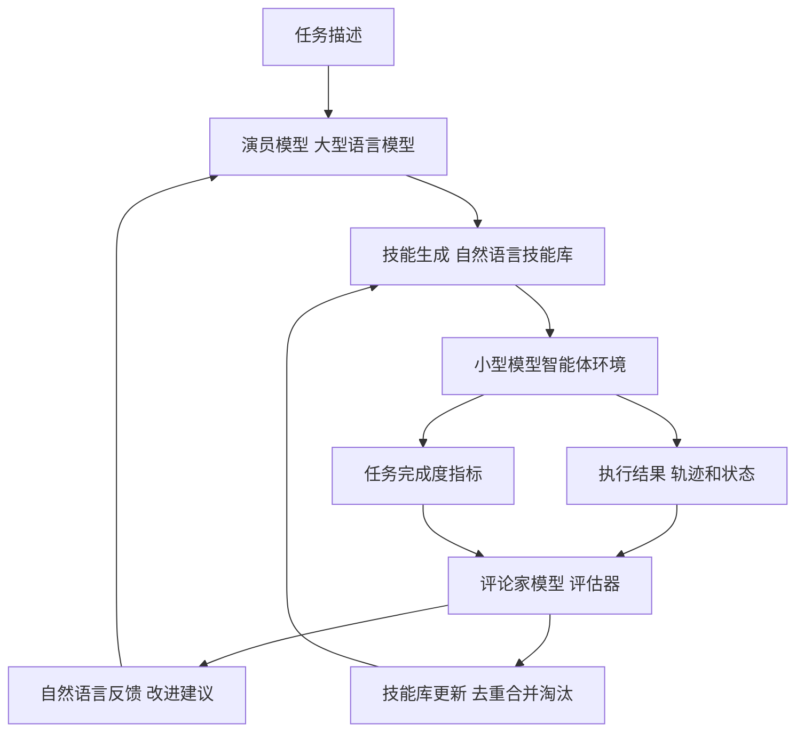
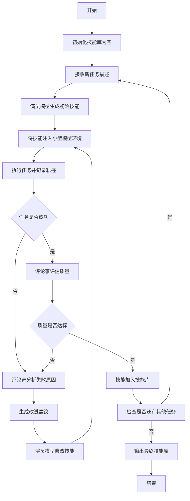
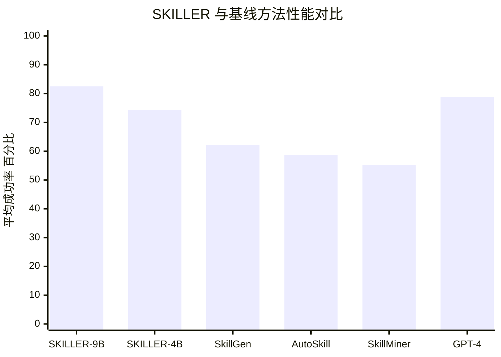

# SKILLER: Language-Level Reinforcement Learning for Reusable Skill Extraction in Small Language Models

> 本文由 paper-daily 使用 DeepSeek 自动生成，仅供快速了解论文；关键结论请以原文为准。

[论文原文](https://arxiv.org/abs/2608.10538) · [PDF](https://arxiv.org/pdf/2608.10538) · [源文件](https://github.com/vsvnakers/paper-daily/blob/master/essay_read/2026-08-12/2608.10538.md)

> SKILLER 通过自然语言强化学习为小型模型自动生成高效技能，显著降低智能体部署成本并提升性能。

## 基本信息

| 属性 | 内容 |
|------|------|
| **作者** | Chenhao Dang, Siyuan Xiong, Conghui He, Weijia Li |
| **来源** | [arXiv:2608.10538](https://arxiv.org/abs/2608.10538) |
| **发布日期** | 2026-08-11 |
| **抓取领域** | 自然语言处理 |
| **学科方向** | 人工智能 |
| **arXiv 分类** | cs.AI |
| **适用层次** | 进阶 |
| **标签** | 强化学习, 技能生成, 小型语言模型, 自然语言反馈, 智能体 |
| **PDF** | [在线阅读](https://arxiv.org/pdf/2608.10538) |
| **代码仓库** | 暂无

---

## 问题的初衷（Why - 为什么要做这个研究）

【问题的初衷】随着大语言模型（Large Language Models, LLMs）在智能体（Agent）系统中的广泛应用，技能（Skill）作为一种标准化的知识封装格式，能够有效约束模型的行为空间，确保任务执行的高质量和可重复性。然而，当前主流的智能体框架（如 Codex、OpenClaw）依赖强大的闭源模型，其推理成本高昂，难以在真实世界任务中大规模部署。开源模型在消费级 GPU 上的能力快速提升，为降低成本提供了可能，但针对这些小型模型自动生成高效技能仍面临巨大挑战。现有技能生成方法多针对大型模型设计，直接迁移到小型模型时效果不佳，因为小型模型的容量有限，难以从复杂指令中提取有效行为模式。因此，如何为小型模型自动生成定制化、可复用的技能，成为降低部署成本、提升智能体实用性的关键问题。

---

## 问题的解决（What - 提出了什么方案）

【问题的解决】SKILLER 提出了一种基于自然语言驱动的强化学习（Reinforcement Learning, RL）框架，用于为小型模型自动生成执行器专属技能。其核心思路是：将强模型（如大型闭源模型）作为演员（Actor）和评论家（Critic），将小型模型智能体系统视为环境（Environment），所有强化学习信号完全通过自然语言传递。具体而言，SKILLER 通过迭代生成技能、执行任务、评估结果并反馈改进建议，从而优化技能库。与现有方法相比，SKILLER 的关键创新在于：1）利用自然语言作为 RL 的奖励信号，避免了传统 RL 中复杂的奖励工程；2）将技能生成与模型执行能力紧密结合，确保生成的技能适配小型模型的实际行为；3）通过评论家模型提供细粒度的改进建议，实现技能的持续进化。

---

## 技术方法详解（How - 怎么实现的）

【技术方法详解】
- **框架组成**：SKILLER 包含三个核心模块：演员模型（Actor）、评论家模型（Critic）和技能执行环境（Environment）。演员模型负责生成和修改技能，评论家模型评估执行结果并提供反馈，环境是小型模型智能体系统，执行技能并产生可观测结果。
- **自然语言强化学习循环**：整个训练过程是一个迭代循环：演员生成技能 → 环境执行技能 → 评论家评估结果并生成自然语言反馈 → 演员根据反馈改进技能。所有信号均为文本形式，无需数值奖励。
- **技能表示**：技能以自然语言指令集（如 JSON 格式）表示，包含任务描述、步骤序列、约束条件和示例，便于小型模型理解和执行。
- **演员模型策略**：演员模型使用大型语言模型（如 GPT-4）作为策略网络，通过上下文学习（In-Context Learning）生成新技能或修改现有技能，其输入包括当前技能库、任务描述和评论家反馈。
- **评论家模型评估**：评论家模型根据任务完成度、执行效率和错误类型生成结构化反馈，如“步骤 3 失败，因为参数类型错误，建议增加类型检查”。
- **技能库管理**：SKILLER 维护一个技能库，通过去重、合并和淘汰机制保持技能的精简和高效，避免冗余技能影响模型性能。
- **训练目标**：优化目标是最大化任务成功率，通过自然语言反馈间接优化技能质量，无需可微的奖励函数。

## 系统架构图

## 方法流程图

## 核心公式与算法

【核心公式】
- 技能生成概率：$P(s_k | T, S_{k-1}, F_{k-1})$，其中 $s_k$ 是第 $k$ 次迭代生成的技能，$T$ 是任务描述，$S_{k-1}$ 是已有技能库，$F_{k-1}$ 是评论家反馈。
- 任务成功率优化目标：$\max_{S} \sum_{t=1}^{N} \mathbb{1}[\text{success}(s_t)]$，其中 $S$ 是技能库，$N$ 是任务数量。
- 反馈生成：$F = \text{Critic}(T, s, \tau)$，其中 $\tau$ 是执行轨迹，$F$ 是自然语言反馈。

---

## 应用场景（Where - 在哪落地）

【应用场景】
- 场景1：智能客服系统。在电商或金融领域，小型模型部署在本地服务器上，通过 SKILLER 生成技能库，使模型能够自动处理常见客户咨询，如退款流程、订单查询等。技能库可随业务变化迭代更新，降低对大型闭源模型的依赖，节省 API 成本，同时保证响应速度。
- 场景2：机器人任务规划。在家庭或工业机器人中，小型模型控制机器人执行复杂任务，如“整理桌面”或“装配零件”。SKILLER 生成的技能将任务分解为可执行的步骤，并适配机器人的传感器和执行器，提高任务成功率，且技能可跨机器人复用。
- 场景3：代码生成助手。在开发环境中，小型模型作为代码补全工具，SKILLER 生成特定框架（如 React 或 Django）的技能，使模型能更准确地生成符合项目规范的代码片段，减少人工审查时间，提升开发效率。

---

## 具体技术细节示例（How in Action - 算法如何执行）

【具体技术细节示例】假设任务为“在 ALFWorld 环境中完成‘加热牛奶’任务”。初始技能库为空。演员模型（GPT-4）生成初始技能：
1. 找到微波炉
2. 将牛奶放入微波炉
3. 设置加热时间 1 分钟
4. 启动微波炉

将技能注入 Qwen3.5-9B 智能体环境执行。执行轨迹显示：模型在步骤 1 中错误地走到了冰箱前，导致任务失败。评论家模型分析轨迹后生成反馈：“步骤 1 失败，模型未识别微波炉的位置，建议在技能中增加环境探索指令，如‘先扫描周围环境，找到微波炉’。”

演员模型根据反馈修改技能：
1. 扫描周围环境，定位微波炉
2. 移动到微波炉前
3. 打开微波炉门
4. 将牛奶放入
5. 关闭门并设置 1 分钟
6. 启动

再次执行，模型成功完成任务。评论家评估质量后，技能被加入技能库。此示例展示了自然语言反馈如何指导技能改进，以及迭代过程如何提升任务成功率。

---

## 实验结果（Results - 效果如何）

【实验结果】论文在五个基准数据集上进行了实验，包括 SkillsBench、ALFWorld、WebShop 等，使用 Qwen3.5-9B 和 Qwen3.5-4B 作为小型模型。对比方法包括三种开源技能生成方法（如 SkillGen、AutoSkill、SkillMiner）和一种闭源方法（如 GPT-4 生成技能）。结果表明，SKILLER 在 9B 模型上取得了 4.3 到 20.4 个百分点的绝对提升，在 4B 模型上取得了 1.8 到 13.3 个百分点的提升。在 SkillsBench 的单技能任务上，SKILLER 生成的技能使小型模型的表现与强闭源模型（如 GPT-4）相当，甚至在某些任务上超越。此外，消融实验验证了自然语言反馈和迭代改进机制的有效性。

## 实验结果可视化

---

## 优势与不足

【优势与不足】
- 优势1：创新性地将自然语言作为强化学习信号，避免了复杂的奖励工程设计，降低了训练难度。
- 优势2：针对小型模型定制技能，显著提升了开源模型在智能体任务上的性能，降低了部署成本。
- 优势3：框架通用性强，可适配不同的小型模型和任务类型，且技能库可迭代进化。
- 不足1：依赖强模型（如 GPT-4）作为演员和评论家，仍需要调用闭源 API，可能带来额外成本。
- 不足2：自然语言反馈的准确性受评论家模型能力限制，若评论家产生误导性反馈，可能导致技能质量下降。

---

## 相关工作

【相关工作】
- 技能生成（Skill Generation）：如 SkillGen 和 AutoSkill，它们为大型模型生成技能，但未考虑小型模型适配。
- 强化学习在 NLP 中的应用：如 RLHF（Reinforcement Learning from Human Feedback），使用人类反馈优化模型，但 SKILLER 使用模型反馈。
- 智能体框架：如 Codex 和 OpenClaw，它们依赖闭源模型，成本高，SKILLER 旨在降低此类框架的部署成本。
- 提示工程（Prompt Engineering）：与技能生成相关，但技能更结构化，SKILLER 强调可复用性。

---

## 未来研究方向

【未来方向】
- 方向1：多任务技能共享。研究如何让技能库中的技能在不同任务间迁移，减少重复生成，提高技能复用率。
- 方向2：评论家模型的自适应。探索使用小型模型自身作为评论家，减少对大型闭源模型的依赖，实现完全本地化的技能生成。
- 方向3：技能的可解释性。分析生成的技能内部逻辑，提供可视化解释，帮助用户理解模型行为，增强信任。

---

## 一句话总结

> SKILLER 通过自然语言强化学习为小型模型自动生成高效技能，显著降低智能体部署成本并提升性能。

---

*本解读由 DeepSeek AI 自动生成，仅供参考。*
