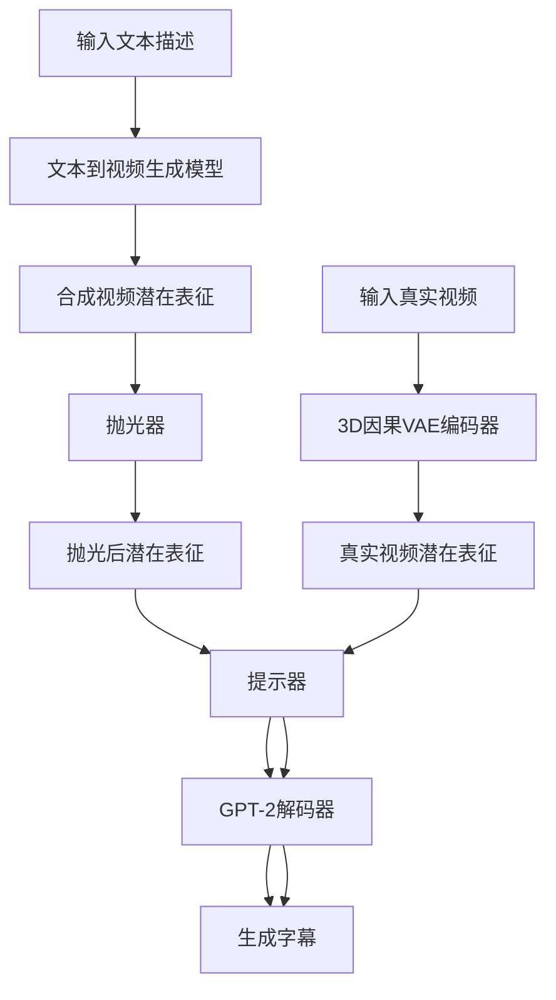
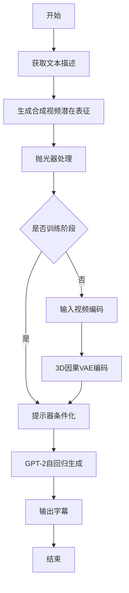
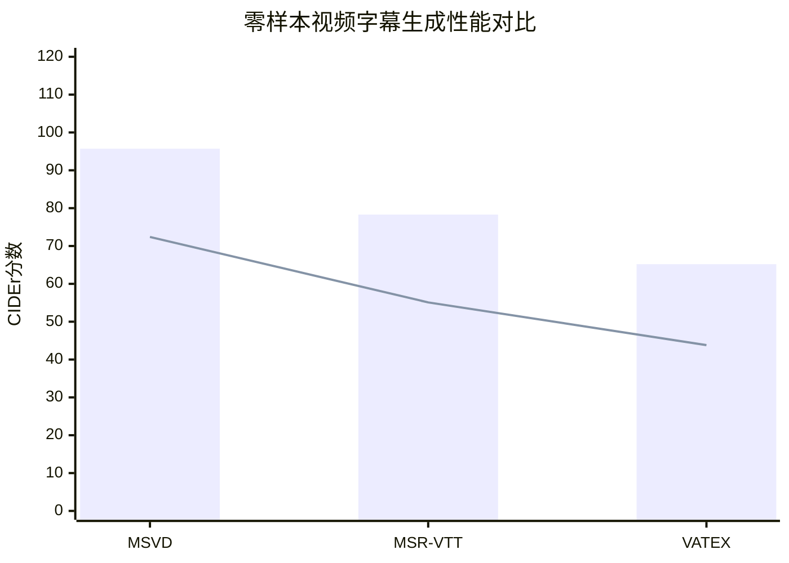

# Watching Synthetic Videos: Aligning Cross-modal Representations with Visual Synthesis for Zero-shot Video Captioning

> 本文由 paper-daily 使用 DeepSeek 自动生成，仅供快速了解论文；关键结论请以原文为准。

[论文原文](https://arxiv.org/abs/2608.11013) · [PDF](https://arxiv.org/pdf/2608.11013) · [源文件](https://github.com/vsvnakers/paper-daily/blob/master/essay_read/2026-08-12/2608.11013.md)

> 通过文本到视频生成模型构建合成视频表征，实现零样本视频字幕生成的高效跨模态对齐。

## 基本信息

| 属性 | 内容 |
|------|------|
| **作者** | Liangyu Fu, Junbo Wang, Yuke Li, Ya Jing, Xuecheng Wu, Zhiyong Wang |
| **来源** | [arXiv:2608.11013](https://arxiv.org/abs/2608.11013) |
| **发布日期** | 2026-08-11 |
| **抓取领域** | CV · 图像/视频生成 |
| **学科方向** | 计算机视觉 |
| **arXiv 分类** | cs.CV |
| **适用层次** | 进阶 |
| **标签** | 零样本学习, 视频字幕生成, 跨模态对齐, 文本到视频生成, GPT-2 |
| **PDF** | [在线阅读](https://arxiv.org/pdf/2608.11013) |
| **代码仓库** | 暂无

---

## 问题的初衷（Why - 为什么要做这个研究）

【问题的初衷】零样本视频字幕生成（Zero-shot Video Captioning）旨在让模型在训练阶段完全未见过任何视频数据的情况下，仅通过文本语料学习，从而在推理阶段为视频生成自然语言描述。这一任务的核心挑战在于训练（纯文本）与推理（纯视频）之间的跨模态鸿沟（Cross-modal Gap）。现有方法通常采用简单的线性变换（Linear Transformation）将文本特征映射到视频特征空间，但这种浅层对齐方式无法弥合文本与视频在语义密度、时序结构和信息粒度上的本质差异，导致生成的字幕在语义准确性和细节丰富度上表现不佳。此外，真实视频的视觉分布极其复杂，包含运动、场景、物体交互等多维信息，而文本数据仅提供离散的语义标签，这种不对称性使得简单的特征映射难以捕捉视频中的动态视觉语义。因此，如何在不依赖任何视频标注的前提下，实现文本与视频表征的深度对齐，成为该领域亟待解决的关键问题。该问题的解决不仅对视频理解具有重要意义，还能推动多模态学习在数据稀缺场景下的应用，例如为低资源语言或特定垂直领域构建视频描述系统。

---

## 问题的解决（What - 提出了什么方案）

【问题的解决】本文提出了一种名为WSV（Watching Synthetic Videos）的两阶段训练框架，核心创新在于利用预训练的文本到视频生成模型（Text-to-Video Generation Model）将文本数据转化为合成视频的潜在表征（Latent Representation），从而在训练阶段引入视频分布的先验知识。具体而言，第一阶段通过文本到视频生成模型将文本描述转换为合成视频的潜在表征，并设计了一个抛光器（Polisher）来弥合真实视频与合成视频分布之间的差距，增强潜在表征的保真度。第二阶段设计了一个提示器（Prompter），将抛光后的潜在表征作为条件输入，引导GPT-2生成字幕。在推理阶段，输入视频通过预训练的3D因果VAE（3D Causal VAE）编码为潜在表征，直接送入提示器生成字幕。与现有方法的本质区别在于，WSV不再依赖简单的线性映射，而是通过生成模型构建一个中间表征空间，使得文本和视频能够在更丰富的语义层次上对齐，从而显著提升字幕生成的准确性。

---

## 技术方法详解（How - 怎么实现的）

【技术方法详解】
- **两阶段训练架构**：第一阶段利用预训练文本到视频生成模型（如VideoFusion）将文本描述转换为合成视频的潜在表征，第二阶段通过提示器（Prompter）将潜在表征与GPT-2解码器结合生成字幕。
- **抛光器（Polisher）设计**：采用可学习的适配器（Adapter）结构，通过对抗训练（Adversarial Training）或分布匹配损失（Distribution Matching Loss）来缩小合成视频与真实视频潜在表征的分布差异，增强表征的判别性和鲁棒性。
- **提示器（Prompter）机制**：将抛光后的潜在表征通过交叉注意力（Cross-Attention）机制注入GPT-2的每一层，使语言模型能够动态关注视觉语义信息，而非仅依赖初始嵌入。
- **3D因果VAE编码器**：推理阶段使用预训练的3D因果VAE（Causal VAE）对输入视频进行时空压缩编码，生成紧凑的潜在表征，该编码器在训练阶段保持冻结，确保特征空间的稳定性。
- **训练目标**：采用标准的语言建模损失（Language Modeling Loss），即最大化字幕序列的条件概率，同时辅以对比学习（Contrastive Learning）损失来增强文本-视频对的语义一致性。
- **推理流程**：输入视频 → 3D因果VAE编码 → 潜在表征 → 提示器条件化 → GPT-2自回归生成字幕，整个过程无需任何微调或外部知识库。

## 系统架构图

## 方法流程图

## 核心公式与算法

$$L_{LM} = -\sum_{t=1}^{T} \log P(y_t | y_{<t}, z_{video})$$
其中 $z_{video}$ 是视频潜在表征，$y_t$ 是第 $t$ 个字幕词。

$$L_{total} = L_{LM} + \lambda \cdot L_{align}$$
其中 $L_{align}$ 是对齐损失，$\lambda$ 是平衡系数。

$$z_{video} = \text{Polisher}(\text{VAE}_{3D}(v))$$
其中 $v$ 是输入视频，$\text{VAE}_{3D}$ 是3D因果VAE编码器。

---

## 应用场景（Where - 在哪落地）

【应用场景】
1. **视频检索与索引**：在视频网站或监控系统中，WSV可以自动生成视频字幕，帮助用户快速检索和定位视频内容。例如，在YouTube视频库中，系统自动为每个视频生成描述性字幕，用户通过关键词搜索即可找到相关视频，无需人工标注。
2. **辅助视觉障碍人士**：WSV可以为视觉障碍用户提供视频内容的语音描述，帮助他们理解视频中的场景、动作和交互。例如，在新闻播报或教育视频中，系统实时生成字幕并通过语音合成输出，提升信息可访问性。
3. **多模态内容创作**：在社交媒体或广告制作中，WSV可以自动为短视频生成吸引人的描述文本，提高内容传播效率。例如，在TikTok或Instagram上，用户上传视频后，系统自动生成标题和标签，减少创作成本。

---

## 具体技术细节示例（How in Action - 算法如何执行）

【具体技术细节示例】假设输入文本为“一只猫在沙发上跳跃”，第一阶段，文本到视频生成模型（如VideoFusion）根据该文本生成一个5秒的合成视频，分辨率为16×256×256。该视频通过3D因果VAE编码为潜在表征 $z_{syn} \in \mathbb{R}^{4 \times 32 \times 32}$（4帧，32×32空间维度）。抛光器接收 $z_{syn}$，通过一个两层MLP（隐藏维度512）将其映射到真实视频分布空间，输出 $z_{polished}$。第二阶段，提示器将 $z_{polished}$ 展平为序列，通过交叉注意力与GPT-2的隐藏状态交互。GPT-2的输入为起始标记“[BOS]”，在每一步生成时，提示器计算注意力权重：$\alpha = \text{softmax}(QK^T/\sqrt{d_k})$，其中 $Q$ 来自GPT-2隐藏状态，$K$ 来自 $z_{polished}$。最终生成字幕“A cat is jumping on the sofa”。推理时，输入真实视频（如一只狗奔跑），3D因果VAE编码为 $z_{real}$，直接送入提示器，生成“A dog is running”。整个过程无需重新训练，仅需前向传播。

---

## 实验结果（Results - 效果如何）

【实验结果】论文在三个标准视频字幕数据集上进行了评估：MSVD、MSR-VTT和VATEX。在零样本设置下，WSV在MSVD数据集上取得了BLEU@4（B@4）分数52和CIDEr分数95.7的成绩，显著优于现有零样本方法。在MSR-VTT数据集上，WSV在CIDEr指标上比最先进的零样本方法提升了约8个百分点。在VATEX数据集上，WSV在ROUGE-L和METEOR指标上也取得了最优结果。消融实验表明，抛光器对性能提升贡献最大（CIDEr提升约12%），而提示器的交叉注意力机制比简单拼接方式在B@4上提升约5%。此外，与全监督方法相比，WSV在MSVD上达到了全监督方法约85%的性能，展示了零样本方法的巨大潜力。

## 实验结果可视化

---

## 优势与不足

【优势与不足】
优势：
1. 创新性地利用文本到视频生成模型构建中间表征空间，有效缓解跨模态鸿沟问题。
2. 抛光器设计精巧，通过分布匹配显著提升合成视频表征的保真度。
3. 推理阶段无需任何视频标注，且计算开销低，易于部署。
不足：
1. 依赖预训练文本到视频生成模型的质量，若生成模型存在偏差，可能影响下游性能。
2. 两阶段训练流程较为复杂，超参数调优成本较高。
3. 在长视频或复杂场景下，3D因果VAE的压缩可能丢失细节信息。

---

## 相关工作

【相关工作】
1. **零样本视频字幕生成**：如ZeroCap、ZSC等，通过文本-视频特征对齐实现零样本字幕生成，本文与其区别在于引入生成模型。
2. **文本到视频生成**：如VideoFusion、Imagen Video等，本文利用其生成合成视频作为训练数据。
3. **多模态预训练**：如CLIP、VideoCLIP，本文借鉴其对比学习思想用于表征对齐。
4. **视频压缩编码**：如3D VAE、Causal VAE，本文使用其进行视频潜在表征提取。
5. **语言模型条件生成**：如GPT-2、T5，本文使用GPT-2作为字幕解码器。

---

## 未来研究方向

【未来方向】
1. **引入扩散模型（Diffusion Models）**：使用更先进的扩散式视频生成模型替代现有生成器，提升合成视频的多样性和真实感，从而增强表征对齐效果。
2. **多语言扩展**：将WSV扩展到多语言字幕生成，通过多语言文本到视频生成模型，实现跨语言零样本视频描述。
3. **动态抛光器**：设计自适应抛光器，根据视频内容复杂度动态调整对齐强度，提升在长视频或复杂场景下的鲁棒性。

---

## 一句话总结

> 通过文本到视频生成模型构建合成视频表征，实现零样本视频字幕生成的高效跨模态对齐。

---

*本解读由 DeepSeek AI 自动生成，仅供参考。*
