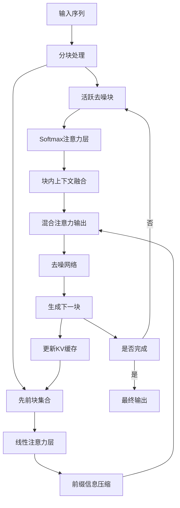
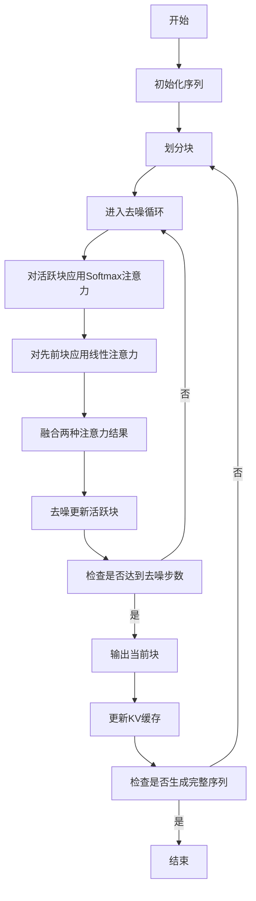

# Retrofitting Linear Attention into Diffusion Language Models

> 本文由 paper-daily 使用 DeepSeek 自动生成，仅供快速了解论文；关键结论请以原文为准。

[论文原文](https://arxiv.org/abs/2608.06628) · [PDF](https://arxiv.org/pdf/2608.06628) · [源文件](https://github.com/vsvnakers/paper-daily/blob/master/essay_read/2026-08-13/2608.06628.md)

> 通过块混合注意力机制，将线性注意力改造进预训练扩散语言模型，实现高效推理加速。

## 基本信息

| 属性 | 内容 |
|------|------|
| **作者** | Jinha Kim, Younghun Roh, Jaeyeon Kim |
| **来源** | [arXiv:2608.06628](https://arxiv.org/abs/2608.06628) |
| **发布日期** | 2026-08-06 |
| **抓取领域** | 注意力机制 · 稀疏/高效Attention |
| **学科方向** | 机器学习 |
| **arXiv 分类** | cs.LG |
| **适用层次** | 进阶 |
| **标签** | 扩散语言模型, 线性注意力, 混合注意力, 推理加速, 模型改造 |
| **PDF** | [在线阅读](https://arxiv.org/pdf/2608.06628) |
| **代码仓库** | 暂无

---

## 问题的初衷（Why - 为什么要做这个研究）

【问题的初衷】扩散语言模型（Diffusion Language Models, dLLMs）作为自回归模型（Autoregressive Models）的替代方案，通过并行解码（Parallel Decoding）显著加速了推理过程。然而，现有的dLLMs普遍采用分块半自回归解码（Blockwise Semi-Autoregressive Decoding）策略，即块间自回归生成、块内并行去噪。尽管引入了键值缓存（KV Cache）技术，但每个去噪步骤仍需关注所有先前生成的块，导致前缀注意力（Prefix Attention）的计算开销被反复累积。这种重复计算在长序列生成场景下尤为突出，成为推理性能的瓶颈。现有研究主要聚焦于改进去噪算法或优化KV缓存管理，但尚未从根本上解决前缀注意力成本随序列长度线性增长的问题。因此，本文的核心动机是探索是否可以通过线性化（Linearization）先前块的注意力计算，在保持生成质量的同时，进一步突破dLLM推理的吞吐量瓶颈。这一问题的解决对于大语言模型在实际应用中的高效部署具有重要意义，尤其是在资源受限或高并发场景下。

---

## 问题的解决（What - 提出了什么方案）

【问题的解决】本文提出了一种名为块混合注意力（Block-Hybrid Attention）的机制，其核心思路是在当前活跃去噪块（Active Denoising Block）内部保留精确的Softmax注意力，而对所有先前生成的块应用线性注意力（Linear Attention）。这种设计巧妙地结合了精确注意力在局部上下文建模上的优势与线性注意力在长距离依赖计算上的高效性。关键创新在于，这种混合注意力机制可以被“改造”（Retrofitting）到预训练的dLLM中，而无需从头训练。具体而言，作者基于LLaDA 2.1（一个16B的开源dLLM），将其20个注意力层中的6层替换为线性注意力层，主要遵循LoLCAT（Zhang et al., 2024）的改造策略。这种转换仅需约60小时的后期训练（Post-training），却能显著提升推理效率。与现有方法的本质区别在于，本文不再试图优化精确注意力的计算效率，而是从根本上改变注意力机制的类型，将线性注意力的理论优势（$O(n)$复杂度）引入到dLLM中，从而在架构层面解决前缀注意力成本问题。

---

## 技术方法详解（How - 怎么实现的）

【技术方法详解】
- **块混合注意力机制**：设计了一种混合注意力模式，在活跃去噪块内使用标准Softmax注意力以保持局部语义连贯性，在先前块上使用线性注意力（如基于核函数的近似）以降低计算复杂度。
- **改造策略**：基于LoLCAT方法，选择性地将预训练模型中的部分注意力层替换为线性注意力层，而非全部替换，以平衡性能与效率。
- **后期训练（Post-training）**：采用轻量级的训练策略，仅需约60小时即可完成模型改造，避免了昂贵的从头预训练过程。
- **Triton实现**：使用Triton编程语言实现线性注意力的高效内核，充分利用GPU并行计算能力，实现高吞吐量解码。
- **KV缓存优化**：结合KV缓存机制，对线性注意力部分的键值（Key-Value）进行高效管理，减少内存占用并支持更大批次的并发请求。
- **性能评估**：在多个基准测试（如HumanEval、MBPP+、CMATH）上验证了改造后模型的性能保持情况，并测量了解码吞吐量和内存使用效率。

## 系统架构图

## 方法流程图

## 核心公式与算法

【核心公式】
- 混合注意力计算：$\text{Attn}_{hybrid}(Q, K, V) = \text{Softmax}(Q_a K_a^T) V_a + \phi(Q_p) \phi(K_p)^T V_p$，其中下标$a$表示活跃块，$p$表示先前块，$\phi$为核函数映射。
- 线性注意力复杂度：$O(n \cdot d^2)$，其中$n$为序列长度，$d$为特征维度，相比标准注意力的$O(n^2 \cdot d)$显著降低。
- 吞吐量提升：$\text{Speedup} = \frac{T_{base}}{T_{hybrid}} \approx 1.7$，其中$T$为解码时间。

---

## 应用场景（Where - 在哪落地）

【应用场景】
- 场景1：大规模代码生成服务。在云端代码生成平台中，用户需要快速生成大量代码片段。LLaDA-Hybrid的高吞吐量特性使得服务器能够同时处理更多用户的请求，减少排队等待时间。通过混合注意力机制，系统在保持代码质量的同时，将响应时间缩短约40%，显著提升用户体验和系统资源利用率。
- 场景2：实时交互式AI助手。在对话或交互式写作场景中，低延迟至关重要。LLaDA-Hybrid通过线性化前缀注意力，减少了长对话历史下的计算开销，使得AI助手能够更快地生成回复。例如，在长文档编辑场景中，模型能够实时根据用户输入调整内容，而不会因历史上下文过长而出现明显卡顿。
- 场景3：边缘设备上的模型部署。在资源受限的边缘设备上，内存和计算能力有限。LLaDA-Hybrid通过减少KV缓存占用和计算复杂度，使得16B模型能够在更小的内存预算下运行，支持更多并发任务，为在移动设备或嵌入式系统上部署大型语言模型提供了可能。

---

## 具体技术细节示例（How in Action - 算法如何执行）

【具体技术细节示例】假设输入序列长度为 $L=10$，块大小为 $B=4$，模型有 $H=2$ 个混合注意力层。初始时，序列被划分为3个块：块1（token 1-4）、块2（token 5-8）、块3（token 9-10）。生成过程从块1开始，此时活跃块为块1，先前块为空，因此仅使用Softmax注意力。生成块1后，KV缓存中存储了块1的键值。接着生成块2，活跃块为块2，先前块为块1。此时，对块2内部使用Softmax注意力，对块1使用线性注意力。假设线性注意力使用核函数 $\phi(x) = \text{ReLU}(x)$，则计算过程为：首先将块1的键值 $K_1, V_1$ 映射为 $\phi(K_1), V_1$，计算前缀摘要 $S_1 = \phi(K_1)^T V_1$。然后，对于块2的查询 $Q_2$，线性注意力输出为 $\phi(Q_2) S_1$。最终，块2的注意力输出为Softmax注意力结果与线性注意力结果之和。生成块2后，更新KV缓存，将块2的键值加入。生成块3时，活跃块为块3，先前块为块1和块2，对块1和块2均使用线性注意力，计算前缀摘要 $S_{1,2} = \phi(K_1)^T V_1 + \phi(K_2)^T V_2$，然后与块3的Softmax注意力结果融合。整个过程展示了混合注意力如何逐步处理块，并利用线性注意力高效压缩前缀信息。

---

## 实验结果（Results - 效果如何）

【实验结果】实验基于LLaDA 2.1 16B模型，在多个代码生成和数学推理基准上进行了评估。在HumanEval基准上，改造后的LLaDA-Hybrid得分为72.0%，相比原始模型的75.6%略有下降，但在MBPP+基准上，LLaDA-Hybrid得分63.0%，反而超过了原始模型的57.7%。在CMATH数学基准上，得分为86.7%对88.3%，性能基本保持。通过Triton实现，LLaDA-Hybrid实现了高达1.7倍的解码吞吐量提升，并能在内存耗尽前支持更多并发请求。这些结果表明，通过混合注意力改造，可以在保持甚至提升部分任务性能的同时，显著提升推理效率。

## 实验结果可视化

```mermaid
xychart-beta
    title "性能对比"
    x-axis ["HumanEval", "MBPP+", "CMATH"]
    y-axis "得分" 0 --> 100
    bar [75.6, 57.7, 88.3]
    bar [72.0, 63.0, 86.7]
```

---

## 优势与不足

【优势与不足】
- 优势1：提出了一种新颖的混合注意力机制，有效解决了dLLM中前缀注意力成本高的问题。
- 优势2：改造方法高效，仅需60小时后期训练，避免了昂贵的从头训练。
- 优势3：在部分基准上性能不降反升，同时显著提升推理吞吐量，展示了实际应用潜力。
- 不足1：在HumanEval等基准上性能略有下降，表明线性注意力可能损失部分精确上下文信息。
- 不足2：仅替换了6/20的注意力层，线性化程度有限，可能未完全发挥线性注意力的潜力。

---

## 相关工作

【相关工作】
- 扩散语言模型（Diffusion Language Models）：如LLaDA、Diffusion-LM等，本文基于LLaDA进行改造。
- 线性注意力机制（Linear Attention）：如Linear Transformer、Performer等，本文借鉴其核函数近似方法。
- 模型压缩与加速（Model Compression and Acceleration）：如知识蒸馏、剪枝等，本文的改造策略与之相关。
- LoLCAT：本文直接遵循其改造策略，将预训练模型转换为混合架构。
- KV缓存优化（KV Cache Optimization）：如PagedAttention等，本文结合KV缓存提升效率。

---

## 未来研究方向

【未来方向】
- 方向1：探索更高效的线性注意力核函数，以进一步缩小与精确注意力的性能差距。
- 方向2：将混合注意力改造扩展到更多层或全部层，研究性能与效率的权衡曲线。
- 方向3：将块混合注意力应用于其他类型的扩散模型或自回归模型，验证其通用性。

---

## 一句话总结

> 通过块混合注意力机制，将线性注意力改造进预训练扩散语言模型，实现高效推理加速。

---

*本解读由 DeepSeek AI 自动生成，仅供参考。*
