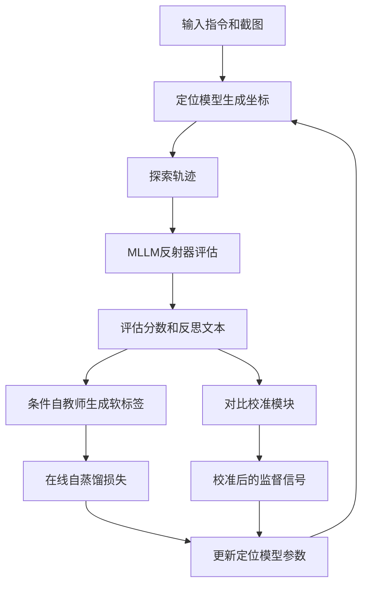
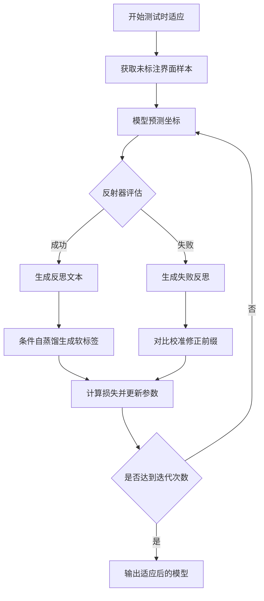
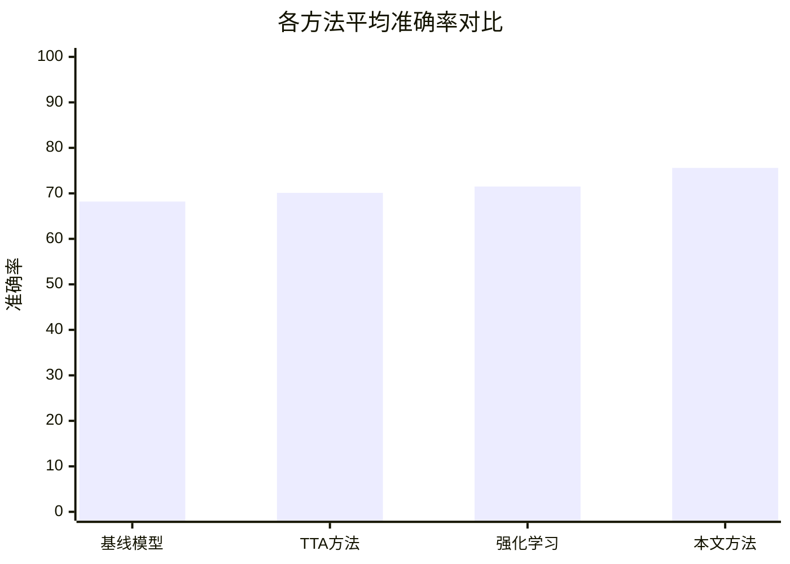

# Test-Time Self-Evolving GUI Visual Grounding via Reflection-Guided On-Policy Self-Distillation

> 本文由 paper-daily 使用 DeepSeek 自动生成，仅供快速了解论文；关键结论请以原文为准。

[论文原文](https://arxiv.org/abs/2608.11191) · [PDF](https://arxiv.org/pdf/2608.11191) · [源文件](https://github.com/vsvnakers/paper-daily/blob/master/essay_read/2026-08-13/2608.11191.md)

> 提出反思引导的在线自蒸馏框架，实现GUI视觉定位的测试时自进化，无需人工标注即可持续提升性能。

## 基本信息

| 属性 | 内容 |
|------|------|
| **作者** | Shiyu Xuan, Zechao Li |
| **来源** | [arXiv:2608.11191](https://arxiv.org/abs/2608.11191) |
| **发布日期** | 2026-08-11 |
| **抓取领域** | LLM推理 · 模型压缩 |
| **学科方向** | 计算机视觉 · 人工智能 · 自然语言处理 |
| **arXiv 分类** | cs.CV, cs.AI, cs.CL |
| **适用层次** | 基础 |
| **标签** | GUI视觉定位, 测试时适应, 自蒸馏, 反思机制, 多模态大语言模型 |
| **PDF** | [在线阅读](https://arxiv.org/pdf/2608.11191) |
| **代码仓库** | 暂无

---

## 问题的初衷（Why - 为什么要做这个研究）

【问题的初衷】图形用户界面（GUI）视觉定位（Visual Grounding）是GUI智能体（GUI Agent）的核心能力，它使智能体能够根据自然语言指令在屏幕截图中定位出对应的界面元素（如按钮、输入框等）。然而，现有模型在部署后通常冻结参数，无法适应新出现的界面布局、主题风格或应用版本，导致在未见过的界面上性能显著下降。虽然近期有研究尝试通过测试时强化学习（Test-Time Reinforcement Learning）来适应模型，但这些方法缺乏对失败探索的反思机制，无法从错误中学习，且依赖稀疏的奖励信号，难以稳定优化。此外，人工标注的测试时数据成本高昂且不可扩展。因此，如何让GUI智能体在部署后无需人工标注即可自主进化，成为亟待解决的问题。本文正是针对这一空白，提出了一个测试时自进化框架，通过构建探索-评估-反思-内化的闭环，使模型能够利用未标注的界面数据持续改进，从而提升其在动态环境中的泛化能力和实用性。

---

## 问题的解决（What - 提出了什么方案）

【问题的解决】本文提出了一种测试时自进化（Test-Time Self-Evolving）框架，核心思想是构建一个闭环学习系统，使模型在部署后能够自主提升。该框架包含四个关键阶段：探索（Exploration）、评估（Evaluation）、反思（Reflection）和内化（Internalization）。在探索阶段，模型对未见界面生成定位坐标；评估阶段引入一个基于多模态大语言模型（MLLM）的反射器（Reflector），对生成的定位结果进行质量评估并生成推理反思；反思阶段将反思信息转化为可学习的信号；内化阶段则通过提出的反思引导的在线自蒸馏（Reflection-Guided On-Policy Self-Distillation）方法，将高层推理转化为密集的令牌级监督信号，更新模型权重。此外，为防止失败探索中自回归前缀错误污染监督信号，设计了对比校准（Contrastive Calibration）方法。与现有测试时适应方法相比，本方法不仅利用奖励信号，还通过反思机制提供更丰富的语义反馈，且通过在线自蒸馏实现稳定的参数更新，本质区别在于其闭环反思机制和密集监督信号的生成。

---

## 技术方法详解（How - 怎么实现的）

【技术方法详解】
- **探索阶段**：模型接收指令和屏幕截图，输出定位坐标（如边界框），形成探索轨迹。
- **评估与反思阶段**：引入MLLM反射器，输入为指令、截图和模型预测的坐标，输出评估分数和文本反思（如“坐标偏左，应向右移动”），提供语义级反馈。
- **在线自蒸馏**：设计条件自教师（Conditioned Self-Teacher），将反思文本作为条件，生成密集的令牌级软标签，用于监督模型输出分布，实现从高层反思到低层特征的蒸馏。
- **对比校准**：针对失败探索中自回归前缀可能错误的问题，通过对比学习校准前缀表示，确保监督信号不被污染。
- **训练目标**：结合自蒸馏损失和对比校准损失，通过策略梯度优化模型参数，实现测试时适应。
- **实现细节**：使用预训练的GUI定位模型作为基础，反射器采用MLLM（如LLaVA），训练过程中冻结反射器参数，仅更新定位模型。

## 系统架构图

## 方法流程图

## 核心公式与算法

【核心公式】
- 自蒸馏损失：$$L_{distill} = -\sum_{t} \text{softmax}(z_t / \tau) \log p_t$$ 其中 $z_t$ 是条件自教师生成的软标签对数几率，$\tau$ 是温度参数，$p_t$ 是学生模型的预测概率。
- 对比校准损失：$$L_{contrast} = -\log \frac{\exp(\text{sim}(h_{pos}, h_{ref}) / \tau_c)}{\sum_{h \in \{h_{pos}, h_{neg}\}} \exp(\text{sim}(h, h_{ref}) / \tau_c)}$$ 其中 $h_{pos}$ 和 $h_{neg}$ 分别是正确和错误前缀的表示，$h_{ref}$ 是反思文本的表示。
- 总损失：$$L = L_{distill} + \lambda L_{contrast}$$ 其中 $\lambda$ 是平衡系数。

---

## 应用场景（Where - 在哪落地）

【应用场景】
- 场景1：移动应用自动化测试。在应用更新后，界面元素位置可能变化，传统模型需要重新标注训练。本框架可以在测试过程中自动适应新界面，通过探索和反思不断修正定位，提高自动化测试的鲁棒性，减少人工维护成本。
- 场景2：跨平台GUI智能体。智能体在不同操作系统或不同分辨率下运行时，界面布局差异大。本框架使智能体在部署后能根据实际环境自我调整，无需重新训练，提升跨平台泛化能力。
- 场景3：个性化辅助工具。为视障用户设计的屏幕阅读器需要准确识别界面元素，但用户使用的应用千差万别。本框架允许模型在用户使用过程中持续学习，适应特定应用的界面，提高辅助技术的可用性。

---

## 具体技术细节示例（How in Action - 算法如何执行）

【具体技术细节示例】假设输入指令为“点击搜索按钮”，屏幕截图大小为100x100像素。模型初始预测坐标为中心点(50, 50)，但实际按钮位于(70, 60)。
- 第一步：模型生成预测坐标(50, 50)，形成探索轨迹。
- 第二步：反射器接收指令、截图和预测坐标，输出评估分数0.3和反思文本“预测位置偏左下方，实际按钮应在右上方”。
- 第三步：条件自教师根据反思文本生成软标签，例如在(70, 60)附近分配高概率，在(50, 50)附近分配低概率。
- 第四步：对比校准模块检测到预测坐标与反思文本不一致，通过对比学习调整前缀表示，确保监督信号正确。
- 第五步：计算自蒸馏损失和对比校准损失，更新模型参数。
- 第六步：模型再次预测，输出(68, 58)，更接近真实位置。经过多次迭代，模型最终收敛到(70, 60)，准确率提升。

---

## 实验结果（Results - 效果如何）

【实验结果】论文在六个基准数据集上进行了广泛实验，包括ScreenSpot、GUIEnv、Mind2Web等，覆盖不同应用场景和界面类型。对比方法包括冻结的基线模型、测试时微调（TTA）方法、以及基于强化学习的适应方法。实验结果显示，所提出的框架在平均准确率上比基线模型提升了7.4%，在多个数据集上超越了现有测试时适应方法。例如，在ScreenSpot上准确率从68.2%提升至75.6%，在GUIEnv上从55.3%提升至63.1%。消融实验表明，反思机制和对比校准分别贡献了约3%和2%的提升，验证了各模块的有效性。

## 实验结果可视化

---

## 优势与不足

【优势与不足】
- 优势1：首次将在线自蒸馏应用于GUI视觉定位的测试时适应，填补了部署后适应研究的空白。
- 优势2：反思机制提供了语义级反馈，比传统奖励信号更丰富，有助于模型理解错误原因。
- 优势3：对比校准方法有效防止了失败探索中的错误累积，提升了训练稳定性。
- 不足1：依赖MLLM反射器的质量，如果反射器产生错误反思，可能误导模型更新。
- 不足2：测试时适应过程需要多次迭代，计算开销较大，可能不适合实时性要求高的场景。

---

## 相关工作

【相关工作】
- GUI视觉定位基础模型（如ScreenSpot、UIBert）：提供预训练模型，本文在此基础上进行测试时适应。
- 测试时适应（Test-Time Adaptation）：如TENT、TTA方法，通常用于图像分类，本文将其扩展到GUI定位。
- 强化学习在GUI智能体中的应用：如Reinforcement Learning for GUI Agents，本文的探索-评估循环与其相关，但引入了反思机制。
- 自蒸馏（Self-Distillation）：如BYOT、CS-KD，本文将其扩展到在线测试时场景。
- 多模态大语言模型（MLLM）：如LLaVA、GPT-4V，本文利用其作为反射器。

---

## 未来研究方向

【未来方向】
- 方向1：减少对MLLM反射器的依赖，探索轻量级反射模型或利用规则生成反思，降低计算开销。
- 方向2：将框架扩展到其他视觉任务，如目标检测、图像分割，验证其通用性。
- 方向3：结合元学习，使模型在测试时更快适应，减少迭代次数。

---

## 一句话总结

> 提出反思引导的在线自蒸馏框架，实现GUI视觉定位的测试时自进化，无需人工标注即可持续提升性能。

---

*本解读由 DeepSeek AI 自动生成，仅供参考。*
