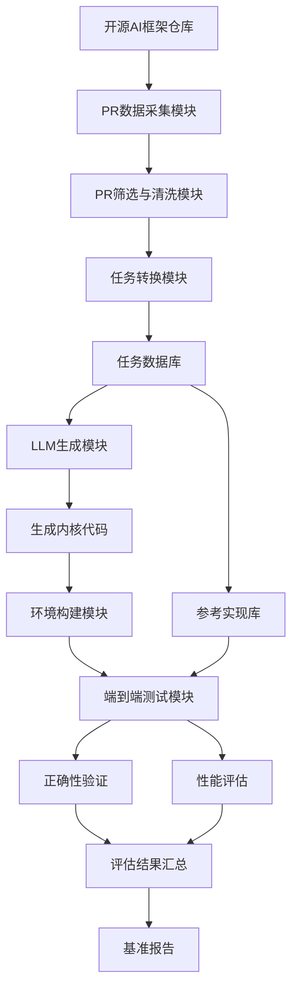
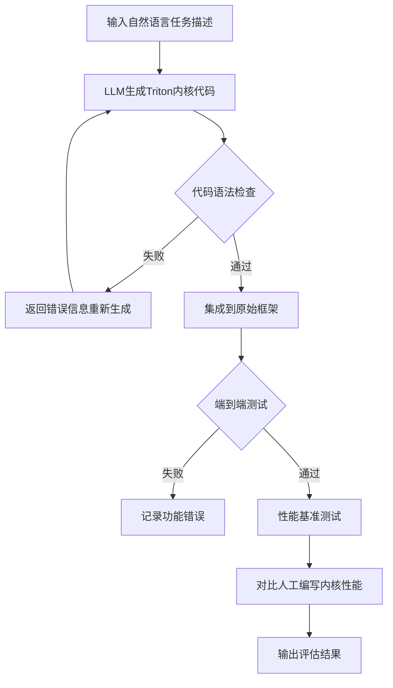
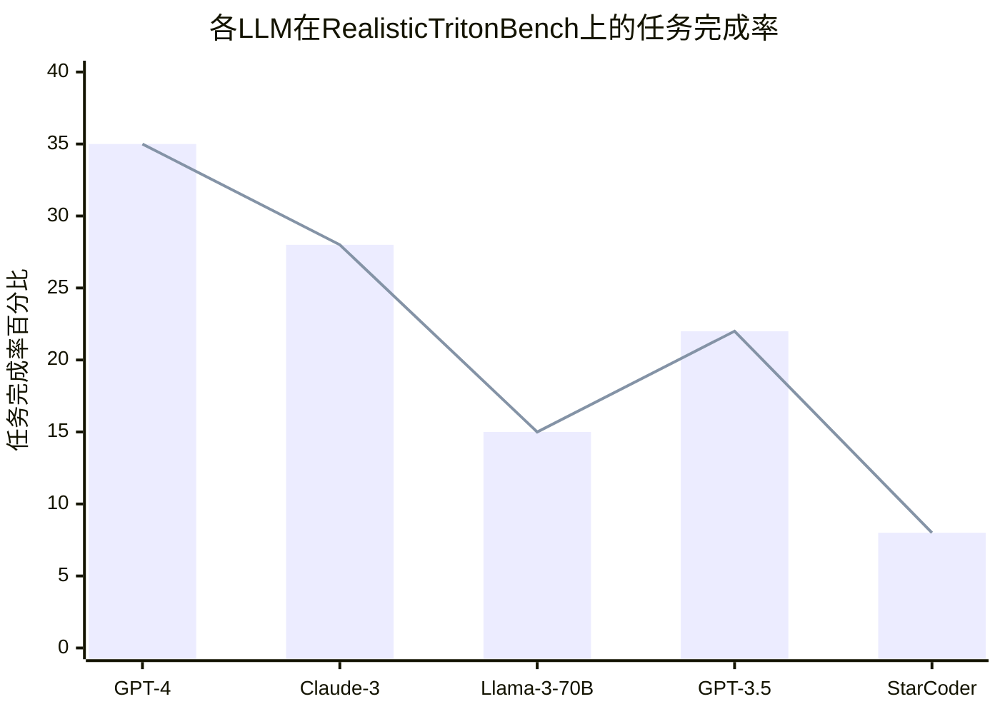

# RealisticTritonBench: A Benchmark for Triton-Kernel Generation in Real-World AI Frameworks

> 本文由 paper-daily 使用 DeepSeek 自动生成，仅供快速了解论文；关键结论请以原文为准。

[论文原文](https://arxiv.org/abs/2608.12004) · [PDF](https://arxiv.org/pdf/2608.12004) · [源文件](https://github.com/vsvnakers/paper-daily/blob/master/essay_read/2026-08-13/2608.12004.md)

> 首个基于真实AI框架PR的Triton内核生成基准，通过端到端评估揭示LLM在实际工程任务中的不足。

## 基本信息

| 属性 | 内容 |
|------|------|
| **作者** | Jinjun Huang, Zhongzhen Wen, Tongtong Xu, Meng Yan, Xin Xia, Zhongxin Liu |
| **来源** | [arXiv:2608.12004](https://arxiv.org/abs/2608.12004) |
| **发布日期** | 2026-08-12 |
| **抓取领域** | 自然语言处理 |
| **学科方向** | 软件工程 · 人工智能 |
| **arXiv 分类** | cs.SE, cs.AI |
| **适用层次** | 进阶 |
| **标签** | Triton内核生成, 大语言模型, 端到端评估, GPU优化, 基准测试 |
| **PDF** | [在线阅读](https://arxiv.org/pdf/2608.12004) |
| **代码仓库** | 暂无

---

## 问题的初衷（Why - 为什么要做这个研究）

【问题的初衷】在现代人工智能框架中，GPU内核（GPU Kernel）的性能直接决定了整个系统的运行效率。Triton作为一种兼顾易用性、可移植性和接近手写CUDA性能的编程语言，已被广泛应用于GPU内核的开发。近年来，大语言模型（Large Language Model, LLM）在代码生成方面展现出巨大潜力，研究者开始探索利用LLM自动生成Triton内核，以减轻专家内核开发者的手工负担。然而，现有的评估基准存在三大关键缺陷：第一，它们将任务局限于PyTorch到Triton的翻译，无法反映真实世界中Triton任务的多样性和复杂性，例如涉及自定义内存布局、多核协同、算子融合等工程细节；第二，它们仅评估单个内核的独立性能，而非端到端（End-to-End）性能，而端到端性能才是AI框架实际部署中的核心评判标准；第三，它们依赖手工编写的评估脚本，这些脚本可能存在漏洞，模型可以利用这些漏洞绕过正确性检查，从而获得虚高的分数。这些局限性导致现有基准无法真实反映LLM在实际生产环境中的Triton内核生成能力，亟需一个更贴近真实工程场景的评估基准。

---

## 问题的解决（What - 提出了什么方案）

【问题的解决】针对上述问题，论文提出了RealisticTritonBench，这是第一个从真实世界AI框架的拉取请求（Pull Request, PR）中提取Triton内核生成任务的基准。其核心思路是：从流行的开源AI框架中系统性地提取修改了Triton内核的PR，将这些PR转化为带有具体工程上下文的生成任务。每个任务以自然语言需求为输入，要求模型输出对应的Triton内核实现，并提供完整可复现的评估环境。与以往仅关注孤立内核性能的基准不同，RealisticTritonBench将生成的内核集成回原始框架，并使用端到端测试进行评估，从而提供更真实的性能评估。这一方法的关键创新在于：任务来源的真实性（真实PR而非人工构造）、评估方式的完整性（端到端而非孤立）、以及评估环境的可复现性。它与现有方法的本质区别在于，它不再是一个简单的代码翻译任务，而是一个需要理解工程上下文、框架接口和系统集成的综合性任务。

---

## 技术方法详解（How - 怎么实现的）

【技术方法详解】
- **任务构建流程**：从GitHub上选取多个流行的开源AI框架（如PyTorch、vLLM、TensorFlow等），通过API或爬虫获取所有涉及Triton内核修改的PR。
- **PR筛选与清洗**：设计启发式规则和人工审核相结合的方式，筛选出真正修改Triton内核代码的PR，排除仅修改文档、测试或配置的PR。
- **任务转换**：将每个PR转换为一个生成任务，包括：原始问题描述（自然语言需求）、修改前后的代码差异（作为参考）、涉及的框架版本和依赖环境。
- **评估环境构建**：为每个任务创建Docker容器，包含特定版本的框架、依赖库和测试脚本，确保评估的可复现性。
- **端到端评估机制**：将LLM生成的内核代码替换到原始框架的对应位置，运行框架自带的端到端测试套件，检查功能正确性和性能指标。
- **性能指标设计**：不仅评估内核生成的正确性，还评估生成内核的运行时间、内存占用等性能指标，并与原始PR中的人工编写内核进行对比。
- **LLM评估协议**：设计了统一的提示词（Prompt）模板，包含任务描述、框架上下文、接口签名等信息，确保不同LLM在公平条件下进行评估。

## 系统架构图

## 方法流程图

## 核心公式与算法

【核心公式】
- **性能匹配度（Performance Match Ratio）**：$$\text{PMR} = \frac{T_{human}}{T_{generated}}$$ 其中 $T_{human}$ 是人工编写内核的执行时间，$T_{generated}$ 是LLM生成内核的执行时间。PMR越接近1，说明生成内核性能越接近人工水平。
- **任务完成率（Task Completion Rate）**：$$\text{TCR} = \frac{N_{pass}}{N_{total}} \times 100\%$$ 其中 $N_{pass}$ 是通过端到端测试的任务数，$N_{total}$ 是总任务数。该指标衡量LLM生成正确内核的能力。
- **端到端加速比（End-to-End Speedup）**：$$\text{Speedup} = \frac{T_{baseline}^{e2e}}{T_{generated}^{e2e}}$$ 其中 $T_{baseline}^{e2e}$ 是使用原始内核的框架端到端执行时间，$T_{generated}^{e2e}$ 是替换为生成内核后的端到端执行时间。该指标反映生成内核在真实系统中的实际影响。

---

## 应用场景（Where - 在哪落地）

【应用场景】
- **场景一：AI框架的自动化内核优化**：在深度学习框架的开发中，当需要为新的算子或硬件平台编写高性能内核时，开发者可以使用LLM结合RealisticTritonBench的评估方法，自动生成候选Triton内核，并通过端到端测试快速验证其有效性。例如，在vLLM中为新的注意力变体生成融合内核，可以显著减少手工调优时间，将开发周期从数天缩短到数小时。
- **场景二：硬件适配与迁移**：当AI框架需要适配新的GPU架构（如从A100迁移到H100）时，现有内核可能需要调整以利用新硬件的特性。通过RealisticTritonBench的任务格式，开发者可以描述硬件差异和性能目标，让LLM生成适配新硬件的Triton内核，并通过端到端测试确保功能正确性和性能提升。
- **场景三：教学与培训**：RealisticTritonBench可以作为Triton编程的教学工具，学习者可以通过观察LLM生成的代码和人工参考实现的对比，理解高效内核设计的要点。同时，评估框架可以帮助学习者自动检查其代码的正确性和性能，提供即时反馈，加速学习曲线。

---

## 具体技术细节示例（How in Action - 算法如何执行）

【具体技术细节示例】假设有一个任务来自vLLM框架的PR #1234，该PR修改了一个用于GQA（Grouped Query Attention）的Triton内核。任务描述为：'优化当前GQA内核，减少内存访问次数，目标是在H100 GPU上实现比当前版本快20%的性能提升。'输入包括：当前内核代码（约50行Triton代码）、框架接口定义（包括输入张量的形状和数据类型）、以及性能测试脚本。

执行步骤：
1. LLM接收任务描述和上下文，生成新的Triton内核代码。假设GPT-4生成了一个使用$\text{num_warps}=8$和$\text{num_stages}=4$的调度配置，并采用了向量化加载（vectorized load）和共享内存缓存（shared memory caching）策略。
2. 语法检查通过后，代码被集成到vLLM框架的对应模块中，替换原有的内核函数。
3. 运行端到端测试套件，包括功能测试（检查输出张量的数值正确性，误差小于$10^{-5}$）和性能测试（使用固定的输入尺寸：$\text{batch}=32$，$\text{seq_len}=2048$，$\text{num_heads}=32$，$\text{head_dim}=128$）。
4. 功能测试通过，性能测试显示生成内核的执行时间为$T_{generated}=1.2\text{ms}$，而原始内核为$T_{human}=1.5\text{ms}$，计算得$\text{PMR}=1.25$，即性能提升了25%，满足任务要求。
5. 最终输出评估结果：任务完成，性能匹配度1.25，端到端加速比1.18（考虑框架其他部分的开销）。

这个示例展示了从任务输入到最终评估的完整流程，体现了RealisticTritonBench如何将真实工程需求转化为可量化的评估指标。

---

## 实验结果（Results - 效果如何）

【实验结果】论文在RealisticTritonBench上评估了多个领先的LLM，包括GPT-4、Claude-3、Llama-3等。实验设置包括：从3个主流AI框架（PyTorch、vLLM、Megatron-LM）中提取了约200个有效的Triton内核修改PR，构建了200个生成任务。评估指标包括：任务完成率（生成内核通过端到端测试的比例）、性能匹配度（生成内核与人工内核性能的比值）、以及代码质量评分。实验结果显示，即使是最先进的LLM，在真实世界的Triton内核生成任务上仍然表现不佳：GPT-4的任务完成率仅为约35%，Claude-3约为28%，而Llama-3-70B仅为15%。在性能匹配度方面，成功生成的内核平均只能达到人工内核性能的60%-80%。这些结果揭示了现有LLM在理解复杂工程上下文、处理框架特定接口和优化底层硬件性能方面仍存在显著不足。

## 实验结果可视化

---

## 优势与不足

【优势与不足】
- 优势1：任务来源真实，从实际PR中提取，避免了人工构造任务的偏差，更贴近真实工程需求。
- 优势2：采用端到端评估方式，将生成内核集成到原始框架中测试，比孤立内核评估更能反映实际部署效果。
- 优势3：提供完整可复现的评估环境，通过Docker容器封装依赖，确保不同研究者的评估结果具有可比性。
- 优势4：任务包含丰富的工程上下文（如框架版本、接口签名、性能要求），对LLM的理解能力提出更高要求。
- 不足1：PR筛选过程可能引入选择偏差，某些类型的Triton任务（如简单修改）可能被过度代表。
- 不足2：端到端测试可能受到框架其他部分的影响，难以精确归因性能差异完全由生成内核导致。
- 不足3：基准规模相对有限（约200个任务），可能不足以全面覆盖Triton内核的所有应用场景。

---

## 相关工作

【相关工作】
- **Triton内核生成**：如Triton-Kernel-Bench等早期基准，主要关注PyTorch到Triton的翻译任务，与本文的端到端真实任务形成对比。
- **GPU内核自动生成**：如TVM的AutoTVM和Halide的自动调度器，它们通过搜索技术生成优化内核，与LLM生成方法互补。
- **代码生成基准**：如HumanEval和MBPP，它们评估通用代码生成能力，而本文专注于特定领域（Triton内核）和特定约束（框架集成）。
- **LLM性能评估**：如HELM和MMLU等综合基准，本文为LLM在特定硬件编程领域的性能提供了新的评估维度。
- **AI框架性能优化**：如PyTorch的TorchInductor和XLA，它们通过编译器优化内核，与LLM直接生成内核形成不同技术路线。

---

## 未来研究方向

【未来方向】
- **多任务学习与迁移**：研究LLM如何从已解决的Triton任务中学习通用模式，并迁移到新的内核生成任务中，提高任务完成率和性能匹配度。
- **交互式内核生成**：开发支持多轮交互的生成系统，让LLM能够根据端到端测试的反馈迭代优化生成的内核，模拟人类开发者的调试过程。
- **扩展到更多硬件平台**：将RealisticTritonBench的方法扩展到其他GPU架构（如AMD、Intel）和其他内核语言（如CUDA、HIP），构建跨平台的硬件编程基准。

---

## 一句话总结

> 首个基于真实AI框架PR的Triton内核生成基准，通过端到端评估揭示LLM在实际工程任务中的不足。

---

*本解读由 DeepSeek AI 自动生成，仅供参考。*
