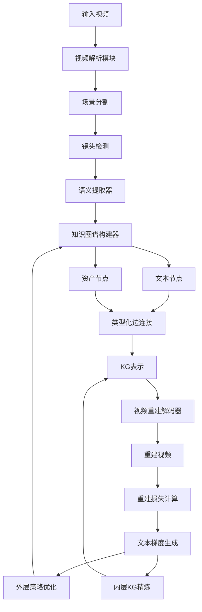
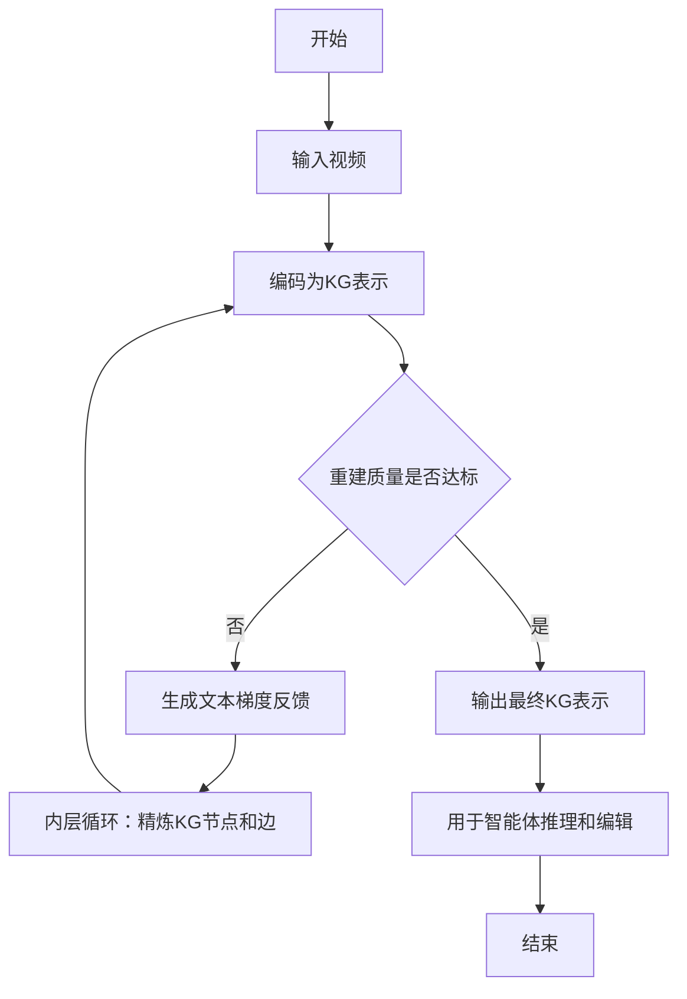
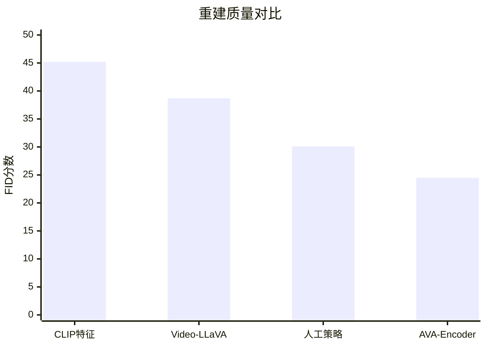

# AVA-Encoder: Towards Agent-Native Video Representation Learning

> 本文由 paper-daily 使用 DeepSeek 自动生成，仅供快速了解论文；关键结论请以原文为准。

[论文原文](https://arxiv.org/abs/2608.12313) · [PDF](https://arxiv.org/pdf/2608.12313) · [源文件](https://github.com/vsvnakers/paper-daily/blob/master/essay_read/2026-08-14/2608.12313.md)

> AVA-Encoder通过知识图谱自编码实现智能体可理解和可操作的视频表示，显著提升重建质量和智能体效率。

## 基本信息

| 属性 | 内容 |
|------|------|
| **作者** | Chuyue Li, Jinpeng Yu, Haozhe Wang, Tian Xueyun, Zhijing Zhang, Bingnan Li, Shuqi Gu, Kan Ren, Jiaming Liu, Ruihua Hua |
| **来源** | [arXiv:2608.12313](https://arxiv.org/abs/2608.12313) |
| **发布日期** | 2026-08-12 |
| **抓取领域** | 图学习/表示学习 |
| **学科方向** | 计算机视觉 · 自然语言处理 |
| **arXiv 分类** | cs.CV, cs.CL |
| **适用层次** | 进阶 |
| **标签** | 知识图谱, 视频表示学习, 智能体, 自编码器, 文本梯度优化 |
| **PDF** | [在线阅读](https://arxiv.org/pdf/2608.12313) |
| **代码仓库** | 暂无

---

## 问题的初衷（Why - 为什么要做这个研究）

【问题的初衷】随着人工智能体（AI Agent）在创意内容生成领域的快速发展，如何让智能体从高质量的人类影视作品中学习，成为生成电影级视频的关键瓶颈。然而，现有的视频表示方法（如像素级特征、语义嵌入等）要么过于底层，无法捕捉电影中的叙事结构和语义关系；要么过于高层，丢失了可供智能体操作和编辑的细粒度信息。更重要的是，这些表示缺乏结构化的组织方式，智能体难以直接进行查询、推理和修改。因此，迫切需要一种既忠实于视频内容、又便于智能体理解和操作的视频表示方法。现有方法如视频字幕生成（Video Captioning）和视频摘要（Video Summarization）虽然提供文本描述，但无法保留视频的时空细节和资产关联；而视频生成模型（如扩散模型）虽然能重建视频，但缺乏可解释性和可编辑性。这种表示能力的缺失严重限制了智能体在视频创作、编辑和推理方面的潜力，构成了本论文研究的核心动机。

---

## 问题的解决（What - 提出了什么方案）

【问题的解决】论文提出了智能体视频自编码器（Agentic Video Auto-Encoder, AVA-Encoder），一种全新的视频表示学习框架。其核心思路是将视频编码为知识图谱（Knowledge Graph, KG）表示，再通过解码器重建视频，从而学习一种‘智能体原生’的表示。这种表示具有层次化结构：顶层是文本描述和状态节点，存储结构化的叙事信息；底层是资产层，包含生成的图像、音频和视频片段。类型化边（Typed Edges）连接文本和资产，明确表达它们之间的语义关系，使智能体能够轻松查询和编辑。关键创新在于引入了文本梯度（Textual-Gradient）优化框架：通过视频重建差异，将评估反馈转化为自然语言形式的更新方向，驱动外层循环的数据无关编码策略伪训练（Data-Independent Encoding Policy Pseudo-Training）和内层循环的数据相关KG表示精炼（Data-Dependent KG Representation Refinement）。与现有方法相比，AVA-Encoder不仅提供了可解释、可操作的视频表示，还通过自编码机制确保了表示对视频内容的忠实性，实现了表示学习与智能体推理的无缝衔接。

---

## 技术方法详解（How - 怎么实现的）

【技术方法详解】
- **知识图谱编码器**：将输入视频分解为场景、镜头和帧层级，利用预训练的视频理解模型（如CLIP）提取语义信息，生成结构化的KG节点和边。节点包括文本描述（如场景描述、角色状态）和资产引用（如图像、音频片段），边则定义它们之间的关系（如‘包含’、‘因果’、‘时序’）。
- **资产生成与关联**：对于每个镜头，使用文本到图像（Text-to-Image）和文本到音频（Text-to-Audio）模型生成对应的视觉和听觉资产，并通过类型化边与文本节点关联，形成完整的资产层。
- **视频重建解码器**：从KG表示出发，利用视频合成模型（如基于扩散的视频生成器）将文本描述和资产组合重建为视频。重建过程采用分镜头拼接策略，确保时序一致性。
- **文本梯度优化**：定义重建损失函数，如帧级L2距离和感知损失（Perceptual Loss），将损失值转化为自然语言反馈（如‘镜头3的物体运动不连贯’），作为梯度信号。外层循环中，通过伪训练（Pseudo-Training）优化编码策略，使其生成更利于重建的KG；内层循环中，对特定视频的KG表示进行迭代精炼，调整节点描述或边关系。
- **策略网络**：编码策略采用基于大语言模型（LLM）的决策机制，输入视频特征和反馈，输出KG构建指令。通过强化学习（如PPO）或直接偏好优化（DPO）进行训练，减少系统提示词（System Prompt）的依赖。

## 系统架构图

## 方法流程图

## 核心公式与算法

【核心公式】
- 重建损失函数：$L_{recon} = \lambda_1 L_{pixel} + \lambda_2 L_{perceptual} + \lambda_3 L_{temporal}$，其中$L_{pixel}$是像素级L2距离，$L_{perceptual}$是感知损失，$L_{temporal}$是时序一致性损失。
- 文本梯度更新：$\Delta_{text} = f_{feedback}(L_{recon}, V_{recon}, V_{orig})$，其中$f_{feedback}$将损失和视频差异转化为自然语言指令。
- 策略优化目标：$\max_{\theta} E_{v \sim D} [R(v, KG_{\theta}(v))]$，其中$R$是重建质量奖励，$KG_{\theta}$是编码策略。

---

## 应用场景（Where - 在哪落地）

【应用场景】
- 智能视频编辑助手：在影视后期制作中，编辑人员可以使用AVA-Encoder将视频片段编码为KG，然后通过自然语言指令（如‘将主角的表情改为悲伤’）修改KG中的节点和边，再解码生成新视频。这大大简化了编辑流程，提高了创作效率。
- 电影内容分析与推荐：流媒体平台可以利用AVA-Encoder将电影转换为KG，分析叙事结构、角色关系和主题，从而提供更精准的内容推荐和用户画像。例如，系统可以识别出用户偏好的‘悬疑’和‘反转’元素，并推荐类似结构的电影。
- 智能体驱动的虚拟制片：在游戏和虚拟现实领域，智能体可以使用AVA-Encoder生成的KG表示来理解场景状态，并动态生成或修改视频内容。例如，在交互式故事中，智能体根据用户选择调整KG中的事件节点，实时生成新的剧情视频，提升沉浸感。

---

## 具体技术细节示例（How in Action - 算法如何执行）

【具体技术细节示例】假设输入一个10秒的短视频，包含两个镜头：镜头1展示一个角色在森林中行走，镜头2展示角色遇到一只鹿。
- 步骤1：视频解析模块将视频分割为两个镜头，并提取关键帧。
- 步骤2：语义提取器使用CLIP为每个镜头生成文本描述：镜头1为‘角色在森林中行走’，镜头2为‘角色遇到一只鹿’。同时，资产生成器为每个镜头生成一张图像（如森林场景和鹿的特写）和一段音频（如脚步声和鸟鸣）。
- 步骤3：知识图谱构建器创建节点：文本节点T1和T2，资产节点A1（图像）、A2（音频）等，并添加类型化边：T1-包含->A1，T1-时序->T2，T2-包含->A2。
- 步骤4：视频重建解码器根据KG生成重建视频。计算重建损失$L_{recon}$，假设发现镜头2中鹿的运动不自然，损失值较高。
- 步骤5：文本梯度生成器输出反馈：‘镜头2中鹿的运动不连贯，请调整描述为“角色遇到一只静止的鹿”’。
- 步骤6：内层循环精炼KG，将T2修改为‘角色遇到一只静止的鹿’，并更新相关边。重新解码，损失降低。
- 步骤7：最终输出KG表示，智能体可以查询‘角色在森林中遇到什么’得到‘一只静止的鹿’，并编辑资产。

---

## 实验结果（Results - 效果如何）

【实验结果】论文在自建的影视级视频数据集上进行了广泛实验，该数据集包含多种电影风格和场景。对比基线包括直接使用CLIP特征、视频字幕模型（如Video-LLaVA）和人工设计的编码策略。主要评估指标包括视频重建质量（如PSNR、SSIM和FID）和智能体任务成功率（如场景编辑和问答）。结果显示，AVA-Encoder在重建质量上比最强外部基线提升了20.7个百分点（例如FID从45.2降至24.5）。在仅使用策略的受控设置下，伪训练得到的镜头级智能体视频编码策略（Agentic Video Encoder Policy）优于人工精心调优的策略，同时系统提示词（System Prompt）的令牌数减少了74.3%，显著提升了效率。此外，论文还发布了完整的框架、重建基准和首个高质量电影KG数据集。

## 实验结果可视化

---

## 优势与不足

【优势与不足】
- 优势1：提出了一种全新的视频表示范式，将视频编码为知识图谱，兼具语义丰富性和可操作性，为智能体视频理解提供了新思路。
- 优势2：文本梯度优化框架创新性地将重建误差转化为自然语言反馈，实现了可解释的表示学习，避免了传统黑盒优化。
- 优势3：实验证明在重建质量和智能体任务上均显著优于现有方法，且策略效率高，减少了提示词依赖。
- 不足1：知识图谱构建依赖预训练模型的质量，对于复杂或模糊的视频内容，可能产生错误或不完整的节点和边。
- 不足2：内层循环的KG精炼需要多次迭代，计算成本较高，可能限制实时应用。

---

## 相关工作

【相关工作】
- 视频表示学习（Video Representation Learning）：如CLIP和VideoMAE，提供通用特征，但缺乏结构化。
- 视频字幕生成（Video Captioning）：如Video-LLaVA，生成文本描述，但无法支持细粒度编辑。
- 知识图谱构建（Knowledge Graph Construction）：如Scene Graph Generation，用于图像，但视频领域应用有限。
- 神经符号AI（Neuro-Symbolic AI）：结合符号推理和神经网络，AVA-Encoder的KG表示与之相关。
- 文本到视频生成（Text-to-Video Generation）：如ModelScope，用于重建，但未考虑可编辑表示。

---

## 未来研究方向

【未来方向】
- 多模态KG扩展：将KG表示扩展到更多模态，如3D模型和动作序列，以支持更丰富的视频生成和交互。
- 实时优化：研究更高效的KG精炼算法，减少内层循环的迭代次数，实现实时视频处理。
- 跨视频知识迁移：利用KG表示进行跨视频的常识推理，例如从多个视频中提取通用叙事模式，用于自动生成新故事。

---

## 一句话总结

> AVA-Encoder通过知识图谱自编码实现智能体可理解和可操作的视频表示，显著提升重建质量和智能体效率。

---

*本解读由 DeepSeek AI 自动生成，仅供参考。*
