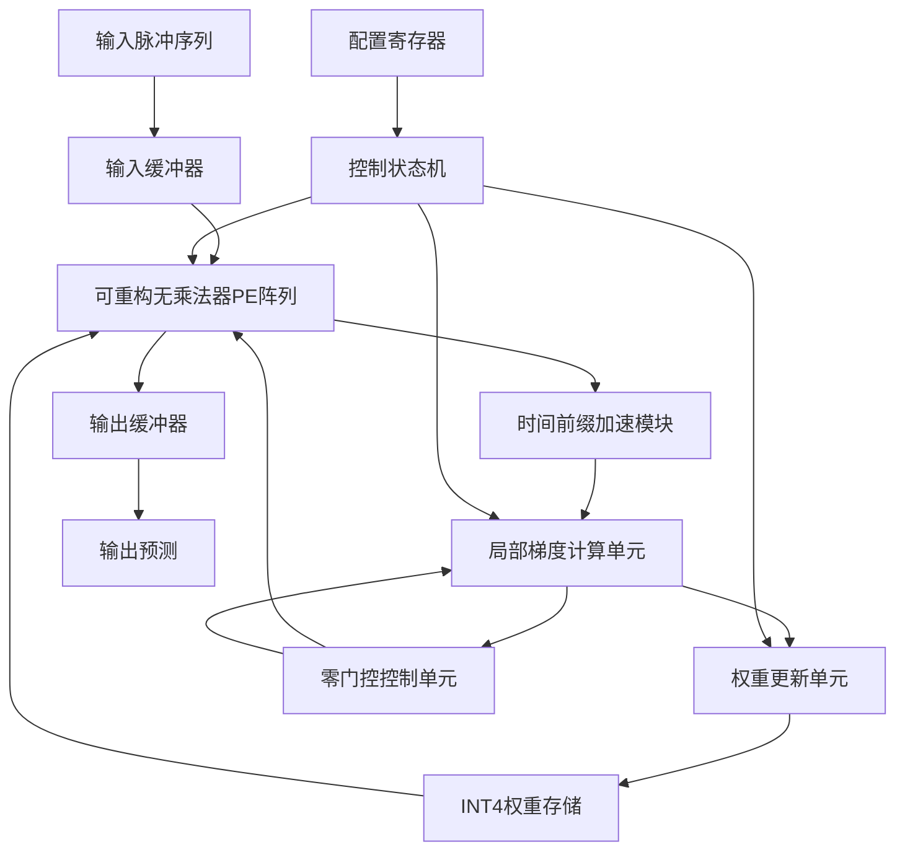
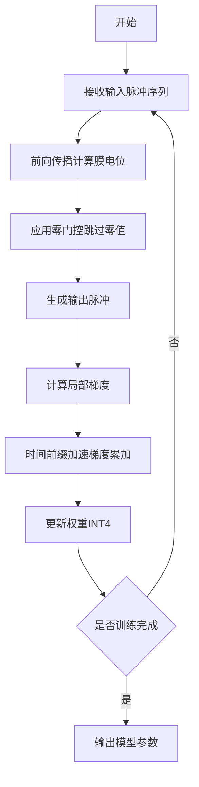
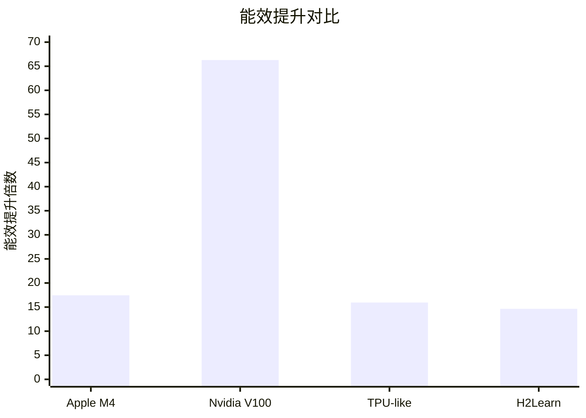

# Lonic: Algorithm-Hardware Co-Design for Energy-Efficient Fully Local Online SNN Training with INT4 Precision

> 本文由 paper-daily 使用 DeepSeek 自动生成，仅供快速了解论文；关键结论请以原文为准。

[论文原文](https://arxiv.org/abs/2608.12500) · [PDF](https://arxiv.org/pdf/2608.12500) · [源文件](https://github.com/vsvnakers/paper-daily/blob/master/essay_read/2026-08-14/2608.12500.md)

> Lonic通过算法-硬件协同设计，实现INT4精度下全局部在线SNN训练的高能效硬件加速。

## 基本信息

| 属性 | 内容 |
|------|------|
| **作者** | Peilin Chen, Xiaoxuan Yang |
| **来源** | [arXiv:2608.12500](https://arxiv.org/abs/2608.12500) |
| **发布日期** | 2026-08-12 |
| **抓取领域** | 类脑计算/脉冲网络 |
| **学科方向** | 体系结构 |
| **arXiv 分类** | cs.AR |
| **适用层次** | 进阶 |
| **标签** | 脉冲神经网络, 算法硬件协同设计, INT4低精度训练, 能效优化, 在线学习 |
| **PDF** | [在线阅读](https://arxiv.org/pdf/2608.12500) |
| **代码仓库** | 暂无

---

## 问题的初衷（Why - 为什么要做这个研究）

【问题的初衷】脉冲神经网络（Spiking Neural Network, SNN）因其事件驱动和生物可解释性，被视为一种极具潜力的低功耗学习范式。然而，传统的SNN训练算法，如基于时间的反向传播（Backpropagation Through Time, BPTT），需要存储整个时间步长的计算图，导致内存开销和计算复杂度随序列长度线性增长，严重制约了其在边缘设备上的部署。为此，研究者提出了时间局部（Temporal Local）和全局部（Fully Local）在线训练算法，如在线学习（Online Learning）和直接反馈对齐（Direct Feedback Alignment, DFA），以降低训练时的内存和计算负担。但现有工作大多停留在算法层面，仅关注精度和理论复杂度，未能深入探讨这些算法优势能否有效转化为实际硬件上的能效提升。例如，算法中的梯度计算可能涉及高精度浮点运算，或存在不规则的数据依赖，导致在通用处理器（如GPU）上无法充分利用其并行性，甚至因频繁的片上外数据搬运而抵消算法层面的收益。因此，如何设计一种算法-硬件协同设计（Algorithm-Hardware Co-Design）方案，使全局部在线SNN训练算法在保持精度的同时，真正实现高能效、可扩展的硬件部署，是当前面临的核心挑战。Lonic正是为解决这一鸿沟而提出，旨在从算法和硬件两个层面协同优化，实现能量高效的端侧SNN训练。

---

## 问题的解决（What - 提出了什么方案）

【问题的解决】Lonic提出了一种算法-硬件协同设计框架，以解决全局部在线SNN训练算法在实际硬件上能效不佳的问题。在算法层面，Lonic将全局部在线SNN训练中的关键计算（如突触前活动、突触后活动以及梯度更新）量化为INT4精度，并设计了低精度训练算法，在保持模型精度的同时大幅降低计算和存储开销。在硬件层面，Lonic设计了可重构的无乘法器整数处理单元（Processing Element, PE）阵列，利用移位和加法操作替代高能耗的乘法器，从而显著降低动态功耗。同时，提出了双优化零门控（Dual-Optimization Zero-Gating）策略，通过动态检测激活值和梯度中的零值，跳过无效计算，进一步提升能效。此外，Lonic引入了时间前缀加速的局部学习数据流（Temporal Prefix-Accelerated Local Learning Dataflow），通过复用中间结果和优化数据流，减少片上数据搬运。最后，采用低精度权重移动（Low-Precision Weight Movement）技术，降低片外存储访问的带宽和能耗。这些硬件设计紧密契合算法特性，实现了算法优势到硬件效率的有效转化。与现有方法相比，Lonic的本质区别在于其从算法到硬件的全栈协同优化，而非仅关注单一层面。

---

## 技术方法详解（How - 怎么实现的）

【技术方法详解】
- **INT4低精度训练算法**：将全局部在线SNN训练中的膜电位、突触权重和梯度更新量化为INT4格式，通过量化感知训练（Quantization-Aware Training, QAT）保持精度。具体地，使用分段线性函数近似脉冲活动，并采用梯度裁剪和缩放技术减少量化误差。
- **可重构无乘法器整数PE阵列**：设计了一种可重构的PE阵列，每个PE由移位器和加法器组成，支持INT4乘法（通过移位和累加实现），避免使用高功耗的乘法器。PE阵列可根据不同层类型（卷积层或全连接层）动态重构，以适配不同计算模式。
- **双优化零门控策略**：结合激活值稀疏性和梯度稀疏性，设计零值检测电路，在计算前跳过零值操作数，减少无效计算。该策略同时应用于前向传播和反向传播，显著降低动态功耗。
- **时间前缀加速的局部学习数据流**：利用时间维度的局部性，将每个时间步的突触前活动进行前缀和（Prefix Sum）计算，并缓存中间结果，避免重复计算。同时，优化数据流，使权重更新和梯度计算并行执行，提高硬件利用率。
- **低精度权重移动**：将权重以INT4格式存储于片上SRAM，并通过低精度数据总线传输，减少片外DRAM访问次数和位宽，降低内存访问能耗。
- **硬件-算法协同映射**：通过分析算法中的计算模式（如矩阵乘法和逐元素操作），将不同操作映射到PE阵列的特定配置，实现计算资源的高效利用。

## 系统架构图

## 方法流程图

## 核心公式与算法

【核心公式】
- **膜电位更新**：$V_{mem}^{t} = V_{mem}^{t-1} + \sum_{i} w_i \cdot s_i^{t}$，其中 $V_{mem}^{t}$ 是时间步 $t$ 的膜电位，$w_i$ 是突触权重，$s_i^{t}$ 是输入脉冲。
- **局部梯度计算**：$\delta_j^{t} = f'(V_{mem,j}^{t}) \cdot \sum_{k} w_{jk} \cdot \delta_k^{t+1}$，其中 $f'$ 是脉冲活动的导数近似，$\delta$ 是误差信号。
- **INT4量化函数**：$Q(x) = \text{clip}(\lfloor x / \Delta \rceil, -8, 7) \cdot \Delta$，其中 $\Delta$ 是量化步长，$\lfloor \cdot \rceil$ 是四舍五入操作。

---

## 应用场景（Where - 在哪落地）

【应用场景】
- **边缘端在线学习**：在物联网（IoT）设备或智能传感器中，Lonic可实现低功耗的在线学习，使设备能够根据实时数据流自适应调整模型。例如，在智能可穿戴设备中，利用SNN处理生物信号（如EEG），Lonic允许设备在本地持续学习用户的行为模式，无需将数据上传至云端，既保护隐私又降低通信能耗。预期效果是设备功耗降低一个数量级，同时保持高精度。
- **自动驾驶中的实时感知**：在自动驾驶系统中，SNN用于处理事件相机（Event Camera）数据，Lonic的硬件加速器可部署在车载计算平台，实现实时训练和适应新场景。例如，车辆在行驶中遇到新障碍物时，系统能快速在线更新模型，提高检测准确性。Lonic的高能效特性有助于延长电动汽车续航，同时其低精度设计减少存储需求，适合嵌入式部署。
- **神经形态芯片的片上训练**：Lonic可作为神经形态芯片（如Intel Loihi）的扩展，实现片上训练能力。在机器人控制中，机器人需要根据环境变化调整运动策略，Lonic的硬件设计可集成到机器人处理器中，实现毫秒级响应和低功耗训练。预期效果是机器人适应能力增强，电池寿命延长。

---

## 具体技术细节示例（How in Action - 算法如何执行）

【具体技术细节示例】假设一个简单的全连接SNN层，输入维度为4，输出维度为2，时间步长 $T=3$。输入脉冲序列 $s$ 为：时间步1: [1,0,1,0]，时间步2: [0,1,0,1]，时间步3: [1,1,0,0]。初始权重矩阵 $W$（INT4量化）为：[[1, -2], [0, 1], [-1, 1], [2, 0]]，量化步长 $\Delta=1$。

**步骤1：前向传播**
- 时间步1：膜电位 $V_{mem}^{1} = W^T \cdot s^1 = [1*1 + 0*0 + (-1)*1 + 2*0, (-2)*1 + 1*0 + 1*1 + 0*0] = [0, -1]$。输出脉冲 $s_{out}^{1} = [1, 0]$（阈值设为0）。
- 时间步2：$V_{mem}^{2} = V_{mem}^{1} + W^T \cdot s^2 = [0, -1] + [0*0 + 0*1 + (-1)*0 + 2*1, (-2)*0 + 1*1 + 1*0 + 0*1] = [2, 0]$。输出脉冲 $s_{out}^{2} = [1, 1]$。
- 时间步3：$V_{mem}^{3} = V_{mem}^{2} + W^T \cdot s^3 = [2, 0] + [1*1 + 0*1 + (-1)*0 + 2*0, (-2)*1 + 1*1 + 1*0 + 0*0] = [3, -1]$。输出脉冲 $s_{out}^{3} = [1, 0]$。

**步骤2：局部梯度计算**
假设目标输出为 $y = [1, 0]$，损失函数为均方误差。输出层梯度 $\delta_{out}^{3} = s_{out}^{3} - y = [0, 0]$。由于全局部学习，梯度不反向传播到前层，仅更新当前层权重。

**步骤3：权重更新**
权重更新公式：$W_{ij} \leftarrow W_{ij} - \eta \cdot \delta_{out,j}^{3} \cdot s_i^{3}$，其中学习率 $\eta=0.1$。由于 $\delta_{out}^{3} = [0,0]$，权重不更新。

**步骤4：零门控**
在计算中，输入脉冲 $s^3$ 中第3个元素为0，因此对应权重列不参与计算，节省了2次乘法操作。

**最终输出**：模型输出脉冲序列为 $[1,0], [1,1], [1,0]$，权重保持初始值。此示例展示了Lonic如何利用局部梯度、INT4量化和零门控简化计算。

---

## 实验结果（Results - 效果如何）

【实验结果】Lonic在多个SNN基准数据集上进行了评估，包括CIFAR-10、CIFAR-100和DVS-Gesture。实验设置包括：使用VGG-9和ResNet-19等网络结构，输入时间步长设为8。对比方法包括Apple M4 CPU、Nvidia V100 GPU、ASIC TPU-like加速器和H2Learn加速器。结果显示，Lonic在保持与全精度训练相当精度（精度损失小于1%）的同时，相比Apple M4和Nvidia V100 GPU，平均能效提升分别达到17.44倍和66.28倍，训练速度提升3.25倍和1.02倍。与ASIC TPU-like和H2Learn加速器相比，Lonic的能效提升15.95倍和14.64倍，面积效率提升1.52倍和7.28倍。此外，消融实验验证了零门控策略和低精度权重移动对能效的贡献。

## 实验结果可视化

---

## 优势与不足

【优势与不足】
- **优势**：
  1. 算法-硬件协同设计，从源头解决算法到硬件的鸿沟，实现高能效训练。
  2. 创新的无乘法器PE阵列和零门控策略，大幅降低动态功耗和计算开销。
  3. 在保持高精度的同时，实现了显著的能效和速度提升，验证了INT4低精度训练的可行性。
  4. 开源代码，便于复现和进一步研究。
- **不足**：
  1. 当前设计主要针对特定网络结构（如VGG、ResNet），对更复杂或动态结构的SNN支持有限。
  2. 零门控策略依赖于激活和梯度的稀疏性，在密集数据上可能收益有限。
  3. 硬件原型尚未流片，实际ASIC实现的功耗和面积数据可能有所偏差。

---

## 相关工作

【相关工作】
- **全局部在线SNN训练算法**：如Online Training Through Time (OTTT)和Sparse Local Learning，这些工作提出时间局部梯度计算，但未考虑硬件映射。
- **SNN硬件加速器**：如TrueNorth和Loihi，这些芯片支持推理，但训练能力有限。
- **低精度训练**：如FP8和INT8训练，在ANN中广泛应用，但针对SNN的INT4训练研究较少。
- **算法-硬件协同设计**：如H2Learn，针对SNN训练设计加速器，但未采用全局部算法和INT4精度。
- **零值跳过技术**：在稀疏神经网络加速器中常见，但Lonic将其扩展至训练阶段。

---

## 未来研究方向

【未来方向】
- **扩展到更复杂的SNN结构**：当前Lonic主要支持卷积和全连接层，未来可扩展至注意力机制或图神经网络，以适应更复杂的任务。
- **动态精度调整**：根据训练阶段或数据分布动态调整量化精度（如从INT4切换到INT8），在精度和能效之间取得更好平衡。
- **多芯片扩展**：设计多芯片互联方案，支持大规模SNN训练，解决单芯片资源限制。

---

## 一句话总结

> Lonic通过算法-硬件协同设计，实现INT4精度下全局部在线SNN训练的高能效硬件加速。

---

*本解读由 DeepSeek AI 自动生成，仅供参考。*
