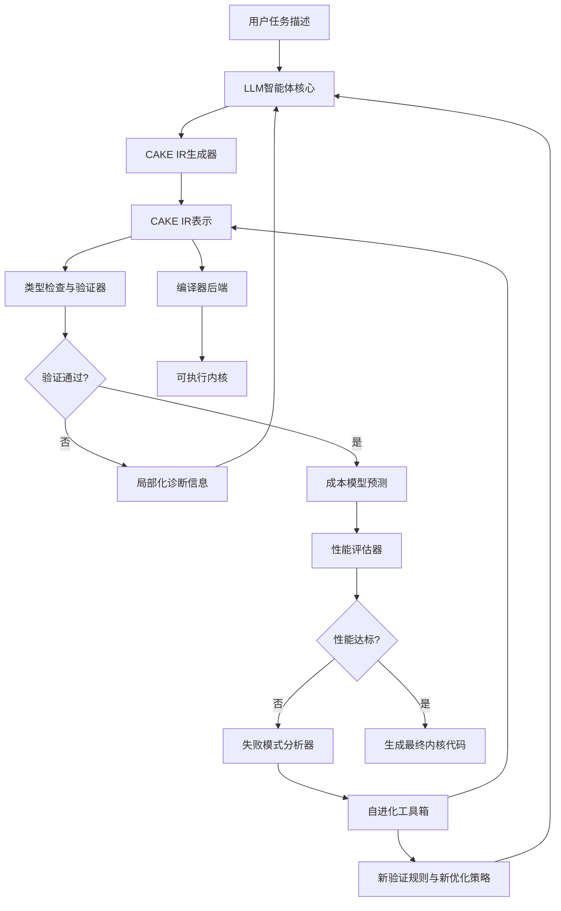
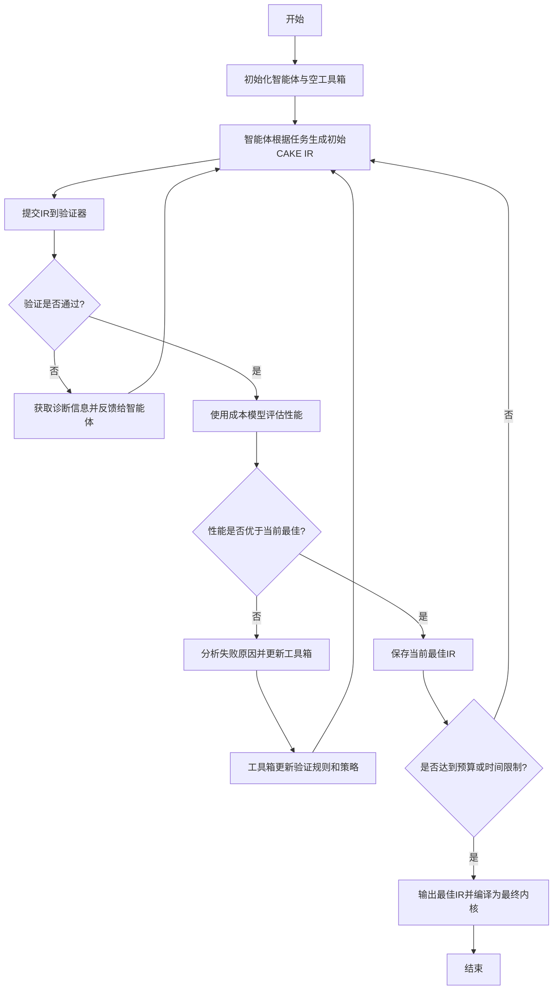
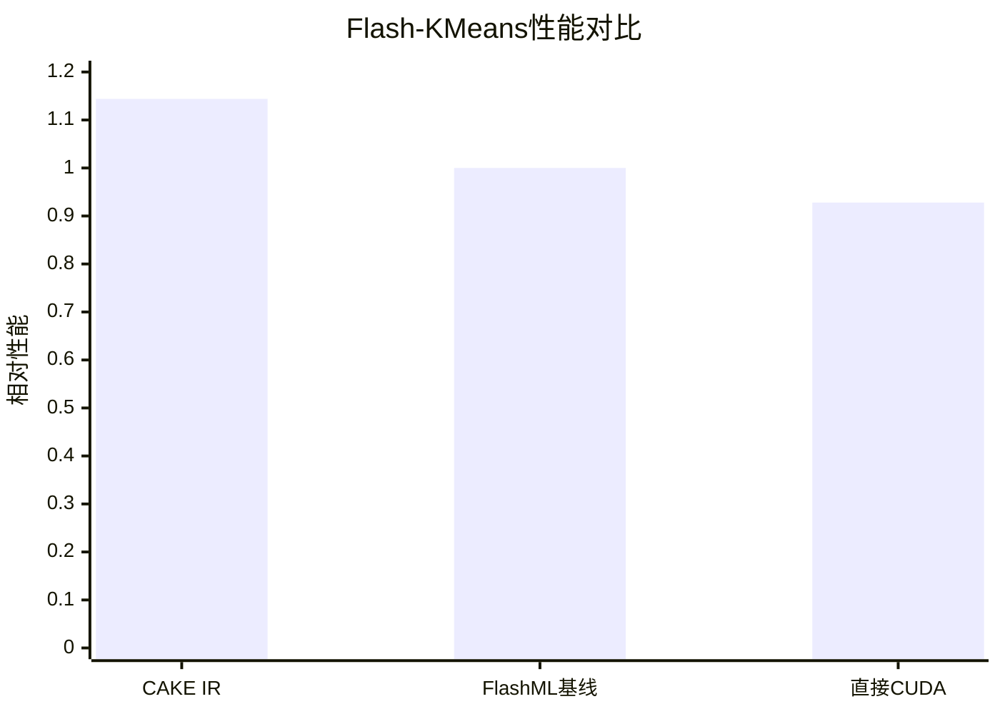

# CAKE: Compiler-Agent Co-Design for Frontier Kernel Evolution

> 本文由 paper-daily 使用 DeepSeek 自动生成，仅供快速了解论文；关键结论请以原文为准。

[论文原文](https://arxiv.org/abs/2608.12629) · [PDF](https://arxiv.org/pdf/2608.12629) · [源文件](https://github.com/vsvnakers/paper-daily/blob/master/essay_read/2026-08-14/2608.12629.md)

> CAKE通过编译器与智能体协同设计，以硬件显式IR打破黑盒壁垒，实现高性能GPU内核的自动化进化。

## 基本信息

| 属性 | 内容 |
|------|------|
| **作者** | Zihao Ye, Yingyi Huang, Hongyi Jin, Bohan Hou, Junru Shao, Zhongming Yu, Jinqi Chen, Meghan Cowan, Shiyi Cao, Shanli Xing, Hanfeng Chen, Vinod Grover, Tianqi Chen, Luis Ceze |
| **来源** | [arXiv:2608.12629](https://arxiv.org/abs/2608.12629) |
| **发布日期** | 2026-08-12 |
| **抓取领域** | 深度学习编译器/IR |
| **学科方向** | 机器学习 |
| **arXiv 分类** | cs.LG |
| **适用层次** | 进阶 |
| **标签** | 编译器协同设计, GPU内核优化, 大语言模型智能体, 硬件显式IR, 自进化系统 |
| **PDF** | [在线阅读](https://arxiv.org/pdf/2608.12629) |
| **代码仓库** | 暂无

---

## 问题的初衷（Why - 为什么要做这个研究）

【问题的初衷】

GPU内核（Kernel）是高性能计算和深度学习推理的核心，其性能直接决定了上层应用的效率。然而，编写一个接近硬件理论峰值的内核极其困难，需要专家对GPU架构（如线程调度、共享内存、寄存器分配）有深刻理解。近年来，两个方向试图解决这一难题：一是基于大语言模型（LLM）的GPU内核智能体（Agent），它们能自动生成和优化内核代码；二是领域特定语言（DSL），如Triton、FlashML，它们通过高级抽象简化内核编写。

然而，这两个方向存在根本性的割裂。智能体通常将编译器视为一个固定的黑盒，它们只能通过编译错误、正确性测试结果和运行时间（Timing）来间接感知内核质量，无法深入理解编译器的调度决策和硬件资源映射。这导致智能体在探索优化空间时如同盲人摸象，效率低下且难以突破性能瓶颈。另一方面，现有的DSL要么隐藏了关键的调度决策（如线程束角色分配、内存移动），要么通过难以掌握的布局抽象（Layout Abstraction）来暴露这些决策，使得专家也难以精确控制硬件行为。

这种割裂导致了一个核心问题：专家级的高性能内核难以被智能体自动复现，智能体生成的代码往往在性能上远逊于手工调优的内核。随着GPU架构的快速迭代（从Ampere到Blackwell），这种人工优化成本的瓶颈愈发凸显。因此，本文旨在弥合智能体与编译器之间的鸿沟，提出一种协同设计（Co-Design）方法，让智能体能够直接操作硬件显式（Hardware-Explicit）的中间表示（IR），从而高效地探索和生成接近专家水平的内核。

---

## 问题的解决（What - 提出了什么方案）

【问题的解决】

CAKE（Compiler-Agent Co-Design for Frontier Kernel Evolution）提出了一种革命性的协同设计范式，其核心思想是让智能体直接编写一种名为CAKE IR的、类型化的、硬件显式的调度表示（Schedule Representation）。与将编译器视为黑盒不同，CAKE将编译器的内部表示和调度能力开放给智能体，使其能够直接控制GPU的底层资源。

CAKE IR的设计哲学是“暴露关键决策，隐藏无关细节”。它明确暴露了四个核心硬件概念：线程束角色（Warp Roles）、内存移动（Memory Movement）、同步（Synchronization）和流水线（Pipelines）。通过类型系统，CAKE IR在编译时就能验证许多正确性约束，从而减少运行时错误。此外，CAKE IR还支持成本模型（Cost Modeling）和局部化诊断（Localized Diagnostics），让智能体能预测性能瓶颈并快速定位错误。

更关键的是，CAKE的“编译器-智能体”协同是动态演化的。它构建了一个“自进化工具箱”（Self-Evolving Toolbox）：当智能体在优化过程中反复遇到同一类失败时，系统会自动将这些失败模式转化为新的验证器规则（Verifier Rules）、IR原语（IR Primitives）、模型校准数据（Model Calibrations）和可复用的优化策略（Reusable Optimization Tactics）。这意味着系统会随着使用而变得越来越强大，智能体的优化经验被沉淀为系统的固有知识。

与现有方法的本质区别在于：CAKE不是让智能体适应编译器，也不是让编译器隐藏硬件，而是让两者在同一个硬件显式的IR层面进行深度交互和共同进化。

---

## 技术方法详解（How - 怎么实现的）

【技术方法详解】

- **CAKE IR设计**：CAKE IR是一种类型化的中间表示，它不像PTX那样是纯汇编，也不像Triton那样是高级张量操作。它位于两者之间，专注于调度（Scheduling）而非计算（Compute）。其核心类型系统区分了不同的内存空间（如全局内存、共享内存、寄存器）和线程束角色（如生产者、消费者、加载器）。

- **硬件显式调度原语**：CAKE IR提供了丰富的调度原语，例如 `warp_role` 用于指定线程束的功能，`async_copy` 用于异步内存拷贝，`barrier` 用于同步，`pipeline_stage` 用于定义软件流水线阶段。这些原语直接映射到NVIDIA GPU的硬件指令，如 `cp.async` 和 `bar.sync`。

- **验证器（Verifier）**：CAKE内置了一个强大的验证器，它利用类型系统在编译期检查调度合法性。例如，它可以验证一个 `async_copy` 操作的目标内存是否在写入前已完成同步，或者线程束角色是否与计算逻辑匹配。这种静态验证大大减少了智能体生成错误代码的概率。

- **成本模型（Cost Model）**：CAKE集成了一个可学习的成本模型，用于预测给定CAKE IR在特定GPU上的运行时间。该模型会随着智能体的实际运行结果而不断校准，从而为智能体提供更准确的性能反馈，指导其搜索方向。

- **自进化工具箱（Self-Evolving Toolbox）**：这是CAKE的核心创新。系统维护一个知识库，当智能体在优化过程中遇到失败时，系统会分析失败原因。如果是模式化的错误，系统会生成新的验证规则；如果是性能瓶颈，系统会提炼出新的优化策略（Tactic）。这些新知识会立即被用于后续的智能体优化过程，形成正反馈循环。

- **与LLM智能体的接口**：CAKE为LLM智能体提供了一个结构化的接口。智能体不再需要生成纯文本代码，而是生成结构化的CAKE IR操作序列。系统提供API让智能体查询成本模型、提交IR进行验证、获取局部诊断信息。这大大降低了智能体与编译器交互的复杂度。


## 系统架构图




## 方法流程图




## 核心公式与算法

【核心公式】

CAKE论文的核心并非单一公式，而是一套优化框架。但我们可以用以下公式来抽象其核心思想：

1. **性能优化目标**：
$$\min_{IR \in \mathcal{S}} T_{exec}(IR, GPU)$$
其中，$IR$ 是CAKE IR程序，$\mathcal{S}$ 是所有合法IR的集合，$T_{exec}$ 是在特定GPU硬件上的执行时间。CAKE的目标是找到使执行时间最小的IR程序。

2. **成本模型校准**：
$$\hat{T}_{pred}(IR) = f_{\theta}(IR)$$
其中，$f_{\theta}$ 是参数为 $\theta$ 的成本模型。校准过程即最小化预测误差：
$$\min_{\theta} \sum_{i} (T_{exec}(IR_i) - f_{\theta}(IR_i))^2$$

3. **自进化知识更新**：
$$K_{t+1} = K_t \cup \text{Extract}(\text{Failures}_t)$$
其中，$K_t$ 是第 $t$ 轮迭代时的知识库（包含验证规则和优化策略），$\text{Failures}_t$ 是第 $t$ 轮迭代中智能体遇到的失败案例，$\text{Extract}$ 是从失败中提取新知识的函数。


---

## 应用场景（Where - 在哪落地）

【应用场景】

**场景一：深度学习算子库的自动化开发**
在深度学习框架（如PyTorch）中，新模型架构（如Kimi Delta Attention）往往需要手写高性能的CUDA内核。CAKE可以被用来自动化这一过程。开发者只需提供算子的数学定义和性能目标，CAKE智能体就能自动探索调度空间，生成经过验证的高性能内核。这能显著缩短新算子的开发周期，从数周缩短到数天，并确保性能接近手工调优水平。

**场景二：大规模科学计算内核的持续优化**
在分子动力学、气候模拟等科学计算领域，核心计算内核（如KMeans、KNN）需要针对不同的输入规模（Shapes）进行优化。CAKE的调度器（Dispatcher）机制可以针对不同的数据形状自动选择最优的内核变体。通过CAKE，可以构建一个自适应的计算库，它能够根据运行时的数据特征动态切换内核，从而在超过400种不同的形状下都保持1.42倍到2.12倍的性能提升，极大地提升了科学计算的吞吐量。

**场景三：硬件设计空间探索**
虽然CAKE目前针对现有GPU，但其硬件显式IR的思想可以用于探索未来GPU架构的设计空间。通过修改CAKE IR中的硬件参数（如线程束大小、内存带宽），可以模拟不同硬件配置对内核性能的影响。这为芯片设计人员提供了宝贵的反馈，帮助他们理解哪些硬件特性对实际工作负载最重要，从而指导下一代GPU的架构设计。


---

## 具体技术细节示例（How in Action - 算法如何执行）

【具体技术细节示例】

假设我们要用CAKE优化一个简单的Flash-KMeans内核，输入数据为 $N=1024$ 个点，每个点维度为 $D=64$，簇数为 $K=16$。

**步骤1：智能体生成初始IR**
智能体首先生成一个最朴素的CAKE IR，它只使用一个线程束（Warp）来处理所有数据。该IR的伪代码为：

```
warp_role = COMPUTE_ALL
for each point p:
    for each centroid c:
        dist = compute_distance(p, c)
        update_min(dist)
```

**步骤2：验证与性能评估**
验证器检查该IR，发现类型正确，通过验证。成本模型预测其执行时间为 $T_{pred} = 1000 \mu s$。

**步骤3：智能体优化迭代**
智能体认为性能不佳，决定引入并行性。它生成一个新的IR，将数据划分为4个块，每个块由一个独立的线程束处理，并使用 `async_copy` 预取数据到共享内存。

```
warp_role = LOADER for warp 0, COMPUTE for warp 1-3
async_copy(global_mem[block_0], shared_mem[0])
barrier()
warp_role = COMPUTE for all warps
for each point p in local_block:
    for each centroid c:
        dist = compute_distance(p, c)
        update_min(dist)
```

**步骤4：验证失败与学习**
验证器发现一个错误：`async_copy` 操作在 `barrier()` 之前没有完成数据同步，可能导致计算线程束读取到未就绪的数据。系统将这一失败模式提取为一条新的验证规则：“`async_copy` 必须与 `barrier` 配对使用”。智能体收到诊断信息后，修正IR，在 `async_copy` 后正确放置 `barrier`。

**步骤5：性能收敛**
经过多轮迭代，智能体最终生成了一个包含4级软件流水线的IR，每个线程束负责不同的流水线阶段。成本模型预测其性能为 $T_{pred} = 120 \mu s$。实际运行时间 $T_{exec} = 115 \mu s$，达到了FlashML基线性能的1.144倍。

**最终输出**：CAKE将最佳IR编译为可执行的CUDA内核，该内核在B200 GPU上运行，性能显著优于基线。


---

## 实验结果（Results - 效果如何）

【实验结果】

论文在多种任务上验证了CAKE的有效性。首先，在Flash-KMeans基准测试中，使用B200 GPU，在8000万token的优化预算下，CAKE IR生成的最佳候选内核性能达到了调优后的FlashML基线（Tuned FlashML Baseline）的1.144倍，而直接使用CUDA/PTX的智能体（Direct CUDA/PTX）仅能达到0.928倍。这证明了CAKE IR的硬件显式表示能显著提升智能体的优化上限。

其次，在更复杂的Kimi Delta Attention任务上，CAKE智能体生成的内核相比官方FlashKDA实现了2.05倍的几何平均加速比，并成功通过了端到端的服务验证（End-to-End Serving Validation），表明其不仅速度快，而且正确性有保障。

此外，CAKE还展示了其泛化能力。通过调度器（Dispatcher）支持的KNN和KMeans算法，在超过400种不同的形状（Shapes）下，性能提升了1.42倍到2.12倍。最后，论文提到有四个内核优化成果已被上游接受为Pull Request（PR），证明了其生成代码的实际可用性和高质量。


## 实验结果可视化




---

## 优势与不足

【优势与不足】

**优势**
- **打破黑盒壁垒**：CAKE通过硬件显式IR，让智能体能够直接感知和操作硬件调度，这是对传统编译器黑盒模式的根本性突破，极大地提升了智能体的优化能力和效率。
- **自进化能力**：系统能够从失败中学习，将经验固化为规则和策略，这种“越用越强”的特性是其他静态方法无法比拟的，代表了系统设计的前沿方向。
- **显著的性能提升**：在多个基准测试中，CAKE均取得了超越现有最佳方法（如FlashML、FlashKDA）的性能，证明了其方法的实用性和有效性。

**不足**
- **硬件依赖性**：CAKE IR的设计紧密耦合NVIDIA GPU的特定架构（如Ampere到Blackwell），这使得其难以直接迁移到其他硬件平台（如AMD、Intel），通用性受限。
- **智能体成本高昂**：虽然CAKE提升了优化效率，但整个优化过程仍然依赖于LLM智能体的推理，需要消耗大量的token预算（如8000万token），对于简单的内核优化任务来说，可能成本过高。

---

## 相关工作

【相关工作】

- **GPU内核智能体（GPU Kernel Agents）**：如使用LLM直接生成CUDA代码的工作，这些工作通常将编译器视为黑盒，通过试错法优化，CAKE与它们的区别在于提供了结构化的硬件显式接口。
- **领域特定语言（DSL）**：如Triton和FlashML，它们通过高级抽象简化内核编写，但隐藏了调度细节。CAKE IR则反其道而行之，暴露了关键调度决策，为智能体提供了更精细的控制粒度。
- **编译器自动调优（Compiler Auto-Tuning）**：如TVM的AutoTVM，它们通过搜索编译选项来优化性能，但搜索空间有限。CAKE的智能体可以探索更广泛的调度结构，而不仅仅是参数调整。
- **可微编程与自动微分（Differentiable Programming）**：虽然不直接相关，但CAKE的成本模型与可微编程中的梯度下降思想有相似之处，都是通过模型指导搜索。

---

## 未来研究方向

【未来方向】

- **跨硬件平台扩展**：将CAKE IR的抽象层提升，使其能够映射到AMD、Intel等不同厂商的GPU架构，甚至扩展到其他加速器（如TPU）。这需要设计一个更通用的硬件抽象层，并开发针对不同后端的代码生成器。
- **多智能体协作优化**：当前CAKE使用单个智能体进行优化。未来可以探索多个智能体并行搜索不同的调度空间，并通过通信机制共享有价值的中间结果和优化策略，从而进一步加速搜索过程并避免陷入局部最优。
- **与编译器自动生成结合**：CAKE目前由智能体生成IR。未来可以研究让编译器根据高层意图自动生成部分CAKE IR，智能体则专注于优化关键路径。这种“编译器生成+智能体优化”的混合模式可以降低智能体的搜索空间，提高整体效率。


---

## 一句话总结

> CAKE通过编译器与智能体协同设计，以硬件显式IR打破黑盒壁垒，实现高性能GPU内核的自动化进化。

---

*本解读由 DeepSeek AI 自动生成，仅供参考。*
