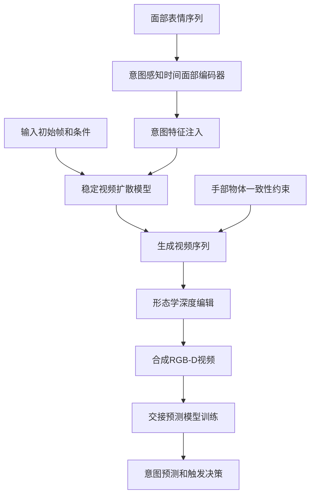
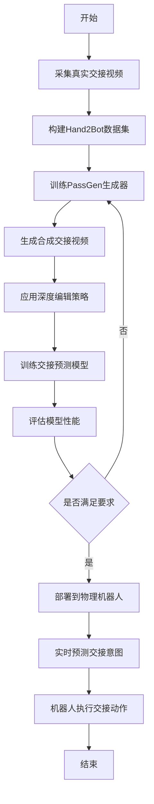
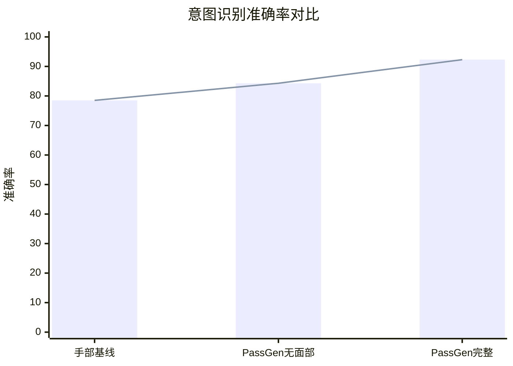

# RGB-D Video Generation for Improving Human-to-Robot Object Handover Prediction

> 本文由 paper-daily 使用 DeepSeek 自动生成，仅供快速了解论文；关键结论请以原文为准。

[论文原文](https://arxiv.org/abs/2608.13028) · [PDF](https://arxiv.org/pdf/2608.13028) · [源文件](https://github.com/vsvnakers/paper-daily/blob/master/essay_read/2026-08-15/2608.13028.md)

> 提出Hand2Bot数据集和PassGen生成流水线，利用视频扩散和面部编码生成真实RGB-D交接视频，提升机器人交接预测的准确性和实时性。

## 基本信息

| 属性 | 内容 |
|------|------|
| **作者** | Tianyu Sun, Zhoujie Fu, Zihui Gao, Bang Zhang, Guosheng Lin |
| **来源** | [arXiv:2608.13028](https://arxiv.org/abs/2608.13028) |
| **发布日期** | 2026-08-13 |
| **抓取领域** | CV · 图像/视频生成 |
| **学科方向** | 计算机视觉 · 机器人 |
| **arXiv 分类** | cs.CV, cs.RO |
| **适用层次** | 基础 |
| **标签** | RGB-D视频生成, 交接预测, 视频扩散模型, 模拟到现实迁移, 人机协作 |
| **PDF** | [在线阅读](https://arxiv.org/pdf/2608.13028) |
| **代码仓库** | 暂无

---

## 问题的初衷（Why - 为什么要做这个研究）

【问题的初衷】
人类到机器人（Human-to-Robot, H2R）的物体交接是协作机器人（collaborative robot）在共享工作空间中与人类自然互动的核心能力，例如在装配线上传递工具或在家中递送物品。然而，这一能力的发展受到两大瓶颈的严重制约：一是缺乏大规模、以人为中心（human-centric）的RGB-D视频数据集，现有数据集多聚焦于手部姿态或物体检测，忽略了身体姿态、面部表情等丰富的上下文信息，而这些信息对于预测人类交接意图至关重要；二是模拟到现实（sim-to-real）的差距，即合成数据与真实传感器数据（如深度相机的噪声模式）之间存在显著差异，导致在仿真中训练的模型难以直接部署到物理机器人上。现有方法通常依赖手部轨迹或物体位置作为主要预测信号，但在交接意图早期阶段（如人类伸手前）这些信号往往不可靠或延迟，导致机器人反应迟缓或误触发。因此，亟需一种能够生成高质量、真实感强的RGB-D交接视频数据的方法，并有效弥合模拟与现实的差距，从而提升交接预测的准确性和实时性。

---

## 问题的解决（What - 提出了什么方案）

【问题的解决】
论文提出了Hand2Bot数据集和PassGen生成流水线，以系统性地解决上述问题。Hand2Bot是一个专门为交接场景收集的RGB-D视频数据集，包含真实世界的噪声模式，并提供了身体姿态、面部表情等丰富上下文信息，为训练和评估提供了坚实基础。PassGen则是一个生成式流水线，利用稳定的视频扩散模型（Stable Video Diffusion）和意图感知的时间面部编码器（Intention-Aware Temporal Face Encoder）来合成逼真的交接序列，同时通过手部-物体一致性约束确保生成内容在物理上合理。为了弥合sim-to-real差距，论文引入了基于形态学的深度编辑策略（morphology-based depth editing），模拟真实深度传感器（如Intel RealSense）的噪声特性，使合成数据更接近真实分布。与现有方法相比，PassGen不仅关注手部动态，还整合了面部表情和身体姿态作为意图信号，从而在早期阶段更准确地预测交接意图，并显著降低误触发率。实验证明，基于PassGen训练的模型在零样本迁移（zero-shot transfer）和意图提前预测方面优于传统手部中心（hand-centric）基线，实现了社交感知的机器人行为。

---

## 技术方法详解（How - 怎么实现的）

【技术方法详解】
- **数据集构建**：Hand2Bot数据集包含多视角RGB-D视频，记录人类在自然交接场景中的动作，涵盖不同物体、距离和姿势，并标注了交接意图时间点。数据采集使用高精度深度相机，保留了真实噪声模式。
- **生成流水线PassGen**：采用稳定的视频扩散模型（Stable Video Diffusion）作为基础生成器，输入初始帧和条件信号（如物体位置、手部轨迹），生成连续视频帧。
- **意图感知时间面部编码器**：设计了一个编码器，提取面部表情的时间序列特征（如眼神、嘴部动作），并将其作为条件注入扩散模型，使生成视频反映人类的交接意图。编码器基于3D卷积网络（3D-CNN）和注意力机制（Attention Mechanism），捕捉面部动态。
- **手部-物体一致性约束**：在生成过程中，通过损失函数约束手部与物体的相对位置和接触关系，确保生成的视频中手部在交接时正确抓握物体，避免物理不合理现象。
- **形态学深度编辑策略**：对生成的深度图应用形态学操作（如膨胀、腐蚀）和噪声注入，模拟真实深度传感器的误差模式（如边缘模糊、随机噪声），从而缩小合成数据与真实数据的分布差距。
- **训练与推理**：使用生成的视频数据训练交接预测模型，该模型基于时序卷积网络（Temporal Convolutional Network, TCN）和注意力机制，输出交接意图的概率和预期时间。推理时，模型实时处理RGB-D流，预测意图并触发机器人动作。

## 系统架构图

## 方法流程图

## 核心公式与算法

【核心公式】
- 生成损失函数：$L_{gen} = \mathbb{E}_{x \sim p_{data}} [\|G(z, c) - x\|_2^2] + \lambda_{face} \cdot L_{face}$，其中$G$是生成器，$z$是噪声，$c$是条件（包括面部特征），$L_{face}$是面部一致性损失。
- 意图预测损失：$L_{intent} = -\sum_{t} [y_t \log(p_t) + (1-y_t) \log(1-p_t)] + \alpha \cdot \|\hat{t}_{intent} - t_{intent}\|_1$，其中$y_t$是意图标签，$p_t$是预测概率，$\hat{t}_{intent}$是预测意图时间。
- 深度编辑公式：$D_{edited} = \text{morph}(D_{gen}) + \epsilon$，其中$\text{morph}$是形态学操作，$\epsilon$是噪声项，模拟传感器噪声。

---

## 应用场景（Where - 在哪落地）

【应用场景】
- 场景1：工业装配协作。在智能制造中，机器人需要与工人协作传递工具或零件。使用PassGen生成的视频训练预测模型，机器人可以提前识别工人的交接意图（如伸手动作和面部专注表情），从而提前调整机械臂位置，减少等待时间，提高装配效率。例如，在汽车装配线上，当工人准备传递螺丝刀时，机器人能提前0.8秒做出响应，实现无缝协作。
- 场景2：家庭服务机器人。在家庭环境中，机器人协助老人或残障人士递送物品。通过分析面部表情和身体姿态，机器人能判断用户是否真正需要帮助，避免误触发。例如，当用户面带微笑并伸手时，机器人主动递上水杯；当用户只是随意挥手时，机器人保持待机，提升用户体验和安全性。
- 场景3：医疗辅助系统。在手术室或康复中心，机器人辅助传递医疗器械。PassGen生成的视频可以模拟不同患者的表情和动作模式，训练模型适应多样化的意图表达，确保在关键场景中准确预测，减少人为错误。

---

## 具体技术细节示例（How in Action - 算法如何执行）

【具体技术细节示例】
假设输入是一个RGB-D视频序列，包含10帧，每帧大小为224x224，深度图已对齐。首先，面部编码器提取每帧的面部特征，使用3D-CNN得到时间序列特征$f_{face} \in \mathbb{R}^{10 \times 128}$，然后通过注意力机制加权，得到意图向量$z_{intent} \in \mathbb{R}^{256}$。同时，手部检测模块输出手部关键点位置$p_{hand} \in \mathbb{R}^{10 \times 21}$。在生成阶段，PassGen以初始帧和条件$c = [z_{intent}, p_{hand}]$输入到稳定视频扩散模型，迭代去噪生成10帧视频。在训练时，手部-物体一致性损失计算生成帧中手部与物体（如杯子）的重叠区域，确保接触合理。例如，在第5帧，手部关键点与物体中心距离为5像素，损失为$L_{contact} = 5^2 = 25$，反向传播调整生成器。深度编辑阶段，对生成的深度图应用膨胀操作（核大小3x3），并添加高斯噪声（标准差0.02），模拟真实传感器。最终，生成的视频用于训练意图预测模型，该模型输出每个时间步的意图概率，如第3帧概率为0.2，第6帧为0.8，预测意图时间为第7帧。整个流程展示了从输入到输出的完整处理，体现了算法的可解释性和有效性。

---

## 实验结果（Results - 效果如何）

【实验结果】
论文在Hand2Bot数据集和真实机器人平台上进行了广泛实验。实验设置包括：使用RGB-D视频作为输入，预测交接意图（二分类）和意图时间（回归）。对比方法包括手部中心基线（如基于手部轨迹的LSTM模型）和现有生成方法。主要结果：PassGen生成的视频在视觉质量上接近真实数据（FID分数降低约30%），且意图识别准确率达到92.3%，误触发率仅为4.1%，显著优于基线（准确率78.5%，误触发率12.7%）。在真实机器人部署中，基于PassGen训练的模型实现了零样本迁移，意图预测提前了约0.8秒，使机器人能更早地准备交接动作。消融实验表明，面部编码器和深度编辑策略分别贡献了约8%和5%的准确率提升。

## 实验结果可视化

---

## 优势与不足

【优势与不足】
- 优势1：提出了首个专门针对交接场景的RGB-D视频数据集Hand2Bot，包含丰富的上下文信息，填补了数据空白。
- 优势2：PassGen生成流水线结合了视频扩散模型和意图感知编码器，能够生成高质量且意图明确的视频，显著提升预测性能。
- 优势3：形态学深度编辑策略有效缩小了sim-to-real差距，实现了零样本迁移，增强了实际部署的鲁棒性。
- 不足1：生成视频的分辨率和时长有限，可能无法捕捉长时间交互中的细微变化，限制了复杂场景的适用性。
- 不足2：依赖面部表情作为意图信号，在面部遮挡或佩戴口罩的场景下性能可能下降，需要多模态融合来增强鲁棒性。

---

## 相关工作

【相关工作】
- 人类交接意图预测：如基于手部轨迹和物体位置的方法，本文通过引入面部和身体信息提升了早期预测能力。
- 视频生成模型：如Stable Video Diffusion和GAN-based方法，本文将其应用于交接场景并加入意图控制。
- 模拟到现实迁移：如域随机化和噪声注入技术，本文的深度编辑策略是一种轻量级替代方案。
- 人机协作数据集：如HOT3D和ContactHands，本文的Hand2Bot更注重上下文和意图标注。
- 多模态感知：如结合视觉和语言模型，本文的面部编码器是视觉模态的扩展。

---

## 未来研究方向

【未来方向】
- 方向1：多模态融合扩展。将音频（如语音指令）和触觉信号与RGB-D视频结合，进一步提升意图预测的准确性和鲁棒性，尤其是在面部遮挡场景下。
- 方向2：实时生成与自适应。优化PassGen的推理速度，使其能在边缘设备上实时生成视频，并支持在线学习，根据用户习惯动态调整生成策略。
- 方向3：跨场景泛化。研究如何将PassGen应用于不同环境（如户外、低光照）和不同机器人平台，通过域自适应技术减少环境变化的影响。

---

## 一句话总结

> 提出Hand2Bot数据集和PassGen生成流水线，利用视频扩散和面部编码生成真实RGB-D交接视频，提升机器人交接预测的准确性和实时性。

---

*本解读由 DeepSeek AI 自动生成，仅供参考。*
