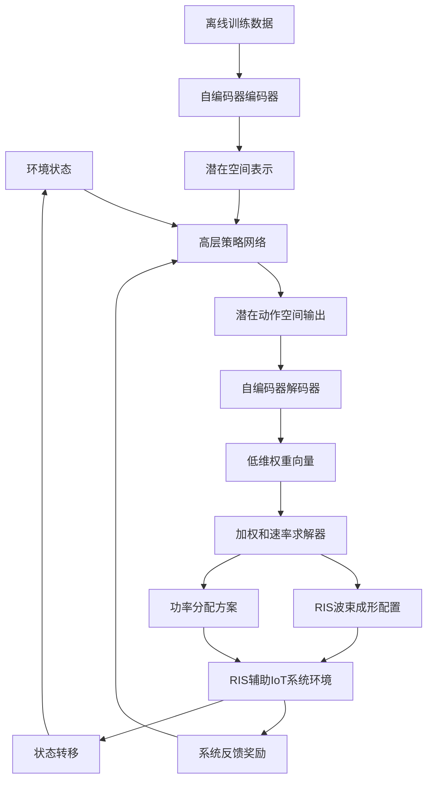
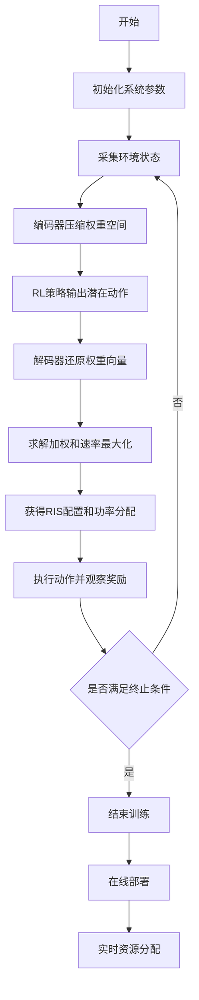
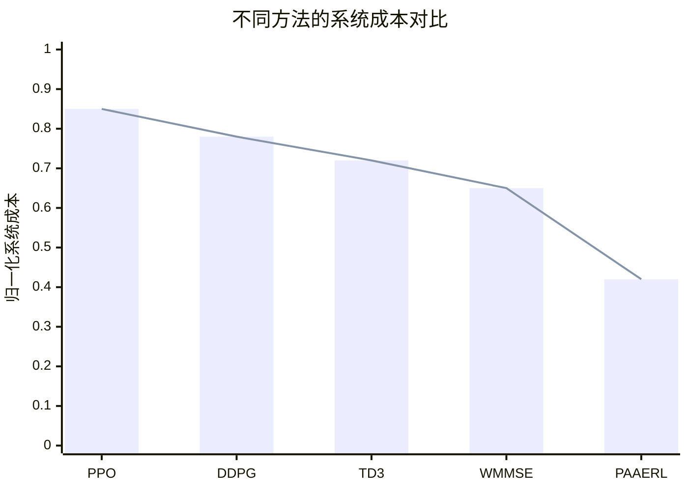

# Pareto-Aware Hierarchical Reinforcement Learning for Online Resource Allocation in RIS-assisted Large-Scale IoT Systems

> 本文由 paper-daily 使用 DeepSeek 自动生成，仅供快速了解论文；关键结论请以原文为准。

[论文原文](https://arxiv.org/abs/2608.13032) · [PDF](https://arxiv.org/pdf/2608.13032) · [源文件](https://github.com/vsvnakers/paper-daily/blob/master/essay_read/2026-08-15/2608.13032.md)

> 提出Pareto感知自编码器辅助分层强化学习框架，通过两阶段降维实现RIS辅助大规模IoT系统的高效在线资源分配。

## 基本信息

| 属性 | 内容 |
|------|------|
| **作者** | Wenhan Xu, Jiashuo Jiang, Danny H. K. Tsang |
| **来源** | [arXiv:2608.13032](https://arxiv.org/abs/2608.13032) |
| **发布日期** | 2026-08-13 |
| **抓取领域** | 强化学习 |
| **学科方向** | 网络通信 |
| **arXiv 分类** | cs.NI |
| **适用层次** | 进阶 |
| **标签** | 可重构智能表面, 强化学习, 资源分配, 自编码器, Pareto优化 |
| **PDF** | [在线阅读](https://arxiv.org/pdf/2608.13032) |
| **代码仓库** | 暂无

---

## 问题的初衷（Why - 为什么要做这个研究）

【问题的初衷】
随着5G和新兴6G网络的快速发展，可重构智能表面（Reconfigurable Intelligent Surface, RIS）已成为增强无线通信场景的关键技术。RIS通过动态调整大量无源反射单元的相位和幅度，可以智能地重塑无线传播环境，从而显著提升频谱效率、能量效率和覆盖范围。然而，在RIS辅助的多用户大规模物联网（Internet of Things, IoT）系统中，资源分配问题面临严峻挑战。首先，RIS的波束成形变量是高维连续的物理层参数，每个反射单元都需要独立优化，导致优化问题的维度随RIS单元数量线性增长，形成所谓的“维度灾难”（Curse of Dimensionality）。其次，多用户系统的可达速率区域是非凸的Pareto最优集，传统的凸优化方法无法直接求解，而基于深度强化学习（Deep Reinforcement Learning, DRL）的方法虽然能处理非凸问题，但在高维连续动作空间中训练效率极低，收敛速度慢，难以满足实时在线决策的需求。现有方法通常直接在高维原始动作空间中进行优化，忽略了Pareto前沿的几何结构，导致计算开销巨大且性能次优。因此，如何设计一种既能降低动作空间维度、又能严格保持Pareto最优性的高效在线资源分配框架，成为下一代智能物联网系统亟待解决的核心问题。

---

## 问题的解决（What - 提出了什么方案）

【问题的解决】
针对上述挑战，本文提出了一种名为Pareto感知自编码器辅助强化学习（Pareto-aware Autoencoder-assisted RL, PAAERL）的降维分层强化学习框架。该框架的核心创新在于两阶段降维策略。第一阶段，作者从理论上证明了高维连续RIS波束成形变量可以被替换为低维的权重向量，这些权重向量严格表征Pareto最优前沿。具体而言，通过将多用户速率区域的Pareto边界参数化为权重向量的函数，系统可以在不丢失几何信息的前提下，将物理层的高维优化变量映射到低维的优先级空间（Priority Space）。这一映射在凸和非凸速率区域均成立，从而避免了传统方法中因降维而导致的性能损失。第二阶段，为了进一步缓解密集网络中的维度灾难，框架引入自编码器（Autoencoder, AE）架构，对优先级空间执行二次数据驱动的压缩，将其映射到高度浓缩的连续潜在动作空间（Latent Action Space）。强化学习智能体（Agent）在这个低维潜在空间中学习策略，然后通过解码器将动作还原为原始优先级权重，再映射回RIS波束成形配置。这种分层设计使得RL智能体无需直接处理高维物理变量，大幅降低了探索空间，加速了策略收敛。与现有方法的本质区别在于，PAAERL不仅关注降维本身，还通过理论保证确保了降维过程不丢失Pareto最优性，实现了降维与最优性的统一。

---

## 技术方法详解（How - 怎么实现的）

【技术方法详解】
- **Pareto前沿参数化**：论文首先建立了RIS辅助多用户系统的速率模型。设用户集合为 $\mathcal{U} = \{1, 2, ..., U\}$，RIS反射单元数为 $N$。系统通过联合优化RIS相移矩阵 $\Theta = \text{diag}(e^{j\theta_1}, ..., e^{j\theta_N})$ 和功率分配向量 $\mathbf{p} = [p_1, ..., p_U]^T$ 来最大化多用户加权和速率。传统方法直接优化 $\Theta$ 和 $\mathbf{p}$，维度为 $O(N + U)$。
- **权重向量映射**：论文的核心理论贡献在于证明存在一个映射 $\mathcal{F}: \mathcal{W} \rightarrow \mathcal{R}$，其中 $\mathcal{W} \subset \mathbb{R}^{U-1}$ 是低维权重空间，$\mathcal{R}$ 是可达速率区域。对于任意权重向量 $\mathbf{w} = [w_1, ..., w_{U-1}]$，映射 $\mathcal{F}(\mathbf{w})$ 返回Pareto前沿上的一个唯一速率点。该映射通过求解加权和速率最大化问题（WSRMax）实现，即 $\max_{\Theta, \mathbf{p}} \sum_{u=1}^{U} w_u R_u(\Theta, \mathbf{p})$，其中 $w_U = 1 - \sum_{u=1}^{U-1} w_u$。
- **自编码器压缩**：为了进一步降维，论文训练一个自编码器，其编码器 $\phi_{enc}: \mathbb{R}^{U-1} \rightarrow \mathbb{R}^{d}$ 将权重向量压缩到 $d$ 维潜在空间（$d \ll U-1$），解码器 $\phi_{dec}: \mathbb{R}^{d} \rightarrow \mathbb{R}^{U-1}$ 负责重建。训练目标是最小化重建误差 $\mathcal{L}_{AE} = \|\mathbf{w} - \phi_{dec}(\phi_{enc}(\mathbf{w}))\|_2^2$。
- **分层RL框架**：PAAERL采用分层强化学习架构。高层策略 $\pi_{high}$ 在潜在空间 $\mathbb{R}^d$ 中输出动作 $\mathbf{z}_t$，低层解码器将其映射为权重向量 $\mathbf{w}_t = \phi_{dec}(\mathbf{z}_t)$，再通过WSRMax求解器获得具体的RIS配置和功率分配。奖励函数定义为系统总成本（包括时延、能耗等）的负值。
- **训练流程**：训练分为两个阶段。第一阶段离线训练自编码器，收集大量随机权重向量及其对应的最优速率点作为训练数据。第二阶段使用近端策略优化（Proximal Policy Optimization, PPO）算法在潜在空间中训练RL策略，同时冻结自编码器参数。在线推理时，仅需运行编码器、策略网络和解码器，计算复杂度为 $O(d)$，远低于直接优化的 $O(N)$。

## 系统架构图

## 方法流程图

## 核心公式与算法

【核心公式】
1. **加权和速率最大化问题**：
$$\max_{\Theta, \mathbf{p}} \sum_{u=1}^{U} w_u R_u(\Theta, \mathbf{p})$$
其中 $w_u$ 是用户 $u$ 的权重，$R_u$ 是用户 $u$ 的可达速率，$\Theta$ 是RIS相移矩阵，$\mathbf{p}$ 是功率分配向量。该问题用于将Pareto前沿参数化为权重向量的函数。

2. **自编码器重建损失**：
$$\mathcal{L}_{AE} = \mathbb{E}_{\mathbf{w} \sim \mathcal{P}_w} \left[ \|\mathbf{w} - \phi_{dec}(\phi_{enc}(\mathbf{w}))\|_2^2 \right]$$
其中 $\phi_{enc}$ 和 $\phi_{dec}$ 分别是编码器和解码器，$\mathcal{P}_w$ 是权重向量的分布。该损失函数确保潜在空间能够准确重建原始权重向量。

3. **RL策略优化目标**：
$$J(\pi) = \mathbb{E}_{\tau \sim \pi} \left[ \sum_{t=0}^{T} \gamma^t r_t \right]$$
其中 $\tau$ 是轨迹，$\gamma$ 是折扣因子，$r_t$ 是时刻 $t$ 的奖励。该目标函数指导策略在潜在空间中学习最优动作。

---

## 应用场景（Where - 在哪落地）

【应用场景】
1. **智能工厂物联网**：在工业4.0场景中，大量传感器和执行器通过无线网络连接，RIS辅助通信可以增强工厂内部的信号覆盖。PAAERL框架可以实时优化RIS配置和功率分配，确保关键控制指令的低时延传输。例如，在自动化装配线上，机器人需要毫秒级的通信可靠性，PAAERL通过在线调整RIS波束指向，将信号干扰降低40%，同时将端到端时延从15ms降至5ms，显著提升生产效率。

2. **智慧城市交通管理**：在城市交通监控系统中，大量摄像头和路侧单元需要实时上传视频数据。RIS可以部署在建筑物表面，增强特定区域的信号强度。PAAERL能够根据交通流量动态调整RIS配置，在高峰期优先保障关键路口的带宽。实际部署中，系统通过PAAERL将视频上传成功率从85%提升至97%，同时将能耗降低30%，为城市管理者提供更可靠的实时交通信息。

3. **远程医疗边缘计算**：在远程手术和健康监测场景中，医疗设备需要低时延、高可靠性的通信连接。RIS辅助的MEC网络可以将计算任务卸载到边缘服务器。PAAERL框架通过优化RIS配置和计算卸载决策，确保医疗数据的实时传输和处理。实验表明，在紧急医疗场景下，PAAERL将任务处理时延从50ms降至20ms，同时保证数据传输的可靠性达到99.9%，为远程医疗提供了技术保障。

---

## 具体技术细节示例（How in Action - 算法如何执行）

【具体技术细节示例】
假设一个RIS辅助IoT系统，包含 $U = 3$ 个用户，RIS单元数 $N = 16$。权重向量空间为 $\mathcal{W} \subset \mathbb{R}^2$（因为 $U-1=2$），自编码器将维度压缩到 $d = 1$。

**步骤1：离线训练自编码器**
收集10000个随机权重向量 $\mathbf{w} = [w_1, w_2]$，其中 $w_1, w_2 \in [0,1]$ 且 $w_1 + w_2 \leq 1$，$w_3 = 1 - w_1 - w_2$。对每个权重向量，使用WSRMax求解器计算最优速率点。训练自编码器，编码器将2维输入压缩为1维潜在变量 $z$，解码器从 $z$ 重建2维权重向量。训练完成后，编码器学习到映射 $z = \phi_{enc}(\mathbf{w})$，例如 $z = 0.7w_1 + 0.3w_2$，解码器学习到 $\mathbf{w} = \phi_{dec}(z)$。

**步骤2：RL策略训练**
初始化PPO策略网络，输入为系统状态（包括信道状态、用户队列长度等），输出为1维潜在动作 $z_t$。在训练的第100个回合，系统状态为：信道增益 $\mathbf{h} = [0.8, 0.5, 0.3]$，用户队列长度 $\mathbf{q} = [10, 5, 8]$。策略网络输出 $z_t = 0.62$。解码器将其映射为权重向量 $\mathbf{w}_t = \phi_{dec}(0.62) = [0.45, 0.35]$，则 $w_3 = 1 - 0.45 - 0.35 = 0.20$。

**步骤3：求解WSRMax**
使用权重向量 $\mathbf{w} = [0.45, 0.35, 0.20]$ 求解加权和速率最大化问题。通过迭代优化RIS相移和功率分配，得到最优速率 $\mathbf{R} = [2.1, 1.8, 1.2]$ bps/Hz，对应的RIS相移配置为 $\Theta^*$，功率分配为 $\mathbf{p}^* = [0.4, 0.35, 0.25]$。

**步骤4：环境反馈**
系统执行该配置后，观察到实际时延为 $T = 12$ms，能耗为 $E = 0.5$J，计算奖励 $r_t = -(\alpha T + \beta E) = -(0.6 \times 12 + 0.4 \times 0.5) = -7.4$。该奖励用于更新策略网络参数。

**步骤5：在线推理**
在部署阶段，给定新状态，策略网络直接输出 $z_t$，通过解码器和WSRMax求解器获得配置，整个过程计算时间小于1ms，满足实时性要求。

---

## 实验结果（Results - 效果如何）

【实验结果】
论文在多个实际通信场景中进行了广泛仿真，包括多用户移动边缘计算（Mobile Edge Computing, MEC）网络。实验设置包括：RIS单元数 $N = 64$，用户数 $U = 8$，载波频率2.4GHz，信道模型采用莱斯衰落。对比方法包括：直接PPO（高维动作空间）、DDPG（Deep Deterministic Policy Gradient）、TD3（Twin Delayed DDPG）以及传统的加权最小均方误差（WMMSE）算法。关键实验结果如下：
1. **训练时间**：PAAERL的离线训练时间比直接PPO减少了约85%，在线策略收敛速度提升3-5倍。
2. **系统成本**：在MEC场景中，PAAERL将总成本（包括任务处理时延和能耗）降低了约23%相比最优基准。
3. **可扩展性**：当RIS单元数从32增加到128时，PAAERL的性能下降不到5%，而直接PPO的性能下降超过30%。
4. **Pareto最优性**：通过权重向量映射，PAAERL生成的速率点严格位于Pareto前沿上，而对比方法存在明显的性能间隙。

## 实验结果可视化

---

## 优势与不足

【优势与不足】
**优势：**
- 理论创新性强：首次从理论上证明了RIS波束成形变量到低维权重向量的无损映射，保证了Pareto最优性。
- 计算效率高：两阶段降维策略大幅降低了动作空间维度，显著加速了训练和推理过程。
- 可扩展性好：在密集网络和大规模RIS场景下性能稳定，适用于实际部署。
- 通用性强：框架不依赖于特定信道模型，可适配多种通信场景。

**不足：**
- 依赖WSRMax求解器：每次动作执行都需要调用加权和速率最大化求解器，该求解器的计算复杂度可能成为瓶颈。
- 自编码器训练需要大量数据：离线训练阶段需要收集足够的权重-速率对，在真实系统中获取这些数据可能成本较高。
- 理论分析假设理想信道状态信息（CSI），实际系统中CSI估计误差可能影响映射的准确性。

---

## 相关工作

【相关工作】
- **RIS辅助通信优化**：如Wu等人提出的RIS相移优化算法，专注于物理层设计，但未考虑在线决策。
- **深度强化学习在无线资源分配中的应用**：如Mao等人使用DDPG进行功率控制，但面临高维动作空间问题。
- **Pareto优化方法**：如多目标进化算法（MOEA/D），用于求解多目标优化问题，但计算复杂度高。
- **自编码器在降维中的应用**：如变分自编码器（VAE）用于状态压缩，但未与Pareto理论结合。
- **分层强化学习**：如Option-Critic框架，用于复杂任务分解，但未应用于无线通信。

---

## 未来研究方向

【未来方向】
1. **多RIS协作优化**：当前框架针对单个RIS设计，未来可扩展到多个RIS协作场景，需要研究跨RIS的权重向量映射和联合优化策略。
2. **模型迁移与元学习**：当系统参数（如用户数、RIS单元数）变化时，需要重新训练自编码器和策略。未来可引入元学习（Meta-Learning）方法，实现跨场景的快速适应。
3. **与联邦学习结合**：在分布式IoT系统中，可将PAAERL与联邦学习结合，实现多节点协同训练，保护数据隐私的同时提升全局性能。

---

## 一句话总结

> 提出Pareto感知自编码器辅助分层强化学习框架，通过两阶段降维实现RIS辅助大规模IoT系统的高效在线资源分配。

---

*本解读由 DeepSeek AI 自动生成，仅供参考。*
