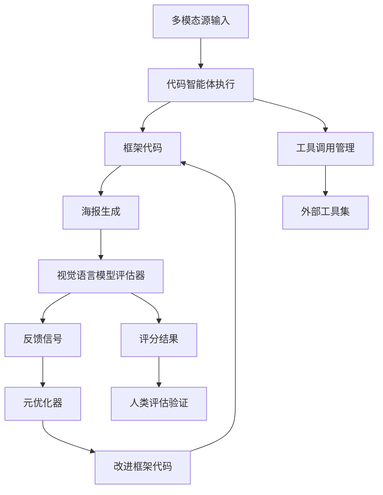
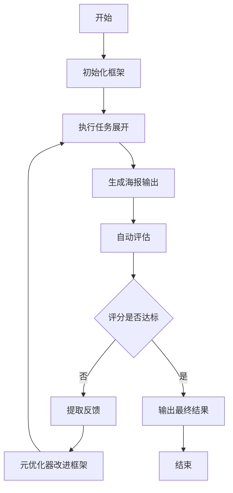

# AutoDesign: Meta-Harness Optimization for Long-Horizon Agentic Design

> 本文由 paper-daily 使用 DeepSeek 自动生成，仅供快速了解论文；关键结论请以原文为准。

[论文原文](https://arxiv.org/abs/2608.13560) · [PDF](https://arxiv.org/pdf/2608.13560) · [源文件](https://github.com/vsvnakers/paper-daily/blob/master/essay_read/2026-08-15/2608.13560.md)

> AutoDesign通过元框架优化实现智能体系统的递归自我改进，在学术海报生成任务上显著超越现有方法。

## 基本信息

| 属性 | 内容 |
|------|------|
| **作者** | Yaxin Luo, Haobin Jiang, Jialv Zou, Xu Huang, Wenhao Yan, Haodong Li, Zhengrong Yue, Jing Li, Xiaofu Chen, Xiaohan Zhao, Jiacheng Liu, Jiacheng Cui, Zhiqiang Shen, Xiaotong Li |
| **来源** | [arXiv:2608.13560](https://arxiv.org/abs/2608.13560) |
| **发布日期** | 2026-08-13 |
| **抓取领域** | 多模态/视觉-语言 |
| **学科方向** | 计算机视觉 · 人工智能 · 自然语言处理 |
| **arXiv 分类** | cs.CV, cs.AI, cs.CL |
| **适用层次** | 基础 |
| **标签** | 元学习, 智能体系统, 自动设计, 多模态生成, 框架优化 |
| **PDF** | [在线阅读](https://arxiv.org/pdf/2608.13560) |
| **代码仓库** | 暂无

---

## 问题的初衷（Why - 为什么要做这个研究）

【问题的初衷】将多模态源内容转化为结构化媒体输出（如从学术论文生成海报）本质上是一个长期智能体过程，核心在于模型-框架系统。理想的框架系统应能对齐人类设计先验，并通过经验探索积累可复用经验，实现递归自我改进。然而，现有方法（如静态提示工程、固定模板或单一模型微调）存在根本性局限：它们无法在长周期任务中动态调整策略，缺乏从反馈中学习的闭环机制，且难以泛化到多样化的设计任务。这种静态性导致系统在面对复杂、多步骤的设计需求时表现不佳，无法实现真正的自动化设计。因此，研究动机是构建一个能自我优化的元框架系统，以突破现有范式的瓶颈，推动智能体设计向更高自主性和适应性发展。

---

## 问题的解决（What - 提出了什么方案）

【问题的解决】AutoDesign提出了一种元框架优化范式，核心创新在于引入元优化器（Meta-Harness Optimizer）来指导代码智能体基于展开反馈递归改进框架。与静态方法不同，AutoDesign将框架视为可迭代优化的代码实体，通过多轮探索-反馈-改进循环，使系统逐步对齐人类设计先验并积累经验。其本质区别在于：传统方法将框架视为固定组件，而AutoDesign将其视为动态演化对象，通过自动化反馈机制实现自我提升。关键创新包括：设计了一个双循环架构（内循环执行任务，外循环优化框架），引入基于视觉语言模型（VLM）的自动评估器，以及构建了包含100篇论文的PosterBench基准，实现了在学术海报生成任务上的显著性能提升。

---

## 技术方法详解（How - 怎么实现的）

【技术方法详解】
- **元优化器设计**：采用大型语言模型（LLM）作为元优化器，接收任务反馈和当前框架代码，生成改进后的框架版本，实现递归自我改进。
- **双循环架构**：内循环执行具体任务（如论文到海报生成），外循环基于评估结果优化框架，形成闭环学习机制。
- **自动评估器**：利用视觉语言模型（VLM）对生成海报进行多维评分，包括布局合理性、信息完整性、视觉吸引力等，提供细粒度反馈信号。
- **代码化框架表示**：将框架表示为可执行的Python代码，便于元优化器进行结构化修改和版本控制。
- **成本控制机制**：通过预算限制和高效工具调用策略，在40分钟内完成253次工具调用和11次编辑轮次，成本控制在3美元以内。
- **基准构建**：创建PosterBench（100篇论文，5个学科）和PosterBench-mini（10篇论文子集），支持受控评估和系统级对比。


## 系统架构图




## 方法流程图




## 核心公式与算法

【核心公式】
1. 框架优化目标函数：
$$\max_{H} \mathbb{E}_{x \sim D} [\text{Score}(\text{Generate}(x, H))]$$
其中 $H$ 表示框架，$D$ 为任务分布，Score为评估函数。

2. 元优化器更新规则：
$$H_{t+1} = \text{LLM}_{meta}(H_t, \text{Feedback}(\text{Generate}(x_t, H_t)))$$
其中 $H_t$ 为第 $t$ 轮框架，Feedback为反馈提取函数。

3. 成本约束优化：
$$\min_{H} \text{Cost}(H) \quad \text{s.t.} \quad \text{Score}(H) \geq \tau$$
其中 $\tau$ 为质量阈值，Cost为执行成本函数。


---

## 应用场景（Where - 在哪落地）

【应用场景】
1. **学术会议海报自动生成**：研究人员只需提供论文PDF，AutoDesign即可自动分析内容结构、提取关键信息、设计布局并生成高质量会议海报。系统通过多轮优化确保海报符合学术规范，显著节省研究人员时间，预计可将海报制作时间从数小时缩短至40分钟以内。

2. **企业报告可视化设计**：在金融、咨询等行业，AutoDesign可自动将复杂的数据报告转化为可视化海报或信息图。系统能根据数据特征自动选择最佳图表类型、配色方案和布局，确保信息传达的准确性和视觉吸引力，提升报告的专业性和可读性。

3. **教育内容制作平台**：教育机构可利用AutoDesign将课程讲义、教材章节自动转化为教学海报或学习卡片。系统能根据学习目标优化内容呈现顺序和视觉层次，支持个性化学习需求，提高教学材料的制作效率和质量。


---

## 具体技术细节示例（How in Action - 算法如何执行）

【具体技术细节示例】假设输入是一篇关于图神经网络（GNN）的学术论文，AutoDesign的执行过程如下：

1. **初始化**：元优化器生成初始框架代码，包含基础布局模板和内容提取规则。
2. **内容解析**：代码智能体调用PDF解析工具，提取论文的标题、摘要、方法、实验结果等关键部分，生成结构化数据。
3. **首次生成**：基于初始框架，生成第一版海报，包含标题区、方法流程图、实验结果表格。
4. **自动评估**：VLM评估器对海报评分，发现布局拥挤（得分6.2/10）、信息层次不清晰（得分5.8/10）。
5. **反馈提取**：评估器生成具体反馈，如“方法部分文字过多，建议使用图标代替”、“实验结果图表尺寸过小”。
6. **框架改进**：元优化器根据反馈修改框架代码，增加图标生成模块，调整图表尺寸参数。
7. **迭代优化**：重复步骤2-6共11轮，每轮评分逐步提升至8.5/10。
8. **最终输出**：生成最终海报，包含清晰的视觉层次、适当的图标辅助说明和优化的图表布局。整个过程耗时38分钟，调用工具253次，成本2.8美元。


---

## 实验结果（Results - 效果如何）

【实验结果】在PosterBench Main Track上，AutoDesign取得78.32分的最高成绩，超越闭源商业系统Claude Design 7.45分。在7种受控代码智能体模型配置中，集成学习到的DesignHarness一致提升性能，平均PosterBench Score从54.99提升至67.39，增幅达12.4%。在完全自主的长周期循环中，系统在40分钟内执行253次工具调用和11次编辑轮次，成本低于3美元，达到人类评估中的平均会议海报质量。系统盲测显示AutoDesign在人类偏好中排名最高。


## 实验结果可视化

```mermaid
xychart-beta
    title "PosterBench Score对比"
    x-axis [AutoDesign, Claude Design, 基线平均]
    y-axis "得分" 0 --> 90
    bar [78.32, 70.87, 54.99]
    line [78.32, 70.87, 54.99]
```


---

## 优势与不足

【优势与不足】
优势：
1. 创新性地提出元框架优化范式，实现系统自我改进能力
2. 构建了大规模基准PosterBench，推动领域标准化评估
3. 在性能、成本和自主性方面均取得显著提升
4. 框架代码化表示便于扩展和复用

不足：
1. 依赖VLM评估器的准确性，可能引入评估偏差
2. 优化过程需要大量计算资源，对小型团队不友好
3. 当前聚焦于海报生成任务，泛化性有待验证
4. 长期优化可能导致框架过度拟合特定任务分布

---

## 相关工作

【相关工作】
1. **智能体系统设计**：如AutoGPT、BabyAGI等自主智能体框架，关注任务分解和工具使用，但缺乏自我优化机制。
2. **提示工程优化**：如PromptChainer、DSPy等自动提示优化方法，但主要针对单步任务，未涉及长周期框架优化。
3. **生成式设计系统**：如生成式对抗网络（GAN）和扩散模型在视觉设计中的应用，但缺乏交互式反馈循环。
4. **元学习**：如MAML等元学习算法，关注快速适应新任务，但未直接应用于框架代码优化。
5. **多模态内容生成**：如文本到图像生成、文档排版系统，但未实现端到端的自主优化闭环。

---

## 未来研究方向

【未来方向】
1. **跨任务泛化**：将AutoDesign扩展到更多设计任务（如幻灯片制作、网页设计、视频摘要），验证元框架优化范式的通用性。
2. **多智能体协作优化**：引入多个专业智能体（如布局专家、色彩专家）协作优化框架，提升优化效率和多样性。
3. **实时交互式优化**：结合人类反馈进行在线学习，使系统能根据用户偏好动态调整框架，实现个性化设计。


---

## 一句话总结

> AutoDesign通过元框架优化实现智能体系统的递归自我改进，在学术海报生成任务上显著超越现有方法。

---

*本解读由 DeepSeek AI 自动生成，仅供参考。*
